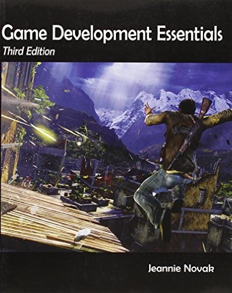
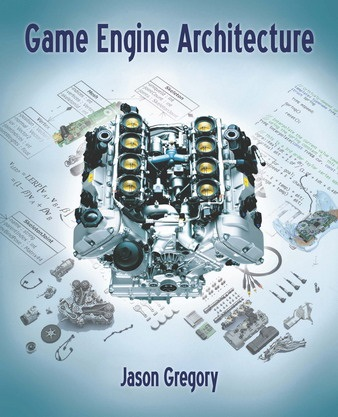
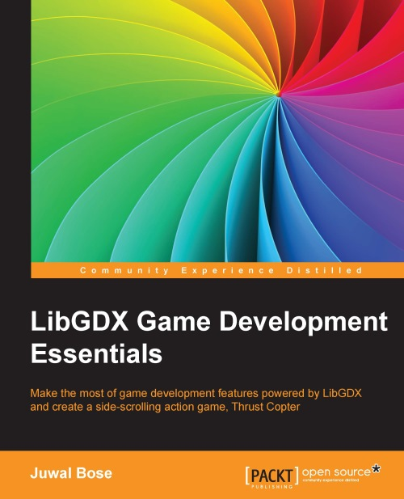
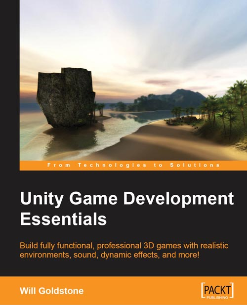

<!--
bespokeEvent: bullets.disable
-->

# Desenvolvimento de Jogos Digitais

*Professor:* Flávio Coutinho

---
# Atividades Avaliativas

- ~~Prova e Listas~~ (0 pontos!!!)
- Aulas Práticas (24 pontos)
- Trabalhos Práticos (76 pontos)
  - [TP0][tp0] (3 pontos)
  - [TP1][tp1] - Autogame (25 pontos)
  - Projeto - Jogo Completo (35 pontos)
  - Seminário sobre PCG (13 pontos)

[tp0]: http://fegemo.github.io/cefet-web/assignments/tp0/
[tp1]: https://github.com/fegemo/cefet-games/tree/master/assignments/tp1-autogame
[tp1-repo]: https://github.com/fegemo/cefet-games-meow-au
[tp2]: https://github.com/fegemo/cefet-games/tree/master/assignments/tp2-meow-au-again
[final]: https://github.com/fegemo/cefet-games/blob/master/assignments/final/README.md
[seminar]: https://github.com/fegemo/cefet-games/tree/master/assignments/seminar

---
# Aulas (1/3)

- [Ferramentas de Desenvolvimento de Jogos](classes/tools/)
- Introdução: [História, Plataformas e Gêneros](classes/intro/)
  - Prática _Maker_: [slides](classes/rpgmaker),
    atividade: [RPG Maker][activity-rpgmaker] ou [RPG Boss][activity-rpgboss]
- Introdução: [Jogadores, Narrativa, Gameplay](classes/intro2/)
  - Prática _Sprites_: [slides](classes/2d-graphics),
    atividade: [Goombas][activity-sprites]
- Física: [Detecção de Colisão](classes/collision/)
  - Física: Prática de Colisão AABB, MEB: [atividade da navinha][activity-navinha]
- Introdução: [_Level Design_, Equipe, Produção](classes/intro3/)
- IA: [Movimentação cinemática e dinâmica](classes/movement)
  - Prática de Movimentação: [atividade da cinemática][activity-kinematics]

[activity-rpgmaker]: https://github.com/fegemo/cefet-games/tree/master/assignments/rpgmaker
[activity-rpgboss]: https://github.com/fegemo/cefet-games/tree/master/assignments/rpgboss
[activity-sprites]: https://github.com/fegemo/cefet-games-goomba
[activity-navinha]: https://github.com/fegemo/cefet-games-navinha
[activity-kinematics]: https://github.com/fegemo/cefet-games-cinematica

---
# Aulas (2/3)

- IA: [_Pathfinding_ usando Grafos](classes/pathfinding)
  - Prática de A*: [atividade][activity-pathfinding]lp
- IA: [Representação do Mundo](classes/world-representation)
  - [Demonstração](classes/unity) da Unity
- CG: [_Pipeline_ Programável](http://fegemo.github.io/cefet-cg/classes/programmable-pipeline/)
- Acessibilidade: [Aula de Introdução](attachments/game-accessibility/Acessibilidade em Jogos.pptx)
  - Prática de Acessibilidade: [atividade][activity-access]
- CG: [Renderização em Tempo-Real](classes/realtime-rendering-pt1)
- CG: [Renderização em Tempo-Real](classes/realtime-rendering-pt2) (parte 2)

[activity-pathfinding]: https://github.com/fegemo/cefet-games-pathfinding/
[activity-access]: https://github.com/fegemo/cefet-games/blob/master/assignments/gameover/README.md#prática-diretrizes-de-acessibilidade

---
# Aulas (3/3)

- IA: [Tomada de Decisão](classes/decision-making/)
  - Apresentação de seminários
- Apresentação de seminários
  - Prática de Efeitos de Partículas: [atividade + código seminal][activity-particle-effects]
- [Dinâmica](classes/dynamics)
  - CG: [Animação de Personagens](classes/animation)
- [Jogos em Rede](classes/networking)
  - IA: Jogos de Tabuleiro 22/11/2016)

[activity-particle-effects]: https://github.com/fegemo/cefet-games-cauldron

<!--

- Prática Game Maker: [atividade][activity-gamemaker]
- IA: [Agentes Inteligentes](attachments/IA 01 - Agentes.pptx) (15/09/2015)
- Prática Robocode: [atividade][activity-robocode]
--->

---
# Bibliografia Básica

---
## _Game Development Essentials: An Introduction_ Third Edition

  
  

- **Título**	_Game Development Essentials: An Introduction Third Edition_
- **Autora**	Jeannie Novak
- **Editora**	Delmar Cengage Learning, 2011

---
## _Real-Time Rendering_

  
  

- **Título**	Real-Time Rendering, Third Edition
- **Autores**	Tomas Akenine-Möller, Eric Haines, Naty Hoffman
- **Editora**	Taylor &amp; Francis, 2008

---
## _Artificial Intelligence for Games_

  
  

- **Título**	_Artificial Intelligence for Games, 2nd Edition_
- **Autores**	Ian Millington, John Funge
- **Editora**	CRC Press, 2009

---
## _Game Engine Architecture_

  
  

- **Título**	_Game Engine Architecture_
- **Autores**	Jason Gregory
- **Editora**	Taylor &amp Francis, 2009

---
# Bibliografia Complementar

---
## _LibGDX Game Development Essentials_

  
  

- **Autor** Juwal Bose
- **Editora** Packt Publishing, 2014

---
## _Unity Game Development Essentials_

  
  

- **Autor** Will Goldstone
- **Editora** Packt Publishing, 2011
