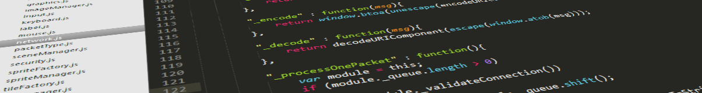

# **Projeto** de Desenvolvimento de Jogo

Você e seu grupo (até 3 pessoas) devem desenvolver um jogo completo ao longo
deste curso. Este projeto será entregue em 3 etapas, sendo:

1. Sumário Executivo (até 5 páginas)
  - Valor: 5 pontos
  - Entregar o sumário via ~~Moodle~~ email
1. _Game Design Document_ inicial + Protótipo de jogabilidade
  - Valor: 10 pontos
  - Entregar o GDD e algumas telas ou vídeo do seu jogo com o status
1. _Game Design Document_ final + Jogo + _Technical Design Document_ super sucinto (_a la_ README simplão)
  - Valor: 25 pontos
  - Entregar o jogo, GDD e README via Moodle e apresentar o jogo em sala

As etapas têm suas datas de entrega descritas na seção de [cronograma](#cronograma).

## Critérios de Avaliação

Você tem total liberdade para escolher as ferramentas com as quais quer
trabalhar para criar o jogo, contanto que elas possuam licenças gratuitas para
estudantes/desenvolvedores independentes.

Um jogo criado usando uma API gráfica, naturalmente, poderá não ter a mesma
quantidade de conteúdo do que um jogo feito usando um _Maker_ ou _Engine_.
Contudo, não tema por sua decisão - o que será avaliado não será apenas o
resultado final, mas também:
- Criatividade
- Esforço
- Complexidade

## Instruções sobre o jogo

A plataforma, gênero e estilo do jogo são completamente livres. Você pode até mesmo fazer um _audiogame_, em vez de um _videogame_ (wtf!!). Basta que você escolha um subconjunto dos ingredientes apresentados a seguir:
- **Gráficos** (CG)
- **Comportamento inteligente** (IA)
- **Conteúdo procedural** (PCG)
- **Jogos multijogador** em rede (Redes)
- **Física** mais avançada
- **Áudio** mais avançado do que efeitos sonoros e música
- **Acessibilidade** universal ou para uma maior gama de jogadores

Quanto mais componentes escolher, não necessariamente as notas serão melhores. O importante aqui é criar um jogo que seja bonito, divertido e polido, muito mais do que recursos e pontuações extras para cada um. Portanto, use sua liberdade e criatividade para propor o jogo e a nota refletirá o bom desempenho dos 3 critérios descritos anteriormente.

## Cronograma

As datas de entrega são:
1. Etapa 1: Sumário
  - 17/09/2015
1. Etapa 2: GDD + Protótipo
  - 15/09/2015
1. Etapa 3: Apresentação
  - 26/11/2015

## Instruções gerais

O trabalho é em grupos de até 3 (sem exceções) e deve ser produzido
integralmente pelos alunos. Podem discutir idéias entre os colegas, mas cada
grupo deve ter a sua implementação independente dos demais. **Trabalhos muito
semelhantes receberão nota 0**, independente de quem copiou de quem. Trabalhos
semelhantes aos de outras pessoas (ex-alunos, pessoas na Internet) também
receberão nota 0.

## O que faz perder nota

Alguns descuidos podem fazer com que sua nota fique muito abaixo do esperado:
- A não entrega de uma etapa
- A entrega em atraso da última etapa não é permitida, uma vez que os jogos serão apresentados em sala
- Atraso na entrega das 2 primeiras etapas. Cada dia de atraso reduz o valor máximo de nota da
  maneira abaixo. Considere `x` como dias de atraso e `f(x)` a penalidade
  percentual na nota:

  
  - Isso implica que 1 ou 2 dias de atraso são pouco penalizados
  - E após 5 dias de atraso, o trabalho vale 0
  - _Seeing is believing_: https://www.google.com.br/search?q=y%3D(2%5E(x-2)%2F0.16)%2Cy%3D100

## O que deve ser **entregue**

Deve ser entregue **um arquivo .tar.gz ou .zip** via **Moodle** contendo:
  1. 3+ _screenshots_ de diferentes cenas do seu jogo
  1. Todo o programa fonte, juntamente com as bibliotecas necessárias
     para compilação e execução
  1. O arquivo executável/instalação
  1. Um arquivo **README** contendo:
     - Instruções para **compilação e execução**
     - Descrição sucinta das decisões de implementação
  1. (opcional, +3%) O link para **um vídeo curto** (youtube, vimeo,
     dailymotion etc.) do seu jogo mostrando as opções implementadas

Qualquer dúvida, entre em contato comigo. Ou acrescente a sua interpretação no
arquivo README e mãos à obra.
