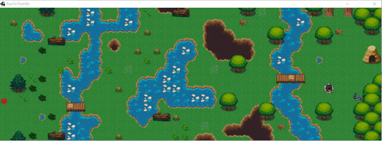
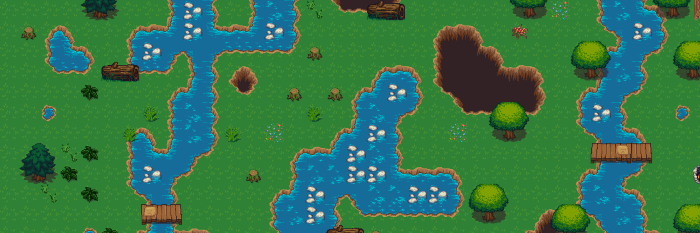

# Prática: Planejamento de Caminhos



Pré-requisitos:
  1. Um pouco de Java
    - Sugiro IDE NetBeans com _plugin_ _Gradle Support_ instalado
    - Mesmo _setup_ da prática sobre movimentação
  1. Conhecimento sobre grafos

Objetivos:

1. Praticar o uso de algoritmos de planejamento de caminhos em grafos
1. Implementar **heurísticas para o algoritmo A***
1. Perceber que o **algoritmo de Dijkstra é o A\* que não usa heurística**
1. Entender o que é uma **heurística admissível** e o impacto do uso de uma que não é

## Atividade Prática

Você deve começar usando o código do professor como ponto de partida para a
atividade. Você deve implementar 3 heurísticas para o algoritmo A*:

1. Uma heurística "nula", que transforme o A* no Dijkstra
2. A heurística de distância Euclidiana
3. (Opcional) Uma outra heurística à sua escolha (e pesquisa ;)

## Sobre o código

Descrevemos um **Agente** (`Agent.java`) por:

1. Algoritmo de movimentação (_steering_)
1. Algoritmo de planejamento
  - Que, por sua vez, pode conter uma função heurística

A movimentação acontece em três passos. Assim que um clique é feito:

1. Passo de Planejamento: Um algoritmo de planejamento (no caso, A*) encontra
  a melhor rota para o ponto desejado.
1. Passo de Movimentação: Um algoritmo de movimentação (no caso, _seek_)
  determina para onde o agente deve ir. O objetivo (_target_) do algoritmo é
  definido sempre como o próximo nó do caminho retornado pelo passo de
  planejamento.
1. Passo de Física: Usamos integração de Euler para atualizar a posição do
  agente.

Um algoritmo de controle identifica se o passo de movimentação cumpriu
seu objetivo e, em caso afirmativo, define o objetivo como o próximo nó do
caminho. Veja o trecho de código de `Agent.java:44`:

```java
public void update(float delta) {
    boolean shouldMove = true;

    // verifica se atingimos nosso objetivo imediato
    if (position.coords.dst2(steeringTarget.coords) < MIN_DISTANCE_CONSIDERED_ZERO_SQUARED) {
        // procurar se temos outra conexão na nossa rota
        // e, caso afirmativo, definir o nó de chegada como novo target
        if (shouldMove = pathIterator.hasNext()) {
            TileConnection nextConnection = pathIterator.next();
            TileNode nextNode = nextConnection.getToNode();
            steeringTarget.coords = nextNode.getPosition();

            // atualiza a velocidade do "seek" de acordo com o terreno (a conexão)
            this.behavior.maxSpeed = fullSpeed - (fullSpeed / 2.0f) * (nextConnection.getCost() - 1) / (LevelManager.maxCost - 1);
        }
    }

    // integra
    if (shouldMove) {
        Steering steering = behavior.steer(this.position);
        position.integrate(steering, delta);
    }
}
```

O Agente (`Agent.java:68`) recebe um evento de clique quando o usuário clica em
uma parte do mapa. Nesse momento, acionamos o algoritmo de planejamento para
traçar a rota:

```java
public void setGoal(int x, int y) {
    TileNode startNode = LevelManager.graph.getNodeAtCoordinates((int) this.position.coords.x, (int) this.position.coords.y);
    TileNode targetNode = LevelManager.graph.getNodeAtCoordinates(x, y);

    path.clear();
    pathFinder.searchConnectionPath(startNode, targetNode, new EuclideanDistanceHeuristic(), path);
    pathIterator = path.iterator();
}
```

---
## Interação com o Exercício

Ao abrir o código na IDE (sugiro NetBeans), você pode compilar e executar o código e deve aparecer o mapa, com o agente (bolinha vermelha) no canto esquerdo, assim como mostra a figura "pratrasmente".

Nesse momento, ao clicar com o botão do mouse em alguma posição válida (fora de um obstáculo), o agente deveria planejar o (melhor) caminho e ir até lá. Contudo, o programa (e talvez seu computador - cuidado) vão explodir porque a heurística não está implementada, mas apenas lançando uma bomba chamada exceção:

```java
// AQUI ESTAMOS CHAMANDO O ALGORITMO A* (instância pathFinder)
pathFinder.searchConnectionPath(startNode, targetNode, new Heuristic<TileNode>() {

    @Override
    public float estimate(TileNode n, TileNode n1) {
        throw new UnsupportedOperationException("MEIMPLEMENTEPORFAVOR");
    }
}, path);
```

Além disso, a qualquer momento você pode pressionar a tecla `d` do teclado para **ativar o modo _debug_** e poder enxergar o grafo que foi construído para representar o mapa:



O modo de _debug_ mostra todos os nós e conexões do grafo de navegação, que é usado pelo algoritmo de planejamento (o A* neste caso).

- Nó vermelho: obstáculo
- Nó azul: "passável"
  - Peso das arestas incidentes:
    - Grama: 1
    - Água: 9
    - Água com pedrinhas para pisar: 5
    - Ponte: 1

---
## Como Avaliar MinhaPrimeiraHeurística (s2)

O algoritmo de Dijkstra é conhecidamente (1) completo e (2) ótimo:
  1. Se há um caminho do ponto atual ao desejado, ele acha
  1. Esse caminho é o melhor possível (_i.e._, um que minimiza o peso das arestas)

Como vimos em aula, o A* também é completo, mas para que ele seja ótimo também, **a heurística deve ser admissível** (volte nos slides e veja o quê isso significa :).

Ou seja, para saber se a sua heurística bacanuda está funcionando devidamente, o A* usando ela **precisa dar a mesma rota que o Dijkstra (que é A\* sem heurística, ou com a "herística nula")**.

Caso o agente esteja passando toda hora por cima da água, é provável que a função heurística que você implementou não está admissível. Neste caso, reveja o conceito de admissibilidade e conserte-a =)

---
## Entrega

~~Este trabalho deve ser entregue **via Moodle**. Mas caso o Moodle ainda não esteja funcionando de vento em polpa,~~ considere o parágrafo a seguir.

Os exercícios desta aula prática serão corrigidos ao final do nosso horário. Assim que estiver pronto, chame o professor para que possa ver seu trabalho.
