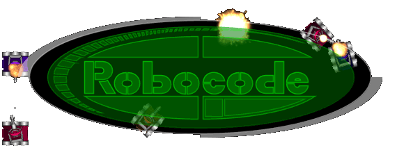

# Prática: Robocode

Pré-requisitos:
  1. Ter um <abbr title="Java Development Kit">JDK</abbr> instalado (versão 1.6+)
  1. Baixar e instalar o [Robocode][dl] (~6 MB)

Objetivos:
  1. Ter contato com ao problema de controle da movimentação e ações de um agente inteligente
  1. Praticar a criação de um agente de inteligência artificial

## Atividade Prática

Faremos esta atividade prática em grupos pequenoss (2-3) de forma que tenhamos 8 grupos na sala.

Vocês terão aproximadamente 60 minutos para criar um BOT trucidante cujo objetivo é eliminar o inimigo.

Nos próximos 25 minutos, colocaremos os meninos para brigar no formato de Copa (mata-mata).

Ao final, o grupo vitorioso vai brevemente (5 min) revelar a estratégia e técnicas usadas.

Cada jogo entre 2 times será realizado em 3 partidas, no estilo melhor-de-3.

### Atenção

Os bots "profissionais" de Robocode levam meses para serem feitos. Temos 60 minutos. Ou seja, escolha bem o comportamento que você quer para o agente considerando o tempo ultra limitado que temos.

Exemplos:

  1. Robô parado mas que tenta sempre mirar no inimigo
  1. Robô tenta atropelar o inimigo
  1. Robô tenta desviar dos tiros

## Entrega

~~Este trabalho deve ser entregue **via Moodle**. Mas caso o Moodle ainda não esteja funcionando de vento em polpa,~~ considere o parágrafo a seguir.

Os exercícios desta aula prática serão corrigidos ao final do nosso horário. Assim que estiver pronto, chame o professor para que possa ver seu trabalho.

[dl]: http://sourceforge.net/projects/robocode/files/latest/download?source=files  
