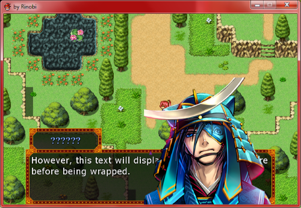

# Prática: RPG ~~Maker~~ Boss

Pré-requisitos:
  1. Visitar [o site oficial][site] do RPG Boss
  1. Visitar [o repositório][repo] do RPG Boss no GitHu
  b e clicar na estrelinha :3 para demonstrar seu apoio ao projeto
  1. [Baixar (~70 MB)][dl] e instalar o RPG Boss no computador

Objetivos:
  1. Conhecer uma ferramenta do tipo "_genre creator_"
  1. Entender o funcionamento de um jogo com conteúdo criado por _game designers_

## Atividade Prática

Você deve brincar com o RPG Boss. Mas a brincadeira precisa render frutos. Ao final da aula, o professor espera ver pelo menos:

### Exercício 1: Mapas (35 min.)

- 3 cenários, sendo:
  1. Um mapa externo (campo aberto)
  1. Um mapa de uma (01) vila, ou cidade, ou desfiladeiro ou exterior de um castelo
  1. Uma mapa interno de uma (01) casa da vila ou cidade, ou de uma caverna, ou do interior do castelo
- Deve ser possível o **jogador entrar e sair dos três mapas** quando o personagem chega a determinados locais
- Você deve usar os _assets_ gráficos disponibilizados
  - Há também "mapas prontos" de exemplo, porém para esta   atividade você é quem deve criar os mapas
- [Se você tiver fones:] Os mapas devem possuir música de fundo (<abbr title="Background Music">BGM</abbr>)

**Tempo limite sugerido**: 35 minutos

### Exercício 2: NPCs (10 min.)

- No do mapa mais interno, deve haver **alguém com quem o personagem principal possa ter um diálogo** (_<abbr="id est (que, em latin, podemos entender como 'isto é')">i.e.</abbr>_, um <abbr title="Non-player Character">NPC</abbr>)
  - Para valer pontos, esse diálogo precisa ser algo que faça o professor rir quando ler :joy:
- O NPC não deve ficar parado, mas deve se movimentar de alguma forma pelo cenário

**Tempo limite sugerido**: 10 minutos

### Exercício 3: NPCs++ (25 min.)

- **Na segunda vez**¹ que o jogador **conversar com o NPC**, em vez de falar a mesma coisa, ele **deve propor um desafio** (pergunta) ao jogador
  - Caso o jogador acerte a resposta, **ele ganha um prêmio** (_<abbr title="exempli gratia (que, em latin, podemos entender como 'por exemplo')">e.g.</abbr>_, 20 de gold)
    - [Se você tiver fones:] Aproveite e **toque um efeito sonoro** (<abbr title="Sound Effect">SE</abbr>)
  - Caso o jogador erre a resposta, **uma batalha** se dá início - pode ser uma batalha contra _slimes_ (pág. 3 dos comandos de evento)
    - Antes da batalha começar, seria legal ver a tela tremer (pág. 2 dos comandos de evento)...

¹ Para fazer esse tipo de lógica, você deve usar as _switches_ do jogo e usar mais de uma página no evento do NPC

**Tempo limite sugerido**: 25 minutos

## Entrega

~~Este trabalho deve ser entregue **via Moodle**. Mas caso o Moodle ainda não esteja funcionando de vento em polpa,~~ considere o parágrafo a seguir.

Os exercícios desta aula prática serão corrigidos ao final do nosso horário. Assim que estiver pronto, chame o professor para que possa ver seu trabalho.

[site]: http://rpgboss.com
[repo]: https://github.com/rpgboss/rpgboss
[dl]: https://github.com/rpgboss/rpgboss/releases
