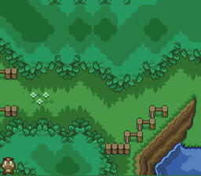
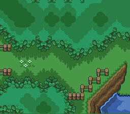
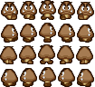

# Prática: Sprites

Pré-requisitos:
  1. Assistir [o vídeo promocional][promo] do _framework_ de jogos LibGDX
  1. Conhecimento de Java
    - Um ambiente de desenvolvimento:
      - NetBeans com plugin _Gradle Support_

Objetivos:

1. Familiarizar-se com o funcionamento da LibGDX
1. Conhecer técnicas comuns de renderização em 2D - Sprites, Tiles etc.
1. Praticar conceitos de renderização em 2D na LibGDX
  - Uso de texturas
  - Sprites
  - Animações
1. Entender a importância de se reduzir o número de "chamadas de desenho"
  (_draw calls_)

## Atividade Prática

Você deve começar usando o código do professor como ponto de partida para a
atividade. Você deve fazer 3 exercícios:

1. Desenhar o cenário em `Game.java` (como uma textura, carregando `map.png`)
  
1. Desenhar o Goomba (em `Goomba.java`, usando `goomba.png`)
  
1. Controlar a movimentação do Goomba pelas setas do teclado
  - Primeiramente faça sem animação
  - Depois, não deixe que o personagem saia da tela
    - Basta garantir que sua posição `x` está entre `0` e `LARGURA_DA_TELA - LARGURA_GOOMBA` e o análogo para `y`
  - Por fim, faça uma animação do personagem andando nas 4 direções. Passe a usar a _spritesheet_ `goomba-spritesheet.png`
  
    - Configuração da _spritesheet_:
      - Largura do quadro: 21px
      - Altura do quadro: 24px

[promo]: https://libgdx.badlogicgames.com/

---
## Entrega

~~Este trabalho deve ser entregue **via Moodle**. Mas caso o Moodle ainda não esteja funcionando de vento em polpa,~~ considere o parágrafo a seguir.

Os exercícios desta aula prática serão corrigidos ao final do nosso horário. Assim que estiver pronto, chame o professor para que possa ver seu trabalho.
