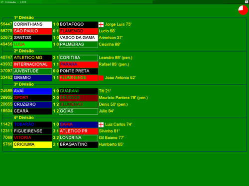
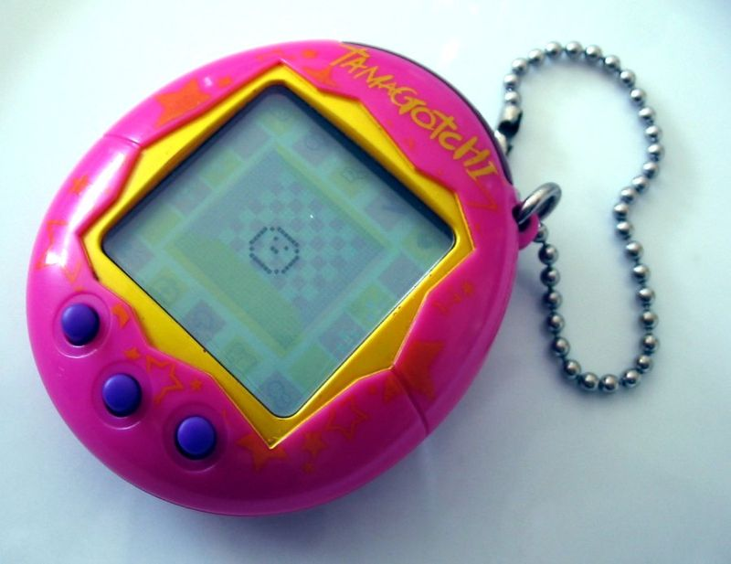
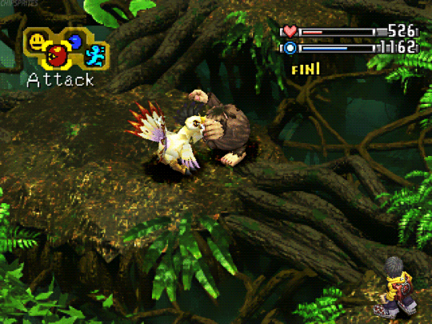
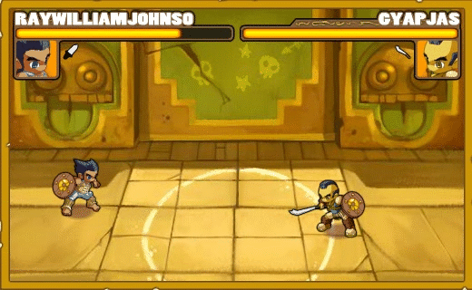

# Trabalho Prático 1 - Auto Game

Tão divertido quanto jogar um jogo comum é programar um jogo
que se joga sozinho. Neste trabalho, vamos desenvolver auto game.

_Auto games_ são jogos que possuem uma mecânica relativamente simples
e que tira da responsabilidade dos jogadores o controle direto sobre
os personagens, dando a esses apenas a possibilidade de influenciar
o comportamento destes - (a) dando dicas (_e.g._, prefira ataque, defesa ou uso de poderes); (b) definindo estratégias antes das partidas e apenas as assistindo (_e.g._, fazer um ataque fulminante (_rush attack_) ou evoluir as defesas com calma), ou apenas gerenciando a evolução do personagem para as próximas partidas (_e.g._, escolhendo em que atributos investir no personagem com os pontos de experiência ganhos).

## Inspiração

O jogo [Elifoot (1987)][elifoot] foi um dos precursores desse estilo de jogo,
tendo inaugurado o subgênero de simulação de campeonato de futebol.
Em vez de controlar um jogador em campo, no Elifoot o jogador tinha o
papel de (a) técnico de um time - poderia fazer substituições e definir a tática para cada jogo - e de (b) presidente - fazendo negociações de jogadores e definindo de que campeonatos/ligas participar, com a gestão financeira disso. Durante a partida, que simular os 45 minutos de cada tempo em 1 minuto, o jogador era apresentado com apenas os resultados de número de gols e de cartões amarelos/vermelhos aplicados pelo "juíz", sem nenhuma representação gráfica que mostrasse o campo de futebol. Mais tarde, outros jogos seguiram a mesma linha, como a série de jogos [Championship Manager][cm-steam].

Na década de 90, a Bandai, uma empresa Japonesa criou o conceito de bichinho virtual, que rapidamente se tornou um produto e foi mundialmente comercializado. Tratava-se de um pequeno dispositivo de hardware - cabia na mão e no bolso, em forma similar à de um ovo e com uma telinha de cristal líquuidok e alguns poucos botões - e, assim que ativado pela primeira vez, um bichinho nascia do ovo e precisava de cuidados (receber comida, remédio, limpar cocô etc.) e, ao longo do tempo, conforme a alimentação e qualidade dos cuidados, evoluía para outras formas - virava um monstrinho adolescente, depois adulto, depois morria, deixando um novo ovinho.

Outro jogo digital que envolve uma mecânica de _auto game_ foi o [Digimon World (1999)][digimon]. Nesse jogo de RPG, o personagem principal controla monstrinhos que (a) sentiam fome, faziam caquinha no chão e tinham o seu próprio humor e, além disso, poderiam (b) batalhar contra outros monstrinhos. O jogador em situações de batalha (b) controlava apenas o personagem (humano), que podia "torcer" (dar dicas, sugestões) para o seu digimon, que lutava com seu inimigo por conta própria e poderia acatar as sugestões imediatamente, demorar um tempo ou até ignorá-las, dependendo da afinidade que havia sido construída pelo jogador entre o personagem e o monstrinho. As dicas de batalha contemplavam "vá pra cima", "proteja-se" e "bora fugir porque vamos perder".

Nos anos 2000, uma empresa francesa criou dois _auto games_: [La Brute][labrute] e My Tennis. O primeiro consistia de um jogo de luta 2D com gráficos bem simples e os personagens lutavam por conta própria, sendo papel do jogador apenas distribuir os pontos entre força, destreza, agilidade e pontos de vida adquiridos durante uma batalha. Assim que passava de nível, o personagem ganhava uma nova habilidade aleatória, que ele podia usar apenas 01 vez durante a batalha no momento escolhido pelo jogador, que podia apenas assisti-la e interagir com essa habilidade. Mais tarde, a mesma empresa fez um jogo similar, porém com a mecânica do esporte de tênis.

[elifoot]: http://www.elifoot.com/site/pt/index.asp?menu=0&main=0&locCountryCode=BR
[cm-steam]: https://store.steampowered.com/app/35030/Championship_Manager_2010/?l=portuguese&cc=uk
[digimon]: https://en.wikipedia.org/wiki/Digimon_World
[labrute]: http://mybrute.com/

## O Trabalho

Você, sozinho ou em dupla, deve propor e desenvolver um _auto game_ simples, porém completo (do ponto de vista de jogo), levando em consideração os jogos que inspiraram esse tipo de mecânica.

É objetivo deste trabalho exercitar o projeto de jogos (_game design_), computação gráfica e inteligência artificial para (a) fazer uma simulação (como no Elifoot) ou para (b) controlar os personagens que jogam por conta própria (como no La Brutte). Portanto, pensem em uma mecânica simples.

O código do jogo pode ser feito em qualquer tipo de ferramenta, e deve ser completo (ter "início/meio/fim", com telinhas de menu etc.).

## Avaliação

Seu trabalho será avaliado quanto à
qualidade do resultado final e da implementação, além do cumprimento do seu objetivo proposto.

## O que faz perder nota

Alguns descuidos podem fazer com que sua nota fique muito abaixo do esperado:
- Seu trabalho não executa: nota 0
- Atraso na entrega. Cada dia de atraso reduz o valor máximo de nota da
  maneira abaixo. Considere `x` como dias de atraso e `f(x)` a penalidade
  percentual na nota:

  
  - Isso implica que 1 ou 2 dias de atraso são pouco penalizados
  - E após 5 dias de atraso, o trabalho vale 0
  - _Seeing is believing_: https://www.google.com.br/search?q=y%3D(2%5E(x-2)%2F0.16)%2Cy%3D100

## O que deve ser **entregue**

Deve ser entregue **um _pull request_** via **GitHub** contendo os _commits_
com o código e _assets_ criados pelo grupo.

Veja no [repositório][repo] algumas instruções mais detalhes acerca da entrega.

[changed-world]: http://www.makeuseof.com/tag/10-video-games-that-changed-the-world/
[warioware-video]: https://www.youtube.com/watch?v=Ch9YyYiBvQY
[dumb-ways]: https://www.youtube.com/watch?v=IJNR2EpS0jw
[mini-mix]: https://play.google.com/store/apps/details?id=com.brokenbeta.minimixmayhem&hl=pt_BR
[beat-the-boot]: http://beattheboot.appspot.com/
[repo]: https://github.com/fegemo/cefet-games-meow-au
[box2d-libgdx]: https://github.com/libgdx/libgdx/wiki/Box2d
[resolution-independence]: https://github.com/fegemo/cefet-games-brushmyteethplz/blob/master/README.md#sistema-de-coordenadas
