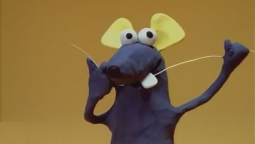
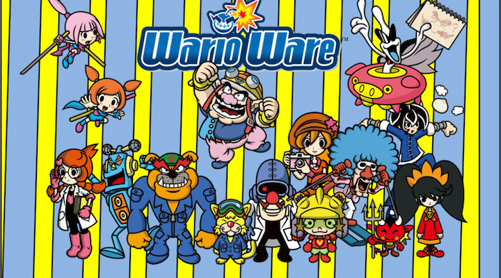

# Trabalho Prático 1 - Escove-meu-dente-por-favor

[][ratinho]

Uma criança típica já nasce programada para sentir medo de pelo menos 3 coisas
no mundo: (a) Bicho Papão, (b) Dentistas e (c) Palhaços. Alguns desses medos
são prejudiciais para a formação da crinça, como o caso do medo do (a)
Bicho Papão que, na realidade, nunca foi visto mundo material, e do medo dos
(b) Dentistas, que só estão ali para ajudar. O outro medo (c) é de
criaturas coloridamente perigosas e terríveis e as crianças
fazem bem em mantê-lo mesmo quando adultas. Até mesmo os professores.

Neste trabalho pretendemos ajudar crianças a entrarem tranquilas na salinha
do dentista. Para isso, vamos criar um jogo simples, descomprometido e maroto,
para que crianças (e ~~criançonas~~ adultos) possam jogar enquanto estão na
sala de espera.

## Inspiração

Há alguns jogos digitais que de uma certa forma
[mudaram o mundo][changed-world]. Outros jogos, um pouco menos raros, propõem
mecânicas tão singular que acabam por definir um novo gênero de jogo. Um
desses jogos foi o WarioWare.

[][warioware-video]

O jogo coloca o jogador contra desafios extremamente curtos, independentes
e focados em uma  mecânica de controles simples. Esses desafios, ou
**_microgames_** são colocados em sequência (de aproximadamente 20)
e devem ser cumpridos ininterruptamente e com pressa - cada um leva
até 10 segundos.

O senso de humor extravagante e o desafio de vencer as sequências de
desafios fizeram da série de jogos WarioWare um sucesso.

Outros jogos foram feitos usando uma mecânica similar, como o (i)
[Dumb Ways to Die][dumb-ways], uma iniciativa do governo australiano
para conscientizar crianças sobre perigos na vida real (_e.g._, ~~palhaços~~
andar nos trilhos de um trem, não olhar para atravessar a rua), o (ii)
[Mini Mix Mayhem][mini-mix], um jogo em que o jogador deve resolver 4
_microgames_ ao mesmo tempo e o (iii) [Beat the Boot][beat-the-boot], jogo
da Google para anunciar que seus Chromebooks levavam só 8 segundos para
ligar - cada desafio deveria ser completado em até 8 segundos.

## Escove-meu-dente-por-favor

Neste trabalho, vamos todos nós desenvolver o mesmo jogo, tudo junto. Tipo
MMODesenvolvimentoDeJogos (MultiProgramador Massivo Online etc. etc.).

O jogo já tem um arcabouço mínimo de programação pronto e disponível em seu
[repositório][repo]. A documentação (comentários, um ou outro diagrama) será
disponibilizada no próprio repositório.

Existem 2 _microgames_ prontos: (a) ShootTheCaries e (b) ShooTheTartarus. No
primeiro (a), o jogador deve atirar (com o mouse) em todas as cáries antes que o
tempo acabe. No segundo (b), o jogador deve proteger todos os dentes,
espantando os tártaros malignos que se aproximam.

### O que deve ser feito

Cada grupo de 1 a 2 integrantes deve **criar 2 novos _microgames_** na temática
proposta para o jogo. Os _microgames_ devem seguir um padrão similar aos
microjogos já existentes, mas **devem ter mais qualidade** (como presença
de som, cenários mais detalhados etc.) e **não devem seguir o mesmo
estilo gráfico** - no WarioWare, por exemplo, cada _microgame_ tem seu próprio
estilo.

Em uma segunda etapa do trabalho (em outra especificação), cada grupo vai
escolhar um conjunto de funcionalidades gerais para implementar no jogo -
_e.g._, uma tela de opções, tela de menu principal, tela de escolha
dos _microgames_, ajuste de dificuldade dinâmico etc.

### Descrição da implementação

O jogo está feito em LibGDX - Java e OpenGL. Para criar os _microgames_ é
permitido usar outras bibliotecas, como a [Box2D][box2d-libgdx] para
rotinas de física, por exemplo

## Avaliação

Seu trabalho será avaliado quanto à criatividade dos _microgames_ e à qualidade do resultado final e da implementação.

## O que faz perder nota

Alguns descuidos podem fazer com que sua nota fique muito abaixo do esperado:
- Seu trabalho não executa: nota 0
- Atraso na entrega. Cada dia de atraso reduz o valor máximo de nota da
  maneira abaixo. Considere `x` como dias de atraso e `f(x)` a penalidade
  percentual na nota:

  
  - Isso implica que 1 ou 2 dias de atraso são pouco penalizados
  - E após 5 dias de atraso, o trabalho vale 0
  - _Seeing is believing_: https://www.google.com.br/search?q=y%3D(2%5E(x-2)%2F0.16)%2Cy%3D100

## O que deve ser **entregue**

Deve ser entregue **um _pull request_** via **GitHub** contendo os _commits_
com o código e _assets_ criados pelo grupo.

[ratinho]: https://www.youtube.com/watch?v=BJM8lj3PQbc
[changed-world]: http://www.makeuseof.com/tag/10-video-games-that-changed-the-world/
[warioware-video]: https://youtu.be/35Wg3Ot4bHE?t=46s
[dumb-ways]: https://www.youtube.com/watch?v=IJNR2EpS0jw
[mini-mix]: https://play.google.com/store/apps/details?id=com.brokenbeta.minimixmayhem&hl=pt_BR
[beat-the-boot]: http://beattheboot.appspot.com/
[repo]: https://github.com/fegemo/cefet-games-brushmyteethplz
[box2d-libgdx]: https://github.com/libgdx/libgdx/wiki/Box2d
