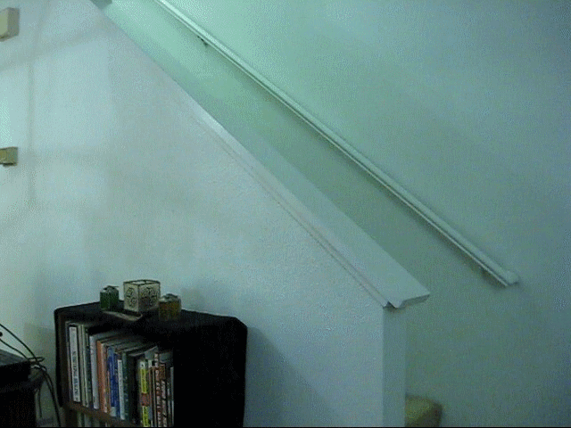
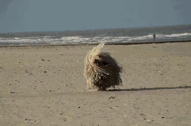
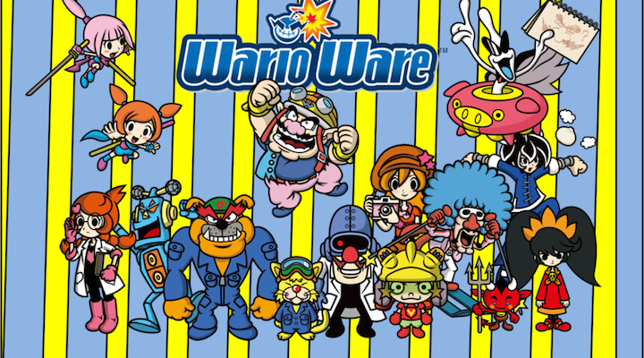
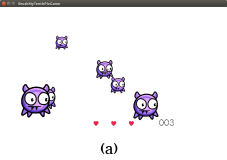
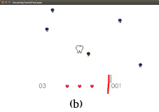

# Trabalho Prático 1 - Miau Au

Há vários séculos a humanidade domesticou alguns animais e convive com eles em
relação de harmonia e ternura. ~~Katchorros~~ Cães e ~~gatíneos~~ gatos
estão espalhados no mundo, praticamente ocupando todas as casas humanas, mas
pouco se conhece sobre a vida secreta desses peculiares seres.

Poucos acreditam, mas alguns já foram testemunhas, até oculares, de
acontecimentos cani-felinos que desafiam a compreensão que temos sobre essas
espécies. Há relatos, por exemplo, de (a) atividades sobrenaturais promovidas
por gatos, chamadas de Gatividade Paranormal.



...em outros casos, já foram avistados (b) espiocães, mestres do disfarce,
em algum tipo de missão secreta com suas habilidade de mimetização.



Sempre assumimos que eles ficam dormindo, quietinhos, quando não estamos
em casa. Mas isso não é verdade. Quais são seus objetivos - dominar o mundo?
promover a evolução humana? alavancar o conhecimento científico? previnir
a extinção humana destruindo asteróides potencialmente perigosos?

Neste trabalho, pretendemos mostrar ao mundo o pouco que já sabemos sobre a
vida secreta cani-felina. Para isso, vamos criar um jogo simples,
descomprometido e maroto conhecer um pouco mais sobre eles.


## Inspiração

Há alguns jogos digitais que de uma certa forma
[mudaram o mundo][changed-world]. Outros jogos, um pouco menos raros, propõem
mecânicas tão singulares que acabam por definir um novo gênero de jogo. Um
desses jogos foi o WarioWare.

[][warioware-video]

O jogo coloca o jogador contra desafios extremamente curtos, independentes
e focados em uma  mecânica de controles simples. Esses desafios - ou
**_microgames_** - são colocados em sequência (de aproximadamente 20)
e devem ser cumpridos ininterruptamente e com pressa - cada um leva
até 5 segundos.

O senso de humor extravagante e o desafio de vencer as sequências de
_microgames_ fizeram da série de jogos WarioWare um sucesso.

Outros jogos foram feitos usando uma mecânica similar, como o (i)
[Dumb Ways to Die][dumb-ways], uma iniciativa do governo australiano
para conscientizar crianças sobre perigos na vida real (_e.g._, ~~palhaços~~
andar nos trilhos de um trem, não olhar para atravessar a rua), o (ii)
[Mini Mix Mayhem][mini-mix], um jogo em que o jogador deve resolver 4
_microgames_ ao mesmo tempo e o (iii) [Beat the Boot][beat-the-boot], jogo
da Google para anunciar que seus Chromebooks levavam só 8 segundos para
ligar - cada desafio deveria ser completado em até 8 segundos.

## Miau Au

Neste trabalho, vamos todos nós desenvolver o mesmo jogo, tudo junto. Tipo
MMODesenvolvimentoDeJogos (MultiProgramador Massivo Online etc. etc.).

O jogo já tem um arcabouço mínimo de programação pronto e disponível em um
delicioso [repositório disponibilizado no GitHub][repo]. A documentação
(comentários, um ou outro diagrama) está disponibilizada no próprio
repositório.

Existem 2 _microgames_ prontos: (a) `ShootTheCaries` e (b) `ShooTheTartarus`,
que haviam sido feitos para o jogo Escovemeusdentesporfavor. No primeiro (a),
o jogador deve atirar (com o mouse ou tocando a tela) em todas as cáries
antes que o tempo acabe. No segundo (b), o jogador deve proteger todos os
dentes, espantando os tártaros malignos que se aproximam.




### O que deve ser feito

Cada grupo de 1 a 2 integrantes deve **criar 2 novos _microgames_** na temática
proposta para o jogo. Os _microgames_ devem seguir um padrão similar aos
microjogos já existentes, mas **devem ter MAIS qualidade** (os que estão lá
são muito simples) e **não podem seguir o mesmo estilo gráfico** - no
WarioWare, por exemplo, cada _microgame_ tem seu próprio estilo.

Pelo menos um dos dois _microgames_ devem conter uma das seguintes
características:

1. Usar o motor de física box2d para algo interessante
1. Usar um mapa em tiles como cenário
1. Ser em 3D em vez de 2D
1. Ter algum tipo inteligência artificial
1. Ter 2 "etapas" do jogo

Há dois tipos de _microgame_ e você deve escolher os formatos dos seus:

1. `TimeoutBehavior.WINS_WHEN_MINIGAME_ENDS`: jogador deve evitar que algo
   aconteça até o tempo do _microgame_ acabar. O `ShooTheTartarus` é
   desse tipo.
1. `TimeoutBehavior.FAILS_WHEN_MINIGAME_ENDS`: o jogador deve fazer algo
   antes que o tempo acabe. O `ShootTheCaries` é assim.

Cada _microgame_ deve poder ser **configurado quanto a sua dificuldade**.
Ao ser instanciado, ele recebe um nível de dificuldade entre 0 e 1, em que
0 é o nível mais fácil e 1 é o nível mais impossível.

O jogo é destinado a executar em três plataformas, sendo elas _desktop_,
dispositivos móveis e _web_, com a intenção de que ele execute tanto em
_smartphones_ quanto em outros dispositivos como _smart TVs_ cujos
aplicativos são baseados na _web_ (_e.g._, WebOS, FirefoxOS). Isso traz
mais dois requisitos não-funcionais ao jogo:

- **Independência de resolução**
  - Almejamos a razão de aspecto 16:9, com uma resolução ideal de
    1280:720 (_i.e._, _high definition_).
  - Contudo, os _microgames_ devem executar em qualquer resolução.
    - Veja no repositório como a
      [independência de resolução][resolution-independence] está sendo feita.
- **_Input_ via mouse ou toque**
  - Para que seja possível jogar em um computador, dispositivo sensível a
    toque e dispositivo com apontador estilo o controle do Wii
    (_e.g._, _smart TVs_ com sistema WebOS).
  - A LibGDX possui abstrações de `input` (em
    `if (Gdx.input.justTouched() == true)`, por exemplo) que já nos dão
    a flexibilidade que precisamos.


### Descrição da implementação

O jogo está feito em LibGDX - Java e OpenGL. Para criar os _microgames_ é
permitido usar outras bibliotecas, como a [Box2D][box2d-libgdx] para
rotinas de física, por exemplo.

Criar um _microgame_ no jogo é uma tarefa com 3 etapas:

1. **Criar uma classe** (_e.g._, `MicroJogoMarotex`) que herda as
   funcionalidades e tipo (_i.e._, `extends`) da classe abstrata
   `MiniGame`. Exemplo:
   ```java
   public class MicroJogoMarotex extends MiniGame {
       // ...

       @Override
       public void onCreate() {
          // instancia as entidades do minigame (jogador/inimigos/cenário/sons)
       }

       @Override
       public void onHandlePlayingInput() {
           // lidar com input do jogador
       }

       @Override
       public void onUpdate(float dt) {
           // atualizar a lógica do minigame
       }

       @Override
       public void onDraw() {
           // desenhar as paradas
       }

       // ... outros métodos
   }
   ```
   - Caso o jogador consiga vencer o desafio antes do tempo do _microgame_,
     você deve chamar `super.challengeSolved()` nesse momento.
   - Analogamente, caso o jogador perca o desafio antes do tempo, você
     deve chamar `super.challengeFailed()`.
1. **Criar uma classe** (_e.g._, `MicroJogoMarotexFactory`) que
   implementa (_i.e._, `implements`) a interface `MiniGameFactory`. Exemplo:
   ```java
   public class MicroJogoMarotexFactory implements MiniGameFactory {
       @Override
       public MiniGame createMiniGame(BaseScreen screen,
         GameStateObserver observer, float difficulty) {
           // retorna uma nova instância de
           // MicroJogoMarotex, e.g.:
           // return new MicroJogoMarotex(...);
       

       @Override
       public Map<String, Class> getAssetsToPreload() {
           // retorna um conjunto de assets para serem
           // pré-carregados antes deste
           // minigame começar
       }
   }
   ```
1. **Alterar a classe da tela de jogo** (`PlayingGamesScreen`) para colocar
   o novo _minigame_ como elegível para sorteio:

   ```java
   // ...
   public PlayingGamesScreen(Game game, BaseScreen previous) {
       // ...
       this.sequencer = new GameSequencer(5, new HashSet<MiniGameFactory>(
               Arrays.asList(
                       new ShootTheCariesFactory(),
                       new ShooTheTartarusFactory()),
                       // COLOQUE ESTA LINHA:
                       new MicroJogoMarotexFactory()
       ), this, this);
   }
   ```

## Avaliação

Seu trabalho será avaliado quanto à criatividade dos _microgames_ e à
qualidade do resultado final e da implementação.

## O que faz perder nota

Alguns descuidos podem fazer com que sua nota fique muito abaixo do esperado:
- Seu trabalho não executa: nota 0
- Atraso na entrega. Cada dia de atraso reduz o valor máximo de nota da
  maneira abaixo. Considere `x` como dias de atraso e `f(x)` a penalidade
  percentual na nota:

  
  - Isso implica que 1 ou 2 dias de atraso são pouco penalizados
  - E após 5 dias de atraso, o trabalho vale 0
  - _Seeing is believing_: https://www.google.com.br/search?q=y%3D(2%5E(x-2)%2F0.16)%2Cy%3D100


## O que deve ser **entregue**

Deve ser entregue **um _pull request_** via **GitHub** contendo os _commits_
com o código e _assets_ criados pelo grupo.

Veja no [repositório][repo] algumas instruções mais detalhes acerca da entrega.

[changed-world]: http://www.makeuseof.com/tag/10-video-games-that-changed-the-world/
[warioware-video]: https://www.youtube.com/watch?v=Ch9YyYiBvQY
[dumb-ways]: https://www.youtube.com/watch?v=IJNR2EpS0jw
[mini-mix]: https://play.google.com/store/apps/details?id=com.brokenbeta.minimixmayhem&hl=pt_BR
[beat-the-boot]: http://beattheboot.appspot.com/
[repo]: https://github.com/fegemo/cefet-games-meow-au
[box2d-libgdx]: https://github.com/libgdx/libgdx/wiki/Box2d
[resolution-independence]: https://github.com/fegemo/cefet-games-brushmyteethplz/blob/master/README.md#sistema-de-coordenadas
