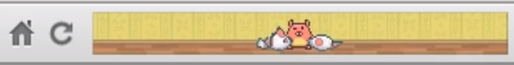

# Trabalho Prático 1 - RA 14,4 (ou 0,694)

Segundo especialistas, RA é a sigla para <u>r</u>azão de <u>a</u>specto, que
representa a divisão da largura de alguma coisa por sua altura. Neste trabalho,
vamos fazer um jogo horizontal (RA 14,4) ou vertical (RA 0,0694). Mas da onde
veio essa incrível ideia?

## Inspiração

Lá nos antigamentes, uma empresa Israelense chamada BaconOppenheim, por motivos
misteriosos, achou sensacional a ideia de criar jogos que executavam na barra
de favoritos do navegador Firefox. Eles criaram o PiTSi
([vídeo][pitsi-video], [página oficial][pitsi-page]) inspirado nos jogos
de bichinho virtual e o Velocity X
([vídeo][velocityx-video], [página oficial][velocityx-page]) como um jogo de
navinha que não deve se chocar com o teto e o chão.

A premissa dos adoradores do Bacon era que os jogos pudessem ser jogados
por jogadores com foco ou tempo fracionado, ou seja, eles não requeriam atenção
constante. Chegaram até a cunhar o termo "background gaming" indicando essa
característica de deixar que o jogo possa ficar sem atenção do jogador por um
tempo, seja pausado (como no Velocity X) ou "se jogando" sozinho
(como no PiTSi).

[pitsi-video]: https://www.youtube.com/watch?v=9pVBon_WjAk
[pitsi-page]: http://www.bnop.co/projects/pitsi/
[velocityx-video]: https://www.youtube.com/watch?v=FT4bEFux6Ng
[velocityx-page]: http://www.bnop.co/projects/velocity-x/

## O Trabalho

Você, sozinho ou em dupla, deve propor e desenvolver um jogo simples com razão
de aspecto 14,4 (eg, 720 de largura por 50 de altura) ou 0,0694
(eg, 50 de largura por 720 de altura), porém completo, com arte criada ou
apropriada pela equipe, efeitos sonoros, música, condição de vitória/derrota e
progressão de dificuldade.

É objetivo deste trabalho exercitar o projeto de jogos (_game design_),
computação gráfica e inteligência artificial para (a) fazer uma simulação
(como no caso de bichinho virtual) ou para (b) controlar os personagens que
jogam por conta própria (como no La Brutte). Portanto, pensem em uma
mecânica simples.

O jogo pode ser criado em qualquer tipo de ferramenta (_maker_, motor,
_framework_ ou API gráfica). Uma sugestão é fazê-lo na mesma ferramenta que
se pretende usar para o projeto da disciplina (para já ir aprendendo).

Fazer o jogo todo, completinho do jeito que foi proposto garante à equipe uma
nota de 75% do trabalho. Para conseguir mais pontos, até um limite de 120%,
podem ser implementados alguns itens opcionais, descritos mais adiante.

- Itens obrigatórios **(75%)**:
  1. Possibilitar controle do jogo pelo jogador (via mouse, teclado ou toque).
     É importante que o controle seja simplificado, dado o tamanho da tela e o
     objetivo do jogo.
  1. Ter arte consistente, que pode ser criada por terceiros
     (basta dar os créditos, se a licença permitir).
  1. Música de fundo e feitos sonoros relevantes.
  1. Uma mecânica de jogo *simples*. Se precisar de ideias, veja o FAQ.
  1. Deve ser possível se abster do jogo temporariamente
     (eg, quando o mouse está fora dele o jogo fica em "modo _background_").
- Itens opcionais:
  1. **(até 8%)** rolagem da tela, possivelmente com efeito parallax.
  1. **(3-10%)** geração procedural de conteúdo.
  1. **(até 6%)** _input_ diferente do obrigatório (eg, por fala).
  1. **(até 8%)** IA mais rebuscada para controlar o jogo quando em
     "modo _background_" (eg, em um jogo de navinha, ela é controlada
     automaticamente pela IA, mas vai gastando algum combustível por isso).
  1. **(até 6%)** criar a própria arte.
  1. **(4%/7%)** ter um _ranking_, que pode ser local/online.
  1. **(5%)** cenário criado com _tilesets_.
  1. **(5%)** ser em 3D.
  1. **(5%)** iluminação dinâmica em 3D ou em 2D (neste caso, algo como
     [box2dlights][box2dlights] ou [Sprite Lamp][spritelamp] -
     o professor tem uma cópia _DRM Free_).
  1. **(até 5%)** uso de física para algo diferente de velocidade/aceleração
     tangencial.
  1. **(4%)** ter três ou mais fases.
  1. **(4%)** possibilidade de salvar/resumir o jogo de onde parou.
  1. **(5%)** animações em tempo de execução, usando algo como eg
     [Dragon Bones][dragonbones].
  1. **(5%)** exportar para web, para que o jogo possa ser jogado dentro
     do navegador, sem instalação. Se muitos grupos fizerem isto, o professor
     vai criar uma página contendo todos os jogos ao mesmo tempo.

[box2dlights]: https://github.com/libgdx/box2dlights
[spritelamp]: http://www.snakehillgames.com/spritelamp/
[dragonbones]: http://dragonbones.com/en/index.html

## Avaliação

Seu trabalho será avaliado quanto à qualidade do resultado final e da
implementação, além do cumprimento do objetivo proposto.

## O que faz perder nota

Alguns descuidos podem fazer com que sua nota fique muito abaixo do esperado:
- Seu trabalho não executa: nota 0
- Não gravar vídeo: nota/2
- Atraso na entrega. Cada dia de atraso reduz o valor máximo de nota da
  maneira abaixo. Considere `x` como dias de atraso e `f(x)` a penalidade
  percentual na nota:

  
  - Isso implica que 1 ou 2 dias de atraso são pouco penalizados
  - E após 5 dias de atraso, o trabalho vale 0
  - _Seeing is believing_: https://www.google.com.br/search?q=y%3D(2%5E(x-2)%2F0.16)%2Cy%3D100

## FAQ

1. Sério, não consigo conceber um único motivo de fazer o jogo com uma
   **razão de aspecto tão bizarra**...
  - Na verdade, quando nós criadores temos restrições (seja de tempo, de
    dinheiro, número de cores, resolução ou de outras limitações de hardware
    ou software), ficamos com menos opções. E isso é... ótimo! Algo que pode
    acontecer conosco se chama "paralisia decisória", e a ideia é evitar isso.
    Pense: é mais fácil escolher o sabor de uma pizza quando temos 200 sabores,
    ou quando temos apenas 3 possibilidades?
1. Não consegui pensar em **ideias de jogo**. O que eu poderia fazer?
  - Jogo de {navinha, submarino, barco} destruindo {meteoros, torpedos, aviões}.
  - Um _endless runner_, estilo jogo do dinossaurinho do Chrome, em que
    o jogador pode saltar/abaixar para desviar de paradas.
  - Um _clicker_, em que o jogador vai fazendo pontos, mas quando clica em
    alguma coisa faz mais pontos ainda; e ele pode aumentar a quantidade de
    pontos por segundo comprando _upgrades_.
  - Bichinho virtual, estilo o PiTSi.
  - [Vertical] Jogo de pular de plataforma em plataforma para cima evitando
    cair no chão, estilo [Doodle Jump][doodle].
  - [Vertical] Jogo de pescaria em que o anzol deve chegar até o fundo pegando
    peixes pelo caminho e evitando obstáculos, estilo
    [Ridiculous Fishing][ridiculous].

[doodle]: https://youtu.be/MHnQI9vUv-Y?t=10
[ridiculous]: https://youtu.be/vzKcJ8QFbMk?t=13
