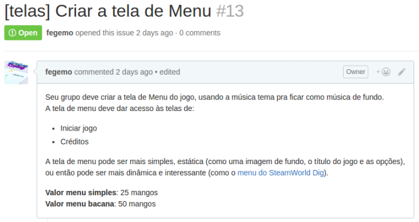
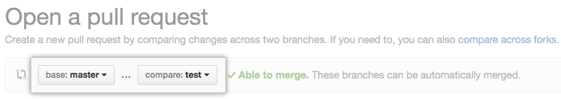

# Trabalho Prático 2 - Escovemeudente**denovo**

Nesta segunda etapa, vamos concluir o desenvolvimento do nosso jogo completo: o **Escovemeudenteporfavor**.

Com essa nova leva de melhorias, queremos deixar o jogo muito mais **_juicy_** (normalmente traduzido como **fluido**, ou mesmo **suculento**).

Um jogo _juicy_ é diferente de um jogo "quadradão". A ideia é que as animações sejam
mais arredondadas e menos lineares. Que coisas aconteçam a cada interação do jogador e do próprio jogo. Veja um exemplo de [transformação de um breakout "quadradão" em um breakout juicy][juice-it-or-lose-it]. Ou então [jogue as duas versões][juice-it-game]¹².

¹ **Ao entrar no jogo**, a versão "quadradona" está ativada. **Pressione "Enter"** para ativar a versão _juicy_.

² Precisa de _flash_ no navegador (_i.e._, o Chrome não abrirá)

## O que deve ser feito

Cada grupo de 1 a 2 integrantes deve escolher novas funcionalidades para implementar, que estão descritas como _issues_ no [repositório do jogo no GitHub][repo].

Cada funcionalidade tem um certo valor de mercado, pelo qual o professor vai comprar seu trabalho. Por exemplo, pela funcionalidade **[telas] Criar a tela de Menu**, o professor está disposto a pagar **de 25 a 50 mangos**.



Ao final do semestre, você pode trocar seus mangos por pontos e então passar na disciplina. A taxa de conversão é de 100 mangos por 15 pontos.

Como o professor está rico, ele está comprando tarefas com até mais do que um 100 mangos de cada grupo, podendo adquirir trabalhos por um total de até 120 mangos.


## Desenvolvimento do Projeto

Este trabalho será gerenciado pelo professor semanalmente durante a aula prática, preferencialmente, ou na teórica.

O status de desenvolvimento das tarefas será rastreado com [um quadro no Trello][trello]. As regras são as seguintes:

1. Todo grupo deve ter sempre **1, e apenas 1, tarefa a ele assinalada**
  - Exceção: grupo já concluiu suas implementações
1. Os _deadlines_ das tarefas precisam ser cumpridos
  - Nota: algumas tarefas possuem _deadlines_ bem anteriores à entrega final do trabalho
    - Isso acontece porque outras tarefas dependem delas para que possam ser iniciadas
1. Deve haver progresso semanal, verificado pelo professor
  - Consequência: caso um grupo não faça progresso em uma tarefa a ele assinalada por 8 dias, ele perderá a tarefa (e pontos)
1. Tarefas bloqueadas não podem ser iniciadas até que suas condições de desbloqueio sejam satisfeitas
1. A tarefa fegemo/cefet-games-brushmyteethplz#29 (+1 MiniGame) é especial e pode ser implementada até 1x por cada grupo
  - O grupo é responsável por criar uma tarefa no Trello relativa a ela

### Fluxo de Trabalho (_Workflow_)

**Cada tarefa** deve ser enviada como **um _pull request_ separado**. Desta vez, cada **grupo será responsável por mesclar suas alterações** (_commits_) antes de enviar seu(s) _pull requests_. Sendo assim, quanto antes você concluir suas atividades, menor a chance e a quantidade de conflitos.

Antes de começar uma nova tarefa, você deve [atualizar o seu _fork_ a partir do repositório original][sync-fork].

Cada tarefa deve ser feita em um _branch_ próprio cujo nome contenha os nomes dos integrantes da dupla e o número da tarefa (_issue_) sendo implementada: _e.g._, _branch_ `sandy-junior-20`.

Os passos para fazer uma tarefa são:

1. Atualizar o _branch_ `master` do _fork_ com o _branch_ `master` do repositório original ([sincronizando _forks_][sync-fork])
1. Criar um _branch_ local, a partir do `master`, com nome da dupla e código da tarefa (_e.g._, `sandy-junior-20`)
  ```
  git checkout master
  git branch sandy-junior-20
  git checkout sandy-junior-20
  ```
1. Desenvolver a tarefa e dar um ou mais _commits_ no _branch_ da tarefa
1. [Criar o _pull request_][pull-request] pela interface web do GitHub
  - A origem é seu _branch_ da tarefa (_e.g._, `sandy-junior-20`)
  - O destino é o _branch_ `master` do repositório original
  - Caso o GitHub informe que é possível fazer o _merge_ sem conflitos, prossiga com a criação do _pull request_

  
  - Caso não seja possível fazer o _merge_ automático, você deve atualizar seu _branch_ (`sandy-junior-20`) com base no `master` do repositório original (_i.e._, `upstream/master`). Para fazê-lo:
    1. Abandone a criação do _pull request_ por ora
    1. Rebaseie seu _branch_ em cima do `upstream/master`:
      ```
      git fetch upstream
      git checkout sandy-junior-20
      git rebase upstream/master
      ```
      - Neste momento, um _rebase_ iniciará e **conflitos** surgirão e **precisarão ser corrigidos**. Leia atentamente as mensagens dadas pelo Git no terminal e prossiga até que o _rebase_ tenha terminado
    1. Teste o jogo para ver se está tudo funcionando e se suas alterações estão presentes
    1. Volte para a interface web do GitHub e crie o _pull request_

## Avaliação

Seu trabalho será avaliado quanto à qualidade do resultado final e da implementação, além do cumprimento dos prazos estabelecidos.


[repo]: https://github.com/fegemo/cefet-games-brushmyteethplz
[repo-issues]: https://github.com/fegemo/cefet-games-brushmyteethplz/issues
[sync-fork]: https://help.github.com/articles/syncing-a-fork/
[pull-request]: https://help.github.com/articles/creating-a-pull-request/
[trello]: https://trello.com/b/Riltj01G
[juice-it-or-lose-it]: https://www.youtube.com/watch?v=Fy0aCDmgnxg
[juice-it-game]: http://grapefrukt.com/f/games/juicy-breakout/
