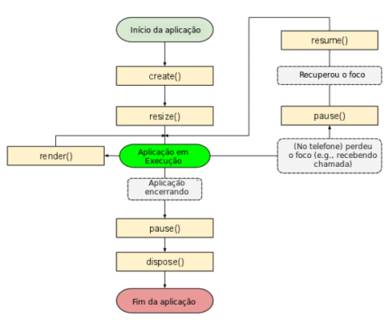
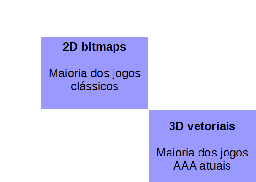
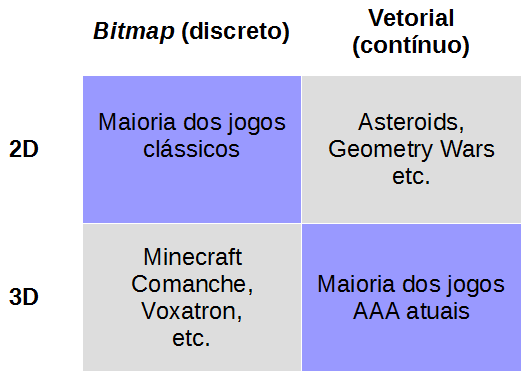
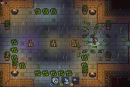
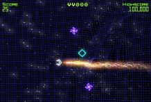
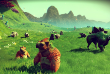
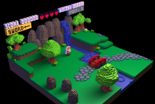
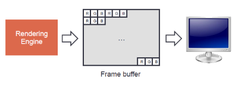
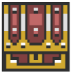

<!--
backdrop: 2d-graphics
bespokeEvent: bullets.disable
-->

# Gráficos em 2D - Texturas e Sprites
---
# Roteiro

1. LibGDX: introdução
1. Imagens discretas _vs._ contínuas
1. Desenho de objetos 2D
   - Texturas e atlas
   - _Sprite Batching_
   - _Sprites_ e _spritesheets_
1. Prática Goombas
<!--1. Desenho de cenários 2D
  - _Tiles_ e _tilesets_
  - _Scrolling_
  - _Parallaxing_
-->

---
<!-- { "layout": "section-header" } -->


---
<!-- { "layout": "regular" } -->
## 

- Um _framework_ para desenvolvimento de jogos 2D/3D
  - Multiplataforma: desktop, web, Android e iOS
  - Escrito em Java
  - Baseado em OpenGL <abbr title="Embedded Systems">ES</abbr>
  - Gratuito, de código aberto
- [Site oficial](https://libgdx.badlogicgames.com/)

---
<!-- { "layout": "regular" } -->
# Funcionamento da LibGDX

- ```java
  public class MeuJogo implements
    ApplicationListener {
    public void create() { }
    public void resize(int w, int h) { }
    public void render() { }
    public void pause() { }
    public void resume() { }
    public void dispose() { }
  }
  ```
  <!-- {li:.push-right.no-bullet style="width: 530px;"} -->
- Gameloop
  - Já está devidamente implementado pelo _framework_ <!-- {ul^1:.full-width} -->
- Basta **implementar `ApplicationListener`** ou herdar `ApplicationAdapter`:
  - `create()` é chamada 1x
  - `resize(w,h)` é chamada quando a tela muda de tamanho
  - `render()` é chamada sempre

---
<!-- { "layout": "centered-horizontal" } -->
# Ciclo de vida de uma aplicação LigGDX



- [Documentação][docs-lifecycle]

[docs-lifecycle]: https://github.com/libgdx/libgdx/wiki/The-life-cycle

---
<!-- { "layout": "section-header" } -->
# Representação de imagens
## Imagens discretas _vs._ contínuas

---
<!-- { "layout": "centered-horizontal" } -->
# Tipos de Representação

<figure style="position: relative; display: block; margin: auto;">
  
  
  
  
  
  
  
</figure>

---
<!-- { "layout": "regular" } -->
# **Renderização**

- Independente da representação interna dos gráficos do jogo (2D, 3D, bitmaps,
  vetorial), **renderizar significa definir as cores do _frame buffer_**
  - O _frame buffer_ é um pedaço da RAM contendo uma matriz de cores que
    armazena o que está sendo mostrado na tela

    
- Hoje vamos focar em 2D + _bitmaps_

---
<!-- { "layout": "regular" } -->
# Texturas

- ::: figure .polaroid.push-right width: 180px;background: transparent;
    
    <figcaption>bau.png</figcaption>
  :::
  Quando usamos 2D + _bitmaps_:
  - Usamos imagens previamente criadas por artistas gráficos
    - A essas imagens damos o nome de **texturas**
  - Mais tecnicamente, **textura é uma imagem enviada para a placa de vídeo**
    e eventualmente usada para ser <u>aplicada a um retângulo</u>

---
<!-- { "layout": "regular" } -->
# Classe [`Texture`][docs-texture] na LibGDX

```java
// na função "create":
batch = new SpriteBatch();
fundo = new Texture("tela-de-fundo.png");
fundoX = 20;
fundoY = 0;

// na função "render":
batch.draw(fundo, fundoX, fundoY);
```
- Mas quem é esse `SpriteBatch`?

[docs-texture]: https://libgdx.badlogicgames.com/nightlies/docs/api/com/badlogic/gdx/graphics/Texture.html

---
<!-- { "layout": "regular" } -->
## Classe `SpriteBatch` ([documentação][docs-spritebatch] - 1/2)

- Cada vez que se desenha algo, há um **processo de comunicação** com a
  placa de vídeo que é **dispendioso**
  - Para evitar fazer várias pequenas comunicações, <u>optamos por fazer
    uma menor quantidade de comunicações maiores</u> <!-- {li:.push-left style="max-width: 60%;"} -->
    ```java
    batch.begin();
    batch.draw(texturaFundo, 0, 0);
    batch.draw(texturaCeu, 0, 250);
    batch.draw(texturaTerreno, 0, 0);
    // ...outros desenhos...
    batch.end(); // apenas 1 chamada à GPU
    ```
  - Para tal, usamos uma `SpriteBatch`
    - Acumulamos vários desenhos (texturas) e mandamos desenhar apenas 1 vez
    - Veja a documentação da [`SpriteBatch`][docs-spritebatch]

[docs-spritebatch]: https://libgdx.badlogicgames.com/nightlies/docs/api/com/badlogic/gdx/graphics/g2d/SpriteBatch.html

---
<!-- { "layout": "centered-horizontal" } -->
## Classe `SpriteBatch` (2/2)

```java
public class MeuJogo extends ApplicationAdapter {
    private SpriteBatch batch;

    public void create () {
        batch = new SpriteBatch();
    }

    public void render () {
        // apaga a tela para redesenhar nela
        Gdx.gl.glClear(GL20.GL_COLOR_BUFFER_BIT);

        batch.begin();
        // comandos de desenho aqui...
        // batch.draw(...)
        batch.end();
    }
}
```

---
<!-- { "layout": "regular" } -->
# Classe `Sprite`

- ```java
  // na função "create":
  batch = new SpriteBatch();
  textura = new Texture("jogador.png");
  jogador = new Sprite(textura);
  jogador.setPosition(50, 20);

  // na função "render":
  batch.begin();
  batch.draw(texturaFundo, 0, 0);
  batch.draw(texturaCeu, 0, 200);
  jogador.draw(batch);  // ela se desenha,
  batch.end();          // com o "batch"
  ```
  <!-- {li:.no-bullet.push-right.compact-code style="max-width: 64%;"} -->
- Uma [_Sprite_][docs-sprite] é um objeto gráfico (possui uma textura) <!-- {li:style="margin-right: 20px;"} -->
  posicionado na tela do jogo:
  - textura
  - dimensão (largura, altura)
  - posição (x, y)


[docs-sprite]: https://libgdx.badlogicgames.com/nightlies/docs/api/com/badlogic/gdx/graphics/g2d/Sprite.html

---
<!-- { "layout": "2-column-highlight-and-list" } -->
# _Spritesheet_

::: figure .polaroid.light.push-right width: 180px;
  
  <figcaption>goomba-spritesheet.png`</figcaption>
:::

- É muito comum termos **animações** de _sprites_
- Nesse caso, criamos uma **_spritesheet_** contendo **todos os quadros
  de animação** de um personagem
  - Usar apenas 1 arquivo (e, portanto, 1 textura) em vez de 20 tem
    desempenho muito melhor
- Na LibGDX, não há `AnimatedSprite`¹, então usamos `Texture` e `Animation`
  - ¹mas dá pra criar!

---
<!-- { "layout": "centered-horizontal" } -->
# **Animações** em LibGDX (1/3)

```java
Texture spriteSheet;
TextureRegion[][] quadrosDaAnimacao;
Animation andarParaFrente;
float tempoDaAnimacao;

// na "create()"
spriteSheet = new Texture("goomba-spritesheet.png");
quadrosDaAnimacao = TextureRegion.split(spriteSheet, 20, 30);
andarParaFrente = new Animation(0.1f,
  quadrosDaAnimacao[0][0], // 1ª linha, 1ª coluna
  quadrosDaAnimacao[0][1], // idem, 2ª coluna
  quadrosDaAnimacao[0][2],
  quadrosDaAnimacao[0][3],
  quadrosDaAnimacao[0][4]);
andarParaFrente.setPlayMode(PlayMode.LOOP_PINGPONG);
tempoDaAnimacao = 0;

// na "update()"
tempoDaAnimacao += Gdx.graphics.getDeltaTime();

// na "render()"
batch.draw((TextureRegion)
  andarParaFrente.getKeyFrame(tempoDaAnimacao), x, y);
```

---
<!-- { "layout": "regular" } -->
# Animações na LibGDX (2/3)

- Classe `Animation` ([documentação][docs-animation],
  [informações][guide-animation])
  ```java
  Animation andarParaFrente =
    new Animation(tempoEntreQuadros, quadro1, quadro2...);
  ```
  - Contém uma sequência de `TextureRegion` que são alternadas ao longo do tempo
- Classe `TextureRegion` ([documentação][docs-textureregion],
  [informações][guide-textureregion])
  ```java
  TextureRegion quadroDoMeio =
    new TextureRegion(textura, 0, 0,
      larguraDoQuadro, alturaDoQuadro);
  ```
  - É um pedaço de uma textura


[docs-animation]: https://libgdx.badlogicgames.com/nightlies/docs/api/com/badlogic/gdx/graphics/g2d/Animation.html
[guide-animation]: https://github.com/libgdx/libgdx/wiki/2D-Animation
[docs-textureregion]: https://libgdx.badlogicgames.com/nightlies/docs/api/com/badlogic/gdx/graphics/g2d/TextureRegion.html
[guide-textureregion]: https://github.com/libgdx/libgdx/wiki/Textures,-textureregion-and-spritebatch#textureregion

---
<!-- { "layout": "regular" } -->
# Animações na LibGDX (3/3)

- Método estático
  `TextureRegion.split(textura, larguraDoQuadro, alturaDoQuadro)`:
  - **Divide a textura** em uma matriz de quadros (`TextureRegion[][]`)
  - Usamos essa matriz para **instanciar as animações**
- Classe `Animation` (continuação)
  ```java
    //...na função "render()"
    tempoDaAnimacao += Gdx.graphics.getDeltaTime();
    TextureRegion quadroCorrente = (TextureRegion)
      andarParaFrente.getKeyFrame(tempoDaAnimacao);
    batch.draw(quadroCorrente, x, y);
  ```
  - Desenhamos apenas o **"quadro corrente"**

---
<!-- { "layout": "section-header" } -->
# Goomba Transdimensional

---
<!-- { "layout": "regular" } -->
## Prática Goombas

1. Faça um _fork_ do
  [repositório com o código seminal][activity-sprites] no GitHub
1. Clone **seu _fork_** para seu computador
1. Faça a atividade descrita no [enunciado][activity-sprites]
1. Faça _add_ e _commit_ com as suas mudanças
1. Faça _push_ para enviar seus _commits_
1. Envie o link do seu repositório no Moodle

[activity-sprites]: https://github.com/fegemo/cefet-games-goomba

---
<!-- { "layout": "centered" } -->
# Referências

- Livro _LibGDX Game Development Essentials_
  - Capítulo 1: _Wiring Up_
  - Capítulo 2: _Let There Be Graphics_
