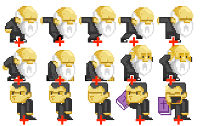

<!--
backdrop: 2d-graphics
bespokeEvent: bullets.disable
-->

# Gráficos em 2D
---
# Roteiro

1. Imagens discretas _vs._ contínuas
1. Desenho de objetos 2D
  - _Sprites_ e _spritesheets_
  - Texturas e atlas
1. Desenho de cenários 2D
  - _Tiles_ e _tilesets_
  - _Scrolling_
  - _Parallaxing_
1. LibGDX: introdução
  - _Sprite Batching_
  - Exercício

---
# Imagens Discretas _vs._ Contínuas

---
## Tipos de Representação

<figure style="position: relative; display: block; margin: auto;">
  
  
  
  
  
  
  
</figure>

---
## **Renderização**

- Independente da representação interna dos gráficos do jogo (2D, 3D, bitmaps,
  vetorial), **renderizar significa definir as cores do _frame buffer_**
  - O _frame buffer_ é um pedaço da RAM contendo uma matriz de cores que
    armazena o que está sendo mostrado na tela

    
- Hoje vamos focar em 2D + _bitmaps_

---
# Desenhos de objetos 2D
---
## Texturas

- Quando usamos 2D + _bitmaps_:
  - Usamos imagens previamente criadas representando com os pixels que queremos
    desenhar


---
## _Sprite_

```
class Sprite {
  Texture textura;
  Rect dimensoes;
  Vector2 posicao;
  Vector2 ancora;

  void desenha() {
    // ...
  }
}
```

---
## _Spritesheet_



---
# Referências

- Livro _LibGDX Game Development Essentials_
  - Capítulo 1: _Wiring Up_
  - Capítulo 2: _Let There Be Graphics_
