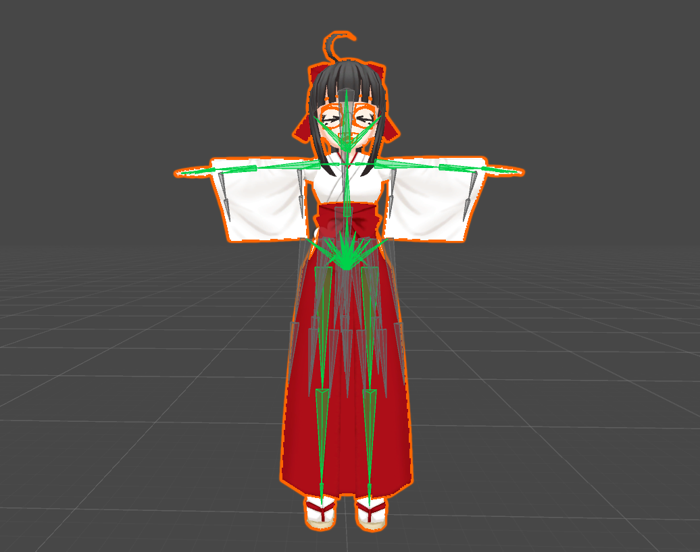

<!-- {"layout": "title"} -->
# Animação de Personagens

---
<!-- {"layout": "centered-horizontal"} -->
# Roteiro

1. [Tipos de animação](#tipos-de-animacao)
   - Animação em células
   - Animação hierárquica rígida (_skeletal_)
   - Animação por vértice (/_morph targets_)
   - Animação de pele (_skinning_)
1. [Técnicas avançadas](#tecnicas-avancadas)
   - Mesclagem de clipes
   - Redirecionamento de animação (_retargeting_)
1. [Animação procedural](#animacao-procedural)

---
<!-- {"layout": "regular"} -->
# Animação

- Animação não é a mesma coisa que movimento

  **Movimento** <!-- {.alternate-color} -->
  ~ Alterar posição (x,y,z) do centro de gravidade de um objeto ao longo do tempo

  **Animação**
  ~ Alterar representação interna do objeto ao longo do tempo
- A maior parte dos jogos centra nos personagens
  - Tipicamente, humanos, humanóides às vezes animais ou aliens
  - Esses personagens precisam se mover de forma **fluida, orgânica, verossímel**
  - Isso é mais difícil do que animar objetos rígidos (_e.g._, uma bola rolando)
- Tipos de animação definem como elas são produzidas e como são executadas

---
<!-- { "layout": "section-header", "slideClass": "tipos-de-animacao", "slideHash": "tipos-de-animacao" } -->
# Tipos de Animação

1. Por célula
1. Hierárquica rígida
1. _Morph target_
1. _Skinning_

---
<!-- {"layout": "regular"} -->
# Tipo: **Animação por Células**

1. <!-- {.layout-split-3.full-width style="align-items: center; justify-content: center"} -->
   <!-- {ol:.no-bullet.full-width.no-margin} -->
   
   
   ::: figure .sprite.push-right width: 60px; height: 60px; margin: 0
    <!-- {p:.no-margin} -->
   :::

- Ilusão de movimento produzida pela **alternância de imagens
  pré-renderizadas**, tipicamente desenhadas por artistas **quadro a quadro**
- Um personagem pode ter vários **clipes de animação**:
  - À toa (_idle_), andando, correndo, saltando etc.
  - Alguns **clipes fazem _loop_** (_e.g._, andando), outros não
    (_e.g._, morrendo)

---
<!-- {"layout": "regular"} -->
# Tipo: **Animação Hierárquica Rígida** (_Skeletal_)

-  <!-- {ul:.bullet} -->
  Personagens são modelados como um conjunto de partes rígidas
  - Quando começamos com jogos 3D, esta foi a "primeira" técnica (Doom ainda usava _sprites_)
- **Partes dispostas em hierarquia** (partindo da pelvis)
  -  <!-- {ul^0:.bulleted} -->
    Problema: "rachaduras" nas juntas
  - Funciona bem para robôs e maquinário, construídos de partes rígidas

---
<!-- {"layout": "regular"} -->
# Animação _Skeletal_

- Apesar de falarmos em ossos, **o que importa mesmo são as juntas (_joints_)**
- Inicialmente proposto para personagens 3D, mas hoje em dia fazemos também em 2D!
  - ::: figure .polaroid.item-300w
     <!-- {ul^0:.multi-column-inline-list-2.no-bullet} --> <!-- {.full-width} -->
    <figcaption>Avengers: Age Of Ultron – Global Chaos (2D)</figcaption>
    :::
  - ::: figure .polaroid.item-300w
     <!-- {style="width: 140px;"} -->
    <figcaption>Super Mario 64 (3D)</figcaption>
    :::

---
<!-- {"layout": "regular"} -->
# **Pose** do esqueleto e **clipes** de animação

- A **pose de uma junta** é definida com relação à junta pai por:
  - Posição
  - Orientação
  - Escala <!-- {ul^0:.multi-column-list-3} -->
- Tipicamente representada por uma estrutura SQT (_**S**cale, Rotation **Q**uaternion, **T**ranslation_)
  - Quatérnio: uma ferramenta matemática que consegue expressar uma rotação
    melhor que uma matriz
-  <!-- {.push-right style="max-width: 350px;"} -->
  **Uma pose de um esqueleto** é formada pelo **conjunto das poses de cada junta**
- Uma **pose chave** é uma pose que representa um extremo de um movimento
- Um **clipe** de animação é formado por uma **sequência de poses chave que são interpoladas**

*[SQT]: scale, quaternion, translation*

---
<!-- {"layout": "regular"} -->
# Interpolação de Pose

- **Clipe**: sequência de poses nos tempos
  t_1, t_2, ..., t_n
- Para cada tempo t tal que t_i < t < t_j:
  - O motor de animação pode interpolar entre poses definidas em t_i < t < t_j
  - A interpolação gera as poses intermediárias
- ::: figure .polaroid.item-250w.push-right
     <!-- {.full-width} -->
    <figcaption><a href="https://dragonbones.github.io/demo/DragonBonesEvent/index.html">Exemplo</a> usando motor de animação DragonBones</figcaption>
  :::
  Já que podemos interpolar poses, podemos executar animações em qualquer velocidade, ou mesmo ao contrário
  - [Exemplo da Spine][exemplo-spine]

[exemplo-spine]: http://pt.esotericsoftware.com/spine-demos

---
<!-- {"layout": "regular"} -->
# Tipo: **Animação por Vértice/_Morph Targets_**

- Possibilidade para deformar a malha poligonal
  - Impossível com a animação rígida
  -  <!-- {.push-right} -->
    Muito usado para **representar o rosto do personagem**
- Artista cria objeto em **pose neutra** (_poker face_), depois o deforma em vários extremos (sorrindo, gargalhando, super triste, chorando etc.)
  - Também conhecido como _blendshape_
  - Consegue-se muitas possibilidades usando-se variação de pesos da face neutra + (peso x _blendshape_)

---
<!-- {"layout": "regular"} -->
# Como funcionam _Morph Targets_/_Blendshapes_

- 
  Dadas duas poses (neutra + outra), computa-se os vetores diferença
- Os vetores são usados para "adicionar" movimentos na
  face neutra
  - Neste caso, pesos positivos resultam no sorriso e
    negativos em um rosto triste

---
<!-- {"layout": "regular"} -->
# Tipo: **Animação de Pele (_skinned animation_)**

- Método **híbrido entre animação por vértice e por ossos**
  - Existe um esqueleto, mas a malha (pele) deforma para acompanhá-lo
  - O esqueleto não é renderizado
- É a técnica mais usada tanto em jogos (tempo real) quanto em animações

---
<!-- {"layout": "regular"} -->
# _Skinning_ (1/3)

- A pele é apenas uma malha de triângulos associada ao esqueleto
- Cada malha possui:
  - Uma lista de ossos aos quais a pele está ligada
  - Para cada vértice na malha:
    - Um peso para cada osso: quanta influência ele tem neste vértice

 <!-- {p:.centered} -->

---
<!-- {"layout": "regular"} -->
# _Skinning_ (2/3)

- Coordenadas dos vértices da pele são **definidas em relação ao osso**
  - Primeiramente, obtém-se a matriz de transformação do osso
  - Essa matriz é, então, usada em cada um dos vértices da malha da pele

 <!-- {p:.centered} -->

---
<!-- {"layout": "regular"} -->
# _Skinning_ (3/3)

- Em geral, vértices da pele podem estar associados a mais de um osso

<figure style="position: relative; height: 226px; width: 460px; margin: 0 auto; border-radius: .25em;">
  
  
  
  
  
</figure>

---
<!-- {"layout": "regular"} -->
# Uso de _skinning_ **em 2D**

<video width="800" height="308" controls style="margin: 0 auto;">
  <source src="../../videos/creature-kestrelmoon-raptor.mp4"  type="video/mp4; codecs=avc1.42E01E,mp4a.40.2">
  Seu navegador não suporta o elemento <code>video</code>.
</video>

- Programas famosos:
  - [Spriter](https://brashmonkey.com/) (originalmente _"kickstarted"_)
  - [Spine](http://esotericsoftware.com/) (dos caras que revoltaram com Spriter)
  - [DragonBones](http://esotericsoftware.com/)

---
<!-- { "layout": "section-header", "slideClass": "tecnicas-avancadas", "slideHash": "tecnicas-avancadas" } -->
# Técnicas avançadas

- Mesclagem de clipes
  - Temporal
  - Espacial
  - Situacional
- Redirecionamento

---
<!-- {"layout": "regular"} -->
# Mesclagem de clipes (1/3)

- Dados dois clipes de animação, podemos mesclá-los em um novo clipe
- Usado par **combinar duas ou mais animações** (_e.g._, pulando e atirando)
  para não precisar fazer as animações combinadas (_e.g._, atirando ao pular)
- Exemplos:
  - [Temporal] transição entre andar e correr
  - [Espacial] personagem andando + personagem machucado
  - [Situacional] mirando para esquerda + mirando para direita

---
<!-- {"layout": "regular"} -->
# Mesclagem de clipes (2/3)

- Método mais comum é a interpolação linear
  - Computa-se as poses para cada animação no tempo corrente e interpola entre elas
  - Apenas precisamos de um peso que vai de 0 a 1 (de uma animação a outra)

<iframe width="560" height="315" src="https://www.youtube.com/embed/-ec82SKcjkE?rel=0" frameborder="0" allowfullscreen style="margin: 0 auto;"></iframe>

---
<!-- { "layout": "regular" } -->
# Mesclagem de clipes (3/3)

- Situacional: cada t do clipe representa uma situação
  do personagem
  - Por exemplo, apontando para diferentes direções

<iframe width="560" height="315" src="https://dragonbones.github.io/demo/CoreElement/index.html" frameborder="0" allowfullscreen style="margin: 0 auto;"></iframe>

---
<!-- {"layout": "regular"} -->
# Redirecionamento de animação (_retargeting_)

- Tipicamente, um clipe é feito para um único esqueleto
- Contudo, se 2 esqueletos forem suficientemente parecidos, animação feita para um pode ser aproveitada pelo outro
  - Diferença permitida: ossos "folha" que não afetem a hierarquia fundamental
  - Basta o sistema de animação ignorar ossos ausentes
- Este é um _hot topic_ da animação de personagens!

---
<!-- {"layout": "regular"} -->
# _Animation retarging_ na Unity

<iframe width="480" height="360" src="https://www.youtube.com/embed/A9BikRKRG0I?rel=0" frameborder="0" allowfullscreen style="margin: 0 auto;"></iframe>

---
<!-- {"layout": "regular"} -->
# Animações Procedurais

- Gerada em tempo de execução em vez de ditada por dados capturados ou
  exportados de uma ferramenta
  - Exemplo: **árvores e vegetação** podem conter ossos, mas serem animadas
    conforme o vento
- Tipos:
  - Cinemática Inversa
  - _Rag Dolls_ (simulação de molas)
  - Comportamental (simulação de sistema nervoso)

---
# Max Payne 3

<iframe width="640" height="360" src="https://www.youtube.com/embed/bgGcsjCoPSI?rel=0" frameborder="0" allowfullscreen style="margin: 0 auto;"></iframe>

---
<!-- {"layout": "regular"} -->
# Motor de Animação Procedural Euphoria

<iframe width="640" height="360" src="https://www.youtube.com/embed/HauN98naZ9U?rel=0" frameborder="0" allowfullscreen style="margin: 0 auto;"></iframe>

---
<!-- {"layout": "centered"} -->
# Referências

- Livro _Game Engine Architecture, Second Edition_
  - Capítulo 11: _Animation Systems_
- Livro _Real-Time Rendering_
  - Capítulo _Transformations_, seção _Morphing_
