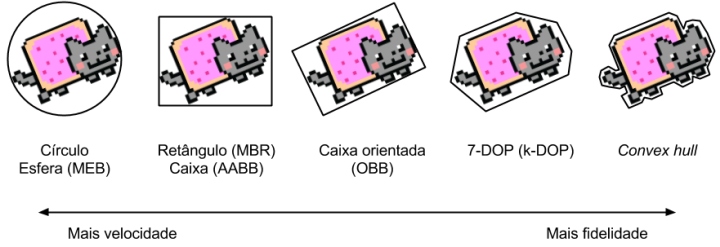
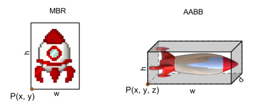
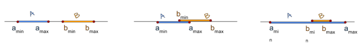
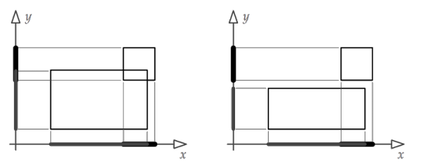
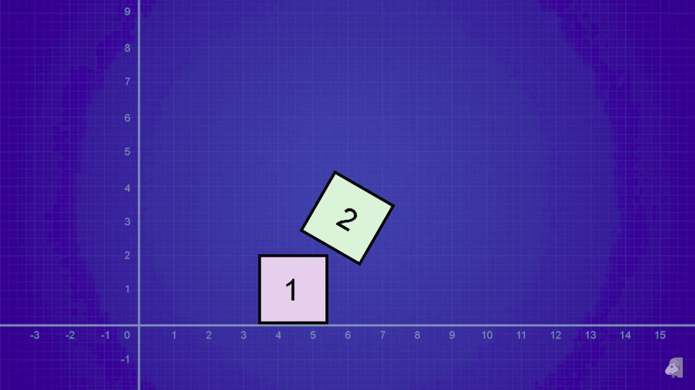
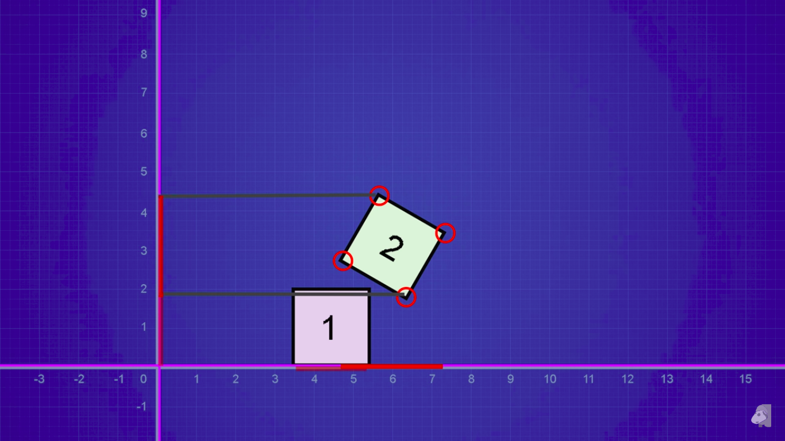
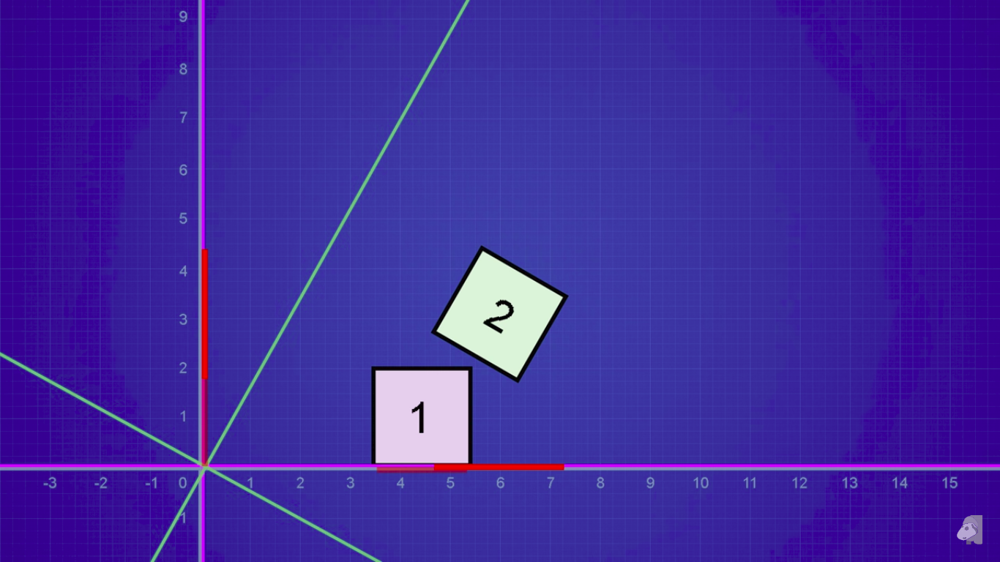
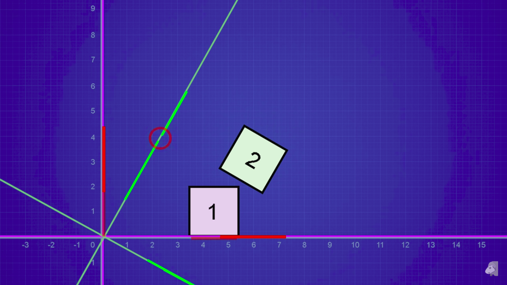

<!--
backdrop: collision
-->

# Colisão

---
# Roteiro

1. Problema da colisão
1. Primitivas de colisão
   1. Círculo e esfera
   1. Retângulo e <abbr title="Axis-aligned bounding box">AABB</abbr>
   1. <abbr title="Oriented bounding box">OBB</abbr>

<!-- 1. Colisão com raios
1. Otimizações
   1. Sweep and prune
   1. Hierarquia de objetos
   1. Divisão do espaço -->

---
# Colisão: Detecção e Resposta

- Queremos saber:
  1. Se objetos entraram em contato
     - Esta é a **detecção de colisão**
  1. O que fazer com eles devido à colisão
     - Determinação da **resposta da colisão**
- Nesta aula, vamos falar sobre detecção da colisão

---
## Entidades colidíveis

- Além da **representação visual** dos objetos, atribuímos a eles uma
  **representação de colisão** - como ele se comporta no mundo físico
- Normalmente, usamos a forma mais simples possível (== barata)

  
- Toda entidade no jogo possui (a) nenhum colisor, (b) 01 colisor ou (c)
  vários colisores, um para cada parte

---
# Primitivas de Colisão

---
## Círculo (2D) e Esfera (3D)

- Podem ser representados por sua posição e raio (3 ou 4 valores)
  - É o colisor mais simples e barato
- Círculo (C, r) _vs_
  ponto P: \lVert\vec{P - C}\rVert \leq r
  - A distância entre o ponto e o círculo deve ser menor que o raio
- Círculo _vs_ círculo:

  <iframe scrolling="no" title="Circle-Circle Intersection" src="https://www.geogebra.org/material/iframe/id/dGfFnRpk/width/1346/height/584/border/888888/smb/false/stb/false/stbh/false/ai/false/asb/false/sri/true/rc/false/ld/false/sdz/true/ctl/false" width="720" height="300" style="border:0px;"> </iframe>

---
## Retângulo <abbr title="Minimum bounding rectangle">MBR</abbr> (2D) e Caixa <abbr title="Axis-aligned bounding box">AABB</abbr> (3D)

- Representamos com uma posição e n escalares (4 ou 6 valores)
  - Ou por 2 ou 3 pontos (equivalente, mas mais caro)
- Segmento A(a\_{min}, a\_{max}) _vs_ segmento B(b\_{min}, b\_{max}):
  
  - Interseção ocorre se: a\_{max} \geq b\_{min} e
    a\_{min} \leq b\_{max}
- Retângulo _vs_ retângulo: _(próximo slide)_

---
## Retângulo <abbr title="Minimal bounding rectangle">MBR</abbr> (2D) e Caixa <abbr title="Axis-aligned bounding box">AABB</abbr> (3D) (cont.)

- Retângulo _vs_ retângulo:
  - A interseção dos segmentos deve acontecer nos dois eixos

    
- AABB _vs_ AABB:
  - A interseção dos segmentos deve acontecer nos três eixos :3

---
## Retângulo _vs_ Círculo

<iframe width="100%" height="300" src="//jsfiddle.net/fegemo/rpd1z4L2/embedded/result/" allowfullscreen="allowfullscreen" frameborder="0"></iframe>

- Passos:
  1. Encontrar o ponto do retângulo mais próximo do círculo (próximo slide)
  1. Encontrar a distância entre o centro do círculo e o ponto
     - Se a distância &leq; raio, colidiu

---
## Ponto mais próximo do círculo ao retângulo

---
<iframe width="560" height="315" src="https://www.youtube.com/embed/WmybRroLLu4?rel=0" frameborder="0" allowfullscreen></iframe>

---
## <abbr title="Oriented bounding box">OBB</abbr>

- Às vezes precisamos de retângulos ou caixas com uma orientação diferente
  daquela do sistema de coordenadas do mundo
  - _Oriented bounding box_
    - Gerado da mesma forma que um AABB
    - Mas rotaciona junto com a entidade
  - Vantagens:
    - Mais "justo" que um AABB
    - Rotacionar tem custo zero
  - Desvantagem:
    - Detecção de colisão é mais cara

---
## [Separating Axis Theorem][sat-video] (SAT)

<figure class="picture-steps" style="max-height: 500px">
  
  
  
  
</figure>

[sat-video]: https://www.youtube.com/watch?v=Ap5eBYKlGDo

---
# Referências

- Livro _Game Engine Architecture, Second Edition_
  - Capítulo 12: _Collision and Rigid Body Dynamics_

  <!-- 1. Game Eng. Arch: 666
  2. Maxim: 07-collisions (slides 41+)
  3. Sushil: Physics.pdf (14-29)
  4. Dave Mount: chapt11-physics.pdf (slides 13,14) -->
