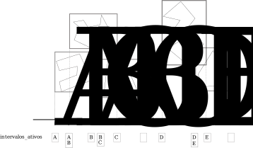

<!-- { "layout": "title" } -->
# Colisão
## Determinando colisões de objetos

---
<!-- { "layout": "centered" } -->
# Roteiro

1. Problema da colisão
1. Primitivas de colisão
   1. Círculo (2D) e esfera (3D)
   1. Retângulo (2D) e AABB (3D)
   1. OBB

*[AABB]: Axis-aligned bounding box*
*[OBB]: Oriented bounding box*

<!--
1. Colisão com raios
1. Otimizações
   1. Sweep and prune
   1. Hierarquia de objetos
   1. Divisão do espaço
-->

---
<!-- { "layout": "regular" } -->
# Colisão: Detecção e Resposta

- Queremos saber:
  1. Se objetos entraram em contato
     - Esta é a **detecção de colisão**
  1. O que fazer com eles devido à colisão
     - Determinação da **resposta da colisão**
- Nesta aula, vamos falar sobre detecção da colisão

---
<!-- { "layout": "regular" } -->
# Para quê determinar colisão?

- Motivos:
  1. Determinar objetos se intersectando
  1. Para lançar eventos (eg, jogador chegou no final da fase)
  1. Determinar todos objetos dentro de um volume
  1. Planejamento de caminhos sem colisão

---
<!-- { "layout": "regular" } -->
# Entidades colidíveis

- Além da **representação visual** dos objetos, atribuímos a eles uma
  **representação de colisão** - como ele se comporta no mundo físico
- Normalmente, usamos a forma mais simples possível (== barata)
   <!-- {.centered style="max-width: 520px;"} -->
- Toda entidade no jogo possui (a) nenhum colisor, (b) 01 colisor ou (c )
  vários colisores, um para cada parte

---
<!-- { "layout": "section-header" } -->
# Primitivas de Colisão

---
<!-- { "layout": "regular" } -->
# Círculo (2D) e Esfera (3D)

- <iframe scrolling="no" title="Circle-Circle Intersection" src="https://www.geogebra.org/material/iframe/id/dGfFnRpk/width/1346/height/584/border/888888/smb/false/stb/false/stbh/false/ai/false/asb/false/sri/true/rc/false/ld/false/sdz/true/ctl/false" width="500" height="250" style="border:0px; margin: 0 auto;" class="push-right"></iframe>
  Podem ser representados por sua posição e raio (3 ou 4 valores)
  - É o colisor mais simples e barato
- Círculo (C, r) _vs_
  ponto P: \lVert\vec{P - C}\rVert \leq r
  - A distância entre o ponto e o círculo deve ser menor que o raio
- Círculo _vs_ círculo: :arrow_right:

---
<!-- { "layout": "regular" } -->
# Retângulo MBR (2D) e Caixa AABB (3D)

 <!-- {p:.centered style="margin-top: 0; margin-bottom: 0;"} --> <!-- {style="height: 140px;"} -->

- Representamos com 1 ponto e n escalares (4 ou 6 valores) <!-- {ul:.full-width} -->
  - Ou por 2 ou 3 pontos (equivalente, mas mais caro) <!-- {li:.bullet} -->
- Segmento A(a\_{min}, a\_{max}) _vs_ segmento B(b\_{min}, b\_{max}): <!-- {li:.bullet} -->
   <!-- {.centered} -->
  - Interseção ocorre se: a\_{max} \geq b\_{min} e
    a\_{min} \leq b\_{max} <!-- {li:.bullet} -->
- Retângulo _vs_ retângulo: _(próximo slide)_ <!-- {li:.bullet} -->

*[MBR]: Minimum bounding rectangle*
*[AABB]: Axis-aligned bounding box*
*[OBB]: Oriented bounding box*

---
<!-- { "layout": "regular" } -->
# Retângulo MBR (2D) e Caixa AABB (3D) (cont.)

 <!-- {p:.centered style="margin-top: 0; margin-bottom: 0;"} -->

- Retângulo _vs_ retângulo: <!-- {ul:.full-width} -->
  - A interseção dos segmentos deve acontecer nos dois eixos <!-- {li:.bullet} -->
     <!-- {.centered style="height: 220px;"} -->
- AABB _vs_ AABB: <!-- {li:.bullet} -->
  - A interseção dos segmentos deve acontecer nos três eixos :3 <!-- {li:.bullet} -->

*[MBR]: Minimum bounding rectangle*
*[AABB]: Axis-aligned bounding box*
*[OBB]: Oriented bounding box*

---
<!-- { "layout": "regular" } -->
## Retângulo _vs_ Círculo

- <iframe width="570" height="300" src="//jsfiddle.net/fegemo/rpd1z4L2/embedded/result/" allowfullscreen="allowfullscreen" frameborder="0" style="float: right;"></iframe>

  Passos: <!-- {ul:.full-width.bullet} -->
  1. Encontrar o ponto do retângulo mais próximo do círculo
  1. Encontrar a distância entre o centro do círculo e o ponto
     - Se a distância &leq; raio, colidiu

Mas como achar o ponto do retângulo mais próximo do círculo?? <!-- {.bullet.centered} -->

---
<!-- { "layout": "regular" } -->
# Ponto mais próximo do círculo ao retângulo

 <!-- {p:.centered} -->

---
<!-- { "layout": "regular" } -->
# OBB

- <iframe width="230" height="230" src="../../attachments/aabb-obb/index.html" frameborder="0" class="push-right"></iframe>

  Às vezes precisamos de retângulos ou caixas com uma orientação diferente
  daquela do sistema de coordenadas do mundo
  - Usamos **_Oriented bounding box_**
    - Gerado da mesma forma que um AABB
    - Mas rotaciona junto com a entidade
  - Vantagens:
    - Mais "justo" que um AABB
    - Rotacionar tem custo zero
  - Desvantagem:
    - Detecção de colisão é mais cara

*[OBB]: Oriented bounding box*
*[AABB]: Axis-aligned bounding box*

---
<!-- { "layout": "centered-horizontal" } -->
# OBB em 3D

<iframe width="560" height="315" src="https://www.youtube.com/embed/WmybRroLLu4?rel=0" frameborder="0" allowfullscreen class="bullet"></iframe>

...Mas como verificar se houve colisão? <!-- {.bullet} --> **Com o SAT** <!-- {.bullet} -->

---
<!-- { "layout": "regular" } -->
# [Separating Axis Theorem][sat-video] (SAT)

::: figure .picture-steps max-height: 440px;
 <!-- {.bullet.bespoke-bullet-active style="max-height: 440px"} -->
 <!-- {.bullet style="max-height: 440px"} -->
 <!-- {.bullet style="max-height: 440px"} -->
 <!-- {.bullet style="max-height: 440px"} -->
:::

[sat-video]: https://www.youtube.com/watch?v=Ap5eBYKlGDo

---
<!-- { "layout": "section-header" } -->
# _Broad vs Narrow Phase_
## Dividindo o esforço em fases

---
# _Broad vs Narrow Phase_

- Suponha uma cena de jogo com o jogador, 19 inimigos e 10 tiros pra cada
  Total de entidades
    ~ 200

  Testes de colisão:
    ~ 199 + 198 + 197 ... + 1 = 20.100

  Complexidade
    ~ O(n^2)

- Para reduzir o número de operações, dividimos o problema nas fases:
  1. **_Broad phase_**: determina pares de entidades potencialmente colidindo
  1. **_Narrow phase_**: confirma apenas os pares indicados na _broad phase_
     - É o que já vimos como fazer

---
# _Broad Phase_

- Baseado nos 4 princípios:

  Aproximação
    ~ Usar geometria mais simples

  Localidade
    ~ Verificar apenas objetos próximos

  Coerência
    ~ Objetos tendem a se manter ou mover pouco

  Cinemática
    ~ Usar informação da trajetória dos objetos

- Algoritmos:
  - Busca exaustiva usando AABB (O(n^2))
  - _Sweep and prune_
  - Particionamento do espaço 

---
<!-- { "layout": "regular" } -->
# _Broad_: **_Sweep and Prune_**
 <!-- {.centered style="height: 460px;" } -->

---
<!-- { "layout": "centered", "state": "show-active-slide-and-previous" } -->
# _Broad_: **_Sweep and Prune_**

1. Determina AABB/Esfera que caiba cada objeto independente de rotação **« Prin. aproximação »** <!-- {.alternate-color} -->
1. Verifica a interseção nos 2/3 eixos. Para cada um:
   1. Ordena todos i_i e f_i em uma lista
   1. Percorre lista do início ao fim
   1. Quando um i é encontrado, marca o intervalo como ativo na lista intervalosAtivos
   1. Quando um f é encontrado, exclui o intervalo da lista intervalosAtivos
   1. Todas duplas de intervalosAtivos se intersectam

---
<!-- { "layout": "regular" } -->
# _Broad_: **_Sweep and Prune_**

- Um par de objetos vai para a _narrow phase_ apenas se aparecem na intervalosAtivos em todos os 2/3 eixos
- Para atualizar a lista no próximo quadro, verifica-se apenas os objetos com velocidade
- Ordenação pode ser feita com Bolha ou Inserção: O(n)
  - O vetor já vai estar praticamente ordenado **« Prin. coerência »** <!-- {.alternate-color} -->

---
<!-- { "layout": "centered" } -->
# Referências

- Livro _Game Engine Architecture, Second Edition_
  - Capítulo 12: _Collision and Rigid Body Dynamics_

  <!-- 1. Game Eng. Arch: 666
  2. Maxim: 07-collisions (slides 41+)
  3. Sushil: Physics.pdf (14-29)
  4. Dave Mount: chapt11-physics.pdf (slides 13,14) -->
