<!--
  backdrop: mgs-quiet
-->

# Tomada de Decisão
---
<!--
bespokeState: checkpoint
-->

# _Tomada de Decisão_

## O que precisamos saber?

- Quando pensamos em IA em jogos, pensamos em tomada de decisão
- Perguntas
  - Quais são as **ferramentas** que podem ser usadas para um agente
    **tomar decisões**?
  - Como a **informação** que alimenta a tomada de decisão **pode/deve ser
    passada ao agente**?

---
# Roteiro

- Ferramentas para tomada de decisão
  1. Árvores de Decisão (_decision tree_)
  1. Máquinas de Estado (<abbr title="Finite State Machine">FSM</abbr>)
  1. Árvore de Comportamento (_behavior trees_)
  1. Comportamento Baseado em Objetivos (<abbr title="Goal-Oriented Behavior">GOB</abbr>)

---
## Visão geral

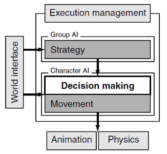

- Basicamente, o **"comportamento"** define quais ações um agente deve tomar
  em um determinado momento do jogo
- O problema: _"dado um conhecimento, uma ação deve ser tomada a partir de um
  conjunto de possibilidades"_

---
## Arquitetura

- 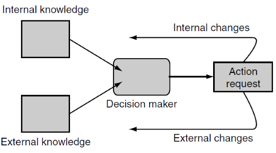
  **Conhecimento interno**: vida, munição etc.
- **Conhecimento externo**: mapa, vista do inimigo, escuta de passos etc.
- **Ação**: atacar, fugir, proteger-se etc.

---
<!--
  backdrop: decision-tree-sample
-->

# Ferramenta: **Árvores de Decisão**
---
## Ferramenta: **Árvores de Decisão**

- Formalização de um conjuntão de regras `if-then`
- Muito popular - fácil de implementar, intuitivo e rápido

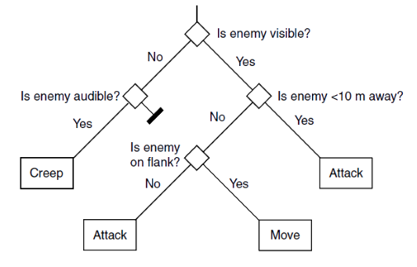

---
## Pseudo-código: estruturas de dados

```ruby
class NoDaArvoreDecisao
  def tomarDecisao() # método abstrato

class Acao (NoDaArvoreDecisao):
  def tomarDecisao():
    return this

class Decisao (NoDaArvoreDecisao):
  noVerdadeiro
  noFalso
  valorSendoTestado
  def getRamo() # abstrato. Executa o teste
  def tomarDecisao() # recursivamente navega na arvore
```

---
## Pseudo-código: algoritmos

```ruby
class DecisaoFloatEmIntervalo (Decisao)
  valorMin
  valorMax

  def getRamo():
    if valorMin < valorSendoTestado < valorMax
      return noVerdadeiro
    else
      return noFalso
```

---
## Pseudo-código: algoritmos (2)

```ruby
class Decisao
  #...
  #...
  def tomarDecisao():
    # tomar minha decisao e continuar no ramo escolhido
    ramo = getRamo()
    return ramo.tomarDecisao()
```

---
## Desempenho

- A árvore de decisão tem custo <span class="math">O(\log _2 \left( n \right))</span>,
  sendo <span class="math">n</span> o número de nós se:
  1. O custo de tomar cada decisão é unitário/constante
  2. A árvore está balanceada... mas pode ser que não esteja!
    - Uma árvore balanceada **tem o mesmo número de folhas em cada ramo**
- Dicas:
  1. Deixe as árvores o mais balanceadas possível
  2. Faça ramos frequentes menores
  3. Coloque decisões custosas perto das folhas

---
## Árvore balanceada _vs_ não balanceada

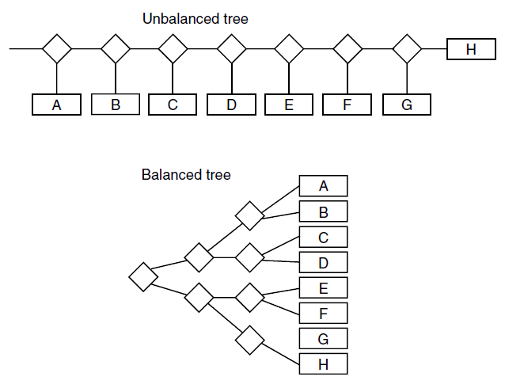

---
## Além das árvores... temos ~~nozes~~ grafos!

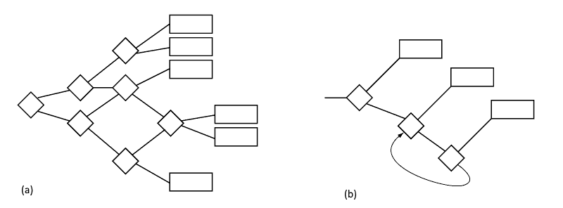

- É possível usar um grafo em vez de árvore, i.e., duas decisões apontando para
  o mesmo nó
  - Contudo, o grafo deve ser acíclico (<abbr title="Directed Acyclic Graph">DAG</abbr>)
  - Com isso, podemos evitar repetir nós

---
## Decisões **Aleatórias**

- Há situações em que não queremos que o agente seja super previsível
  - Nesse caso, podemos usar um pouco de _"random power"_
  
- Como a árvore é executada a todo momento, para não ter decisão/"desdecisão",
  devemos guardar a decisão tomada na memória

---
<!--
  backdrop: fsm-sample
-->

# Ferramenta: **Máquina de Estados**
---
## Ferramenta: **Máquina de Estados**

- Muitas vezes um agente fica executando uma mesma ação por um bom tempo,
  até que algo no mundo aconteça
  - Podemos usar uma **árvore de decisão adaptada**, mas o melhor é usar uma
    **máquina de estados**
- É a **técnica usada na grande maioria dos jogos**

---
## Máquina de Estados


- **Estados** são conectados por **transições**, que acontecem
  quando suas **condições são satisfeitas**
  - **Ações** podem ser executadas dentro dos estados, mas também nas
    transições

---
## Pseudo-código: estruturas de dados

```ruby
class Estado:
  def getAcao() # acao executada sempre que neste estado
  def getAcaoDeEntrada() # acao: quando chega neste estado
  def getAcaoDeSaida()
  def getTransicoes() # transicoes que saem deste estado

class Transicao:
  def foiDisparada() # verif. se a condição foi satisfeita
  def getEstadoAlvo()
  def getAcao() # acao executada quando for disparada
```

---
## Pseudo-código: algoritmo

```ruby
class MaquinaEstados:
  estados # lista de estados
  estadoInicial
  estadoCorrente = estadoInicial

  # método chamado a cada quadro de atualização
  def atualiza():
    transicaoDisparada = nil
    # vê se alguma transição do estado atual foi disparada
    for transicao in estadoCorrente.getTransitions():
      if transicao.foiDisparada():
        transicaoDisparada = transicao
        break

    # se alguma foi disparada, ret. a lista de ações e muda est.
    if transicaoDisparada:
      estadoAlvo = transicaoDisparada.getEstadoAlvo()

      acoes = estadoCorrente.getAcaoDeSaida()
      acoes += transicaoDisparada.getAcao()
      acoes += estadoAlvo.getAcaoDeEntrada()

      estadoCorrente = estadoAlvo
      return acoes

    # se continua no mesmo estado, executa a ação dele
    else
      return estadoCorrente.getAcao()    
```

---
## Análise

- Esta máquina de estados é bastante flexível
- Há muitas formas de implementar!
- O algoritmo tem ordem de complexidade <span class="math">O(m)</span>, em que
  <span class="math">m</span> é o número máximo de transições em um estado
- Uma forma mais simples (e antiga) é de ter todos os estados e transições
  _hard-coded_

---
## Outra implementação: _hard-coded_

```ruby
class GuardinhaFSM:

  # estados via enum
  enum Estado:
    PATRULHA
    DEFESA
    BODADINHA

  estadoCorrente = BODADINHA

  def atualiza():
    switch estadoCorrente:
      case PATRULHAR:
        # transições
        if possoVerJogador(): estadoCorrente = DEFESA
        elif estouCansado(): estadoCorrente = BODADINHA
        break;

      case DEFENDER:
        if not possoVerJogador(): estadoCorrente = PATRULHA

      case BODADINHA:
        if not estouCansado(): estadoCorrente = PATRULHA
```

---
## Análise

- A versão _hard-coded_ é ok para programadores hobbystas e fazedores de TP
- Mas para empresas:
  - Só programadores poderiam alterar o comportamento dos NPCs
    - Mas _game/level designers_ são quem tornam o jogo balanceado
  - Alterar algo requer novo _build_ - pode levar minutos ou horas
  - Estruturas mais complexas (veremos adiante) ficam complicadas usando
    a versão _hard-coded_

---
## Possíveis extensões

1. Máquina de Estado Não-Determinística
  - Introduz **imprevisibilidade** (e _believability_)
  - Um mesmo evento pode levar a diferentes estados
1. Máquina de Estados Hierárquica
  - Estados podem ser **decompostos** em um conjunto de estados
1. Máquina de Estados Compartilhada
  - **Mais de um NPC** executando uma máquina de estados
  - Útil para NPCs com ações coordenadas
    - _e.g._, várias formigas se juntando para carregar uma aranha e
      fazer um churrasco

---
## Exemplo: FSM **Não-Determinística**

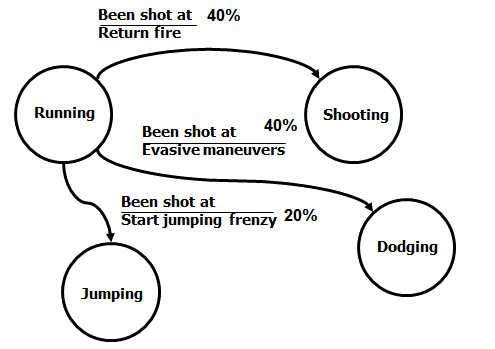

---
## Exemplo: FSM **Hierárquica**

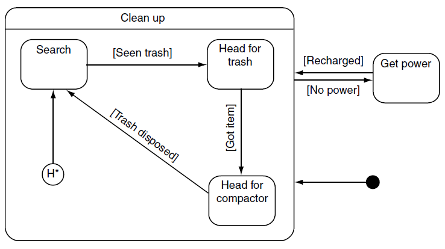

---
<!--
  backdrop: halo2
-->

# Ferramenta: **Árvores de Comportamento**
---
## Ferramenta: **Árvores de Comportamento**

- Tornou-se popular com o jogo Halo 2 (2004)
- Popularizou com o uso de interfaces gráficas para sua criação:

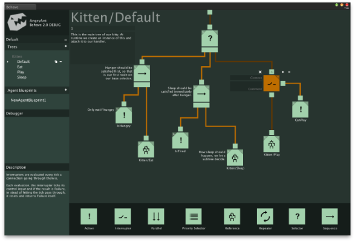

---
## Árvores de Comportamento

- Mescla de várias técnicas: FSM Hierárquica, _Scheduling_, Planejamento e
  Execução de Ações
- Sucesso: fácil para organizar comportamentos a partir de partes (tarefas)
  simples, mesmo para "não-programadores"
- É uma árvore cujo nó é uma **tarefa**, que pode ser:
  1. Uma **condição**
  2. Uma **ação**
  3. Uma **composição**
- Independente do tipo, cada tarefa tem a mesma interface
  - Sempre retorna **sucesso ou falha**

---
## Tarefa: **Condição**

- Uma tarefa de condição **testa se um condição é satisfeita**
- Exemplos:
  <ul class="bt-tasks horizontal">
    <li>Porta Aberta?</li>
    <li>Nível HP Ok?</li>
    <li>Inimigo está próximo?</li>
  </ul>
- Sempre aparece como **folha da árvore**

---
## Tarefa: **Ação**

- Uma tarefa de ação **altera o estado do jogo**
- Exemplos:
  <ul class="bt-tasks horizontal">
    <li>Ir até uma sala</li>
    <li>Encontrar um caminho</li>
    <li>Tocar som</li>
    <li>Conversar com o jogador</li>
  </ul>
- Sempre aparece como **folha da árvore**

---
## Tarefa: **Composição**

- Uma tarefa de composição sequencia/coordena as condições e ações
- Pode ser de 2 tipos:
  1. **Seletora (?)**: retorna assim que a primeira tarefa obtém sucesso
  2. **Sequenciadora (&rarr;)**: retorna assim que a primeira tarefa falha

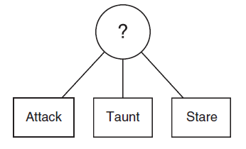
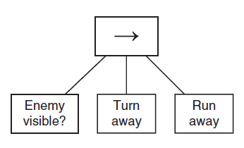

---
## Exemplo maior

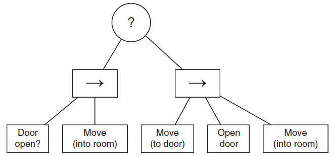

- Indo de uma sala até a outra passando por uma porta
  - E se a porta estiver trancada? (próximo slide)

---
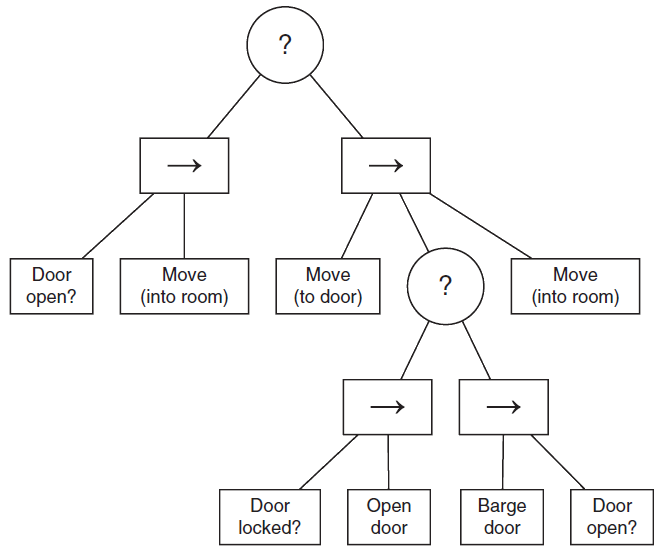

<!--
## Composições não-determinísticas

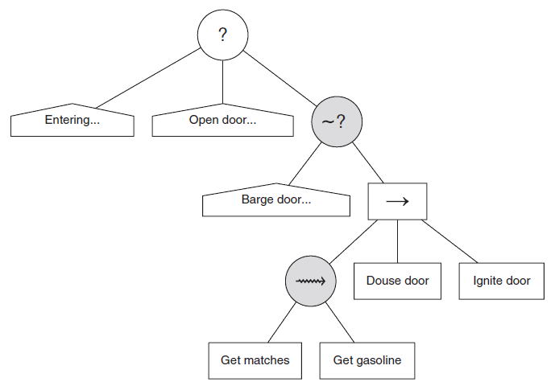
-->
---
## Árvore de Comportamento na <abbr title="Unreal Engine">UE4</abbr>

<iframe width="640" height="360" src="https://www.youtube.com/embed/EotkBaTPLXE?rel=0" frameborder="0" allowfullscreen></iframe>

---
## Mais sobre

- Extensões
  - Outras tarefas:
    - **_decorator_**: apenas 1 filho, executa sob certa condição
    - **composição paralela**: executa todos os filhos em paralelo até
      todos completarem ou algum falhar
- Problema:
  - Difícil modelar "alarmes"
  - Não há como o mundo interferir na execução de forma ativa

---
<!--
  backdrop: the-sims4
-->

# Comportamento Baseado em Objetivo

---
## Comportamento Baseado em Objetivo

- A ferramentas de decisão vistas até agora são todas **reativas**
- Mas podemos precisar que o agente planeje para atingir seu objetivo
- O agente pode ter objetivos internos que ele quer/precisa satisfazer. _E.g._:
  - fome, ameaça, ouro, item
- O sistema possui 3 componentes:
  1. Objetivos
  1. Prioridade dos Objetivos
  1. Ações com Impacto Esperado na Prioridade dos Objetivos

---
## Exemplo em um jogo FPS

- Objetivos e prioridades:
  <ul class="gob-goals horizontal">
    <li class="yellow"><span>Comer</span> <span>9</span></li>
    <li class="blue"><span>Matar inimigo</span> <span>8</span></li>
    <li class="pink"><span>Recuperar vida</span> <span>4</span></li>
  </ul>
- Ações com Impacto nas prioridades:
  - Pegar comida: (<span class="gob-goal yellow"><span>Comer</span> <span>-5</span></span>)
  - Matar inimigo: (<span class="gob-goal blue"><span>Matar inimigo</span> <span>-8</span></span> <span class="gob-goal pink"><span>Recuperar vida</span> <span>+4</span></span>)
  - Pegar kit HP: (<span class="gob-goal pink"><span>Recuperar vida</span> <span>-2</span></span>)

---
## Exemplo 2

- Suponha que o NPC está sob ataque, mas pode pegar arma mais eficiente. Ele
  morre quando `vida` &gt; `10`
- Objetivos
  <ul class="gob-goals horizontal">
    <li class="yellow"><span>Comer</span> <span>7</span></li>
    <li class="blue"><span>Matar inimigo</span> <span>8</span></li>
    <li class="pink"><span>Recuperar vida</span> <span>4</span></li>
    <li class="green"><span>Novas armas</span> <span>1</span></li>
  </ul>
- Ações:
  - Pegar comida (<span class="gob-goal yellow"><span>Comer</span> <span>-5</span></span> <span class="gob-goal pink"><span>Recuperar vida</span> <span>+2</span></span>)
  - Matar inimigo: (<span class="gob-goal blue"><span>Matar inimigo</span> <span>-8</span></span>  <span class="gob-goal pink"><span>Recuperar vida</span> <span>+9</span></span>)
  - Pegar kit HP: (<span class="gob-goal pink"><span>Recuperar vida</span> <span>-2</span></span> <span class="gob-goal yellow"><span>Comer</span> <span>+2</span></span>)
  - Pegar arma (<span class="gob-goal green"><span>Novas armas</span> <span>-1</span></span> + matar inimigo não perde HP)

---
## Como resolver o Exemplo 2

- A melhor ordem é: (1) Pegar kit HP, (2) Pegar arma e (3) Matar inimigo
- 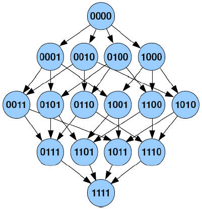
  O espaço de busca é um grafo para tomar todas as ações satisfazendo
  as restrições
- Estado inicial: 0000 e final: 1111  
  - bit 0: comida pegada
  - bit 1: kit HP pegado
  - bit 2: arma pegada
  - bit 3: inimigo morto
- Podemos usar busca em grafo (Dijkstra)
---
# Referências

- Livro _Artificial Intelligence for Games, Second Edition_
  - Capítulo 5: _Decision Making_ (5.1-5.4, 5.7)
