<!--
  backdrop: the-incredible-machine
-->

# Dinâmica de Corpos Rígidos
---
# Roteiro

- Definição de Física
- O básico sobre Dinâmica de Corpos Rígidos
- Dinâmica Linear
- Dinâmica Angular
- Outras Características

---
## Física em Jogos

- O que é física em jogos?
  - Basicamente: mecânica (em particular, dinâmica)
  - Tipicamente: **dinâmica de corpos rígidos** + **colisão de objetos**
  - Alguns jogos incluem dinâmica de fluidos et al., mas vamos começar
    pelo mais comum
- Dinâmica de corpos rígidos:
  - **Física Clássica de Newton**: objetos na simulação obedecem as **3 leis
    do movimento**
  - **Corpos rígidos**: objetos na simulação **não podem ser deformados**
    (forma constante)

---
## Módulo de Física

- O módulo de física de um jogo mantém uma **lista interna dos objetos que
  estão sujeitos à física**:
  - Mantém informação relevante como **forma, massa, velocidade, aceleração
    etc.**
- A lista pode (deve) ser separada da lista mantida pelo restante do jogo
  - _E.g._, nem tudo que é desenhado está sujeito à física
- Pode ser compartilhada com o sistema de detecção de colisão, ou pode ser
  outra ainda

---
## O Básico sobre Dinâmica de Corpos Rígidos

- Unidades de medida:
  - O módulo de física precisa medir as coisas (massa, distância,
  velocidade, etc.)
  - Precisamos definir um sistema de unidades:
    - Métrico: metros, gramas, segundos (padrão na física)
    - **MKS**: metros, kilogramas, segundos (padrão em física de jogos)
    - Imperial: ~~nem os _stormtroopers_ usam mais~~
- Graus de liberdade:
  - O corpo rígido possui:
    - 3 graus de liberdade em 2D (2 lineares e 1 angular)
    - 6 graus de liberdade em 3D (3 lineares e 3 angulares)
  - É possível <u>separar a computação</u> para movimentos lineares e angulares

---
## **Propriedades** de um corpo rígido

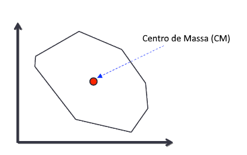

- Para **dinâmica linear**, consideramos que qualquer corpo rígido é **um ponto com uma massa**
  - **Centro de massa é o centróide**
- Outras propriedades: forma, velocidade linear, aceleração linear, velocidade angular, aceleração angular

---
## Objetos compostos

<figure style="position: relative; height: 331px; width: 531px; margin: 0 auto; border-radius: .25em;">
  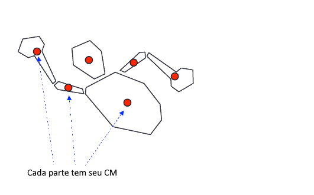
  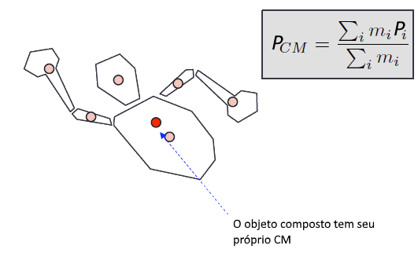
</figure>

---
# Dinâmica Linear

- Movimentação de objetos sem considerar sua rotação
- Estado de um objeto completamente **determinado pela posição de seu
  centro de massa** (para objetos compostos, é necessário o CM de todos)
- O que importa é:
  - Posição do centro de massa (<span class="math">P</span>)
  - Velocidade do centro de massa (<span class="math">\vec{v}</span>)
  - Aceleração do centro de massa (<span class="math">\vec{a}</span>)

---
## Dinâmica Linear (2)

- Equações de movimentação básica:
  - Posição: <span class="math">P=P_0+\vec{v}t</span>
  - Velocidade: <span class="math">\vec{v}=\vec{v}_0+\vec{a}t</span>
  - Aceleração:
    <span class="math">\vec{a}=\frac{\vec{F}}{m}</span>
- Juntando essas equações, obtemos:
  <div class="math">P=P_0+\vec{v}_0t+\frac{1}{2}\vec{a}t^2</div>
- Contudo, pelos **jogos serem interativos**, as forças
  (<span class="math">\vec{F}</span>) podem (e vão) mudar ao longo do
  tempo, fazendo com que **não seja possível resolver o problema de
  forma analítica**

---
## Integração Numérica

- Devemos resolver as equações para pequenos passos de tempo
  - Definimos um passo de tempo <span class="math">\Delta t</span>
  - **Dados**, no tempo <span class="math">t_1</span>:
    - posição (<span class="math">P</span>)
    - velocidade (<span class="math">\vec{v}</span>)
    - força (<span class="math">\vec{F}</span>)
  - **Encontrar**: posição, velocidade no tempo <span class="math">t_2=t_1+\Delta t</span>

---
## Método 1: Integração de Euler Explícita

- Recapitulando que:
  <span class="math">\vec{v}(t)=\dot{\vec{r}}(t)</span>
- Então, podemos aproximar:
  <div class="math">P(t_2)=P(t_1)+\vec{v}(t_1)\Delta t</div>
- E então, podemos atualizar a velocidade com a aceleração:
  <div class="math">\vec{v}(t_2)=\vec{v}(t_1)+\frac{\vec{F}(t_1)}{m}\Delta t</div>

---
## Método 2: Integração de Verlet

- Integração de Euler explícita tende a acumular erros e não é estável
- Podemos usar, então, a Integração de Verlet:
  - Posição:
    <div class="math">P(t_2)=2P(t_1)-P(t_1-\Delta t)+\frac{\vec{F}(t_1)}{m}\Delta t^2</div>
  - Velocidade:
    <div class="math">\vec{v}(t_2)=\frac{P(t_2)-P(t_1)}{\Delta t}</div>

---
## Escrevendo código

- Exemplo de **integração de Euler explítica** em Java:
  ```java
  public void atualiza(ObjetoFisico obj, double delta) {
    Vetor posicao = obj.posicao;
    Vetor velocidade = obj.velocidadeLinear;
    // atualizando posição:
    posicao.add(new Vetor(obj.velocidadeLinear).scale(delta));
    // atualizando velocidade:
    Vetor forca = new Vetor(obj.forca);
    forca.scale(delta);
    forca.scale(1/obj.massa);
    velocidade.add(forca);
  }
  ```

---
# Dinâmica Angular

- Simulação de rotação (orientação) de objetos
- Quando um objeto não está sob efeito de uma força, sólidos rígidos
  giram em torno de seu centro de massa
  - Isso significa que podemos simular a rotação separada da posição
- **2D: fácil** (quase o mesmo que dinâmica linear)
- **3D: complexo** (3 graus de liberdade diferentes)

---
## Dinâmica Angular **2D**

- Único grau de liberdade: <span class="math">\theta(t)</span>
- Velocidade angular:
  <div class="math">\theta(t)=\theta(t_0)+\omega(t)</div>
- Aceleração angular:
  <div class="math">\omega(t)=\omega(t_0)+\alpha(t)</div>

---
## Dinâmica Angular 2D

- **Aplicando forças** em corpos rígidos:

<figure style="position: relative; height: 334px; width: 508px; margin: 0 auto; border-radius: .25em;">
  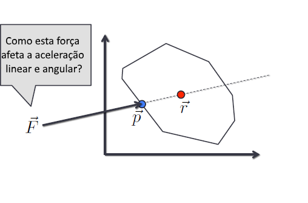
  
  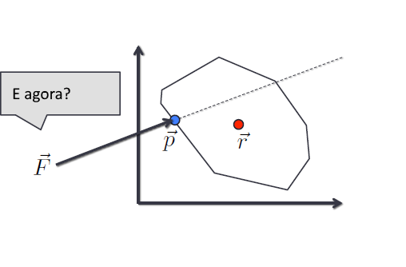
  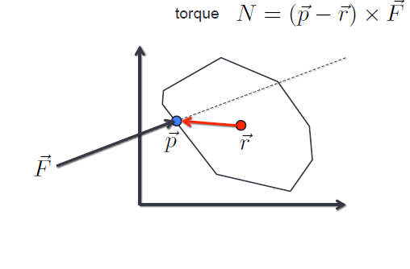
  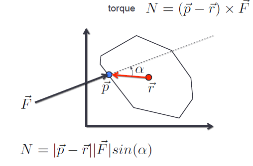
</figure>

---
## Dinâmica Angular 2D

- Em dinâmica linear, uma vez que sabemos a força, basta
  dividi-la pela massa e temos a aceleração
- O **equivalente de massa** para dinâmica angular é o
  **momento de inércia**
  - Que é a resistência de um objeto a mudar sua velocidade angular em torno de um eixo
- Fórmula geral:
  <div class="math">I=\int_Q r^2dm</div>


---
## Dinâmica Angular 2D

- Momento de inércia para **formas comuns**:
  - **Círculo**: <span class="math">I=m\frac{r^2}{2}</span>, onde <span class="math">r=</span> raio
  - **Retângulo**: <span class="math">I=m\frac{h^2+w^2}{12}</span>, onde <span class="math">w=</span> largura e <span class="math">h</span> altura
  - **Objeto composto**:
    <div class="math">\sum_{i=1}^{N} m_ir_i^2</div>, onde <span class="math">m_i</span> é a massa, <span class="math">r_i</span> distância do centro de massa da parte para o todo
- [Outras formas na Wikipedia](http://en.wikipedia.org/wiki/List_of_moments_of_inertia)

---
## Euler Explícito para Dinâmica Angular 2D

- Posição angular:
  <div class="math">\theta(t_2)=\theta(t_1)+\omega(t_1)\Delta t</div>
- Velocidade angular:
  <div class="math">\omega(t_2)=\omega(t_1)+\frac{N(t_1)}{I}(t_1)\Delta t</div>

---
## **Sumarizando** Dinâmica Angular 2D

- 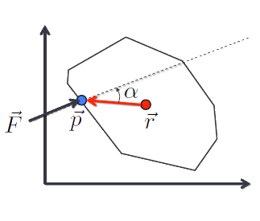
  O algoritmo do módulo de física executa os passos:
  <div class="math">\vec{r}(t_2)=\vec{r}(t_1)+\vec{v}(t_1)\Delta t</div>
  <div class="math">\vec{v}(t_2)=\vec{v}(t_1)+\frac{\vec{F}(t_1)}{m}\Delta t</div>
  <div class="math">\theta(t_2)=\theta(t_1)+\omega(t_1)\Delta t</div>
  <div class="math">N=\left| \vec{p}-\vec{r} \right| \left| \vec{F} \right| \sin{\alpha}</div>
  <div class="math">\omega(t_2)=\omega(t_1)+\frac{N(t_1)}{I}\Delta t</div>

<!--
## Dinâmica Angular **3D**

- Mais complexo porque:
  - Momento de inércia é diferente para cada eixo de rotação
  - Não pode ser computado como um único número - difícil de interpolar
  - Momento de inércia em 3D é uma matrix 3x3 chamada tensor de inércia

<div class="math">I= \begin{bmatrix} I_{xx} & I_{xy} & I_{xz} \\\\ I_{yx} & I_{yy} & I_{yz} \\\\ I_{zx} & I_{zy} & I_{zz}   \end{bmatrix}</div>


## Dinâmica Angular 3D

- Rotação em 3 dimensões:
  - Pode ser representada como uma matriz 4x4 (como fizemos em CG)
  - Ou como vetor + rotação
    - 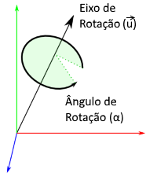
      Em vez de matriz, podemos usar um **_quaternion_**
- _Quaternion_: vetor 4D representando uma **rotação de <span class="math">\alpha</span> graus ao redor de um vetor <span class="math">\vec{u}</span>**:
  <div class="math">q= \begin{bmatrix} u_x\sin{\frac{\alpha}{2}} & u_y\sin{\frac{\alpha}{2}} & u_z\sin{\frac{\alpha}{2}} & \cos{\frac{\alpha}{2}} \end{bmatrix}</div>


## Qua...Quê?

<iframe width="640" height="480" src="https://www.youtube.com/embed/zc8b2Jo7mno?rel=0" frameborder="0" allowfullscreen></iframe>


## Dinâmica Angular 3D

- Velocidade angular representada como um vetor 3D:
  <div class="math">\omega(t)= \begin{bmatrix} u_x\theta(t) & u_y\theta(t) & u_z\theta(t) \end{bmatrix}</div>
- Momento angular:
  <div class="math">L(t)=I\omega(t)</div>


# Outras Características
-->
---
## Colisões 1-1

- 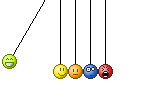
  Colisões entre 2 objetos podem ser calculadas usando a lei de conservação de energia:
  - A energia cinética dos objetos antes e depois da colisão deve ser preservada
  - Alguma energia é dispersada com som e calor, então devemos usar uma constante de preservação <span class="math">0 \leq \varepsilon \leq 1</span>
- Podemos usar um modelo simples de colisão:
  - Impulso instantâneo

---
## Impulso

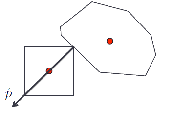

- Impulso: resulta em uma mudança imediata na velocidade
- Representa a mudança no momento de um objeto
- Ambos objetos sofrem impulso idêntico, porém em sentidos opostos

---
## Otimizações

- Ilhas de objetos:
  - É bem improvável que objetos muito distantes um do outro precisem interagir entre si
  - Eles podem ser calculados em simulações separadas
    - Podemos dividir o espaço (e.g., _octrees_ ou a cena)
- ~~Bodadinha~~ Sono:
  - Quando objetos "descansam", podemos parar de atualizá-los
  - Contudo, é difícil detectar quando um objeto foi para o estágio "descansar"

---
## Restrições (_Constraints_)

- Para construir objetos mais complexos (e compostos), também precisamos de:
  - Juntas (_hinges_)
  - Molas (_springs_)
  - Rodas etc.
- Eles restringem o movimento dos objetos:
  - Depois do estágio de simulação física, todos os objetos são devolvidos
    para uma posição onde eles satisfazem sua(s) restrições


---
<div class="item-grid">
  <div class="item-grid-col">
    <figure class="polaroid item-180w">
      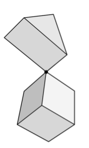
      <figcaption>Point to point</figcaption>
    </figure>
    <figure class="polaroid item-180w">
      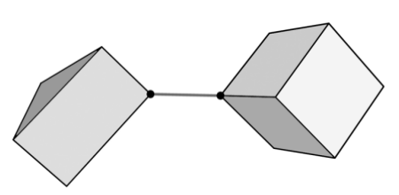
      <figcaption>Mola dura</figcaption>
    </figure>
    <figure class="polaroid item-180w">
      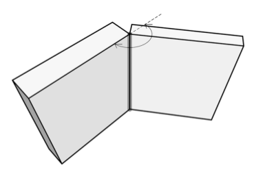
      <figcaption>Dobradiça</figcaption>
    </figure>
    <figure class="polaroid item-180w">
      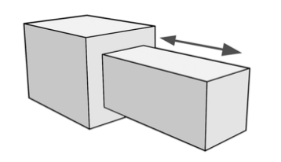
      <figcaption>Prismática (piston)</figcaption>
    </figure>
  </div>
</div>


---
## O _Game Loop_ da Física

- Basicamente:
  - Inicia um "ambiente físico" vazio
  - Define forças naturais (_e.g._, gravidade)
  - Adiciona objetos ao "mundo físico"
- A cada iteração:
  1. Soma todas as forças agindo em cada corpo rígido
  2. Executa a integração numérica
  3. Lida com as colisões
  4. Resolve as restrições

---
# Referências

- Livro _Game Engine Architecture, Second Edition_
  - Capítulo 12: _Collision and Rigid Body Dynamics_
