<!-- {"layout": "title"} -->
# Introdução: História, Plataformas e Gêneros
## Baseadão nos slides do Prof. (Luiz) Chaimo(wicz) da UFMG

---
<!-- {"layout": "centered"} -->
# Roteiro

1. [História](#historia)
1. 
1. 

---
<!-- {"layout": "section-header", "slideHash": "historia", "slideClass": "historia"} -->
# História

## O que precisamos saber?

1. **Como chegamos** até aqui?
1. Quem foram o **pioneiros do desenvolvimento** de jogos?
1. Por que algumas **empresas** tiveram **muito sucesso** e outras **fracassaram**?

---
<!-- {"layout": "regular"} -->
# Ancestrais dos jogos digitais (1/2)

- 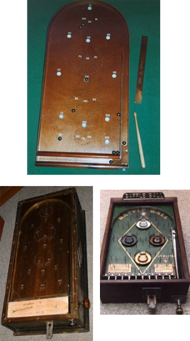 <!-- {.push-right} --> <!-- {ul:.full-width} -->
  Versões primitivas do **Pinball**
  - _Bagattelle_ (1800s)
  - _Whiffle_ (1931)
    - Operada com moedas
    - _Plunger_ em vez de taco
  - _Baffle Ball_ (1931)
- Nessa época ainda não havia _flippers_, contagem de pontos etc.
- Eram jogos de azar: chegaram a ser proibido nos EUA

---
<!-- {"layout": "regular"} -->
# Ancestrais dos jogos digitais (2/2)

- 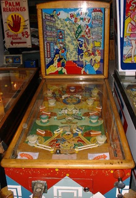
  _Humpty Dumpty_ (1947)
  - Uso de _flippers_, contagem de pontos
- Jogos passam a exigir habilidade ao invés de simplesmente sorte
- Apesar de ainda vista com maus olhos a indústria cresceu, com o aparecimento
  de vários pioneiros
  - _Gottleib, Williams, Bally, Midway_...

---
<!-- {"layout": "regular"} -->
# Os primeiros computadores (1/2)

- Nas décadas 50 e 60, surgiram os primeiros computadores e
  eles estavam concentrados em **universidades** e **instalações militares**
- Alguns estudantes, programadores, professores e pesquisadores "sangue-nos-olhos"
  tornavam seus **_mainframes_ em _video games_** nas horas vagas
  - Tic Tac Toe (1952) <!-- {ul^0:.multi-column-inline-list-2.no-bullet.center-aligned} -->
    ::: figure .polaroid.light.item-200w margin: 0 auto; height: calc(100% - 34px);
      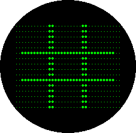 <!-- {.full-width} -->
      <figcaption>A. S. Douglas em um computador EDSAC (tubo de vácuo)</figcaption>
    :::
  - Tennis for two (1958)
    ::: figure .polaroid.light.item-200w margin: 0 auto; height: calc(100% - 34px);
      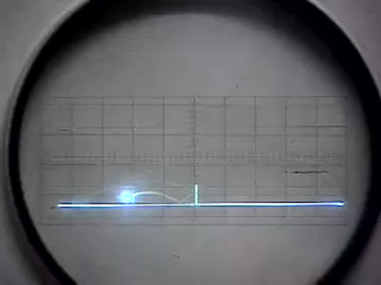 <!-- {.full-width} -->
      <figcaption>Willy Higginbotham em um osciloscópio conectado a um computador analógico</figcaption>
    :::

---
<!-- {"layout": "regular"} -->
# Os primeiros computadores (2/2)

- SpaceWar (1961 - 1962) <!-- {ul^0:.multi-column-inline-list-2.no-bullet.center-aligned.full-width} -->
  ::: figure .polaroid.light.item-300w margin: 0 auto; height: calc(100% - 34px);
    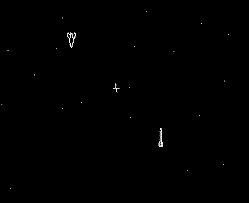 <!-- {.full-width} -->
    <figcaption>Jogo <strong>SpaceWar</strong> contando com controles, torpedos e teletransporte</figcaption>
  :::
- Equipe do SpaceWar
  ::: figure .polaroid.light.item-300w margin: 0 auto; height: calc(100% - 34px);
    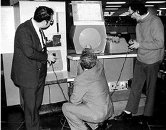 <!-- {.full-width} -->
    <figcaption>Feito para o PDP-11, em 6 meses, <strong>com 200 horas de programação</strong></figcaption>
  :::

---
<!-- { "layout": "regular" } -->
# Linha do tempo

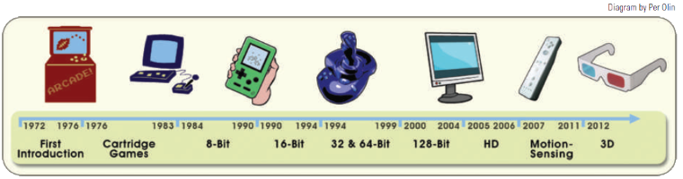 <!-- {p:.centered} -->

- Consoles: 8 gerações
  - Wii U (2012)
  - PS4 (2013)
  - Xbox One (2013)
  - Switch (2017) <!-- {ul^0:.multi-column-list-4} -->
- PCs: a tecnologia das placas gráficas têm determinado os "saltos" entre
  gerações
- Celulares/tablets

---
<!-- { "layout": "regular" } -->
# Fenômeno **Arcade**

- ::: figure .polaroid.push-right.small-width
   <!-- {style="width: 190px"} -->
  <figcaption>Nolan Bushnell</figcaption>
  :::
  Década de 70 - **Nolan Bushnell** <!-- {ul:.full-width} -->
  - Adaptação do Spacewar: Computer Space
    - Hardware customizado + TV + operação por moedas
  - Não fez muito sucesso, mas marcou o início
  - 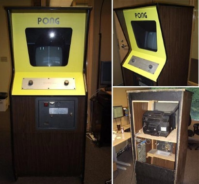 <!-- {.push-right} -->
    Em 1972 **Nolan Bushnell fundou a Atari** e lançou o Pong

---
<!-- { "layout": "regular" } -->
# Mais **arcades**

  

    <figure class="polaroid item-270w" style="border-width: 10px">
      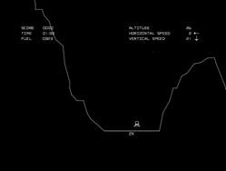
      <figcaption><strong>1978</strong> Atari - Lunar Lander</figcaption>
    </figure>
    <figure class="polaroid item-270w" style="border-width: 10px">
      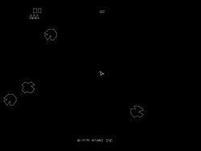
      <figcaption><strong>1978</strong> Atari - Asteroids</figcaption>
    </figure>
    <figure class="polaroid item-270w" style="border-width: 10px">
      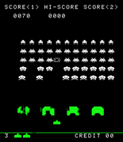
      <figcaption><strong>1978</strong> Midway - Space Invaders</figcaption>
    </figure>
    <figure class="polaroid item-270w" style="border-width: 10px">
      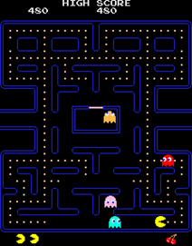
      <figcaption><strong>1980</strong> Namco - PacMan</figcaption>
    </figure>
  

  

    <figure class="polaroid light item-230w">
      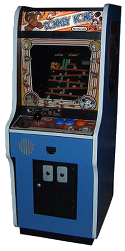
      <figcaption><strong>1981</strong> Nintendo - Donkey Kong</figcaption>
    </figure>
  

---
<!-- { "layout": "regular" } -->
# Consoles

- 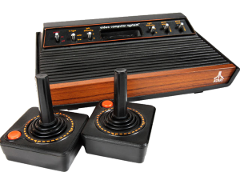 <!-- {.push-right} -->
  Os primeiros consoles **surgiram em paralelo aos arcades**
  - 1972 Magnavox Odissey
  - 1975 Atari Pong
  - 1976 Faichild Channel F
  - 1977 **Atari 2600**
  - 1978 Magnavox Odissey 2

---
<!-- { "layout": "regular" } -->
# Atari 2600

- Console era vendido barato
  - O **lucro da Atari** era grande com os **cartuchos**
- Todo jogo devia ser contido em 4KB

  

    <figure class="polaroid item-270w">
      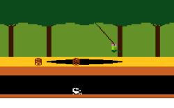
      <figcaption>1982 - Jogo <strong>Pitfall</strong></figcaption>
    </figure>
    <figure class="polaroid item-270w">
      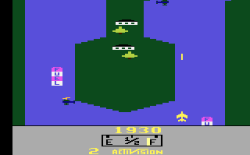
      <figcaption>1982 - Jogo <strong>River Raid</strong></figcaption>
    </figure>
    <figure class="polaroid item-270w">
      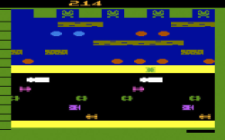
      <figcaption>1981 - Jogo <strong>Frogger</strong></figcaption>
    </figure>
  

---
<!-- { "layout": "regular" } -->
# Consoles

- Vários outros consoles e novas versões foram lançados no final dos 70 início dos 80
- Vários **jogos foram portados** do arcade para o console, alguns fracassaram (PacMan)
- Em 1982, ex-funcionários da Atari **criam a Activision**, primeira _"third part developer"_

### **Crash** de 1983 - 1984

- Depois de um grande sucesso até 1982, a indústria de jogos começou a ter
  problemas e **várias empresas entraram em colapso**
  - Não havia grandes avanços tecnológicos
  - Excesso de jogos e cartuchos (mais de 50 empresas)
  - **Jogos de baixa qualidade** e consoles que não fizeram sucesso
    (ET, Atari 5200)
  - Série de dúvidas quanto ao futuro da indústria.
    O público se questionava os jogos digitais seriam uma
    moda passageira como o bambolê

---
<!-- { "layout": "regular" } -->
# **Computadores pessoais** e jogos

- Década de 80: **surgimento dos PCs**
  - Ameaça ou salvação da indústria?
- Algumas plataformas fizeram muito sucesso com jogos
  - Commodore, Amiga, Apple II
- Mas o IBM PC e os vários clones posteriores, que acabaram virando
  o padrão da indústria
- Hoje em dia se fala em "jogos de computador", "jogos de video game",
  "jogos eletrônicos" ou "jogos digitais" indistintamente

---
<!-- { "layout": "regular" } -->
# Computadores pessoais e jogos

- Várias **empresas** passaram a **desenvolver para essa nova plataforma**
  - 
    **Sierra**
  - Accolade
  - Origin
  - 
    **Electronic Arts**
  - Infocom
  - 
    **Lucas Arts**
  - Broderbund
  - Microprose
  - Epyx
  - …

---
<!-- { "layout": "regular" } -->
# Alguns marcos nos **jogos para PC**

  

    <figure class="polaroid item-260w">
      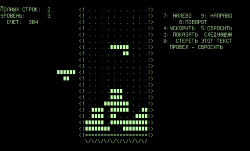
      <figcaption><strong>1984</strong> Tetris (Alexey Pajitnov)</figcaption>
    </figure>
    <figure class="polaroid item-260w">
      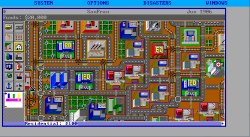
      <figcaption><strong>1989</strong> SimCity - Maxis (Will Wright)</figcaption>
    </figure>
    <figure class="polaroid item-260w">
      
      <figcaption><strong>1993</strong> Doom - id Software</figcaption>
    </figure>
    <figure class="polaroid item-260w">
      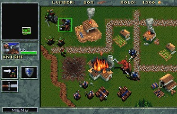
      <figcaption><strong>1995</strong> Warcraft - Blizzard</figcaption>
    </figure>
    <figure class="polaroid item-260w">
      
      <figcaption><strong>1997</strong> Ultima Online - Origin Systems</figcaption>
    </figure>
    <figure class="polaroid item-260w">
      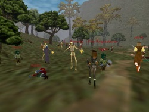
      <figcaption><strong>1999</strong> EverQuest - Daybreak Game Company</figcaption>
    </figure>
  

---
<!-- { "layout": "regular" } -->
# Guerra dos consoles

- Em paralelo ao desenvolvimento dos jogos para PC, os **consoles ganharam
  nova vida**
  - Nintendo NES (1984)
  - Sega Master System (1986)
  - Nintendo Super NES (1990), Sega Genesis (1989)
  - Sega Saturn (1994), Sony Playstation (1994), Nintendo 64 (1995)
1. ::: figure .polaroid.light
   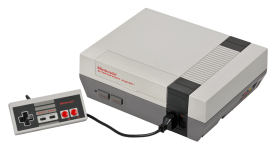 <!-- {.item-200h} -->
   <figcaption>Nintendo Electronic System</figcaption>
   :::
1. ::: figure .polaroid.light
   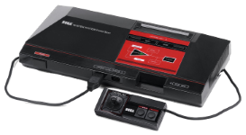 <!-- {.item-200h} -->
   <figcaption>Master System</figcaption>
   :::
   <!-- {ol:.item-grid.no-bullet.full-width style="justify-content: space-around"} -->

---
<!-- { "layout": "regular" } -->
# Guerra dos consoles

- 

    

      <figure class="polaroid thinner light item-160w">
        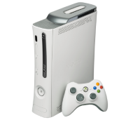
        <figcaption><strong>Xbox 360</strong> (Novembro <strong>2005</strong>)</figcaption>
      </figure>
      <figure class="polaroid thinner  light item-160w">
        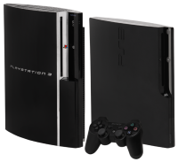
        <figcaption><strong>Playstation 3</strong> (Novembro <strong>2006</strong>)</figcaption>
      </figure>
      <figure class="polaroid thinner  light item-160w">
        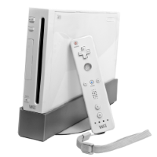
        <figcaption>Nintendo <strong>Wii</strong> (Dezembro <strong>2006</strong>)</figcaption>
      </figure>
    

  

  1999: Sega Dreamcast
- 2000: Sony Playstation 2 <!-- {ul:.full-width} -->
- 2000: **Sega** introduz **acesso à Internet** no Dreamcast
- 2001: Nintendo Gamecube
- 2001: Microsoft Xbox
- 2001: Sega sai da corrida de _hardware_
- 2002: Sony e Microsoft colocam acesso à Internet nos consoles

---
<!-- { "layout": "regular" } -->
# Guerra dos consoles, **hoje**

  

    <figure class="polaroid light item-250w">
      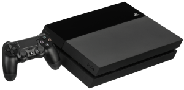
      <figcaption><strong>Playstation 4</strong> (Novembro 2013)</figcaption>
    </figure>
    <figure class="polaroid light item-250w">
      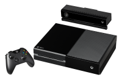
      <figcaption><strong>Xbox One</strong> (Novembro 2013)</figcaption>
    </figure>
  

  

    <figure class="polaroid light item-250w">
      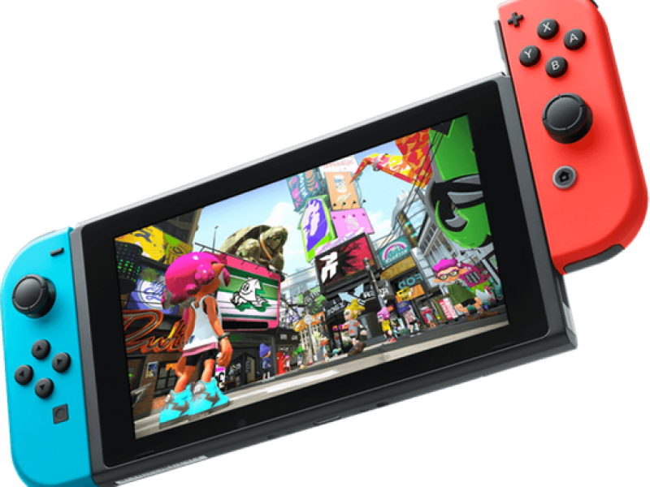
      <figcaption>Nintendo <strong>Switch</strong> (2017)</figcaption>
    </figure>
  

---
<!-- { "layout": "regular" } -->
# **Portáteis**

- Surgiram junto aos consoles
- Sempre houve mercado para os jogos portáteis

  

    <figure class="polaroid light item-250w">
      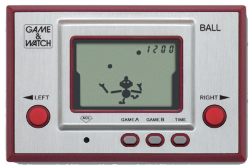
      <figcaption><strong>Game &amp; Watch</strong> (<strong>1980</strong>)</figcaption>
    </figure>
    <figure class="polaroid light item-250w">
      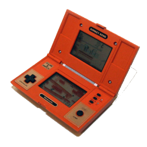
      <figcaption><strong>Game &amp; Watch</strong> Donkey Kong (Novembro <strong>1990</strong>)</figcaption>
    </figure>
    <figure class="polaroid light item-250w">
      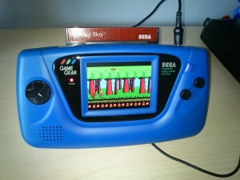
      <figcaption>Sega <strong>Game Gear</strong> (<strong>1991</strong>)</figcaption>
    </figure>
  

---
<!-- { "layout": "regular" } -->
# Portáteis, **hoje**

- New Nintendo 3DS, PS Vita, Switch

  

    <figure class="polaroid light item-250w">
      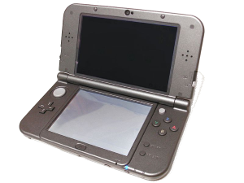
      <figcaption><strong>New Nintendo 3DS</strong> (<strong>2014</strong>)</figcaption>
    </figure>
    <figure class="polaroid light item-250w">
      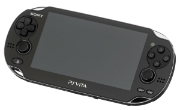
      <figcaption>Sony <strong>PS Vita</strong> (Novembro <strong>2012</strong>)</figcaption>
    </figure>
    <figure class="polaroid light item-250w">
      
      <figcaption>Nintendo <strong>Switch</strong> (<strong>2017</strong>)</figcaption>
    </figure>
  

- Celulares, Tablets

---
<!-- { "layout": "section-header", "slideClass": "plataformas-e-generos", "bespokeHash": "plataformas-e-generos" } -->
# Plataformas e Gêneros

## O que precisamos saber?

- Como a **escolha do _hardware_** alvo de um jogo afeta a forma
  como ele é **desenvolvido e jogado**?
- Quais são as principais **características classificatórias** de jogos?
- **Além de entreter**, jogos podem ter **outros objetivos**?
- Quais são os **gêneros de jogos** mais comuns?

---
<!-- { "layout": "regular" } -->
# **Características** dos jogos

- Existem várias características que devem ser consideradas na hora
  desenvolver um jogo
  - Plataforma <!-- {ul^0:.multi-column-list-2} -->
  - Tempo do jogo
  - Número de jogadores
  - Gênero
  - Objetivo do jogo
  - Público/Mercado alvo
- As decisões corretas com relação a essas várias características são
  fundamentais para o sucesso do jogo

---
<!-- { "layout": "main-point" } -->
# <small>Característica:</small> Plataforma de execução

---
<!-- { "layout": "regular" } -->
# Característica: **Plataforma**

- A plataforma (ou _game system_) pode ser:
  - Arcade <!-- {ul^0:.multi-column-list-3} -->
  - Console
  - Computador
  - Portátil
  - Phone/tablet
  - Smartwatch
- Principais diferenças entre plataformas:
  - **Input**
    - _e.g._, _Joystick_, Mouse+Teclado, _Touch_, _Gesture_...
  - **Output**
    - _e.g._, TV, Monitor, duas telas, tela curva, autoestereoscópica (3d), _virtual reality_...
  - Capacidade de **processamento gráfico** e geral, RAM etc.
  - Tipo de **distribuição** dos jogos
    - _e.g._, cartucho, mídia óptica, digital
  - Tipo de **licenciamento** dos jogos

---
<!-- { "layout": "regular" } -->
# Arcade

- ::: figure .polaroid.push-right.item-200w
    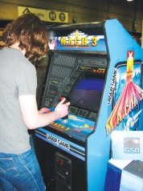 <!-- {style="width: 100%;"} -->
  :::
  Sistemas de jogos independentes, normalmente em locais públicos
- **Tipicamente "alugados"** a jogadores por um tempo breve (5-10 min)
  - Compra-se "fichas" para jogar
- Jogador normalmente **joga em pé**
- Controles consistem de botões, _joysticks_ ou uma combinação deles
- Não é possível salvar/carregar uma sessão de jogo
- Devido à brevidade da sessão de jogo, a maior parte dos **jogos** é **de
  ação**, com **pouca história/narrativa**

---
<!-- { "layout": "2-column-highlight-and-list" } -->
# Desenvolvimento para arcades

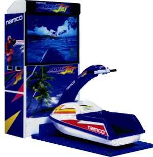 <!-- {.push-right} -->

- É uma oportunidade para jogos com **interfaces exóticas**
- Modelo:
  1. **Fabricante do _hardware_**: detém o direito sobre o _hardware_ e
     controle sobre o conteúdo jogado
  1. **Desenvolvedor de jogos**: normalmente desenvolve para o fabricante,
     mas costuma ser a própria empresa
  1. **Operador local**: licencia ou compra o jogo da fabricante e cobra
     dos jogadores para jogarem

---
<!-- { "layout": "regular" } -->
# Consoles

-  <!-- {.push-right} -->
  Sistemas de jogo dedicados (pelo menos eram!) a apenas jogos
  - Hoje em dia têm Internet, _media players_, **_video streaming_** etc.
- Normalmente jogados em casa, usando-se a **TV como saída**
- A **entrada** é normalmente feita por **controles com direcionais
  e vários botões**
- **Plataforma proprietária**: Sony, Nintendo, Microsoft decidem quem
  pode desenvolver e vender jogos para seus videogames
  - Vantagem: o _hardware_ do videogame (_e.g._, do PS3) é sempre o mesmo
  - Desvantagem: precisa-se comprar licenças e kits de desenvolvimento ($$)

---
<!-- { "layout": "regular" } -->
# Computadores

- 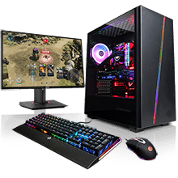 <!-- {.push-right} -->
  **Plataforma aberta**
  - Qualquer um pode produzir e vender um jogo que
    possa ser jogado em um "Dell" rodando "Windows" sem ter que pedir nem
    pagar nada para as fabricantes de _hardware_ e _software_
- Há grande (gigante) variação na capacidade do _hardware_
  - Para assegurar que o jogo execute, estabelece-se **requisitos mínimos**
    e **requisitos recomendados** (placa de vídeo, processador, RAM e HD)
  - Ao desenvolver o jogo, deve-se considerar perfis de configurações
    para parametrizar o custo/benefício de **qualidade gráfica _vs._
    frequência de renderização**

---
<!-- { "layout": "regular" } -->
# Portáteis

-  <!-- {.push-right .item-200w} -->
  De **tamanho reduzido**, são convenientemente **levados pelo o jogador
  a qualquer lugar**
- Plataformas proprietárias, assim como os consoles (Sony e Nintendo)
- Controle via direcionais, botões, telas sensíveis a toque
  - E também: acelerômetro, giroscópio, microfone, GPS
- Jogos precisam sempre poder ser **pausados a qualquer momento**, devido
  ao fato que as sessões de jogo podem ser interrompidas (saindo do ônibus, etc.)
- Jogos distribuídos como **"cartuchos" (_flash card_) ou digitalmente**

---
<!-- { "layout": "regular" } -->
# _Smartphones_ e _Tablets_

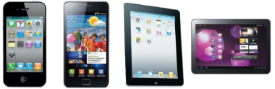 <!-- {p:.centered} -->

- Bem mais recentes (iOS: 2007, Android: 2008)
- Plataformas **proprietárias** (Apple, Google)
- **Distribuição** de jogos (e aplicativos) **por meio das lojas virtuais**
  das fabricantes dos sistemas operacionais
  - Licenciamento no **modelo ganha-ganha: 70/30%**
    - 70% da receita do jogo é do desenvolvedor, 30% da fabricante

---
<!-- { "layout": "main-point" } -->
# <small>Característica:</small> Intervalo de tempo

---
<!-- { "layout": "regular" } -->
# Característica: **Intervalo de Tempo**

- Cada tipo de jogo configura como o **tempo passa dentro do jogo**
- Isso define se o jogo é jogado **por reflexo** ou **refletivamente**:
  - **Baseado em turnos**: como em jogos de carta ou tabuleiro, cada jogador joga
    em sua vez (turno)
  - Em **tempo real**: todos os jogadores jogam ao mesmo tempo e o jogo não pára para
    esperar que jogadores tenham longas reflexões sobre suas ações
    - **Maior complexidade técnica** quando em modo **multi-jogador**
  - **Limitado por tempo**: mescla dos outros dois, com limite de tempo para que
    cada jogador tome sua ação em seu turno

---
<!-- { "layout": "main-point" } -->
# <small>Característica:</small> Número de Jogadores

---
<!-- { "layout": "regular" } -->
## Característica: **Número de Jogadores**

<!-- - O número de jogadores define:
  - A infra-estrutura de redes que pode ser necessária
  - A necessidade de equipe de suporte técnico 24/7
  - O uso de divisão da tela de jogo em mútliplas câmeras virtais
- Varia de **jogador único** (_single-player_) a multi-massivo
  online (<abbr title="multi-massive online">MMO</abbr>) -->

1. <!-- {ol:.layout-split-2.no-bullet.center-aligned} -->
   ### _Single-player_
   ::: figure .light.item-300w.polaroid.light margin: auto;
   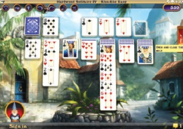 <!-- {style="width: 100%;"} -->
   <figcaption>Paciência, <em>single-player</em> clássico</figcaption>
   :::
   - Apenas **um jogador** por vez  <!-- {ul:.left-aligned} -->
   - **Oponentes**, quando existem, são **controlados por IA**
     - Personagens não jogáveis (NPCs)
1. ### _Two-player_
   ::: figure .light.item-300w.polaroid.light margin: auto;
   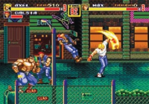 <!-- {style="width: 100%;"} -->
   <figcaption>Streets of Rage 2, <em>two-player</em> cooperativo</figcaption>
   :::
   - Até **dois jogadores** juntos <!-- {ul:.left-aligned} -->
   - Herdado dos arcades antigos
     - Em alguns jogos, **a tela se divide** para mostrar os dois jogadores

*[IA]: Inteligência Artificial*
*[NPCs]: Non-playable characters*

<!-- 

  <section style="border-right: 4px dotted silver;">
    <h3>_Single-player_</h3>
    <figure class="polaroid light item-200w" style="margin:auto;">
      
      <figcaption>Paciência (_Hardwood Solitaire IV_), _single-player_ clássico</figcaption>
    </figure>
    <ul style="text-align: left">
      <li>Apenas **um jogador** por vez</li>
      <li>**Oponentes**, quando existem, são **controlados por <abbr title="inteligência artificial">IA</abbr>**
        <ul>
          <li>São chamados de personagens não-jogáveis ou **<abbr title="non-player character">NPCs</abbr>**</li>
        </ul>
      </li>
    </ul>
  </section>
  <section style="">
    <h3>_Two-player_</h3>
    <figure class="polaroid light item-200w" style="margin:auto;">
      
      <figcaption>Streets of Rage 2, _two-player_ cooperativo</figcaption>
    </figure>
    <ul style="text-align: left">
      <li>Até **dois jogadores** juntos</li>
      <li>Herdado dos arcades antigos
        <ul>
          <li>Em alguns jogos, **a tela se divide** para mostrar os dois jogadores</li>
        </ul>
      </li>
    </ul>
  </section>

 -->

---

  <section style="border-right: 4px dotted silver;">
    <h3>_Local Multiplayer_</h3>
    <figure class="polaroid light item-200w" style="margin:auto;">
      
      <figcaption>Pessoas jogando Wii juntas</figcaption>
    </figure>
  </section>
  <section style="border-right: 4px dotted silver;">
    <h3>_LAN-Based Multiplayer_</h3>
    <figure class="polaroid light item-200w" style="margin:auto;">
      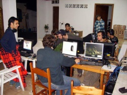
      <figcaption>Foto do professor fazendo **redinha** ;)</figcaption>
    </figure>
  </section>
  <section>
    <h3>_Online Multiplayer_</h3>
    <figure class="polaroid light item-200w" style="margin:auto;">
      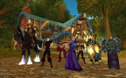
      <figcaption>World of Warcraft</figcaption>
    </figure>
  </section>

- Outros aspectos:
  - Coop _vs._ <abbr title="Player versus player">PvP</abbr>

---
## Característica: **Propósito do Jogo**

- Jogos podem (e costumam) ter **propósitos** que vão **além do "simplesmente entreter"**:
  - Entretenimento
  - Socialização
  - Educação
  - Treinamento / Recrutamento (_serious games_)
  - Propaganda / Marketing (_advergames_)
  - Saúde / _Fitness_
  - Consciência / Mudança (_games for change_)
  - Estética / Criatividade (_art/concept games_)

---
## Propósitos mais raros: _Advergame_

<iframe width="640" height="360" src="https://www.youtube.com/embed/PmnAxS7mc-s?rel=0" frameborder="0" allowfullscreen></iframe>

---
## Propósitos mais raros: _Concept game_

<iframe width="800" height="480" src="http://www.molleindustria.org/everydaythesamedream/everydaythesamedream.html"></iframe>

- Jogo: _Every Day the Same Dream_
- Conceito: monotonia, tédio e alienação

---
## Propósitos mais raros: _Art game_

- 
  [Aether](http://cache.armorgames.com/misc/downloads/aether.zip) (criadores do Super Meat Boy)
  - _"Players control a lonely boy and an octopus-like monster [...] solving puzzles_
    _on different planets to restore them from monochrome to color"_
- 
  [Flow](http://interactive.usc.edu/projects/cloud/flowing/) (baseado em pesquisa sobre **ajuste dinâmico de dificuldade**)
  - _"In Flow, the player navigates a series 2D planes with an aquatic microorganism_
    _that evolves by consuming other microorganisms"_

---
## Característica: **Gêneros**

- São categorias nas quais os jogos são classificados levando em consideração o
  estilo, a narrativa, a perspectiva dos jogadores, _gameplay_, etc
  - Ex.: Ação, Aventura, <abbr title="Role-playing game">RPG</abbr>, <abbr title="Real-time strategy">RTS</abbr>...
- Novos gêneros são criados continuamente
  - Ex: jogos sociais, _music games_
- Normalmente são considerados em conjunto com as características estudadas até aqui
- Novak (2011) considera 10 gêneros, alguns contendo sub-gêneros

---
## Gênero: **Ação**

- Normalmente acontecem em tempo real e exigem coordenação motora e reações rápidas
- Maioria dos Arcades eram/são jogos de ação
- Subgêneros
  - Tiro (Space Invaders, FPSs, ...)
  - Plataforma (Donkey kong, Sonic, ...)
  - Luta
  - Corrida
  - “Outros”: Pac-Man, Guitar Hero...

---
## Gênero: **Ação**

<ul class="multi-column-inline-list-2">
  <li>Plataforma
      <figure class="polaroid light">
        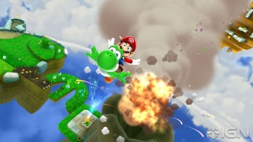
        <figcaption>Super Mario Galaxy 2 (Wii)</figcaption>
      </figure>
  </li>
  <li>_Shooters_ (de tiro)
      <figure class="polaroid light">
        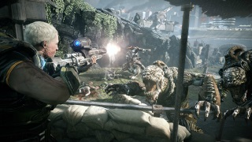
        <figcaption>Gears of War: Judgement (Xbox 360)</figcaption>
      </figure>
  </li>
  <li>Corrida
      <figure class="polaroid light">
        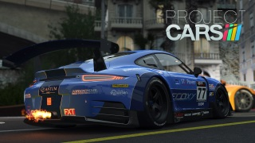
        <figcaption>Project Cars (multi)</figcaption>
      </figure>
  </li>
  <li>Luta
      <figure class="polaroid light">
        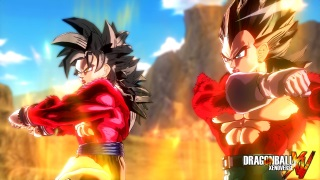
        <figcaption>Dragon Ball: Xenoverse (multi)</figcaption>
      </figure>
  </li>
</ul>

---
## Gênero: **Aventura**

- Normalmente envolvem uma história, onde o jogador deve percorrer cenários,
  coletar itens, interagir com personagens de forma a cumprir alguma missão
- Passo não tão acelerado, muitas vezes _turn-based_
- Gênero híbrido: Ação-Aventura tem se tornado muito mais comuns que jogos de aventura puros

---
## Gêneros: **Aventura**, **Ação-Aventura**

<ul class="multi-column-inline-list-2">
  <li>Aventura
      <figure class="polaroid light item-300w">
        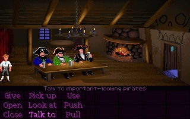
        <figcaption>The Secret of Monkey Island (PC)</figcaption>
      </figure>
  </li>
  <li>Ação-Aventura
      <figure class="polaroid light item-300w">
        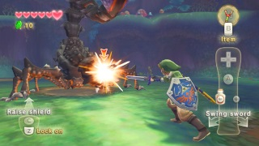
        <figcaption>Zelda Skyward Sword (Wii)</figcaption>
      </figure>
  </li>
</ul>

---
## Gêneros: **Cassino**, _**Puzzle**_

<ul class="multi-column-inline-list-2">
  <li>Cassino
      <figure class="polaroid light item-300w">
        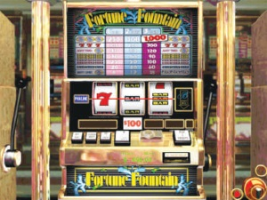
        <figcaption>Microsoft Casino (PC)</figcaption>
      </figure>
  </li>
  <li>_Puzzle_
      <figure class="polaroid light item-300w">
        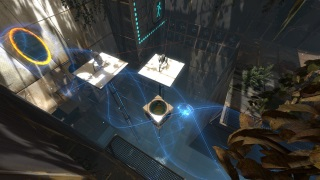
        <figcaption>Portal 2 (PC)</figcaption>
      </figure>
  </li>
</ul>

---
## Gênero: **RPG**

- Jogadores assumem papéis como personagens dentro do jogo (cavaleiros, mágicos, ladrões, etc),
  e evoluem o personagem ao longo do jogo
- Normalmente possuem uma narrativa longa, grandes cenários e
  os jogadores tem que cumprir desafios (_quests_) ao longo do jogo
- Originários dos tradicionais RPG de papel e cartas (_Dungeons and Dragons_)

---
## Gênero: **Simulação**

- Tentam replicar máquinas, sistemas, experiências do mundo real
- Variados graus de realismo
  - Quanto mais precisa é a simulação mais habilidade é requerida do jogador
- Subgêneros:
  - Veículos (MS Flight Simulator, ...)
  - Construção e Gerência (SimCity, SimAnt, SimFarm, ...)
  - God Games (The Sims, B&amp;W, Spore, ...)
  - Esportes (Fifa, "WingElev", NBA, ...)

---
## Gêneros: **RPG**, **Simulação**

<ul class="multi-column-inline-list-2">
  <li>RPG
    <figure class="polaroid light item-300w">
      
      <figcaption>The Witcher 3 (multi)</figcaption>
    </figure>
  </li>
  <li>Simulação
    <figure class="polaroid light item-300w">
      
      <figcaption>SimCity (PC)</figcaption>
    </figure>
  </li>
</ul>

---
## Gênero: **Estratégia**

- Origem em jogos como Xadrez, Diplomacia,...
- Jogadores devem gerenciar recursos e conquistar objetivos
  - Normalmente envolvem construir unidades, coletar riquezas e derrotar inimigos
- Baseado em turnos (TBS) x Em tempo real (RTS)
  - Os jogos RTS atingiram um grande sucesso e são mais comuns hoje em dia
- Mais recentemente: MOBA
  - Action RTS: combates do jogo RTS
  - _Micromanagement_ de poucas unidades

---
## Gênero: **Estratégia**

<ul class="multi-column-inline-list-2">
  <li>Baseada em turnos (TBS)
      <figure class="polaroid light item-300w">
        
        <figcaption>Civilization V (PC)</figcaption>
      </figure>
  </li>
  <li>Em tempo real (RTS)
      <figure class="polaroid light item-300w">
        
        <figcaption>Starcraft 2 (PC)</figcaption>
      </figure>
  </li>
</ul>

---
## Gênero: **MMOG**

- Apesar de derivado de outros gêneros, acabou se tornando
  um gênero próprio por suas características
  - MMORPG, MMOFPS, etc...
- Um grande número de pessoas, fisicamente distribuídas, jogando _on-line_
- Desafios
  - Balanceamento entre socialização e imersão
  - Fazer as pessoas “se comportarem” de acordo

---
## Gênero: **MMOG**

<ul class="multi-column-inline-list-2">
  <li>MMORPG
      <figure class="polaroid light item-300w">
        
        <figcaption>World of Warcraft (PC)</figcaption>
      </figure>
  </li>
  <li>MMOSimulation
      <figure class="polaroid light item-300w">
        
        <figcaption>Eve Online (PC)</figcaption>
      </figure>
  </li>
</ul>

---
## Gênero: **Social**

- Surgiram com o advento das redes sociais
- Características:
  - Jogos casuais (pelo menos eram!)
  - Interação com os amigos da rede
  - Não exigem habilidade, mas dedicação
  - Funcionalidade básica gratuita
    - Pagamento por assinaturas / itens especiais (2 a 5% do público pagante)

---
## Gênero: **Social**

<ul class="multi-column-inline-list-2">
  <li>
      <figure class="polaroid light item-300w">
        
        <figcaption>Candy Crush Saga (Facebook)</figcaption>
      </figure>
  </li>
  <li>
      <figure class="polaroid light item-300w">
        
        <figcaption>Farmville 2 (Facebook)</figcaption>
      </figure>
  </li>
</ul>

---
# Referências

- Livro _Game Development Essentials: An Introduction, Third Edition_
  1. Capítulo 1: _Historical Elements_
  1. Capítulo 2: _Platforms &amp; Player Modes_
  1. Capítulo 3: _Goals &amp; Genres_
