<!--
backdrop: beyond-two-souls
bespokeEvent: bullets.disable
-->

# Introdução: Jogadores, Narrativa e _Gameplay_

## Baseadão nos slides do Prof. (Luiz) Chaimo(wicz) da UFMG

---
# Roteiro

1. Jogadores
  - Características Geográficas
  - Características Psicográficas
  - Características Demográficas
1. Narrativa
1. _Gameplay_

---
<!--
bespokeState: checkpoint
-->

# Jogadores e seus Objetivos

## O que precisamos saber?

- **O que motiva** as pessoas a jogar?
- O que são diferenças **geográficas, demográficas e psicográficas**?
- **O que muda de uma geração** de pessoas para outra?

---
# O Mercado de Jogos

- Para vender um jogo (ou qualquer produto), precisa entender para quem se está vendendo
  - A resposta **não é "para todo mundo"**
- Estatísticas nos [EUA (2015)](../../attachments/Essential-Facts-2015-Infographic.pdf):
  - 155 milhões de pessoas jogam
  - 2 jogadores por residência (média)
  - 4/5 residências possuem dispositivos usados para jogar
  - 51% das residências possuem um console
  - 42% dos americanos jogam regularmente
    - 3h+ por semana
- [Estatísticas 2016](http://essentialfacts.theesa.com/Essential-Facts-2016.pdf)

---
# Motivação dos Jogadores

- Em 1996, Richard Bartle propôs que jogadores de jogos <abbr title="Multi-user dungeon">MUD</abbr> se encaixavam em 4 categorias
  - **Socializadores**: gostam de aprender e se comunicar com outros jogadores
  - **Matadores**: gostam de manipular outros jogadores
  - **Realizadores**: gostam de interagir com o mundo de jogo
  - **Exploradores**: gostam de manipular o mundo de jogo

---
## Motivação dos Jogadores (hoje)

<ul style="width: 100%; box-sizing: border-box;">
  <li>O que leva as pessoas a jogar?
    <ol>
      <li>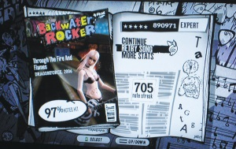
      **Maestria**</li>
      <li>Interação social</li>
      <li>Isolamento físico</li>
      <li>Competição</li>
      <li>Conhecimento</li>
      <li>Vício</li>
      <li>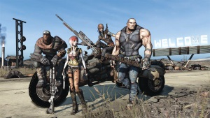
      **Escapismo**</li>
    </ul>
  </li>
</ul>

---
# Características **Geográficas**

- Regiões diferentes possuem contextos de mercado distintas
  <ul class="multi-column-inline-list-2">
    <li>
      <figure class="polaroid item-250w">
        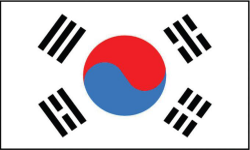
        <figcaption>Caso da Coréia do Sul</figcaption>
      </figure>
      <ul>
        <li>NCSoft lançou o MMORPG Lineage (1998)</li>
        <li>Muitos desempregados devido a uma crise</li>
        <li>Surgimento das Baangs (LAN House)</li>
      </ul>
    </li>
    <li>
      <figure class="polaroid item-250w">
        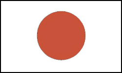
        <figcaption>Caso do Japão</figcaption>
      </figure>
      <ul>
        <li>Monopólio da NTT DoCoMo em telecom</li>
        <li>Presença tardia de banda larga</li>
        <li>Foco em arcades/consoles</li>
      </ul>
    </li>
  </ul>

---
<!--
backdrop: lol-final-seoul
-->

## Cenário da Coréia do Sul

_"When people ask where I think games are going in the **near future**,
I always **refer to South Korea**."_

_"Game parlors are on every block and apartment complex, the **professional
gamers are on billboards and television**, and **everyone you meet has a
favorite StarCraft story**. Games are not just accepted in popular culture;
they are integrated, and **nearly everyone plays**."_

---
## Características **Geográficas** (2)

- Outros casos
  <ul class="multi-column-inline-list-2">
    <li>
        <figure class="polaroid item-250w">
          
          <figcaption>Caso da China</figcaption>
        </figure>
        <ul>
          <li>Ausência de consoles</li>
          <li>Grande foco em MMORPGs gratuitos</li>
          <li>Jogos são usados para socializar</li>
          <li>RPGs têm o _pace_ mais lento (para possibilitar conversa)</li>
        </ul>
    </li>
    <li>
        <figure class="polaroid item-250w">
          
          <figcaption>Caso da Alemanha</figcaption>
        </figure>
        <ul>
          <li>Doom II foi vetado</li>
          <li>Command &amp; Conquer trocou pessoas por robôs</li>
          <li>Proibido: mostrar sangue, atirar em humanos e glorificar a Hitler, os nazistas ou ao _Third Reich_</li>
        </ul>
    </li>
  </ul>

---
# Características **Psicográficas**

- Psicografia consiste nos **valores, atitudes e estilos de vida das pessoas**
  - Como elas passam seu tempo?
  - Como elas enxergam o mundo?
  - Elas são sociáveis?
  - São ambiciosas?
  - Como se sentem sobre dinheiro, religião e cultura?
  - São cínicas ou otimistas?
  - Elas participam de causas sociais e ambientais?
- Vejamos **duas formas para medir essas características**

---
## _Myers-Briggs Type Indicator_ (<abbr title="Myers-Briggs Type Indicator">MBTI</abbr>)

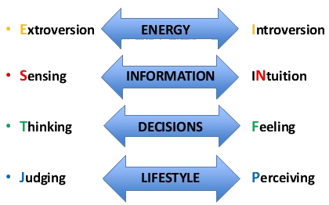

- (16) Tipos de personalidade formadas por combinações de valores dos 4 _continua_

---
## Por quê fazer o estudo psicográfico?

_"Knowing your target player market isn’t just an issue of pure marketing;
[...]. Knowing your audience [...] means understanding the way your game fits
into your players’ lives."_

_"Do your players think of gaming as a **time waster or a dedicated
hobby**? Do your players view games as a **medium for self-expression,
personal growth, socializing, escapism, or something else** entirely?
Knowing the answers to these questions **should fundamentally shape the way
your games are designed**."_

Brandii Grace (Game Designer, Engaging Designs)

---
# Características **Demográficas**

- Informação demográfica **inclui sexo, idade, receita, nível educacional,
  estado civil, etnia e religião**
- **Sexo**
  - Era dos arcades e consoles teve grande predomínio do público masculino
  - A Web (1991+) e os PCs começou a trazer um balanceamento de gêneros
  - 44% dos jogadores dos EUA são mulheres/meninas/senhoras (ESA, 2015)

---
## Demográfica e Psicográfica: **Geração**

- Uma geração é composta por **pessoas cuja localização comum na história
  os torna "uma pessoa coletiva"**
- 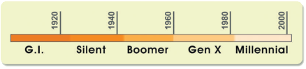
  Nos EUA, há ~5 gerações:  
  1. Geração do Silêncio (~70–90 anos)
  2. Geração _Baby Boomer_ (~50–70 anos)
  3. Geração X (~30–50 anos)
    - Crianças "soltas", adultos empreendedores
  4. Geração Milenar (Y) (~10–30 anos)
    - Computadores, "mimos paternais", autoconfiantes (especiais)
  5. Geração "Homelander" (Z) (~10 anos ou mais jovem)
    - Internet, gamificação, "criançarcado"

---
<!--
bespokeState: checkpoint
-->

# Narrativa

## O que precisamos saber?

- O que são **elementos de narrativa** em um jogo?
- O que são **estruturas de narrativa** e **arquétipos de personagens**?
- É possível contar a **história do jogo** de forma **interativa**?
- Quais são os **dispositivos de narrativa dramática** e como eles afetam a imersão?

---
# Criando Idéias

- Comece por "escreva o que você sabe"
- Inspire-se pelo que você gosta - livros, séries, filmes, histórias
  - Ou mesmo por situações vivenciadas no dia-a-dia
- Reserve um caderno exclusivo para ideias e anote-as ao longo do dia
  - Boas ideias surgirão, mas ainda faltará saber transformá-las em
    bons enredos para jogos

---
# Arquétipos Clássicos de Personagens

- Carl Jung, um dos pais da psicologia, definiu o que chamou de **inconsciência
  coletiva** como um **conhecimento com o qual todos nascemos** mas do qual
  podemos nunca ter consciência
- Dentro da inconsciência coletiva, há **temas universais e arquétipos**, que
  aparecem em nossa cultura nas histórias, tipos de personagens nas artes,
  literatura, música, filmes e jogos
- O inconsciente coletivo é a base da nossa conexão com certos tipos de
personagens universais
  - No entretenimento, esses arquétipos são **usados para aumentar a conexão com
    o público alvo**

---
## O **Herói**

- <figure class="polaroid item-300w light right">
    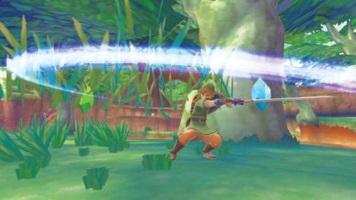
    <figcaption>Link é o herói em The Legend of Zelda: Skyward Sword</figcaption>
  </figure>
  - Personagem central
  - Jogador deve se identificar e se afeiçoar a este personagem
  - O herói tem um problema no início da história e começa uma jornada para
    resolvê-lo
  - Faz boa parte da ação e assume a maior parte da responsabilidade e risco
    - Exemplo: Luke Skywalker

---
## O **Sombra**

- <figure class="polaroid item-300w light right">
    
    <figcaption>O Coringa (Batman: Arkham Asylum) é um sombra</figcaption>
  </figure>
  Extremamente importante, representa o oposto do herói
- Pode ser o responsável pelo problema do herói
- Pode permanecer-se escondido até o clímax da história

---

  <section style="border-right: 4px dotted silver;">
    <h2>O **Mentor**</h2>
    <figure class="polaroid light item-200w" style="margin:auto;">
      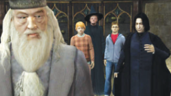
      <figcaption>Dumbledore em Harry Potter e a Ordem da Fênix, que é o mentor
      que treina o herói.</figcaption>
    </figure>
    <ul style="text-align: left">
      <li>Guia o herói para a ação</li>
      <li>Normalmente mais velho</li>
    </ul>
  </section>
  <section>
    <h2>O **Aliado**</h2>
    <figure class="polaroid light item-200w" style="margin:auto;">
      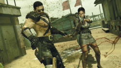
      <figcaption>Sheva é uma aliada em Resident Evil 5</figcaption>
    </figure>
    <ul style="text-align: left">
      <li>Ajuda o herói a progredir na jornada</li>
      <li>Exemplo: Hans Solo e Chewbacca</li>
    </ul>
  </section>

---

  <section style="border-right: 4px dotted silver;">
    <h2>O **Guardião**</h2>
    <figure class="polaroid light item-200w" style="margin:auto;">
      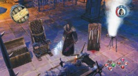
      <figcaption>O Inquisidor em _Sacred 2: Fallen Angel_ tenta bloquear o
        herói de atingir um objetivo</figcaption>
    </figure>
    <ul style="text-align: left">
      <li>Bloqueia o progresso do herói</li>
      <li>Pode ser também um "bloqueio mental" do herói</li>
    </ul>
  </section>
  <section style="border-right: 4px dotted silver;">
    <h2>O **Trapaceiro**</h2>
    <figure class="polaroid light item-200w" style="margin:auto;">
      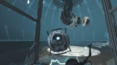
      <figcaption>Glados é um trapaceiro em Portal 2</figcaption>
    </figure>
    <ul style="text-align: left">
      <li>Personagem neutro, prega peças</li>
      <li>Traz _comic relief_</li>
    </ul>
  </section>
  <section>
    <h2>O **Arauto**</h2>
    <figure class="polaroid light item-200w" style="margin:auto;">
      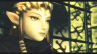
      <figcaption>Zelda repetidamente suscita ações em Link em
        _The Legend of Zelda: Twilight Princess_</figcaption>
    </figure>
    <ul style="text-align: left">
      <li>Facilita mudança na história</li>
      <li>Dá direção ao herói</li>
    </ul>
  </section>

---
# **Além** dos Arquétipos Jungianos

  <section style="border-right: 4px dotted silver;">
    <h2>O **Protagonista**</h2>
    <figure class="polaroid light item-200w" style="margin:auto;">
      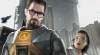
      <figcaption>Gordon Freeman em _Half-Life 2_</figcaption>
    </figure>
    <ul style="text-align: left">
      <li>Similar ao herói, porém mais humano</li>
      <li>Tipicamente contém falhas</li>
      <li>Nem sempre é 100% bom</li>
    </ul>
  </section>
  <section>
    <h2>O **Antagonista**</h2>
    <figure class="polaroid light item-200w" style="margin:auto;">
      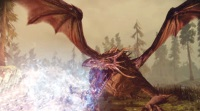
      <figcaption>Archdemon em _Dragon Age: Inquisition_</figcaption>
    </figure>
    <ul style="text-align: left">
      <li>O oposto do protagonista</li>
      <li>Não necessariamente mau</li>
      <li>Há vários tipos (veja a seguir)</li>
    </ul>
  </section>

---
## Tipos de **antagonistas**

  <section style="border-right: 4px dotted silver;">
    <h3>**Transformacional**</h3>
    <ul style="text-align: left">
      <li>Anti-herói, poderia ter sido o herói</li>
      <li>Exemplo: Wario (e Mario)</li>
    </ul>
  </section>
  <section>
    <h2>**Equivocado**</h2>
    <ul style="text-align: left">
      <li>Inicialmente tido como vilão</li>
      <li>Acaba sendo inocente no final</li>
    </ul>
  </section>

  <section style="border-right: 4px dotted silver;">
    <h3>**Exagerado**</h3>
    <ul style="text-align: left">
      <li>Por vezes, mais aparente que o protagonista</li>
      <li>Rouba a atenção</li>
    </ul>
  </section>
  <section>
    <h2>**Realista**</h2>
    <ul style="text-align: left">
      <li>O oposto dos exagerados</li>
      <li>Vilão "comum", disfarça-se entre normais</li>
    </ul>
  </section>

---
# Estrutura de História Tradicional

---
## Os **3 Atos de Holywood**

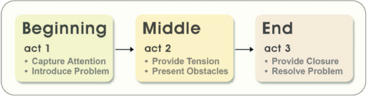

- Uma boa história tem 3 partes:
  1. Ato 1: introduz o problema do personagem principal
  1. Ato 2: obstáculos que bloqueiam o personagem
  1. Ato 3: resolução do problema

---
<!--
backdrop: heroes
-->

<iframe width="800" height="450" src="https://www.youtube.com/embed/Hhk4N9A0oCA?rel=0" frameborder="0" allowfullscreen></iframe>

---
# **Elementos** da "Estória"

- **Premissa** (conceito geral)
  - Sumário (1-2 frases) do propósito do jogo e tema geral
  - Deve intrigar possíveis clientes, promovendo a venda
  - Exemplo do Half-Life:

    _“Take on the role of Gordon Freeman, an ordinary technician who
    is forced to battle trans-dimensional monsters aft er an accident at
    a secret research facility.”_

---
## **Elementos** da "Estória" (2)

- **Por trás da História** (_Backstory_)
  - Informação que leva aonde o jogo começa
  - Um parágrafo no manual do jogo ou no início
  - Orienta o jogador quanto ao propósito e ação envolvidos no jogo
- **Sinopse** (enredo)
  - Existe ao longo do jogo
  - A forma com a qual o jogador muda o mundo de jogo
---
## **Elementos** da "Estória" (3)

- **Tema**
  - Representa o que a "estória" realmente é
  - Exemplos: "Assassínio é justificado?", "Amor triunfará?"
- **Cenário** (_setting_)
  - O local onde se passa a "estória"
  - História e geografia do mundo

---
# A **Trama** (_plot_)

- Mais relacionada a **como a história acontece** e não sobre o quê ela é
- Pode ser parte da estrutura do jogo ou pode ser alterada pelo jogador
- **Há alguns dispositivos de trama** que podem ser usados:
  1. Balanceamento de conflito (_e.g._, _Disaster Day of Crisis_)
  1. Mudança de foco (_e.g._, _Chrono Trigger_)
  1. Prenúncios de eventos (_e.g._, _Half-Life_)
  1. Suspensão de descrença (_e.g._, _Flower_, jogando como o vento, controlando pétalas)
  1. Realismo (_e.g._, _Tony Hawks_)

---
## Enredo **Linear**

- Série de segmentos que o jogador deve percorrer de maneira sequencial para atingir o objetivo
- Forma de organização mais simples
  - Uma única “espinha dorsal”
  - Ao final de uma fase, o jogador é levado à próxima
  - Normalmente são usadas cut scenes para ligação
- Todos os jogadores têm a mesma vivência
  - A interação do jogador com o ambiente não altera a história do jogo

---
## Enredo **com Ramificação**

- Diferentes sequências podem acontecer, dependendo da interação com o jogador
  - Organização em árvore
  - Apenas algumas sequências podem levar ao final desejado (_golden path_)
- Problema principal: crescimento exponencial e desperdício de recursos
- Alternativas
  - Desvios acontecem apenas no final
  - “Espinhas dorsais” paralelas

---
## Enredo **não-Linear**

- A sequência de ações não é pré-determinada
- _Sandbox_: é dado ao jogador um ambiente e um conjunto de ferramentas e ele se
 “monta a sua história” da forma com que preferir
- Objetivos, missões, recompensas são criados dinamicamente, muitas vezes pelo próprio jogador
- Comum em jogos de simulação
  - Exemplo: _The Sims_

---
## Enredo **Modular**

- Conceito no qual os módulos do enredo podem ser vividos em qualquer ordem,
  e ainda assim o enredo é consistente
  - Também usado em cinema (_e.g._, _Pulp Fiction_) e seriados de TV (_e.g._,
    Jornada nas Estrelas)
- O jogador tem a liberdade de escolher qual parte do enredo explorar
  - Normalmente, apenas o início e final são fixos
- Mais imersivo, porém mais complexo de se elaborar e manter a consistência

---
## Mecanismos auxiliares p/ narrativa

- Devido ao caráter interativo dos jogos, muitas vezes é necessário o uso
  de certos mecanismos para transmitir alguns detalhes da história para o jogador
- Especialmente o "por trás da história"
  - Todo o contexto do jogo, que normalmente aconteceu antes do jogo iniciar
- Esses mecanismos também são usados em transições de fases e para fornecer
  outras informações ao longo do jogo

---
## Mecanismos auxiliares p/ narrativa

- Os mecanismos mais comuns são:
  - _Cut Scenes / Cinematics_
  - _Scripted Events_
  - Uso de NPCs
    - Ações, Diálogos, Posicionamento
  - Monólogos internos
- Normalmente são ativados por _triggers_ ou em partes pré-especificadas
  do enredo

---
# Personagens

- Presentes na maioria do Jogos
- Fundamentais para a imersão, principalmente em jogos de aventura, RPG, ...
- Personagens controlados pelo jogador
  - Único personagem: Avatar
  - Exércitos, Grupos (jogos RTS, God Games)
- Personagens controlados pelo computador
  - NPCs: _Non-Player Characters_
- Podem ser de diferentes tipos:
  - fantasia, animais, históricos, míticos, ...

---
## Personagens - Arte

- 
  
  
  (Levantamento do Perfil)
- **Arte Conceitual**
- Modelagem
- Texturas
- _**Rigging**_
- Animação
- **Exportação**

---
## Personagens - Sons

- Tipos: Narração, Monólogo, Diálogo
  - Áudio, legendas, ou ambos
- Objetivos
  - Revelar informações sobre o personagem ou suas emoções
  - Avançar o enredo
  - Revelar conflitos
  - Estabelecer relações
  - Comentar ações
  - Etc...

---
<!--
bespokeState: checkpoint
-->

# _Gameplay_

## O que precisamos saber?

- O que é _gameplay_?
- Como os desafios e estratégias se associam ao _gameplay_?
- O que é modo de interatividade?

---
# O que é _Gameplay_?

- Conceito relacionado com a **experiência que o jogador vive ao interagir com
  o jogo** (experiência de jogo)
  - Desafios, escolhas, resultados, etc.
  - Normalmente se relaciona com vários fatores de gênero, narrativa, etc.
  - Mas é analisado independentemente de aspectos mais técnicos como Gráficos,
    Som, Interface...
- _Gameplay_ x _Game Mechanics_: Sinônimos (?)

---
## Regras do Jogo

- Conjunto de regras que definem o funcionamento do Jogo:
  - Você deve chegar ao fim do labirinto e atirar em todos os monstros pelo caminho
  - _Basic Gameplay_
- Devem ser conhecidas pelo jogador
  - Manual de instruções, guias de estratégia
  - Aprendizado durante o jogo (tutorial, dicas)

---
## **Condições** de Vitória

- O que o jogador deve fazer para **zerar** o jogo?
- Condições de vitória comuns:
  - Chegar ao final e derrotar o chefão
  - Fazer mais pontos que seu adversário
- Múltiplas condições de vitória
  - Permitem _replayability_
- Não necessariamente vencer
  - Quebrar o recorde (_e.g._, tetris)
  - Se manter (_e.g._, Sims)
- **Derrota**: explícita x implícita

---
## **Desafios e Objetivos**

- **Vários tipos de desafios** são encontrados em jogos, muitas vezes em conjunto:
  <ul class="multi-column-list-2">
    <li>Avanço (fase)</li>
    <li>"Corrida"</li>
    <li>_Puzzle_/Solução</li>
    <li>Exploração</li>
    <li>Conflito, Combate</li>
    <li>Captura, Destruição</li>
    <li>Resgate, Coleta</li>
    <li>Perseguição</li>
    <li>Construção</li>
    <li>...</li>
  </ul>

---
## **Características** dos Desafios

- **Explícito x Implícito**
  - Desafios explícitos são mais imediatos, intencionais
- **Conhecimento Intrínseco x Extrínseco**
  - O conhecimento para resolver o desafio vem do próprio jogo ou de contextos externos
- **Informação Perfeita x Imperfeita**
  - O jogador possui toda a informação que precisa para resolver o desafio
  - Informação imperfeita normalmente requer uma maior interação com o ambiente
  - Exemplo: _Fog of War_

---
## **Características** dos Desafios (2)

- **Reconhecimento de Padrões**
  - Envolve resolver _puzzles_, raciocínio
- **Relações Espaciais**
  - Envolve se localizar no espaço, mapas
- **Tempo de Reação**
  - Envolve ações e reações rápidas
- **_Micromanagement_**
  - Envolve administrar e tomar decisões associadas a seus recursos e personagens

---
## **Equilíbrio** do Jogo

- Um jogo é equilibrado se os jogadores o percebem como consistente, justo (e divertido)
- Sorte x Habilidade
- Aspectos que são importantes
  - Jogadores mais habilidosos devem ter mais chance de avançar
  - Desafios consistentes com grau de dificuldade crescente - Níveis de dificuldade
  - _Fair play_, Chance de recuperação

---
## Teoria do Fluxo

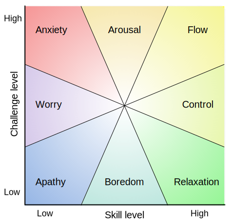

[Csikszentmihalyi [🔊](https://upload.wikimedia.org/wikipedia/commons/5/59/Mih%C3%A1ly_Cs%C3%ADkszentmih%C3%A1lyi.ogg), 1990]

---
# Referências

- Livro _Game Development Essentials: An Introduction, Third Edition_
  1. Capítulo 4: _Player Elements_
  1. Capítulo 5: _Story &amp; Character Development_
  1. Capítulo 6: _Gameplay_
