<!--
backdrop: super-mario-3d-world
bespokeEvent: bullets.disable
-->

# Introdução: _Level Design_, Equipes e Produção

## Baseadão nos slides do Prof. (Luiz) Chaimo(wicz) da UFMG

---
<!--
bespokeState: checkpoint
-->

# _Level Design_ (Projeto de Níveis/Fases)

## O que precisamos saber?

- **O que é _level design_** e qual sua relação com _gameplay_?
- Quais são as **características estruturais, temporais e espaciais** de um
  jogo?
- Como apresentar o desafio do jogo?

---
# _Level Design_

- É a **criação de ambientes, cenários ou missões** em um jogo digital
  - Um _level designer_ tipicamente usa ferramentas de _level design_: editores de mapas, de eventos etc.
    - Valve Hammer Editor (Valve Software)
    - UnrealEd (Epic Games)
    - World Builder (EA)
    - Aurora Toolset (Bioware)...
    - Tiled

---
# Estrutura

- Níveis, fases ou cenários podem ser usados para dar estrutura, organizar progressão e melhorar o _gameplay_
- Ao criar um nível, deve-se considerar seu fluxo, duração, disponibilidade, relacionamento e dificuldade
  - **Objetivos:** cada nível deve ter um conjunto de objetivos conhecido pelo jogador
    - Introduzir ao objetivo _e.g._ via tutorial interativo
  - **Fluxo (_flow_):** explicitar o progresso do jogador
    - Apenas passa de fase quando os objetivos se cumprirem
    - (_e.g._) Não permitir que volte pela porta que entrou

---
## Estrutura (2)

- **Duração:** quanto tempo passar em cada nível
  - Uma boa ideia é fazer com que seja possível "passar uma fase" em uma única sessão de jogo
    - Crianças: 15 minutos
    - Jogadores _hardcore_: 2+ horas
  - Em jogos com sessões gigantes (_e.g._, Civilization, Age of Mythology), crie marcos (_milestones_) para comunicar progresso
- **Disponibilidade:** quantos níveis devem estar "abertos" para o jogador primariamente e simultaneamente
  - Apenas um nível: bom para jogos FPS (imersão, _e.g._, Half-Life 2)
  - Alguns níveis/_quests_: bom para RPGs
  - Muitos níveis: bom para RTS e simuladores

---
## Estrutura (3)

- **Relacionamento:** qual é o relacionamento entre os níveis, _e.g._:
  - Sucessivos (Sonic)
  - Progressão de dificuldade (Bejeweled)
  - Episódico - auto-contidos (Warcraft 3)
- 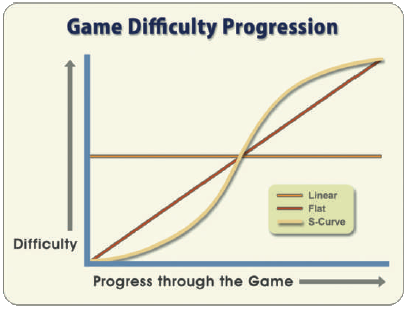
  **Progressão:** como aumentar a dificuldade ao longo dos níveis
  - _flat, linear, s-curve_
  - Ameaças devem ser comunicadas ao jogador, idealmente de formas sutis porém perceptíveis e "aprendíveis"

---
# Tempo

- **Autêntico:** jogos que usam a passagem de tempo real como recurso que afeta _gameplay_
  - Exemplo: Jogo Boktai do Game Boy Advance, que usa um sensor de luz para saber se vampiros estão fortes (noite) ou fracos (dia)

  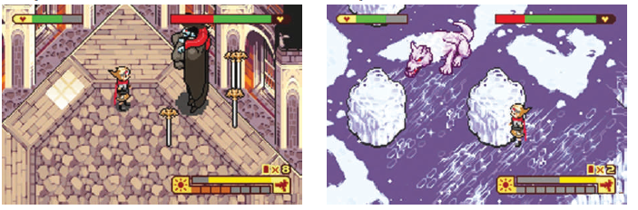

---
## Tempo (2)

- **Limitado:** parte da ambientação do jogo, mas não do _gameplay_
  - Uso de tarefas cronometradas
- **Variável:** jogos cujo tempo virtual podem variar sua velocidade - noites menores que dias, ou mesmo noites inexistentes
  - Exemplo: jogos de guerra

---
## Tempo (3)

- **Ajustado pelo jogador:** jogadores podem modificar o tempo associado aos níveis
  - Exemplo: jogos de esportes
- **Alterado:** tempo alterado (pausa, mais devagar, veloz, viagem no tempo) como um efeito de _gameplay_
  - Exemplo: Max Payne com _bullet time_

---
# Espaço

- Incorpora o ambiente físico do jogo (perpectiva, tamanho, limites,
  estruturas, terreno, objetos e estilo)
  - **Perspectiva e Câmera:** o ponto de vista em que o jogador é colocado em referência ao mundo de jogo
    - 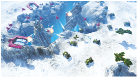
      **Onipresente:** habilidade de ver diferentes partes do mundo e tomar ações em qualquer lugar
    - **Aérea (_top-down_):** mostra o mundo de jogo como visto "por cima" do personagem. Exemplos: Pac-Man, Legend of Zelda

---
## Espaço (2)

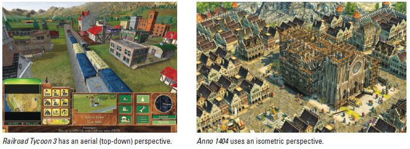

- **Perspectiva e Câmera:**
  - **Isométrico:** o jogador vê o mundo por um ângulo de 30 a 45°
    - Traz o jogador para "mais perto" que vista aérea
    - Artisticamente caro, se rotação é permitida (_e.g._, Sim City 2000)

---
## Espaço (3)

- **Perspectiva e Câmera:**
  - **Rolagem lateral (_side-scrollling_):** no espaço 2D, personagens se movem da esquerda para direita ou pulam para cima e caem
    - Costuma haver rolagem quando o cenário é maior do que o que pode ser visto em uma tela
    - Para dar sensação de profundidade (projeção perspectiva), foi criada a técnica de _parallax-scrolling_
    <iframe height='268' scrolling='no' src='//codepen.io/danbhala/embed/GJGQad/?height=268&theme-id=9685&default-tab=result' frameborder='no' allowtransparency='true' allowfullscreen='true' style='width: 100%;'>See the Pen <a href='http://codepen.io/danbhala/pen/GJGQad/'>8-Bit CSS3 Horizontal Parallax</a> by Dan Stuart (<a href='http://codepen.io/danbhala'>@danbhala</a>) on <a href='http://codepen.io'>CodePen</a>.
    </iframe>

---
## Espaço (4)

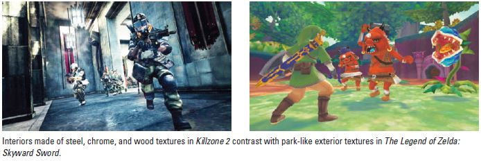

- **Terreno e Materiais:** os materiais influenciam o _look and feel_ do jogo
  - O modelo de sombreamento, as características dos materiais e a direção de arte definem os visuais

---
## Espaço (5)

- **Radiosidade e Efeitos:** radiosidade ou iluminação e outros efeitos visuais também compõem o espaço
  - 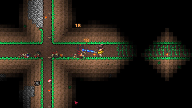
    Mesmo jogos 2D têm incorporado modelos de iluminação, tipicamente usados em jogos 3D
    - Exemplo: Terraria
- **Escala:** o tamanho do cenário e dos objetos no mundo de jogo pode não necessariamente ser realista
  - Exemplo: chaves e itens em jogos FPS
  - Pode-se distorcer o tamanho do mundo para que o jogador chegue mais rapidamente de um ponto ao outro do mundo
    - Exemplo: Final Fantasy VII

---
## Espaço (6)

- **Limites:** até onde é possível ir dentro do mundo
  - Em jogos RTS, tipicamente o mundo termina onde começa um vácuo negro :)
- **Realismo:** uso de dados e imagens do mundo real
  - Exemplo: Pokémon Go
- **Estilo:** comunica o sentimento geral do mundo de jogo, tentando evocar certos sentimentos ou sensações nos jogadores

  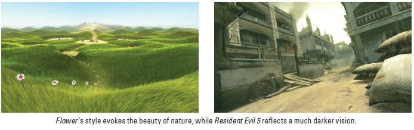

---
<!--
bespokeState: checkpoint
-->

# Cargos e Responsabi- lidades

## O que precisamos saber?

- Que **tipos de empresas existem** no negócio dos jogos digitais?
- Quais são as **responsabilidades de cada cargo** dentro de uma empresa?
- Que tipos de **técnicas e ferramentas** são usadas por cada membro da equipe?

---
<!--
  backdrop: jobs-blizzard
-->

[Vagas abertas na **Blizzard**](http://us.blizzard.com/en-us/company/careers/index.html) (!!)

---
# Papéis de Empresas

- **_Publisher_:** quem financia o jogo, faz o _marketing_ e distribui (vende)
  - _e.g._, Atari, Activision, EA, Ubisoft...
  - Várias tem o seu próprio time de desenvolvimento (_in-house development studio_)
- **_Developer (development studio)_:** quem desenvolve o jogo, desde a idéia, protótipo e produto final
  - _Third Party Developer_
    - _e.g._, Konami, Eidos, Liquid, ...
    - Estúdio _Indie_ (independente)

---
## Papéis de Empresas (2)

- Outros envolvidos:
  - **_Manufacturers_:** empresas que desenvolvem o console ou _hardware_ específico. Normalmente tem que aprovar o jogo e dar uma licença de desenvolvimento
  - **_Licensor_:** caso o jogo seja adaptado de alguma fonte (cinema, livro, etc) é necessário obter uma licença de direitos do autor

---
# Organização da Equipe

- Varia dependendo do tamanho da empresa, e de características próprias
- Divisões comuns
  - Produção
  - _Design_
  - Arte
  - Programação
  - Áudio
  - Teste &amp; QA (Quality Assurance)
  - _Marketing_

---
## Equipe - Produção

- Produtor
  - 
    “makes things happen”
  - Gerencia todo o processo, cronograma, orçamento, equipe, etc
  - Níveis:
    - Produtor Executivo, Produtor, Produtor Associado, ...
  - Externo x Interno

---
## Equipe - _Design_

- 
  
  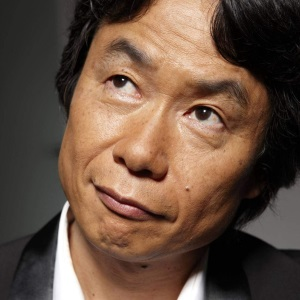
  _Game Designer_
  - Normalmente a mente criativa por trás do jogo
  - Definição do _gameplay_, enredo, níveis, interfaces, etc
- Posições relacionadas
  - _Creative Director_  (estilo, conteúdo)
  - _Design Director_ (aspectos de administração)
  - _Lead Designer_ (aspectos técnicos)
  - _Interface Designer_
  - _Level Designer_

---
## Equipe - Arte

- 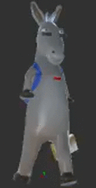
  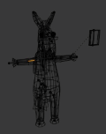
  
  Diretor de Arte
- _Lead Artist_
- Artista Conceitual
- Artista Técnico
- Modelador
- _Texture Artist_
- Animador

---
## Equipe - Programação

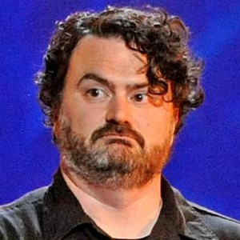

- Diretor Técnico
- _Lead Programmer_
- <ul class="multi-column-list-2">
    <li>_Engine Programmer_</li>
    <li>_Graphics Programmer_</li>
    <li>_Tools Programmer_</li>
    <li>_Network Programmer_</li>
    <li>_AI Programmer_</li>
    <li>_Audio Programmer_</li>
    <li>_Physics Programmer_</li>
    <li>_Interface Programmer_</li>
    <li>_Associate Programmer_</li>
    <li>_Gameplay Programmer_</li>
  </ul>

---

  <section style="border-right: 4px dotted silver;">
    <h2>Equipe - Áudio</h2>
    <figure  style="margin:auto;">
      
      <figcaption>**Yasunori Mitsuda** (Chrono Trigger, Xenogears/saga)</figcaption>
    </figure>
    <ul style="text-align: left">
      <li>Diretor de Áudio</li>
      <li>Compositor</li>
      <li>_Sound Designer_</li>
      <li>Dublador (_voiceover artist_)</li>
    </ul>
  </section>
  <section>
    <h2>Equipe - <abbr title="Quality Assurance">QA</abbr></h2>
    <figure style="margin:auto;">
      
      <figcaption>**Tommy Tallarico** (Video Games Live)</figcaption>
    </figure>
    <ul style="text-align: left">
      <li>_Testing Manager_</li>
      <li>_Lead Tester_</li>
      <li>_Gameplay Testers_</li>
      <li>_Compatibilidade / Formato_</li>
    </ul>
  </section>

---
<!--
bespokeState: checkpoint
-->

# Produção

## O que precisamos saber?

- Quais são as **etapas do desenvolvimento** de um jogo?
- Que **tipos de documentação** podemos/devemos usar?

---
<!--
  backdrop: oldtimes
-->
# Processo **Tradicional** (em cascata)

- O processo de desenvolvimento pode variar, mas é geralmente dividido
  nas seguintes fases:
  1. Conceito
  1. Pré-Produção
  1. Protótipo
  1. Produção
  1. _Release_ (_Alpha, Beta, Gold_)
  1. Pós-Produção

---
<!--
  backdrop: oldtimes
-->
## Fases: Conceito

- Essa fase começa com a **idéia do jogo** e termina quando decide-se
  realmente partir para o **planejamento do projeto**
  - Leva-se em consideração a idéia, mercado, público alvo,
    compatibilidade com a empresa, recursos de pessoal e financeiro, etc
- Nessa fase a equipe pode ser bem pequena

---
<!--
  backdrop: oldtimes
-->
## Fases: Pré-Produção e Protótipo

- Na **Pré-Produção se elabora a proposta e se planeja o desenvolvimento
  do jogo**
  - Aspectos que variam desde o _gameplay_, personagens, etc até o
    cronograma de execução
  - Elaboração do <u>Documento de Design</u> e de outros documentos auxiliares
    (_Style Guide_, _Production Plan_, etc)
- **Protótipo**:
  - _“A working **piece of software** that captures on-screen the **essence of
    what makes your game special**, what sets it apart from the rest, and
    **what will make it successful**”_
  - Fundamental para verificar viabilidade e vender a idéia

---
<!--
  backdrop: oldtimes
-->
## Fases: Produção

- Fase na qual **o jogo é realmente desenvolvido**
- Duração
  - Na média: 6 meses a 2 anos
  - “Crunch Time”  (ver [_EA spouse letter_](http://ea-spouse.livejournal.com/274.html))
- Necessidade de uma boa gerência e da constante interação entre as equipes
- Documentação técnica é constantemente consultada e modificada

---
<!--
  backdrop: oldtimes
-->
## _Releases_

- **Alpha**
  - **Versão jogável do início ao fim**, talvez faltando ainda alguns aspectos
    de arte e acessórios
  - Vai ser testado pela equipe de testes
  - Foco: remover _bugs_, finalizar e aparar arestas
- **Beta**
  - Versão **praticamente pronta**, que vai ser liberada para os
    _beta testers_, normalmente voluntários _off-house_
  - Foco: remover _bugs_, estabilizar, _performance tunning_
- **Gold**
  - Versão **liberada para o mercado**

---
<!--
  backdrop: oldtimes
-->
## Pós-Produção

- Dois focos: _Marketing_ e Manutenção
- _Marketing_
  - Propaganda
  - Lançamento
  - Sites, Comunidades
- Manutenção (e evolução)
  - _Patches_
  - _Updates_
  - Expansões
  - (depois de tudo: fazer o _post mortem_)

---
## Processo **Moderno**

1. Conceito, pré-produção e **protótipo** produzidos e colocados "à prova"
   em _play testing_
   - A ideia é pôr o jogo na mão de jogadores o quanto antes
   - Ideia: errar cedo para corrigir rápido
1. Desenvolvimento, reconceitualização, _marketing_ e distribuição contínua
   - Lançar desde a versão alpha
   - Pegar **_feedback_ dos jogadores** sempre
   - Fazer o _marketing_ **durante** o desenvolvimento
     - Ideia: envolver mídia especializada, YouTubers, Twitchers etc.
   - Manutenção contínua
     - Dependendo do sucesso
     - Construção de comunidade

---
<!--
  backdrop: oldtimes
-->
# Documentação **Tradicional**

- Não há padronização, mas vamos citar alguns:
  1. _Pitch Document_ (sumário executivo)
    - Até 5 páginas, mas deve ser o menor possível
  1. _Game Design Document_
  1. _Technical Design Document_

---
<!--
  backdrop: oldtimes
-->
# Sumário executivo

- Título
- _“The big idea”_
  - Um ou dois parágrafos com uma descrição geral do seu jogo (estória,
    personagens, mundos)
- Gênero &amp; Categoria
  - Determine o gênero do jogo, eventualmente comparando-o com outros existentes
- Plataformas, Licença
- _Play Mechanic_
  - _Gameplay_, controles, desafios

---
<!--
  backdrop: oldtimes
-->
## Sumário executivo (2)

- Tecnologia
  - _Engines_, _middlewares_, etc
- Público alvo
  - Quem vai jogar o seu jogo? Idade, sexo, tipo, etc...
- _Key Features / Unique Selling Points_ (USPs)
  - Quais são os elementos principais que fazem o seu jogo único, diferente
- _Marketing Summary_
  - Porque o jogo vai vender bem?

---
<!--
  backdrop: oldtimes
-->
# _Game Design Document_

- Objetivos:
  - **Descrever o jogo em detalhes**, aprofundando e esclarecendo as idéias
  - Guiar o desenvolvimento do jogo para todas as subequipes envolvidas
- Visão geral
  - Descrição do jogo, expansão da sinopse
  - Narrativa
  - História do jogo contada de maneira criativa e intrigante, descrevendo porque certos elementos existem e como se relacionam no mundo do jogo

---
<!--
  backdrop: oldtimes
-->
## _Game Design Document_ (2)

- Mecânica do jogo
  - _Core gameplay_ (experiência de interação)
  - Modos de jogo (regras)
  - Ações possíveis do jogador
  - Inteligência artificial proposta
- Personagens
  - Descrição detalhada dos personagens (perfil, comportamento,
    habilidades, papel na trama, esboço de sua aparência, controlável ou
    não, etc)

---
<!--
  backdrop: oldtimes
-->
## _Game Design Document_ (3)

- Objetos de cena
  - Elementos interativos: armas, veículos, poderes, itens
    - Características, esboços, funções, efeitos visuais e sonoros
  - Elementos decorativos
    - Esboços
- Cenários (_level design_)
  - Descrição de fases e seus objetivos
  - Estrutura de fluxo (evolução da dificuldade)
  - Descrição de desafios
  - Posicionamento de objetos e desafios (esboços)

---
<!--
  backdrop: oldtimes
-->
## _Game Design Document_ (4)

- Interface com o usuário
  - Diagrama de menus
  - Elementos indicativos (HUD)
    - Mini mapa, pontuação, energia, etc (posição na tela)
  - Mapeamento de teclas / botões
  - Configurações (volume, resolução, etc)

---
<!--
  backdrop: oldtimes
-->
## _Game Design Document_ (5)

- Arte
  - Estilo visual do jogo (_toon_, realista, futurista, etc)
    - Indicar referências para inspiração
  - Estilo sonoro do jogo
    - Indicar referências para inspiração
  - Lista de elementos a serem produzidos/coletados
    - Cenários, personagens, objetos interativos e decorativos, músicas,
      efeitos sonoros, texturas, sprites, HUD
    - Descrição dos efeitos especiais (opcional)

---
<!--
  backdrop: oldtimes
-->
# _Technical Design Document_

- Objetivos:
  - Descrever a estrutura interna do código do jogo a nível de classes
    (_e.g._, Diagramas UML)
  - Auxiliar na visualização do funcionamento do jogo e como os objetos
    se comunicam
- Diagramas de classe:
  - Gerenciamento de entrada (controles)
  - Gerenciamento de áudio
  - Gerenciamento de menus
  - Gerenciamento de vídeo (renderização)
  - Personagens, npcs e itens
  - Sistemas (colisão, iluminação, partículas)

---
<!--
  backdrop: oldtimes
-->
## _Technical Design Document_ (2)

- Diagramas de sequência:
  - _Loop_ principal - métodos
  - Menus e fluxo de janelas
  - Inicialização do jogo (_loading_)
  - Tratamento de colisão
  - Pontuação, alteração de atributos, evolução, etc
  - Inteligência artificial
  - Transição de fases
  - Persistência do mundo do jogo

---
# Documentação **Moderna** (1/2)

- [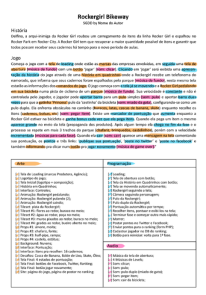][motta-trigueiro-large]
  [_Short Game Design Document_][motta-trigueiro] (Motta e Trigueiro, 2013)
  - Proposto para _advergames_ ou jogos de pequeno porte
  - Descrição (01 página)
- Passos:
  1. Descrever o enredo
  1. Descrever o jogo todo
  1. Destacar (1) arte, (2) mecânicas e (3) áudio
  1. Listar os _assets_
  1. Esboçar o _level design_

[motta-trigueiro]: http://www.sbgames.org/sbgames2013/proceedings/artedesign/15-dt-paper_SGDD.pdf
[motta-trigueiro-large]: ../../images/sgdd-motta-trigueiro-large.png

---
# Documentação **Moderna** (2/2)

- [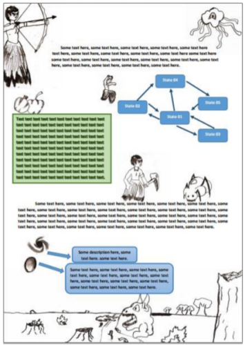][carvalho-gomes-large]
  [_Simple Game Design Document_][carvalho-gomes] (Carvalho e Gomes, 2016)
  - Baseado em Motta e Trigueiro (2013)
  - Contempla ilustrações e foco em _game play_

[carvalho-gomes]: http://www.sbgames.org/sbgames2016/downloads/anais/157232.pdf
[carvalho-gomes-large]: ../../images/sgdd-carvalho-gomes-large.png

---
# Referências

- Livro _Game Development Essentials: An Introduction, Third Edition_
  1. Capítulo 7: _Levels_
  1. Capítulo 10: _Roles &amp; Responsibilities_
  1. Capítulo 11: _Production &amp; Management_
