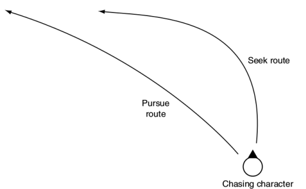

<!--
backdrop: movement
-->

# IA: Movimentação

---
<!--
backdrop: white
-->


---
# Roteiro

1. Introdução à movimentação de entidades
1. Algoritmos de movimentação cinemática
1. Algoritmos de movimentação dinâmica


---
<!--
bespokeState: checkpoint
-->

# Movimentação de Personagens

## O que precisamos saber?

- Como dar comportamentos de movimentação para inimigos
- Como movimentar o personagem de forma automatizada
- Como evitar obstáculos no caminho

---
<!--
backdrop: white
-->

## **Movimentação** como um **Algoritmo**


- Exemplos de algoritmos: buscar, fugir, vagar, interceptar

---
## **Movimentação** como um **Algoritmo** (cont.)

- 
  Exemplos de algoritmos: buscar, fugir, vagar, interceptar
  - **_Input_**: posição atual
    - Opcionais:
      1. Posição do jogador (para buscar)
      1. Posição do tiro do jogador e sua velocidade (interceptar)
      1. Posição e tamanho dos obstáculos (desvio)
  - **_Output_**: a nova velocidade/orientação da entidade

---
## Movimento Cinemático _vs_ Dinâmico

- Em alguns jogos, supomos aceleração perfeita:
  - A entidade assume a velocidade desejada instantaneamente, sem aceleração
  - Nesses, usamos a **movimentação cinemática**
- N'outros, temos aceleração
  - O algoritmo de movimentação tem como output uma aceleração (ou uma força)
  - Nesses, usamos o **movimentação dinâmica**
    - 
      Vários algoritmos formalizados por Craig Reynolds (criador dos _boids_)
    - _Steering behaviors_ ➡️ "formas de condução"

---
## A **pose** do objeto


- **Pose** do objeto: posição e orientação (para onde está olhando)
- Em jogos 2D:
  - Posição: vetor2d (x, y)
  - Orientação: ângulo

---
## A **pose** do objeto (cont.)

- 
  Em jogos 2D:
  - Posição: vetor2d (x, y)
  - Orientação: ângulo
- Em jogos 3D (na maioria), também usamos poses como em 2D
  - A posição y costuma ser apenas uma função do terreno
- Em jogos com movimentação 3D mesmo (aviação, espacial, submarinos) é mais
  complexo
  - Pose tem 6 variáveis (3 para posição, 3 ângulos)


---
## A **pose** do objeto: cinemática _vs_ dinâmica

- Na **movimentação cinemática**, a configuração do objeto
  como uma **pose**: (a) sua posição e (b) para onde ele está
  "olhando"
  ```ruby
  struct Pose:
    position      # (a) um vetor 2D, mesmo quando em 3D
    orientation   # (b) um escalar com um ângulo
  ```
- Na **movimentação dinâmica**, a pose também possui a (c) velocidade linear
  e a (d) angular
  ```ruby
  struct Pose:
    #...
    velocity      # (c) um vetor 2D com velocidade linear
    rotation      # (d) um escalar rad/s
  ```

---
## Orientação como um vetor

- 
  Pode ser útil representar uma orientação como um vetor em vez de um escalar
  - Por exemplo, para movimentar "para a frente"
- Orientação <span class="math">\omega_{s}</span> em radianos pode ser
  expressa em vetor como:
  <div class="math">\vec{\omega_v} = \begin{bmatrix} \sin(\omega_s) \\\ \cos(\omega_s) \end{bmatrix}</div>


---
## Orientação independente do movimento

- Muitos algoritmos de movimentação ignoram a orientação
  - (2D) Personagem pode andar para a direita, olhando para cima
- Nesse caso, atualizamos a orientação de acordo com a velocidade
  ```ruby
  def lookTowardsVelocity(speed):
    if velocidade.length() > 0:
      orientation = atan2(speed.y, speed.x)
  ```
  - Mas isso não é natural...
  - 
    Podemos interpolar a orientação atual com a desejada:


---
## Integrando velocidade e aceleração (1ª forma)

```ruby
struct Pose:
  # membros aqui...
  # ...

  # atualiza a pose, de acordo com o direcionamento
  #  (steering) dado pelo algoritmo e o Δt
  def update(steering, time)
    # atualiza a posição e a orientação
    position += velocity * time
                + 0.5 * steering.linear * time * time  
    orientation += rotation * time
                + 0.5 * steering.angular * time * time

    # e as velocidades linear e angular
    velocity += steering.linear * time
    orientation += steering.angular * time
```

---
## Integrando velocidade e aceleração (Newton-Euler)

```ruby
struct Pose:
  # membros aqui...
  # ...

  # atualiza a pose, de acordo com o direcionamento
  #   (steering) dado pelo algoritmo e o Δt
  def update(steering, time)
    # atualiza a posição e a orientação
    position += velocity * time     # :)
    orientation += rotation * time  # :)
    # Δt é muito pequeno, Δt² menor ainda


    # e as velocidades linear e angular
    velocity += steering.linear * time
    orientation += steering.angular * time
```

---
<!--
bespokeState: checkpoint
-->

# Movimentação Cinemática

## O que precisamos saber?

- Como fazer uma entidade ir até um ponto
- Como fazê-la fugir de um ponto
- Como fazê-la vagar aleatoriamente

---
## Algoritmo: **Buscar** (_seek_)

```ruby
class KinematicSeek:
  # a pose do objeto que está movimentando e do seu alvo
  character
  target
  # velocidade máxima do objeto
  maxSpeed

  def getSteering()
    # cria uma estrutura que representa o output do algoritmo
    steering = new KinematicSteeringOutput()

    # determina a direção da velocidade
    steering.velocity = target.position - character.position

    # ajusta a velocidade para ter a magnitude da
    #   velocidade máxima
    steering.velocity.normalize()
    steering.velocity *= maxSpeed

    # ajusta a orientação para olhar na direção da velocidade
    character.orientation.lookTowardsVelocity(steering.velocity)

    # retorna o direcionamento dado pelo algoritmo
    steering.rotation = 0
    return steering
```

---
## Algoritmo: **Fugir** (_flee_)

- É possível adaptar o **Buscar** para **Fugir**:
  ```ruby
  # no Buscar:
  steering.velocity = target.position - character.position

  # no Fugir: pega o sentido inverso da velocidade
  steering.velocity = character.position - target.position
  ```

---
## Algoritmo: Chegar (_arrive_)

- O **Buscar** tem problemas quando o objeto precisa parar
  - Ele vai _full speed_ e pode ir além do ponto objetivo (_overshoot_)
  - Fica indo e voltando em torno do ponto
- O **Chegar** é uma adaptação que corrige isso. Duas opções:
  1. Fazer objetivo ter um raio e parar ao entrar no círculo
  1. Ajustar a velocidade na medida que se aproxima do objetivo


---
## Algoritmo: Chegar - código
```ruby
class KinematicArrive:
  # a pose do objeto que está movimentando e do seu alvo
  character
  target
  # velocidade máxima do objeto
  maxSpeed
  # raio de satisifação para se atingir o objetivo
  radius
  # tempo para atingir o objetivo
  timeToTarget = 0.25

  def getSteering()
    # (igual) cria uma estrutura que representa o output
    #   do algoritmo
    steering = new KinematicSteeringOutput()
    # (igual) determina a direção da velocidade
    steering.velocity = target.position - character.position

    # verifica se está no raio de satisfação
    if steering.velocity.length() < radius:
      # já está dentro do raio...
      return None
    # queremos ir até o objetivo em timeToTarget segundos
    steering.velocity /= timeToTarget
    # se estiver rápido demais, limita à maxSpeed
    if steering.velocity.length() > maxSpeed:
      # ajusta a velocidade para ter a magnitude da
      #   velocidade máxima
      steering.velocity.normalize()
      steering.velocity *= maxSpeed

    # (igual) ajusta a orientação para olhar na direção
    #   da velocidade
    character.orientation.lookTowardsVelocity(steering.velocity)
    # (igual) retorna o direcionamento dado pelo algoritmo
    steering.rotation = 0
    return steering
```

---
## Algoritmo: Vagar (_wander_)

- 
  Faz a entidade vagar, em direções "aleatórias"
- Temos que ter cuidado para sortear a nova direção
- Precisamos ajustar gentilmente a orientação corrente
  - Podemos usar uma função que tende a manter a orientação
    ```ruby
    def randomBinomial():
      return random() - random()
    ```
    - [Veja o desenho da distribuição](http://jsfiddle.net/fegemo/o4r3nu78/2/)

---
## Algoritmo: Vagar - código

```ruby
class KinematicWander:
  # a pose do objeto que está movimentando
  character
  # velocidade máxima
  maxSpeed
  # velocidade angular máxima
  maxRotation

  def getSteering():
    # cria uma estrutura que representa o output do algoritmo
    steering = new KinematicSteeringOutput()

    # velocidade na direção da orientação
    steering.velocity = maxSpeed
                        * character.getOrientationAsVector()

    # altera a orientação, bem pouquinho, aleatoriamente
    steering.rotation = randomBinomial() * maxRotation

    # retorna o direcionamento
    return steering
```

---
<!--
bespokeState: checkpoint
-->

# Movimentação Dinâmica (_Steering Behaviors_)

## O que precisamos saber?

- Como movimentar a entidade sem alterar sua velocidade diretamente
- Adaptando os algoritmos cinemáticos para dinâmicos
- Como evitar obstáculos
- Como compor algoritmos

---
## Princípios da Movimentação Dinâmica

- É o que usamos para jogos de corrida (sempre), e em outros gêneros
- Têm como:
  - **_input_**: a pose do objeto + velocidades
    - + outras coisas, dependendo do algoritmo
  - **_output_**: acelerações linear e angular
- Exemplos: Buscar, Fugir, Chegar, Alinhar, Separar, Evitar obstáculos
  - Cada algoritmo faz apenas 1 coisa, mas é possível combiná-los

---
## Algoritmo: **Buscar/Fugir** Dinâmico

```ruby
class Seek:
  # pose do objeto e do alvo
  character
  target
  # aceleração máxima do objeto
  maxAcceleration

  def getSteering():
    # saída do algoritmo
    steering = new DynamicSteeringOutput()

    # determina a direção/sentido até o alvo
    steering.linear = target.position - character.position
    # para Fugir Dinâmico, inverter o sentido ⬆️

    # aceleração máxima nesse sentido
    steering.linear.normalize()
    steering.linear *= maxAcceleration

    # retorna o direcionamento
    steering.angular = 0
    return steering
```

---
## Limitando a velocidade

- Para evitar _overshooting_, limitamos a velociade (simulando atrito)
  - Isso é feito na `struct Pose`, no `def update(steering, time)`:
    ```ruby
    def update(steering, maxSpeed, time):
      # acha a nova posição...
      # ...
      # e as novas velocidade e orientação
      velocity += steering.linear * time
      orientation += steering.angular * time

      # (novo) verifica se a velocidade excedeu o máximo
      if velocity.length() > maxSpeed:
        velocity.normalize()
        velocity *= maxSpeed
    ```

---
## Buscar _vs_ **Chegar**


- O **Buscar Dinâmico** tem o mesmo problema que o cinemático para alvos
  estacionados
  - Precisamos definir um **Chegar Dinâmico**

---
## Algoritmo: **Chegar Dinâmico** (_arrive_)

- Similar ao Chegar Cinemático, mas agora precisamos desacelerar sem controlar
  a velocidade diretamente
- Temos 2 raios:
  - `targetRadius`: distância mínima até o alvo que **interrompemos
    o movimento**
  - `slowRadius`: distância até o alvo a partir de onde **começamos a
    desacelerar**

---
## Algoritmo: **Chegar Dinâmico** - código

```ruby
class Seek:
  # pose do objeto e do alvo
  character
  target
  # aceleração máxima do objeto
  maxAcceleration
  # distância do objetivo que estamos satisfeitos
  targetRadius
  # distância do objetivo onde começamos a frear
  slowRadius

  def getSteering():
    # saída do algoritmo
    steering = new DynamicSteeringOutput()

    # determina a direção/sentido até o alvo
    direction = target.position - character.position
    distance = direction.length()

    # já chegamos próximo o suficiente?
    if distance < targetRadius:
      return None

    # se estamos fora do slowRadius, velocidade máxima
    if distance > slowRadius:
      targetSpeed = maxSpeed
    # se estamos começando a desacelerar, escalamos a vel.
    else:
      targetSpeed = maxSpeed * distance / slowRadius

    # targetVelocity tem o sentido e o tamanho da velocidade
    targetVelocity = direction
    targetVelocity.normalize()
    targetVelocity *= targetSpeed

    # aceleração tenta atingir a velocidade alvo
    steering.linear = targetVelocity - character.velocity
    steering.linear /= timeToTarget

    # limita a aceleração até o valor máximo para o objeto
    if steerting.linear.length() > maxAcceleration
      steering.linear.normalize()
      steering.linear *= maxAcceleration

    # retorna o direcionamento
    steering.angular = 0
    return steering
```

---
## Outros Algoritmos Dinâmicos

- **Algoritmo: Alinhar** (_align_)
  - Altera apenas a orientação - vai rotacionando até chegar na
    orientação do alvo
  - Similar ao **Chegar**, mas para orientação
    - Diferença importante: ângulos são periódicos em <span class="math">2\pi</span>
- **Algoritmo: Equiparar velocidade** (_match velocity_)
  - Acelera para igualar à velocidade de um alvo
  - Pouco útil sozinho, mas pode compor outros comportamentos
  - É uma versão mais simples do **Chegar** (desconsiderar a distância
    até o alvo)

---
## Problemas com _Buscar_


- Está sempre um passo atrás...
- E se quisermos **Perseguir**??
  - Precisamos <u>prever a posição do alvo</u>

---
## **Algoritmos Delegativos**

- Vimos os algoritmos básicos: **Buscar**, **Fugir**, **Chegar**, **Alinhar**
- Outros algoritmos <u>calculam uma posição ou orientação alvo</u> e, então
  <u>delegam a execução</u> para um algoritmo básico
  - Exemplos: **Perseguir/Evadir**, **Vagar**, **Evitar colisão**,
    **Evitar obstáculos**

---
## Algoritmo: **Perseguir Dinâmico** (_pursue_)



---
## Algoritmo: **Perseguir Dinâmico** (cont.)

- Olha para a velocidade do alvo e prevê **onde ele estará daqui a x
  segundos**, **supondo que ele mantém a velocidade**:
  1. Determina a posição futura do alvo
  1. Delega para **Buscar Dinâmico**
- Em termos de OO, podemos fazer `Perseguir extends Buscar`
- Analogamente, **Evadir** delega para **Fugir**

---
## Algoritmo: **Vagar Dinâmico** (_wander_)


- **Vagar Cinemático** poderia ter variações bruscas no sentido ocasionalmente
- **Vagar Dinâmico** corrige isso:
  1. Sorteia uma posição em um círculo à frente do objeto
  1. Delega para **Buscar**

---
## Outros Algoritmos Delegativos

- 
  **Algoritmo: Evitar colisões**
  - Mais complexo
  - Determina o ponto de maior proximidade
  - Delega para **Evadir**
- **Algoritmo: Evitar obstáculos**
  - **Evitar colisões** assume todo mundo é círculo/esfera
  - Mas obstáculos podem ter formas não aproximáveis
  - Usamos _ray casting_ para detectar colisão futura

---
## Combinando algoritmos

- Podemos ter um personagem que quer:
  1. atingir um objetivo
  1. evitando bater nos outros personagens
  1. evitando perigos do ambiente
  1. evitando bater nas paredes
- Há duas abordagens:
  1. **Mesclar** os comportamentos com **pesos**; ou
  1. **Arbitrar** que comportamento terá prioridade

---
## Possíveis problemas

- Mínimos locais (equilíbrio instável):

  
- Passagens estreitas:

  
- **Solução**: planejamento de trajetórias (próxima aula!) + movimentação

---
# Referências

- Livro _Artificial Intelligence for Games, Second Edition_
  - Capítulo 3: _Movement_
