<!--
  backdrop: redinha
-->

# Jogos em Rede
---
# Roteiro

- Jogos _multiplayer_
- Fundamentos de redes
- Tipos de Arquiteturas
  1. Cliente-servidor
  1. _Peer-to-peer_
  1. Multi-servidor
- Técnicas para **compensação de latência**

---
# Jogos _multiplayer_

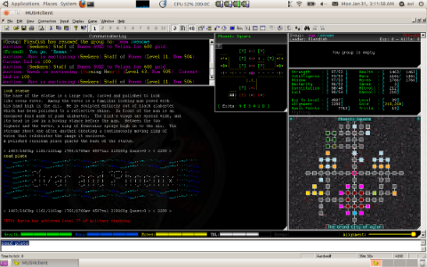

- _Multi-User Dungeons_ (MUDs)
  - São os avós dos MMOs (usavam arquitetura cliente-servidor)
  - Sem limite de jogadores

---
## História dos jogos _multiplayer_

<ul class="multi-column-inline-list-2">
  <li>
    <figure class="polaroid item-250w">
      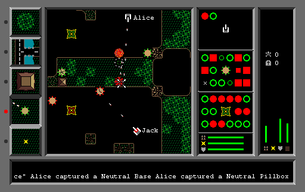
      <figcaption>Bolo (1987)</figcaption>
    </figure>
    <ul>
      <li>Provavelmente o primeiro jogo gráfico em rede</li>
    </ul>
  </li>
  <li>
    <figure class="polaroid item-250w">
      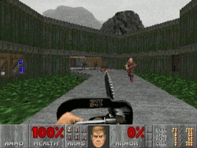
      <figcaption>Doom (1993)</figcaption>
    </figure>
    <ul>
      <li>Até 4 jogadores em rede local</li>
      <li>Arquitetura _peer-to-peer_ usando _broadcast_</li>
      <li>Saturação da rede</li>
    </ul>
  </li>
</ul>

---
## História dos jogos _multiplayer_ (3)

- Quake (1996)
  - <figure class="polaroid item-300w right">
      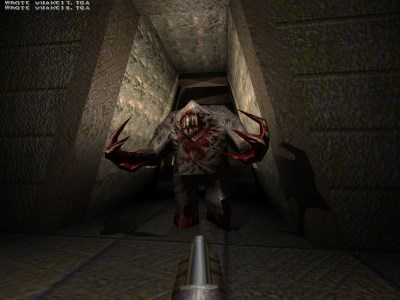
      <figcaption>Quake (1996)</figcaption>
    </figure>
    Servidores permanentes (sala de espera)
  - Arquitetura **cliente-servidor na Internet**
    - Novo problema: **latência**
    - Solução: **predição no cliente**

---
## História dos jogos _multiplayer_ (4)

- <figure class="polaroid item-300w right">
    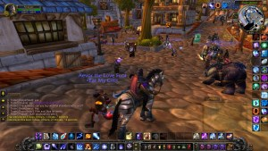
    <figcaption>WoW (2005)</figcaption>
  </figure>
  <abbr title="World of Warcraft">WoW</abbr> (2005)
  - Rede de servidores - cada um exercendo um papel
  - Multi-servidores em _shards_
  - Em 2009:
    - 13.250 servidores
    - 12.000.000 de contas

---
# Fundamentos de Redes

---
## Fundamentos de Redes

- Rede de computador:
  - Um **grupo de 2+ computadores** (ou dispositivos) conectados
  - A comunicação é feita enviando-se dados em pequenas porções, denominadas
    **pacotes**
- Características:
  - **Alcance da rede**:
    - LAN (_local-area network_): _e.g._, sala ou num prédio
    - WAN (_wide-area network_): _e.g._, um bairro, uma cidade,
      estado, país ou no mundo inteiro
  - **Protocolo**: regras de comunicação combinadas entre os computadores
    - _E.g._, <abbr title="Transmission Control Protocol"></abbr>TCP,
      <abbr title="Internet Protocol">IP</abbr>,
      <abbr title="User Datagram Protocol">UDP</abbr>,
      <abbr title="File Transfer Protocol">FTP</abbr>,
      <abbr title="Hipertext Transfer Protocol">HTTP</abbr>,
      <abbr title="Rafael Starling Protocol :)">RSP</abbr>
  - **Arquitetura**: estrutura de papéis dos computadores na rede. _E.g._,
    _peer-to-peer_, cliente-servidor

---
## Principais conceitos

- **Nó**: um computador (ou dispositivo) que compõe a rede
- **IP**: endereço de um nó (_e.g._, 194.26.4.80)
  - Mas também é o principal protocolo da camada de rede
- **Pacote**: um pedaço de informação transferida de um nó a outro
  - Tipicamente, um pacote é enviado para uma tupla [IP, porta] (_e.g._,
    [192.168.1.2, 8008])
  - IP: endereço de destino
  - **Porta**: número (1-65535) que identifica <u>o programa no computador
    de destino</u> que deve receber o pacote
- **Servidor**: um nó que oferece algum serviço (_e.g._, armazenar dados,
  controlar a lógica de jogo, guardar uma lista de "salas de jogos" abertas)
- **Cliente**: um nó que solicita serviços a um servidor

---
## Como estudamos redes de computadores?

- Há 2 modelos possíveis, um mais acadêmico (OSI) e outro mais prático (TCP/IP)

  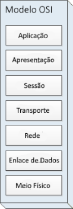
  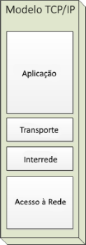
  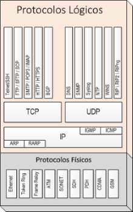

---
## Camadas: **Física** (1) e de **Enlace** (2) (_Link_)

- Camada **física**:
  - É o meio por onde os dados são transmitidos
  - _E.g._, cabo de par trançado, cabo coaxial, ar (_wireless_)
- Camada **de enlace**:
  - Coloca os dados em **quadros** (_frames_) e garante uma transmissão sem erros
  - Exemplo de protocolo: **Ethernet**
  - Place de rede (<abbr title="Network Interface Card">NIC</abbr>):
    é quem implementa o protocolo
  - NIC possui um identificador único chamado **endereço
  <abbr title="Media Access Control">MAC</abbr>**

---
## Camada: de **Rede** (3)

- Camada de **rede**:
  - **Entrega pacotes** de um computador a outro, **mesmo fora da mesma rede**
  - Faz roteamento, controle de fluxo, segmentação de dados e controle de erro
  - Exemplo de protocolo: Protocolo de Interrede (<abbr title="Internet Protocol">IP</abbr>)
- Endereços IP:
  - Endereço é composto por **4 bytes**, tipicamente mostrados como **decimais separados por pontos**: **192.168.15.5**
  - Nova versão: IPv6 (16 bytes)

---
## Camada: de **Transporte** (4)

- Camada de **transporte**:
  - **Transparência na transferência de dados** entre computadores
  - Controle de **fluxo** e **recuperação de erro**
  - Torna a comunicação mais **confiável**
  - Usa conceito de portas, além dos endereços IP
  - Exemplos de protocolos: TCP e UDP
- Portas
  - São "endereços" para aplicações executando em um computador
    - Cada aplicação "escuta" por mensagens enviadas em uma porta
  - _E.g._, FTP: 21, HTTP: 80

---
## Protocolos **TCP** e **UDP**

- Características do **<abbr title="Transmission Control Protocol">TCP</abbr>**:
  - **Transferência ordenada**: cada pacote recebe um número de sequência e é reordenado quando é recebido
  - **Sem erros**: usa _checksum_ para verificar se dados foram corrompidos
  - **Retransmissão de pacotes perdidos**: caso o receptor não acuse recebimento
  - **Evitação de congestionamento**
  - **Descarte de pacotes duplicados**
- Características do **<abbr title="User Datagram Protocol">UDP</abbr>**: protocolo **sem estabelecimento de conexão**
  - **Sem garantia de entrega**
    - "Envia e esquece" os pacotes
    - Pode entregar fora de ordem
    - Pode não entregar

---
## TCP _vs_ UDP

- TCP resolve vários problemas que o UDP não resolve
- Contudo, há o preço de desempenho que precisa ser pago
  - De que adianta receber a posição de um personagem 1s depois dele já ter andado?
- Regra geral:
  - Para **situações de tempo real**, usamos **UDP**
    - _E.g._, atualização de posição de personagens
    - Daí escolhemos quais problemas realmente precisamos resolver e resolvemos nós mesmos
  - Para **sistemas com menor restrição de tempo**, usamos **TCP**
    - _E.g._, mensagens de _chat_, sala de espera, jogo em turnos

---
## Camadas: de **Sessão** (5) e **Apresentação** (6)

- Camada de **sessão**:
  - Gerencia **conexões entre aplicações**
- Camada de **apresentação**:
  - Gerencia formatação dos dados diferente entre dos dois pontos da comunicação
- **Socket**: ferramenta para comunicação em rede de baixo nível (sessão para baixo)
  - Funções da API de um _socket_:
    - `Criar(TipoConexao tcpOuUdp)`
    - `Conectar(Endereco ip, int porta)`
    - `EnviaFluxoDeDados(byte[] dados)` para TCP
    - `EnviaTransmissao(byte[] dados)` para UDP
- **O que enviar**? Depende do jogo... será feito na **camada de aplicação**!

---
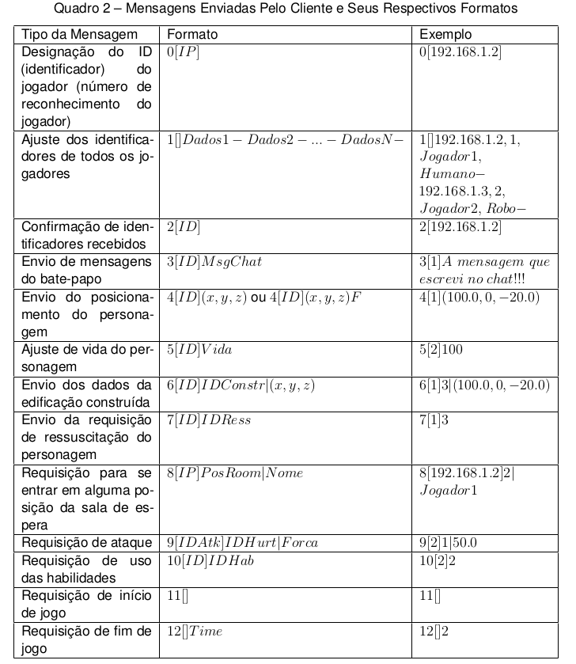

---
# Tipos de Arquiteturas

---
## Arquitetura **Cliente-Servidor**

- Cada jogador (cliente) comunica com o servidor
- Pros:
  - **Escalável**, normalmente requer menos banda
  - Mais fácil para **persistência de dados**
- Cons:
  - **Gargalo** no servidor
  - Falha no servidor causa **indisponibilidade**
- Tipos de clientes:
  - **_Thin client_**: toda simulação ocorre no servidor, bom para clientes "fracos"
  - **_Simulation client_**: maior parte ocorre no servidor

---
## Arquitetura **_Peer-to-Peer_**

- Cada jogador (computador) comunica **diretamente** com **todos os outros**
- Pros:
  - Baixa latência
  - Robusto, tolerante a falhas
- Cons:
  - Requer banda muito alta
  - _Trade-off_ entre persistência e redundância de dados

---
## Arquitetura **Multi-Servidor**

- Muitos **servidores distribuídos**, cada um atentendo a um **subconjunto dos clientes**
- Pros:
  - **Latência reduzida**
  - **Alta escalabilidade**
  - Mais **tolerência a falhas**
- Cons:
  - Difícil **manter consistência** inter-servidor
- Possíveis tipos:
  1. _Shards_
  2. _Mirrors_
  3. _Grids_

---
## Tipos de **Multi-Servidor**: **_Shards_**

- **_Shards_**: cada servidor simula uma **instância diferente** do mundo
  - Cada jogador joga em apenas 1 instância e não influencia as outras
  - Pouquíssimo tráfego entre servidores
- 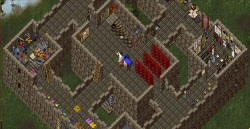
  Origem do nome: _"different images of the world, trapped in the shattered shards
of a mystic gem"_ (**Ultima Online**)
- Exemplos:
  - Ultima Online (1997)
  - Neverwinter Nights
  - World of Warcraft (2005): _realms_

---
## Arquitetura do **<abbr title="World of Warcraft">WoW</abbr>**

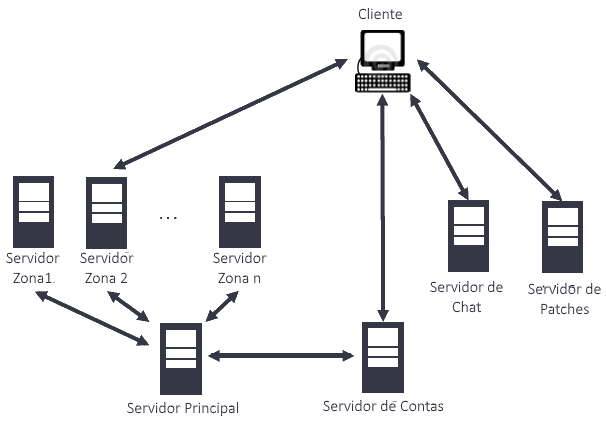

---
## Tipos de **Multi-Servidor**: **_Mirrors_**

- **_Mirrors_**: cada servidor **espelha/replica o mesmo mundo**
- Visão comum do mundo
- Tráfego bem alto inter-servidores para **sincronizar**
- 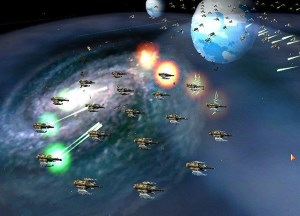
  Exemplos:
  - Mankind (1998)
  - PlanetSide (2003)

---
## Tipos de **Multi-Servidor**: **_Grids_**

- 
  Cada servidor mantém **uma região diferente** do mesmo mundo
- Servidores conversam com outros próximos
- Jogadores são **transferidos de um servidor a outro** quando chegam no **limite da região**
- Boa **escalabilidade** para mundos muito grandes
- Dificuldade de **balancear a carga**
- Exemplo: Second Life (2003)

---
# Compensação de Latência

---
## O problema de latência

- Toda **informação recebida** já está **desatualizada**
- **Atrasos** são variáveis e **imprevisíveis**
- Uma implementação _naïve_:

  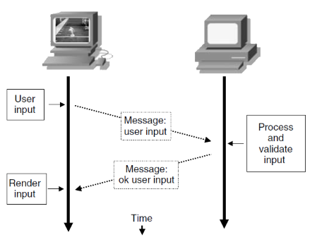

---
## Predição do Jogador

- Em vez de esperar pela resposta do servidor, aplica o resultado do _input_ e corrige a posteriori, caso necessário

  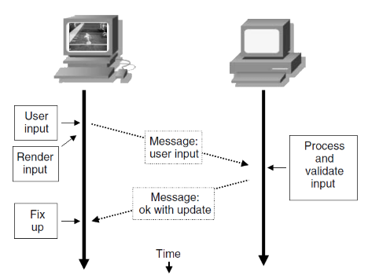

---
## Predição de NPCs/outros jogadores

- Extrapola as novas configurações do jogador baseado na última informação (_e.g._, posição + velocidade)

  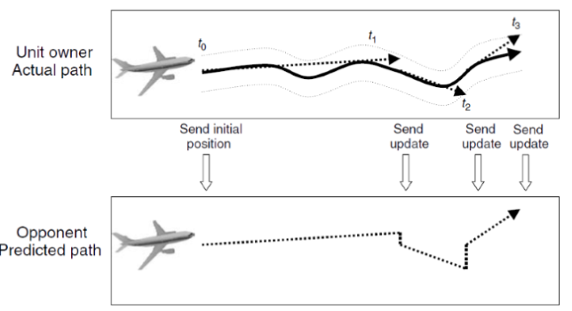

---
## Predição com Interpolação

<iframe width="640" height="480" src="https://www.youtube.com/embed/A4RfSNtUu6c" frameborder="0" allowfullscreen></iframe>

---
# Referências

- Livro _Networking and Online Games_
  - Capítulo 2: _Understanding and Engineering Multiplayer Internet Games_
  - Capítulo 4: _Basic Internet Architecture_
  - Capítulo 6: _Latency Compensation Techniques_
- [Artigo _Game Servers: UDP vs TCP_](https://1024monkeys.wordpress.com/2014/04/01/game-servers-udp-vs-tcp/)
- [Artigo sobre o "WoW Universe"](http://www.gamasutra.com/php-bin/news_index.php?story=25307)
  na GDC Austin (2009)
- Breve descrição da [rede do Quake 3](http://trac.bookofhook.com/bookofhook/trac.cgi/wiki/Quake3Networking)
