<!--
backdrop: pathfinder
bespokeEvent: bullets.disable
-->

# IA: _Pathfinding_ usando Grafos

---
## Roteiro

- Introdução a _Pathfinding_
- Algoritmo de Dijkstra
- Algoritmo A*

---
<!--
bespokeState: checkpoint
-->

# Introdução a _Pathfinding_
## O que precisamos saber?

- Como podemos acabar com problema de **mínimos locais**?
- É possível **planejar um caminho a priori** em vez de agir reativamente?
- **Onde** se encaixa o **planejamento de caminhos** na arquitetura de IA?
- Como que **estrutura de dados** posso **representar grafos**?

---
## O Problema do **Mínimo Local**

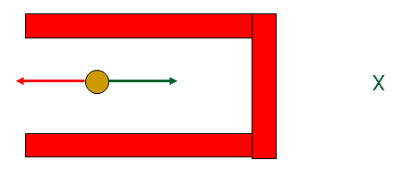

- Somatório de forças é nulo em uma posição que não é o mínimo da função potencial
  - Soluções
    - Aplicar forças randômicas
    - **Planejar o caminho**

---
## Motivação

- 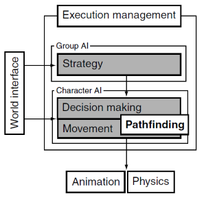
  Casos de uso:
  - Uma unidade de jogo RTS pode ser ordenada a **ir a qualquer ponto
    do mapa a qualquer momento**
  - Uma patrulha em jogo _stealth_ pode precisar **ir para** o ponto de alarme
    **mais próximo** para chamar reforços
  - Um jogo de plataforma pode ter oponentes que **perseguem o jogador por um
    abismo usando as plataformas disponíveis**

<p class="note" style="width: 70%;">
  **_Pathfinding_**: encontrar um caminho até um objetivo, escolhido na fase
  de tomada de decisão
</p>

---
## Motivação (2)

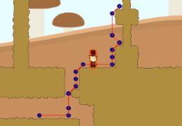
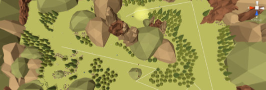

- Premissa do _pathfinding_: precisamos **representar o espaço do jogo de uma
  forma mais simples** - em especial, usamos **um grafo**

---
## O que é um **grafo**

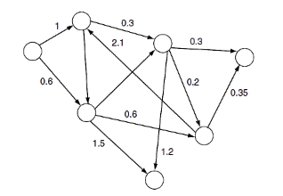

- É uma **estrutura matemática** normalmente representada em diagrama
- Consiste de **nós** (ou vértices) e **conexões** (arestas)
- Podem ser usados como **estrutura de dados** em uma miríade de problemas em
  Ciência da Computação (_e.g._, **_pathfinding_**)

---
## Características de um grafo


- O cenário precisa ser representado por um grafo com **pesos não-negativos**
  e **direcionado** (<abbr title="Directed non-Negative Weighted Graph">DnNWG</abbr>)
  - 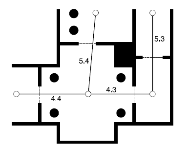
    **Nó**: representa uma região do cenário como uma sala, um pedaço do
    corredor, uma plataforma etc.
  - **Conexão**: representa que regiões estão conectadas
  - **Peso**: de uma conexão define o **custo** do personagem fazer aquele percurso
      - Pode estar relacionado à **distância, ao tempo, a uma combinação**
        dos dois etc.

---
## Estrutura de dados grafo

```ruby
class Graph:
  # Retorna array de conexões (da classe Connection)
  # que saem de um dado nó
  def getConnections(fromNode)

class Connection:
  # Retorna o custo (não-negativo) da conexão
  def getCost()

  # Retorna o nó de onde esta conexão veio
  def getFromNode()

  # Retorna o nó para onde está conexão leva
  def getToNode()
```
- Os nós podem ser identificados por simplesmente um número único

---
<!--
bespokeState: checkpoint
-->

# O <u>Algoritmo de Dijkstra</u>
## O que precisamos saber?

- Como podemos **determinar o caminho menos custoso** de um nó a outro?
- **Como funciona** o algoritmo de Dijkstra?
- Dijkstra **desempenha melhor** quando a **solução está próxima**?

---
## Edsger Dijkstra

- 
  Cientista da computação holandês (1930-2002)
- Propôs um **algoritmo para determinar o menor caminho** de um nó do grafo
  até todos os outros (1959)
  - Isso foi durante seu doutorado
- Primeiro a **xingar o GOTO** (1968):
  - _"A Case against the GO TO Statement"_
- Recebeu prêmio Turing em 1973 por contribuições na linguagem ALGOL
- Pesquisou e deu boas contribuições também na área de sistemas distribuídos
  - Foi ele quem **definiu e cunhou o termo _deadlock_**, por exemplo

---
## O problema

- Dado **um grafo** (DnNWG) **e dois nós** (inicial e objetivo), queremos
  **descobrir um caminho entre eles** de forma que o **custo** total é o
  **menor possível**

  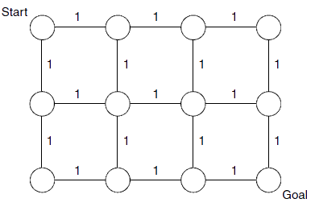
  - Neste caso, há 10 caminhos diferentes com o mesmo custo
    - Qualquer caminho desses vale
  - **Queremos a lista de conexões** usadas, e não de nós

---
## O Algoritmo de Dijkstra

- É **completo** (se existe um caminho, acha) e **ótimo** (o caminho é o menor)
- Fornece o menor custo de um nó para todos os outros
- Idéia geral:
  - Vai **navegando em largura** no grafo, mantendo um valor de "custo mínimo
    até agora" (_cost-so-far_) para cada nova aresta percorrida
  - Um vértice é considerado fechado quando o caminho de custo mínimo até
    ele foi encontrado

---
## Exemplo de Execução de Dijkstra

[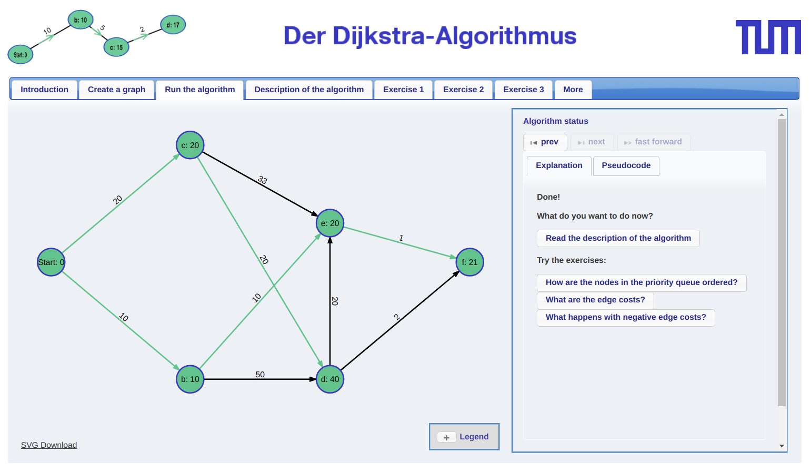](http://optlab-server.sce.carleton.ca/POAnimations2007/DijkstrasAlgo.html)
- Fonte: [Carleton University](http://optlab-server.sce.carleton.ca/POAnimations2007/DijkstrasAlgo.html)

---
## O Algoritmo de Dijkstra (2)

- Funciona em iterações e trabalha, a cada iteração, em 1 **nó (corrente)**
- A **cada iteração**:
  - Considera as **conexões que saem do nó corrente**
    - Calcula o **_cost-so-far_** (ou _g-cost_) para cada conexão
    - Seleciona o <u>próximo(?)</u> nó a expandir

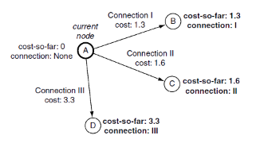
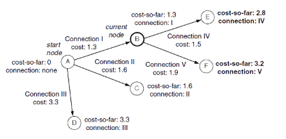

---
## O Algoritmo de Dijkstra (3)

- O algoritmo mantém uma lista de nós abertos e outra de nós fechados:
  - **Abertos**: nós que foram vistos, porém ainda não tiveram sua iteração
    como "nó corrente"
  - **Fechados**: nós que já foram processados
- Lista de **abertos** começa com o nó inicial
- Lista de **fechados** começa vazia
- A cada iteração, **é escolhido o nó aberto <u>com menor
  _cost-so-far_</u>**
  - **Ao processar** esse próximo nó, ele **passa de aberto a <u>fechado</u>**
- O algoritmo termina quando a **lista de abertos está vazia**
  - Mas podemos terminar antes: ao **fecharmos o nó objetivo**

---
## Pseudo-código

```ruby
Push inicial em ABERTOS
While (ABERTOS != [])
  Pop melhor nó n from ABERTOS # expandindo n
  if (n == objetivo) return caminho(n, objetivo)
  for each child of n: # gerando filhos
    Push/Update value on ABERTOS/FECHADOS
  Push n in FECHADOS
return SEM CAMINHO
```
```ruby
If child on ABERTOS, and new cost is less
  Update cost and parent pointer
If child on FECHADOS, and new cost is less
  Update cost and parent pointer, move
    node to ABERTOS
Otherwise
  Push to ABERTOS list
```

---

```ruby
def pathfindDijkstra(graph, start, end):

  # This structure is used to keep track of the
  # information we need for each node
  struct NodeRecord:
    node
    connection
    costSoFar

  # Initialize the record for the start node
  startRecord = new NodeRecord()
  startRecord.node = start
  startRecord.connection = None
  startRecord.costSoFar = 0

  # Initialize the open and closed lists
  open = PathfindingList()
  open += startRecord
  closed = PathfindingList()

  # Iterate through processing each node
  while length(open) > 0:

    # Find the smallest element in the open list
    current = open.smallestElement()

    # If it is the goal node, then terminate
    if current.node == goal: break

    # Otherwise get its outgoing connections
    connections = graph.getConnections(current)

    # Loop through each connection in turn
    for connection in connections:

      # Get the cost estimate for the end node
      endNode = connection.getToNode()
      endNodeCost = current.costSoFar + connection.getCost()

      # Skip if the node is closed
      if closed.contains(endNode): continue

      # .. or if it is open and we’ve found a worse
      # route
      else if open.contains(endNode):

        # Here we find the record in the open list
        # corresponding to the endNode.
        endNodeRecord = open.find(endNode)

        if endNodeRecord.cost <= endNodeCost:
          continue

      # Otherwise we know we’ve got an unvisited
      # node, so make a record for it
      else:
        endNodeRecord = new NodeRecord()
        endNodeRecord.node = endNode

      # We’re here if we need to update the node
      # Update the cost and connection
      endNodeRecord.cost = endNodeCost
      endNodeRecord.connection = connection

      # And add it to the open list
      if not open.contains(endNode):
        open += endNodeRecord

    # We’ve finished looking at the connections for
    # the current node, so add it to the closed list
    # and remove it from the open list
    open -= current
    closed += current

  # We’re here if we’ve either found the goal, or
  # if we’ve no more nodes to search, find which.
  if current.node != goal:

    # We’ve run out of nodes without finding the
    # goal, so there’s no solution
    return None

  else:

    # Compile the list of connections in the path
    path = []

    # Work back along the path, accumulating
    # connections
    while current.node != start:
      path += current.connection
      current = current.connection.getFromNode()

    # Reverse the path, and return it
    return reverse(path)
```

---
##  Algoritmo de Dijkstra

- Complexidade: <span class="math">O((V+E)* log(V))</span>
- Problema:
  - [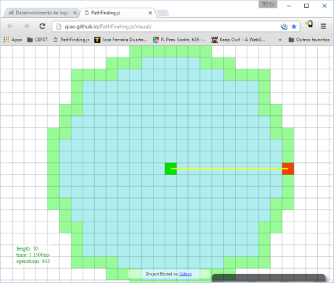](http://qiao.github.io/PathFinding.js/visual/)
    Há _fillers_ demais - **perde-se tempo buscando em lugares distantes
    da solução**
  - Podemos tentar **dar uma dica** falando _e.g._ em que direção está a solução
    - Dica = Heurística

---
<!--
bespokeState: checkpoint
-->

# O <u>Algoritmo A*</u> (estrela)
## O que precisamos saber?

- Como **otimizar** o algoritmo de **Dijkstra**?
- O que é a **heurística "distância de Manhattan"**?
- Há outras **herísticas admissíveis** por aí?

---
## Dijkstra _vs_ A*

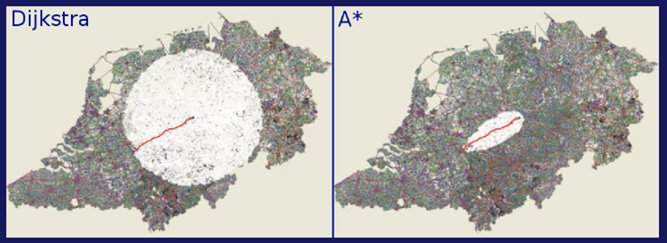

---
## Algoritmo A*

- Um dos **algoritmos <u>mais utilizados</u> em jogos** para fazer o **planejamento
  de trajetórias**
- Algoritmo de pesquisa em grafos no qual o próximo nodo a ser pesquisado
  é escolhido com o **auxílio de uma função heurística**
  - Normalmente envolve ter um conhecimento prévio sobre o problema
- Algoritmo de “busca com informação”: _informed search_

---
## Algoritmo A* (2)

- A escolha do próximo nó a ser investigado é feita
  considerando-se:

  <div class="math">f(n) = g(n) + h(n)</div>
  - <span class="math">g(n)</span>: **custo de chegar ao nó atual** (_cost-so-far_)
  - <span class="math">h(n)</span>: **estimativa** do custo do **nó atual
    para o gol**
- Portanto, <span class="math">f(n)</span> vai ser a estimativa do de custo
  da melhor solução que passa por <span class="math">n</span>

---
## Exemplo de Execução do A*

- Estamos na Romênia e queremos navegar entre **Arad (inicial) e Bucarest
  (objetivo)**
- Possuímos um mapa com as estradas e respectivas distâncias entre cada
  cidade (grafo)
- A **heurística** usada vai ser a <u>distância em linha reta</u> (i.e.,
  distância Euclidiana) entre qualquer cidade e Bucarest (objetivo)

---
## A* - Exemplo

<figure class="picture-steps clean right">
  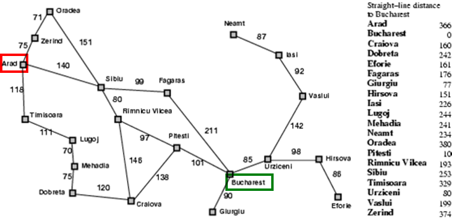
  
  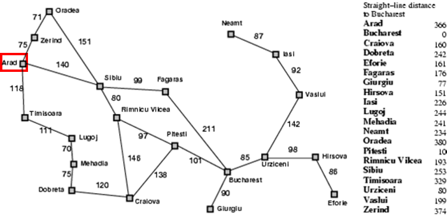
  
  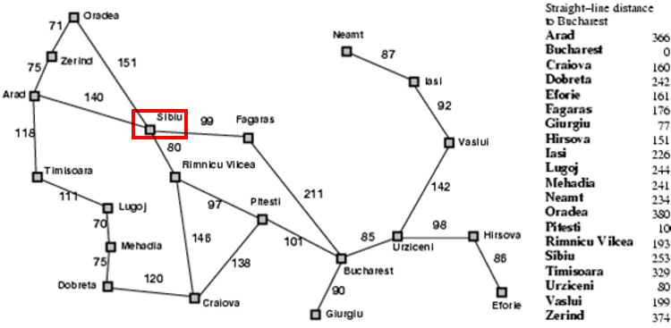
  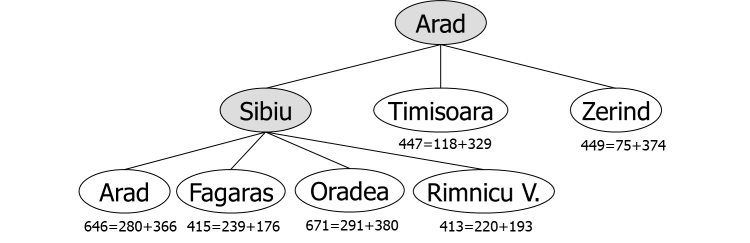
  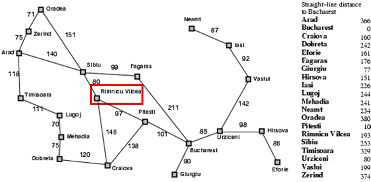
  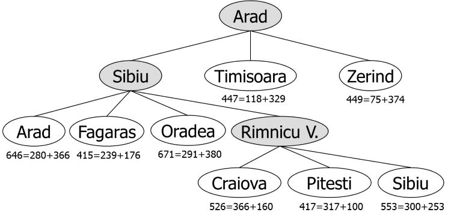
  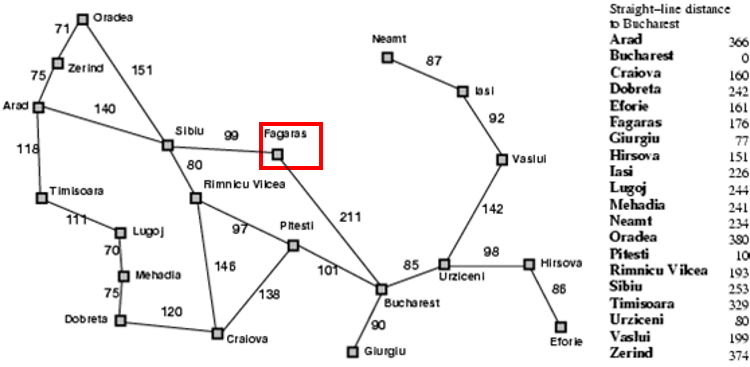
  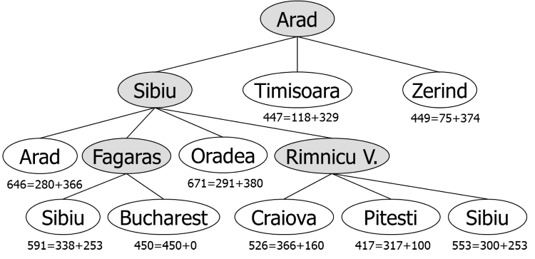
  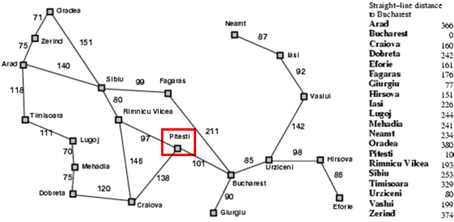
  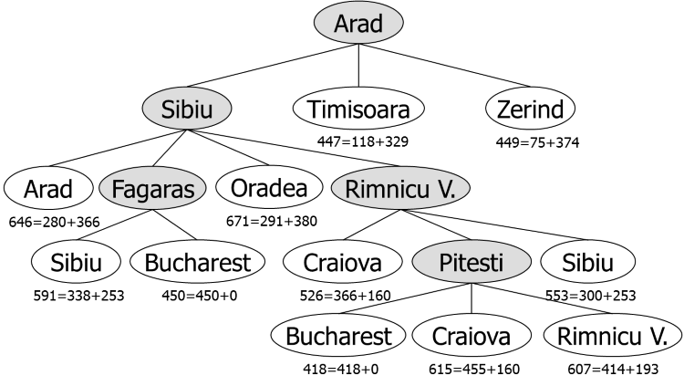
</figure>

---
## Algoritmo A*

- Provadamente fornece a solução ótima se a **<u>heurística é admissível</u>**
  - **Custo** indicado pela **heurística** é <u>menor ou igual ao custo real
    </u> para o gol
  - No exemplo, a distância direta entre duas cidades é sempre menor ou
    igual a distância através das estradas. Logo, a solução encontrada é ótima
- Complexidade depende da heurística
  - Pior caso é exponencial no tamanho da solução

---
## Heurísticas Admissíveis

- Heurística é admissível se:
  `h(n)` <= `h*(n)` em que `h*(n)` é o custo real a partir de `n`
- Exemplos:
  - **Distância Euclidiana** (espaço contínuo)
  - **Distância de Manhattan** (espaço discreto)
    - 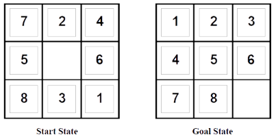
      `h1(n)` = número de quadrados trocados
      `h2(n)` = distância de Manhattan total
        (_i.e._, número de quadrados a partir da posição desejada para cada espaço)
    - `h1(S) = 6`
    - `h2(S) = 4+0+3+3+1+0+2+1 = 14`

---
## Outros detalhes

- O custo (valor da aresta) pode incluir informações como tipo de terreno, etc
  - Estrada x Pântano
  - Essa informação é colocada a priori
- E para informações dinâmicas?
  - Ex. Caminho que não passa pelo inimigo
  - Uso de Mapas de Influência
    - Valor que vai ser dinamicamente somado ao custo

---
# Referências

- Livro _Artificial Intelligence for Games, Second Edition_
  - Capítulo 4: _Pathfinding_ (4.1, 4.2, 4.3)
- Animações do Algoritmo de Dijkstra
  - [Carleton University](http://optlab-server.sce.carleton.ca/POAnimations2007/DijkstrasAlgo.html)
  - [University of San Francisco](https://www.cs.usfca.edu/~galles/visualization/Dijkstra.html)
  - [Visualgo.net](http://visualgo.net/sssp.html)
- Animações do Algoritmo A*
  - [PathFinding.js](http://qiao.github.io/PathFinding.js/visual/)
