<!-- { "layout": "title" } -->
# Renderização em Tempo Real (parte 1)

---
<!-- { "layout": "centered" } -->
## Roteiro

1. [Grafo de cena](#grafo-de-cena)
1. [_Level of Detail_](#level-of-detail)
1. [Pós-processamento](#pos-processamento)
1. [Efeitos complexos](#efeitos-complexos)

---
<!-- { "layout": "section-header", "slideClass": "grafo-de-cena", "slideHash": "grafo-de-cena" } -->
# Grafo de Cena

---
<!-- { "layout": "regular" } -->
# Uma cena de jogo (1/2)

::: figure .centered
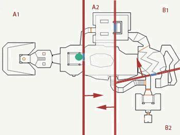
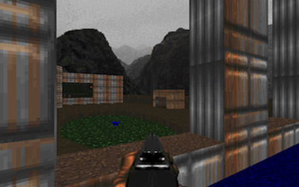
:::

- **Mundos** de jogo podem ser **bem grandes**
- A **maior parte da cena** tipicamente está **fora do _frustum_** da câmera

---
<!-- { "layout": "regular" } -->
# Uma cena de jogo (2/2)

- Deixar que a **GPU recorte** a cena <u>toda</u> pode ser **custoso**
  - Devemos tentar **enviar para renderização** apenas os objetos que podem
    **estar no _frustum_**
  - Precisamos de uma **estrutura de dados** para armazenar os objetos da cena:
    1. De forma estruturada e organizada
    1. **Armazenando informação espacial** dos objetos para otimizar a
      renderização
- Podemos usar um **grafo de cena** (tipicamente uma árvore) para tornar fácil
  **descartar partes da cena** que estejam **fora do _frustum_**

---
<!-- { "layout": "regular" } -->
# Grafo de Cena

- 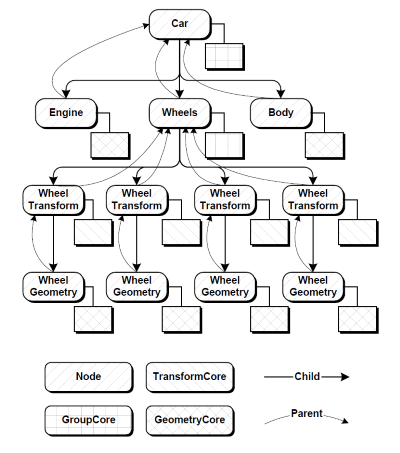 <!-- {.push-right} -->
  Segundo Akenine-Müller, é uma:

  Estrutura em árvore, "orientada ao usuário", que armazena
  a geometria da cena, mas também texturas, transformações, níveis de
  detalhamento, fontes de luz etc. <!-- {.note.info style="max-width: 50%"} -->
- Para desenhar a cena, basta percorrer a árvore chamando `this.renderiza()` em
  cada nó.

---
<!-- { "layout": "regular" } -->
# Grafo de Cena **na Unity**

::: figure .centered
 <!-- {.push-left} -->
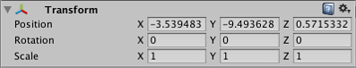 <!-- {.push-right} -->
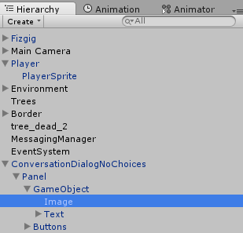 <!-- {.push-right} -->
:::

---
<!-- { "layout": "regular" } -->
# <u>Otimização</u>: **_Frustum Culling_**

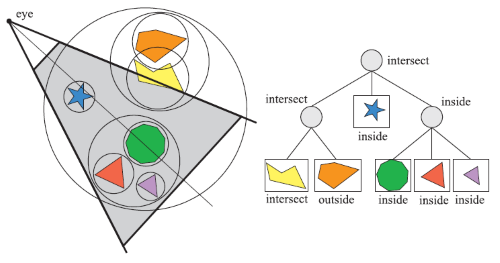 <!-- {p:.centered} -->

- Particiona-se o espaço (_e.g._, _grid_, _octree_) ou a cena
  (_e.g._, BVH) de forma amostral
- Testa-se cada partição contra o _frustum_ (de forma barata)
- É possível podar a árvore usando a informação espacial

*[BSP]: Binary Space Partitioning*
*[BVH]: Bounding Volume Hierarchy*

---
<!-- { "layout": "regular" } -->
# Exemplo de **_Frustum Culling_**

<iframe width="640" height="480" src="https://www.youtube.com/embed/fNa_Gh5gFWY" frameborder="0" allowfullscreen class="centered"></iframe>

---
<!-- { "layout": "regular" } -->
# <u>Otimização</u>: **_Occlusion Culling_**

::: figure .centered
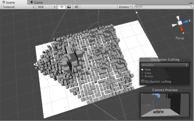

:::

- Ideia: **não desenhar** objetos que estão **atrás de outros** (que são opacos)
- Implementação no espaço: (a) de imagem (projeção), (b) de objeto, (c) de raio
- Recentemente: **_occlusion queries_** feitas no **_hardware_**
  - Rasteriza objeto _off-screen_ e compara com o _z-buffer_

---
<!-- { "layout": "regular" } -->
# Escolhendo Grafo de Cena + Otimização

- A escolha da estrutura de dados e técnica(s) de otimização dependem
  do "problema" (normalmente, do estilo de jogo). Por exemplo:
  1. **Jogo de luta**: dois personagens lutando em um ringue com ambiente
    estático (exclua Mortal Kombat aqui)
    - Não é necessário otimizar
  1. **Jogo de RTS**: terreno aproximadamente plano, com visão aérea
    - Grafo de cena com uma _quadtree_, fazendo _frustum culling_
  1. **Jogo com câmera FP**: cenário com alta densidade de objetos grandes
    - Grafo de cena com _octree_, fazendo _frustum_ + _occlusion culling_
  1. **Jogo com câmera FP**: cenário mais esparso
    - Grafo de cena com _octree_, fazendo _frustum culling_ apenas

---
<!-- { "layout": "section-header", "slideClass": "level-of-detail" } -->
# _Level of Detail_ (LOD)

---
<!-- { "layout": "regular" } -->
# Nível de Detalhamento (LOD)

- 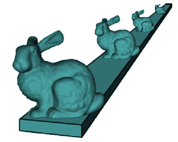 <!-- {.push-right} -->
  _Level of detail_ involve reduzir a complexidade de um objeto a ser
  renderizado ao passo que ele se distancia da câmera ou outra métrica:
  - importância,
  - velocidade relativa ao espaço da câmera, etc.
- Usando LOD, usamos mais memória (RAM) em troca de menos
  trabalho no _pipeline_ gráfico (menos vértices) sendo
  transformados/iluminados
- A qualidade visual reduzida do modelo tipicamente não é notada porque
  o efeito é reduzido pela distância ou velocidade

---
<!-- { "layout": "regular" } -->
# Tipos de LOD

- 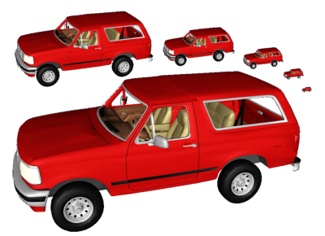 <!-- {.push-right} -->
  **Discreto**:
  - Construir um número finito de modelos com número de polígonos
  variando
- **Contínuo**:
  - Codificar um espectro contínuo de detalhes de baixo a alto
- **Dependente da visualização**:
  - Ajustar detalhes do modelo de acordo com o _viewpoint_

---
<!-- { "layout": "regular" } -->
# LOD **Discreto**

- Abordagem mais simples:
  - Em tempo de execução, apenas o modelo adequado é selecionado e renderizado
- Pros:
  - Funciona bem com as GPUs atuais (_display list_)
  - Mais rápido que LOD contínuo (modo imediatista)
- Cons:
  - Possibilidade de _popping_ durante a troca de nível

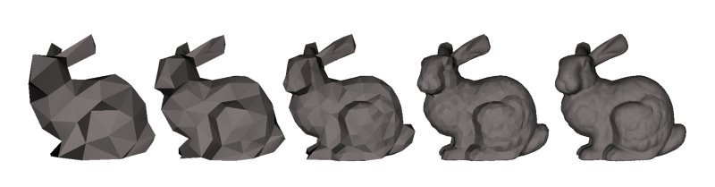 <!-- {p:.centered} -->

---
<!-- { "layout": "regular" } -->
# Problema: _popping_

<iframe width="640" height="360" src="https://www.youtube.com/embed/KfeFcZDjCRg?rel=0" frameborder="0" allowfullscreen class="centered"></iframe>

- Exemplo do jogo Arma 2 (2009)

---
<!-- { "layout": "regular" } -->
# LOD **Contínuo**

- O LOD discreto constrói um número finito de visões
  estáticas do objeto
- O LOD contínuo constrói **uma estrutura de dados a partir da qual extrai-se
  um modelo no nível desejado** em tempo de execução
  - Usa-se, para tanto, os **_shaders_ de geometria e tecelagem**
- Pros:
  - Maior fidelidade ao modelo
  - Melhor granularidade
- Cons:
  - Mais caro

---
<!-- { "layout": "regular" } -->
# LOD Contínuo: Exemplo

<iframe width="480" height="360" src="https://www.youtube.com/embed/2IMyQUTv9Vk?rel=0" frameborder="0" allowfullscreen class="centered"></iframe>

---
<!-- { "layout": "regular" } -->
# LOD **Dependente da Visualização**

- 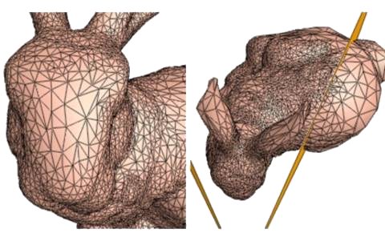 <!-- {.push-right} -->
  É um tipo especial de LOD contínuo que considera o ângulo de visualização
- O algoritmo aloca polígonos onde são mais necessários baseado na câmera
- Pros:
  - Objetos grandes são bem melhor amostrados onde estão sendo visualizados

---
<!-- { "layout": "regular" } -->
# LOD **Dependente da Visualização**: Exemplo

<iframe width="640" height="360" src="https://www.youtube.com/embed/Gmp-WbfF8b8?rel=0" frameborder="0" allowfullscreen class="centered"></iframe>

- Liktor et al (2014): [_Fractional Reyes-Style Adaptive Tessellation for Continuous Level of Detail_](http://cg.ivd.kit.edu/FracSplit.php)

---
<!-- { "layout": "regular" } -->
# LOD de **Texturas: _Mipmapping_**

- 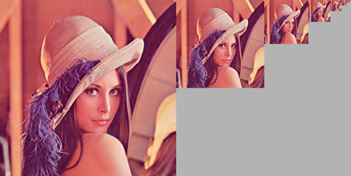 <!-- {.push-right} -->
  A técnica de _mipmapping_ de texturas também é LOD
  - **Reduz _aliasing_** causado por filtragem de redução pobre quando
    **uma textura grande é aplicada a uma região pequena da tela**
- [Exemplo de CG](http://fegemo.github.io/cefet-cg/classes/textures/#33)

---
<!-- { "layout": "section-header", "slideClass": "pos-processamento", "slideHash": "pos-processamento" } -->
# Pós-processamento

- Conceito
- Renderização multipasso
- Efeitos simples

---
<!-- { "layout": "regular" } -->
# Renderização multipasso

- O pipeline gráfico é o processo que gera imagens a partir da descrição geométrica da cena:
  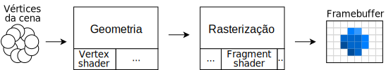 <!-- {.centered style="margin-bottom: 1em;"} -->
- É possível "renderizar para uma textura", em vez de escrever
  no _framebuffer_ padrão
- Sendo assim, é possível desenhar _offscreen_, gerando uma textura em memória,
  depois renderizar normalmente usando esse resultado. Possibilidades:
  1. **Espelhos/retrovisor**: <!-- {strong:.alternate-color} -->
     1. Põe câmera dentro do espelho <!-- {ol^0:.multi-column-list-2} -->
     1. Desenha para textura
     1. Volta câmera
     1. Desenha usando a textura no espelho
  1. Efeitos de **pós-processamento**


---
<!-- { "layout": "regular", "slideClass": "compact-code-more" } -->
# Pós-processamento

- É a renderização em 2 passos, com o segundo aprimorando o primeiro: <!-- {ul:.bulleted.layout-split-2} -->
  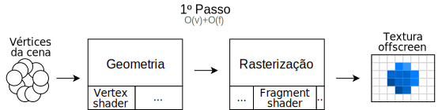 <!-- {.centered} -->
  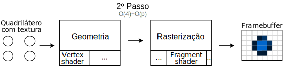 <!-- {.centered} -->
- Em OpenGL, podemos desenhar em um FBO, depois para o _framebuffer_ padrão
  ```c
  void desenha() {
      // 1º passo: renderização normal,
      // mas para o FBO
      fbo.begin();
      desenhaCenario();
      desenhaPersonagem()
      fbo.end()
      
      // 2º passo: efeito de pós-processamento,
      // usando shader específico,
      // gerando framebuffer padrão
      glUseProgram(shaderPosProcessamento);
      glClear(GL_COLOR_BUFFER_BIT);
      glBindTexture(fbo.getTexture());
      desenhaQuadrilatero();
      glFlush();
  }
  ```

*[FBO]: Framebuffer object

---
<!-- { "layout": "regular" } -->
# Efeitos de pós-processamento

1.  <!-- {style="height: 150px"} -->
   ## Transformações radiométricas
   - ➡️ Inverter cores <!-- {ul:style="order:2; text-align: center; padding: 0;"} -->
   - ➡️ Escala de cinza
   - ➡️ Vignette
1. 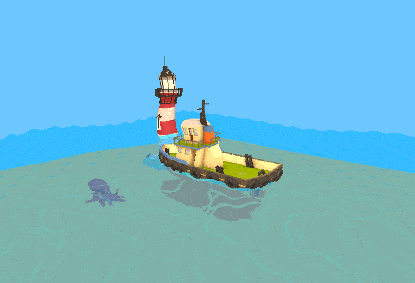 <!-- {style="height: 150px"} -->
   ## Transformações geométricas
   - ➡️ Turbilhão <!-- {ul:style="order:2; text-align: center; padding: 0;"} -->
   - ➡️ Deslocamento
   - ➡️ Afim por partes
1. 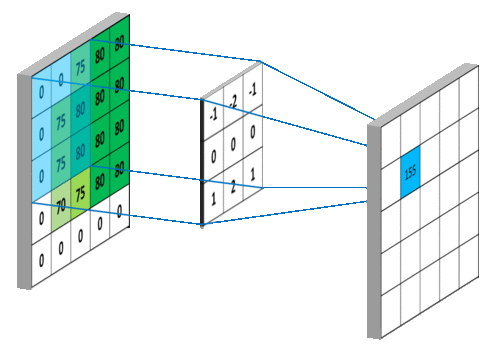 <!-- {style="height: 150px; border: 1px solid silver; margin: 0;"} -->
   ## Convoluções
   - ➡️ Borrão <!-- {ul:style="order:2; text-align: center; padding: 0;"} -->
   - ➡️ Aguçamento
   - ➡️ Detecção de bordas <!-- {ol:.card-list} -->

---
<!-- { "layout": "regular" } -->
# Transformações **radiométricas** (de cor)

- Alteram a cor dos pixels da imagem: <span class="math">Cor_{nova}=T_r(Cor)</span> <!-- {ul:.no-margin} -->

Inverter cores: <!-- {dl:.full-width.no-margin.bulleted} -->
  ~ <span class="math">Cor_{nova}=1-Cor</span>

Escala de cinza:
  ~ <span class="math">Cor_{nova}=(tom,tom,tom)</span>
    <div class="layout-split-2 full-width" style="justify-content: space-around">
      <span class="math" style="font-size: 0.75em">tom=0.33\textcolor{ff8888}{r}+0.33\textcolor{33bb33}{g}+0.33\textcolor{8888ff}{b}</span> ou 
      <span class="math" style="font-size: 0.75em">tom=0.2989\textcolor{ff8888}{r}+0.5879\textcolor{33bb33}{g}+0.1140\textcolor{8888ff}{b}</span>
    </div>

Preto e branco:
  ~ <div class="math" style="font-size: 0.75em">Cor_{nova}=\begin{cases}1&\text{se }tom\geq0.5\\0&\text{do contrário}\end{cases}</div>

Sépia:
  ~ <span class="math">Cor_{nova}=M_{sepia}\times C</span>
    <div class="math" style="font-size: 0.75em;">M_{sepia}=\begin{bmatrix}0.393&0.769&0.189\\0.349&0.686&0.168\\0272&0.534&0.131\end{bmatrix}</div>


*[RGB]: Red, green e blue*

---
<!-- { "layout": "regular" } -->
# Transformações **geométricas**

- Altera a posição dos pixels da imagem: <span class="math">Cor_{P}=Cor_{T^{-1}_g\(P\)}</span>, em que <!-- {ul:.no-margin} -->
  - <span class="math">T_g\(P\)</span> transforma as coordenadas de um pixel
  - <span class="math">T^{-1}_g\(P\)</span> é a inversa dessa transformação <!-- {ul:.no-margin} -->

Deslocamento: <!-- {dl:.full-width.bulleted.no-margin} -->
  ~  <!-- {.push-right style="max-width: 200px"} -->
    <div class="math" style="font-size: 0.75em">P(t)=\begin{bmatrix}P_i+\sin(t)\\P_j+\cos(t)\end{bmatrix}</div>

Rotação:
  ~ <div class="math" style="font-size: 0.75em">R(\theta)=\begin{bmatrix}\cos(\theta)&-\sin(\theta)\\\sin(\theta)&\cos(\theta)\end{bmatrix},R^{-1}(\theta)=\begin{bmatrix}\cos(-\theta)&-\sin(-\theta)\\\sin(-\theta)&\cos(-\theta)\end{bmatrix}</div>
  ~ <div class="math" style="font-size: 0.75em">P=R^{-1}(P)</div>
  ~ <div class="math" style="font-size: 0.75em">Cor_P=Cor_{R^{-1}(P)}</div>

Afim p/ partes:
  ~ [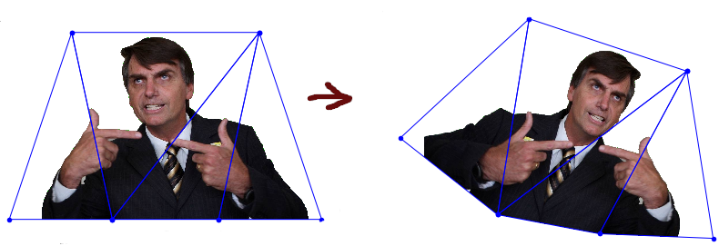](../../images/piecewise-affine.png) <!-- {.push-right style="max-width: 300px"} --> <!-- {a:target="_blank"} --> trabalho [_chroma key_][chroma-key] <!-- {target="_blank"} -->

[chroma-key]: https://github.com/fegemo/chroma-key/blob/master/verdade.ipynb

---
<!-- { "layout": "regular" } -->
# Convoluções (1/2)

-  <!-- {.push-right style="cursor: pointer; max-height: 290px" onclick="this.src=this.src.endsWith('gif')?(this.src.substr(0,this.src.length-3)+'png'):(this.src.substr(0,this.src.length-3)+'gif')"} -->
  Considera-se a vizinhança para definir cor do pixel: <div class="math no-margin">C_{nova}=K*C</div>
  - <span class="math">K</span> é o filtro (_kernel_, pesos) da convolução
- Por exemplo, vizinhança 3x3 com _kernel_<div class="math" style="font-size: 0.75em">K=\color{gray}\begin{bmatrix}-1&-2&-1\\\ 0&0&0\\\ 1&2&1\end{bmatrix}</div> 
  Primeiro pixel:
  <div class="math" style="font-size: 0.75em">C_{nova}=\underbrace{\textcolor{gray}{-1}\times0\textcolor{gray}{-2}\times0\textcolor{gray}{-1}\times\textcolor{99d954}{75}}_\text{1ª linha}\hspace{0.5cm}\underbrace{+\textcolor{gray}{0}\times0+\textcolor{gray}{0}\times\textcolor{99d954}{75}+\textcolor{gray}{0}\times\textcolor{51b956}{80}}_\text{2ª linha}\hspace{0.5cm}\underbrace{+\textcolor{gray}{1}\times0+\textcolor{gray}{2}\times\textcolor{99d954}{75}+\textcolor{gray}{1}\times\textcolor{51b956}{80}}_\text{3ª linha}=155</div>


---
<!-- { "layout": "regular" } -->
# Convoluções (2/2)

Borrão: <!-- {dl:.full-width} --> <!-- {dd:style="margin-bottom:0"} -->
  ~  <!-- {.push-right style="max-height: 90px"} -->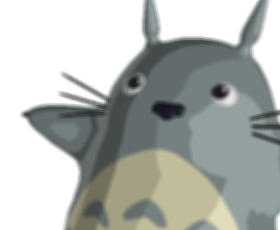 <!-- {.push-right style="max-height: 90px"} -->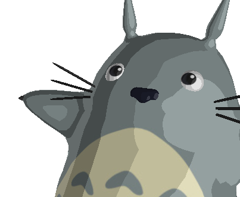 <!-- {.push-right style="max-height: 90px"} -->
    <div style="display: flex; align-items: center">
    <div class="math" style="font-size: 0.75em; margin-right: 0.75em;">\begin{bmatrix}1&1&1\\ 1&1&1 \\ 1&1&1\end{bmatrix}/9</div> ou <div class="math" style="font-size: 0.75em; margin-left: 0.25em;">\begin{bmatrix}1&2&1\\ 2&4&2\\ 1&2&1\end{bmatrix}/16</div>
    </div>

Aguçamento: <!-- {dd:style="margin-bottom:0"} -->
  ~ 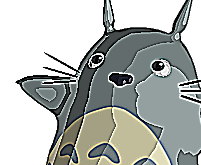 <!-- {.push-right style="max-height: 90px"} --> <!-- {.push-right style="max-height: 90px"} -->
    <div class="math" style="font-size: 0.75em">\begin{bmatrix}-1&-1&-1\\ -1&9&-1 \\ -1&-1&-1\end{bmatrix}</div>

Detec. de bordas:  <!-- {dd:style="margin-bottom:0"} -->
  ~ 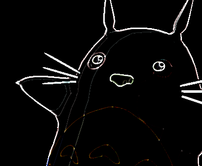 <!-- {.push-right style="max-height: 90px"} --> <!-- {.push-right style="max-height: 90px"} -->
    <div class="math" style="font-size: 0.75em">\begin{bmatrix}1&1&1\\ 1&-9&1 \\ 1&1&1\end{bmatrix}</div>

---
<!-- { "layout": "regular" } -->
# Discussão de desempenho

-  <!-- {.push-right} -->
   <!-- {.push-right.clear} -->
  Aumento de memória (insignificante)
- Aumento no tempo de renderização
  - O segundo passo (adicional) passa rapidinho pelo _vertex shader_ e gasta menos tempo que o primeiro no _fragment shader_
    - <span class="math">fragmentos > pixels</span>

---
<!-- { "layout": "section-header", "slideClass": "efeitos-complexos", "slideHash": "efeitos-complexos" } -->
# Efeitos complexos

- Exemplos:
  - _Depth of field_
  - _Bloom_
  - Oclusão ambiente

---
<!-- { "layout": "regular" } -->
# Tipos de efeitos complexos

- 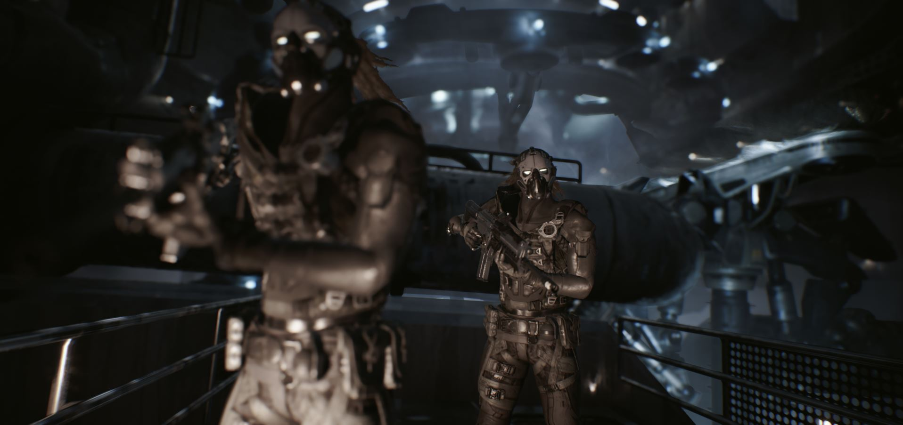
  ## _Depth of field_
- 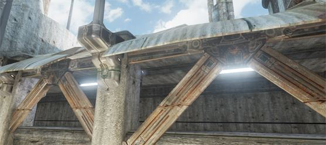
  ## _Bloom_
- 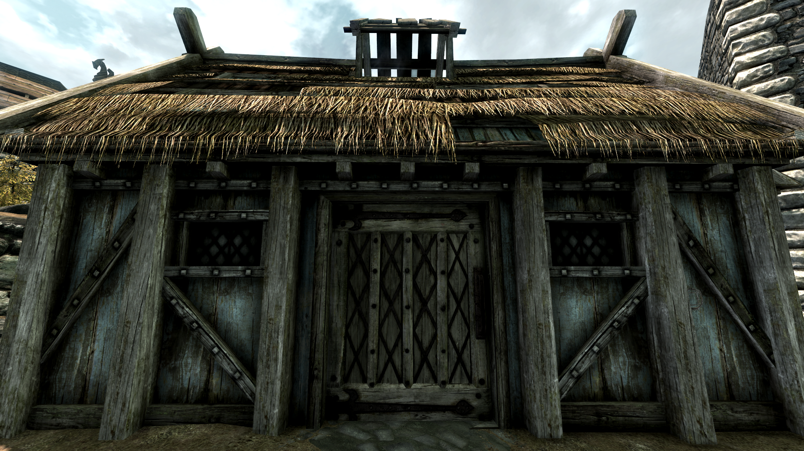
  ## Oclusão ambiente <!-- {ul:.card-list.no-margin} -->

1. 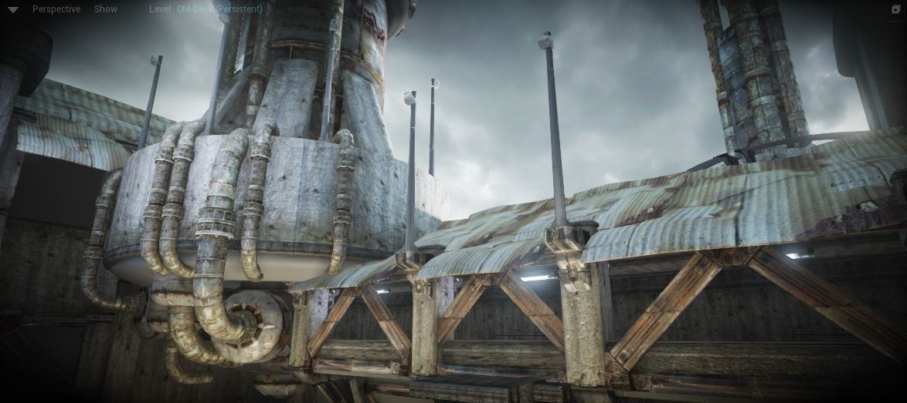
   ## _Vignette_
1. 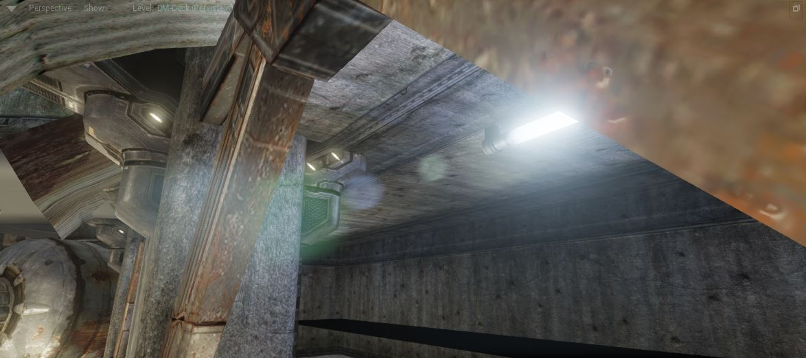
   ## _Lens flare_
1. 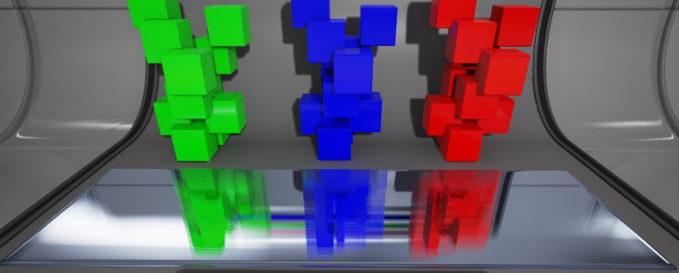
   ## SSR <!-- {ol:.card-list.no-margin} -->

*[SSR]: Screen space reflections*

---
<!-- { "layout": "regular" } -->
# Efeito _depth of field_

::: comparative .centered width: 800px; height: 377px;
 <!-- {.full-width} -->
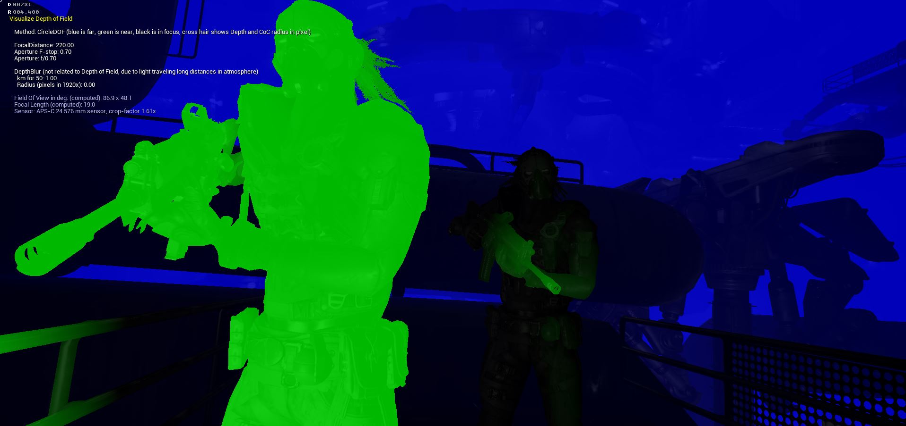
<figcaption><span class="push-left">Resultado</span><span class="push-right">Profundidade</span></figcaption>
:::

- **Ideia**: coisas além ou anteriores ao ponto focal aparecem borradas. Processo: <!-- {li:style="margin-left: 2em;} -->
  1. Usar o _depth buffer_ do primeiro passo no segundo
  1. Borrar apenas os fragmentos que estiverem além ou 
     antes do plano focal

---
<!-- { "layout": "regular" } -->
# Efeito _bloom_

- **Ideia**: objetos muito claros ao redor de outros muito escuros  <!-- {li:style="padding-right: 1em"} -->
  provocam um brilho intenso. Processo:
  1. Selecionar pixels claros
  1. Reduzir imagem
  1. Borrar com filtro grande
  1. Expandir para tam. normal
  1. Somar borrada à original
- Exemplo: <!-- {ul:.layout-split-2} --> <!-- {li:.no-padding.no-bullet style="min-width: 600px"} -->
  ::: comparative .centered width: 557px; height: 248px;
  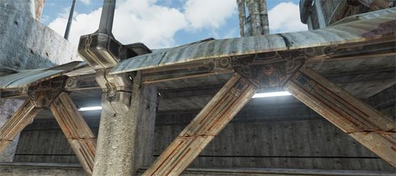
  
  <figcaption><span class="push-left">Pouco bloom</span><span class="push-right">Muito bloom</span></figcaption>
  :::

---
<!-- { "layout": "regular" } -->
# _Ambient occlusion_ (1/3)

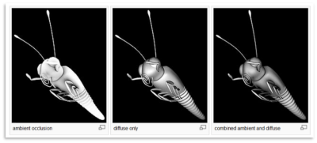 <!-- {p:.centered} -->

- A **oclusão ambiente** aprimora o realismo ao considerar a atenuação da luz
  devido a sua obstrução (_occlusion_)
  - Tenta-se aproximar o caminho da irradiação da luz
- Oclusão ambiente é um método de iluminação global, _i.e._, a iluminação
  em um ponto dada em função da geometria da cena

---
<!-- { "layout": "regular" } -->
# _Ambient occlusion_ (2/3)

- _Ambient Occlusion_ é normalmente calculada lançando raios em
  várias direções a partir da superfície
  - Raios que chegam ao "vazio" ou "céu" aumentam o brilho da superfície
  - Raios que acertam outros objetos não contribuem para iluminação
- 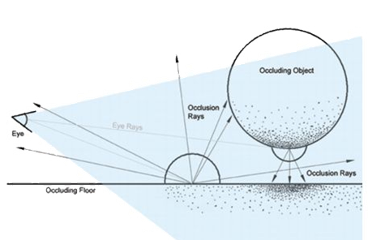 <!-- {.push-right} -->
  Resultado: **pontos rodeados por outros objetos ficam mais escuros** do que
  pontos com pouca geometria próxima

---
<!-- { "layout": "regular" } -->
# _**Screen Space** Ambient Occlusion_ (SSAO 3/3)

- Em tempo real, podemos apenas tentar aproximar o _ambient occlusion_
- SSAO é uma técnica
  de aproximação (introduzida pelo Crysis) que faz uso da profundidade
  (_z-buffer_) da cena renderizada
  - Compara a profundidade do fragmento corrente com a profundidade de alguns
    vizinhos para determinar se está obstruído ou não
  - O fragmento corrente está obstruído se a amostra está mais próxima do olho
    do que os fragmentos vizinhos
- Exemplo de [SSAO no Skyrim](https://www.youtube.com/watch?v=aStBEcs38TQ)

*[SSAO]: Screen Space Ambient Occlusion*

---
<!-- { "layout": "centered" } -->
::: comparative .centered width: 1000px; height: 562.5px
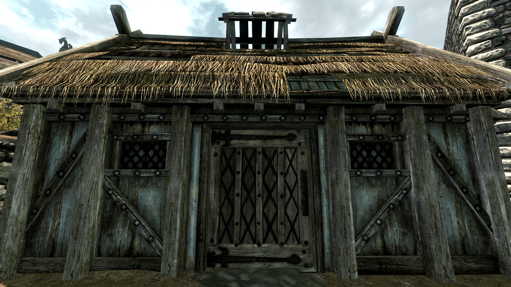 <!-- {style="max-width: 1000px"} -->
 <!-- {style="max-width: 1000px"} -->
<figcaption><span class="push-left">Sem SSAO</span><span class="push-right">Com SSAO</span></figcaption>
:::

---
<!-- { "layout": "centered" } -->
# Referências

- Livro _Game Engine Architecture, Second Edition_
  - Capítulo 10: _The Rendering Engine_
- Livro _Real-Time Rendering, Third Edition_
  - Capítulo 14: _Acceleration Algorithms_
- Efeito _bloom_: [_how to do good bloom for HDR rendering_][bloom]


[bloom]: http://harkal.sylphis3d.com/2006/05/20/how-to-do-good-bloom-for-hdr-rendering/
