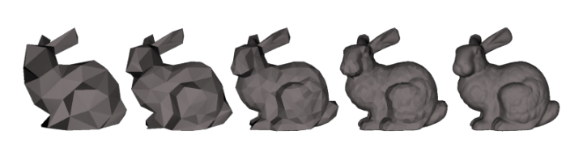

<!-- { "layout": "title" } -->
# Renderização em Tempo Real (parte 1)

---
<!-- { "layout": "centered" } -->
## Roteiro

1. Grafo de Cena
1. _Level of Detail_
1. Sombras em Tempo Real
1. _Ambient Occlusion_

---
<!-- { "layout": "section-header", "slideClass": "grafo-de-cena", "slideHash": "grafo-de-cena" } -->
# Grafo de Cena

---
<!-- { "layout": "regular" } -->
# Uma cena de jogo (1/2)

::: figure .centered

:::

- **Mundos** de jogo podem ser **bem grandes**
- A **maior parte da cena** tipicamente está **fora do _frustum_** da câmera

---
<!-- { "layout": "regular" } -->
# Uma cena de jogo (2/2)

- Deixar que a **GPU recorte** a cena <u>toda</u> pode ser **custoso**
  - Devemos tentar **enviar para renderização** apenas os objetos que podem
    **estar no _frustum_**
  - Precisamos de uma **estrutura de dados** para armazenar os objetos da cena:
    1. De forma estruturada e organizada
    1. **Armazenando informação espacial** dos objetos para otimizar a
      renderização
- Podemos usar um **grafo de cena** (tipicamente uma árvore) para tornar fácil
  **descartar partes da cena** que estejam **fora do _frustum_**

---
<!-- { "layout": "regular" } -->
# Grafo de Cena

-  <!-- {.push-right} -->
  Segundo Akenine-Müller, é uma:

  Estrutura em árvore, "orientada ao usuário", que armazena
  a geometria da cena, mas também texturas, transformações, níveis de
  detalhamento, fontes de luz etc. <!-- {.note.info style="max-width: 50%"} -->
- Para desenhar a cena, basta percorrer a árvore chamando `this.renderiza()` em
  cada nó.

---
<!-- { "layout": "regular" } -->
# Grafo de Cena **na Unity**

::: figure .centered
 <!-- {.push-left} -->
 <!-- {.push-right} -->
 <!-- {.push-right} -->
:::

---
<!-- { "layout": "regular" } -->
# <u>Otimização</u>: **_Frustum Culling_**

 <!-- {p:.centered} -->

- Particiona-se o espaço (_e.g._, _grid_, _octree_,
  BSP _tree_) ou a cena
  (_e.g._, BVH) de forma amostral
- Testa-se cada partição contra o _frustum_ (de forma barata)
- É possível podar a árvore usando a informação espacial

*[BSP]: Binary Space Partitioning*
*[BVH]: Bounding Volume Hierarchy*

---
<!-- { "layout": "regular" } -->
# Exemplo de **_Frustum Culling_**

<iframe width="640" height="480" src="https://www.youtube.com/embed/fNa_Gh5gFWY" frameborder="0" allowfullscreen class="centered"></iframe>

---
<!-- { "layout": "regular" } -->
# <u>Otimização</u>: **_Occlusion Culling_**

::: figure .centered

:::

- Ideia: **não desenhar** objetos que estão **atrás de outros** (que são opacos)
- Implementação no espaço: (a) de imagem (projeção), (b) de objeto, (c) de raio
- Recentemente: **_occlusion queries_** feitas no **_hardware_**
  - Rasteriza objeto _off-screen_ e compara com o _z-buffer_

---
<!-- { "layout": "regular" } -->
# Escolhendo Grafo de Cena + Otimização

- A escolha da estrutura de dados e técnica(s) de otimização dependem
  do "problema" (normalmente, do estilo de jogo). Por exemplo:
  1. **Jogo de luta**: dois personagens lutando em um ringue com ambiente
    estático (exclua Mortal Kombat aqui)
    - Não é necessário otimizar
  1. **Jogo de RTS**: terreno aproximadamente plano, com visão aérea
    - Grafo de cena com uma _quadtree_, fazendo _frustum culling_
  1. **Jogo com câmera FP**: cenário com alta densidade de objetos grandes
    - Grafo de cena com _octree_, fazendo _frustum_ + _occlusion culling_
  1. **Jogo com câmera FP**: cenário mais esparso
    - Grafo de cena com _octree_, fazendo _frustum culling_ apenas

---
<!-- { "layout": "section-header", "slideClass": "level-of-detail" } -->
# _Level of Detail_ (LOD)

---
<!-- { "layout": "regular" } -->
# Nível de Detalhamento (LOD)

-  <!-- {.push-right} -->
  _Level of detail_ involve reduzir a complexidade de um objeto a ser
  renderizado ao passo que ele se distancia da câmera ou outra métrica:
  - importância,
  - velocidade relativa ao espaço da câmera, etc.
- Usando LOD, usamos mais memória (RAM) em troca de menos
  trabalho no _pipeline_ gráfico (menos vértices) sendo
  transformados/iluminados
- A qualidade visual reduzida do modelo tipicamente não é notada porque
  o efeito é reduzido pela distância ou velocidade

---
<!-- { "layout": "regular" } -->
# Tipos de LOD

-  <!-- {.push-right} -->
  **Discreto**:
  - Construir um número finito de modelos com número de polígonos
  variando
- **Contínuo**:
  - Codificar um espectro contínuo de detalhes de baixo a alto
- **Dependente da visualização**:
  - Ajustar detalhes do modelo de acordo com o _viewpoint_

---
<!-- { "layout": "regular" } -->
# LOD **Discreto**

- Abordagem mais simples:
  - Em tempo de execução, apenas o modelo adequado é selecionado e renderizado
- Pros:
  - Funciona bem com as GPUs atuais (_display list_)
  - Mais rápido que LOD contínuo (modo imediatista)
- Cons:
  - Possibilidade de _popping_ durante a troca de nível

 <!-- {p:.centered} -->

---
<!-- { "layout": "regular" } -->
# Problema: _popping_

<iframe width="640" height="360" src="https://www.youtube.com/embed/KfeFcZDjCRg?rel=0" frameborder="0" allowfullscreen class="centered"></iframe>

- Exemplo do jogo Arma 2 (2009)

---
<!-- { "layout": "regular" } -->
# LOD **Contínuo**

- O LOD discreto constrói um número finito de visões
  estáticas do objeto
- O LOD contínuo constrói **uma estrutura de dados a partir da qual extrai-se
  um modelo no nível desejado** em tempo de execução
  - Usa-se, para tanto, os **_shaders_ de geometria e tecelagem**
- Pros:
  - Maior fidelidade ao modelo
  - Melhor granularidade
- Cons:
  - Mais caro

---
<!-- { "layout": "regular" } -->
# LOD Contínuo: Exemplo

<iframe width="480" height="360" src="https://www.youtube.com/embed/2IMyQUTv9Vk?rel=0" frameborder="0" allowfullscreen class="centered"></iframe>

---
<!-- { "layout": "regular" } -->
# LOD **Dependente da Visualização**

-  <!-- {.push-right} -->
  É um tipo especial de LOD contínuo que considera o ângulo de visualização
- O algoritmo aloca polígonos onde são mais necessários baseado na câmera
- Pros:
  - Objetos grandes são bem melhor amostrados onde estão sendo visualizados

---
<!-- { "layout": "regular" } -->
# LOD **Dependente da Visualização**: Exemplo

<iframe width="640" height="360" src="https://www.youtube.com/embed/Gmp-WbfF8b8?rel=0" frameborder="0" allowfullscreen class="centered"></iframe>

- Liktor et al (2014): [_Fractional Reyes-Style Adaptive Tessellation for Continuous Level of Detail_](http://cg.ivd.kit.edu/FracSplit.php)

---
<!-- { "layout": "regular" } -->
# LOD de **Texturas: _Mipmapping_**

-  <!-- {.push-right} -->
  A técnica de _mipmapping_ de texturas também é LOD
  - **Reduz _aliasing_** causado por filtragem de redução pobre quando
    **uma textura grande é aplicada a uma região pequena da tela**
- [Exemplo de CG](http://fegemo.github.io/cefet-cg/classes/textures/#33)

---
<!-- { "layout": "section-header", "slideClass": "sombras-em-tempo-real" } -->
# Sombras em Tempo Real

---
<!-- { "layout": "regular" } -->
# **Sombras**

-  <!-- {.push-right} -->
  O uso de sombras a uma cena aumenta o realismo e fornece dicas visuais
  para a profundidade e posição de objetos
- As técnicas mais comuns em _real-time_:
  1. ~~_Hack_ simplão~~
  1. _Shadow volumes_
  1. _Shadow maps_

---
<!-- { "layout": "regular" } -->
# Sombras (1): **_Hack_ simplão**

-  <!-- {.push-right} -->
  Renderizar cada objeto duas vezes:
  - Primeiro passo: renderizar normalmente
  - Segundo passo: projetar no plano do chão e renderizar totalmente preto
- Pros:
  - Fácil e até convincente
- Cons:
  - Torna-se rapidamente um problema geométrico complexo
    - Fácil projetar em um plano infinito
    - Mas e numa escada? Morro?

---
<!-- { "layout": "regular" } -->
# Sombras (2): **_Shadow Volumes_**

- A técnica foi proposta em 1977 (Frank Crow), mas popularizada com o jogo
  Doom 3
-  <!-- {.push-right} -->
  Para cada par <luz, objeto>, computar a região da malha que obstrui a luz
  1. Encontrar a silhueta sob a perspectiva da luz
  2. Projetar a silhueta ao longo dos raios da luz (fazer uma extrusão)
  3. Triangular (gerar triângulos) conectando a silhueta e sua projeção para
     obter o **volume da sombra**
- Um ponto P está na sombra da luz
  L se algum volume de sombra contém
  P
- Tipicamente, usa-se o _stencil buffer_ ([Everitt e Kilgard, 2002](http://arxiv.org/ftp/cs/papers/0301/0301002.pdf))

---
<!-- { "layout": "regular" } -->
# Sombras (2): **_Shadow Volumes_** (1)

-  <!-- {.push-right} -->
  Pros:
  - A sombra é super precisa (a nível de pixel) e não sofre problemas de
    _aliasing_
- Cons:
  - Computacionalmente mais cara que _shadow maps_

---
<!-- { "layout": "regular" } -->
# Sombras (3): **_Shadow Maps_** (1)

-  <!-- {.push-right} -->
  Renderiza a cena usando **cada fonte de luz como centro de projeção**,
  salvando apenas o _z-buffer_
  - Imagens 2D resultantes são os **mapas de sombras** (uma por fonte de luz)
- Em seguida, renderiza a cena do ponto de vista da câmera

---
<!-- { "layout": "regular" } -->
# Sombras (3): **_Shadow Maps_** (2)

-  <!-- {.push-right} -->
  Para determinar se ponto P de um objeto está
  na sombra:
  1. Computar a distância d_P de
     P até a fonte de luz
  1. Converter P das coordenadas do mundo para
     coordenadas do _shadow map_ (usando matrizes projection * view usada para gerar o mapa)
  1. Recuperar a distância d_{min} no mapa
  1. P está na sombra se
     d_P > d_{min}, _i.e._, se estiver atrás de um
     objeto mais próximo da fonte

---
<!-- { "layout": "regular" } -->
# Sombras (3): **_Shadow Maps_** (3)

-  <!-- {.push-right} -->
  Pros:
  - Pode ser extendida para ter _soft shadows_
  - Mais barata que _shadow volumes_
- Cons:
  - Implementação simples tem problemas seríssimos de _aliasing_
    - Câmera mais próxima da sombra que a fonte, muitos pixels podem ser
      cobertos por apenas um "texel" do _shadow map_
- Há várias técnicas para resolver o problema de _aliasing_...

---
<!-- { "layout": "regular" } -->
# Sombras (3): **_Shadow Maps_** (4)

- **_Screen Space Blurred Shadow Mapping_**:
  - Sombras renderizadas em uma textura e ela é borrada e então aplicada na tela
- **_Percentage Closer Filtering_**:
  - Usa mais de um "texel" do _shadow map_ para determinar se ponto está na
    sombra

 <!-- {p:.centered} -->

---
<!-- { "layout": "regular" } -->
# Sombras **em 2D**

-  <!-- {.push-right} -->
  Em jogos 2D (e até 3D), normalmente simplificamos as sombras a apenas um
  **_shadow blob_**
  - Simplesmente um gradiente circular desenhado nos pés dos objetos
  - Quando o personagem pula, a [figura é aumentada/esmaecida](https://youtu.be/31m02lH46S0?t=38s)
-  <!-- {.push-right} -->
  Recentemente alguns jogos 2D passaram a usar **sombras dinâmicas** usando
  **_raycasting_**
  - Veja um [excelente passo-a-passo](http://ncase.me/sight-and-light/) de
    como fazer

---
<!-- { "layout": "section-header", "slideClass": "ambient-occlusion" } -->
# **_Ambient Occlusion_**

---
<!-- { "layout": "regular" } -->
# **_Ambient Occlusion_**

 <!-- {p:.centered} -->

- A **obstrução ambiente** aprimora o realismo ao considerar a atenuação da luz
  devido a sua obstrução (_occlusion_)
  - Tenta-se aproximar o caminho da irradiação da luz
- Oclusão ambiente é um método de iluminação global, _i.e._, a iluminação
  em um ponto dada em função da geometria da cena

---
<!-- { "layout": "regular" } -->
# **_Ambient Occlusion_** (2)

- _Ambient Occlusion_ é normalmente calculada lançando raios em
  várias direções a partir da superfície
  - Raios que chegam ao "vazio" ou "céu" aumentam o brilho da superfície
  - Raios que acertam outros objetos não contribuem para iluminação
-  <!-- {.push-right} -->
  Resultado: **pontos rodeados por outros objetos ficam mais escuros** do que
  pontos com pouca geometria próxima

---
<!-- { "layout": "regular" } -->
# **_Screen Space Ambient Occlusion_** (SSAO)

- Em tempo real, podemos apenas tentar aproximar o _ambient occlusion_
- SSAO é uma técnica
  de aproximação (introduzida pelo Crysis) que faz uso da profundidade
  (_z-buffer_) da cena renderizada
  - Compara a profundidade do fragmento corrente com a profundidade de alguns
    vizinhos para determinar se está obstruído ou não
  - O fragmento corrente está obstruído se a amostra está mais próxima do olho
    do que os fragmentos vizinhos
- Exemplo de [SSAO no Skyrim](https://www.youtube.com/watch?v=aStBEcs38TQ)

*[SSAO]: Screen Space Ambient Occlusion*

---
<!-- { "layout": "centered" } -->
<figure style="position: relative; width: 800px; height: 600px;" class="centered">
  
  
</figure>

- [Comparação lado a lado](http://international.download.nvidia.com/geforce-com/international/comparisons/the-elder-scrolls-v-skyrim-tweak-guide/Skyrim-Tweak-Guide-AO-Comparison.html)

---
<!-- { "layout": "centered" } -->
# Referências

- Livro _Game Engine Architecture, Second Edition_
  - Capítulo 10: _The Rendering Engine_
- Livro _Real-Time Rendering, Third Edition_
  - Capítulo 14: _Acceleration Algorithms_
