<!--
  backdrop: little-big-planet-3
-->

# Renderização em Tempo Real (parte 2)
---
## Roteiro

1. [Efeitos Visuais](http://fegemo.github.io/cefet-cg/classes/visual-effects/) (aula de CG)
1. Árvores e Vegetação
1. _Forward vs Deferred Rendering_

---
<!--
  backdrop: crysis3-foliage
-->

# Árvores e Vegetação

---
## Árvores e Vegetação

- 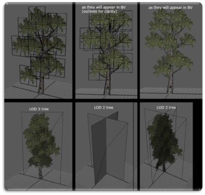
  A complexidade visual de grama, arbustos, árvores etc. é frequentemente
  renderizada usando um ou mais _billboards_ ou _sprites_

  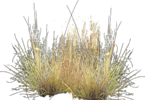
- [Renderização de grama no Crysis 3](https://www.youtube.com/watch?v=Uh2Lv97OhMg)

---
## **Grama**

- 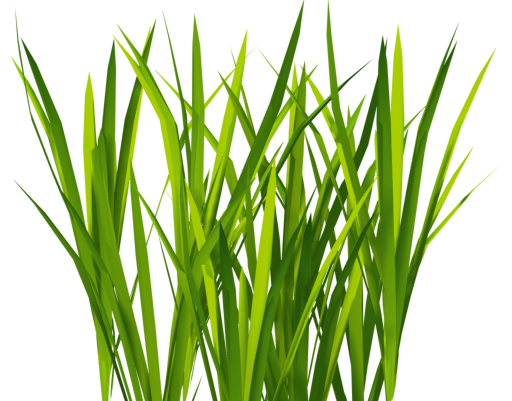
  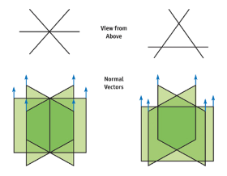
  Grama é normalmente renderizada usando _sprites_ intersectantes, renderizados
  usando transparência
- As _sprites_ são cruzadas para que haja qualidade visual independente do
  ponto de vista
  - As normais devem apontar para cima
  - _Backface culling_ deve ser desabilitado

---
## Grama (2)

- 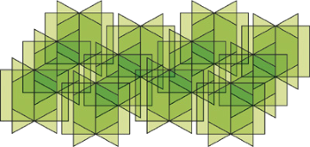
  Para dar sensação de alta densidade, as "moitinhas" devem ser colocadas
  próximas umas às outras
- Para renderizar, os testes alfa e de profundidade devem ser ativados

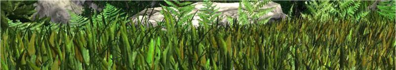

---
## Grama: respondendo ao **vento**

- 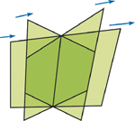
  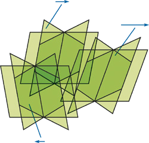
  Uma transformação (_shearing_) pode ser feita nas moitas, cuja intensidade
  é determinada pela quantidade de vento e o momento (tempo) corrente
- Pode ser feito em um _vertex shader_, usando funções envolvendo `sin`/`cos`
  para dar efeito de movimento ondular

---
## **Árvores**

- 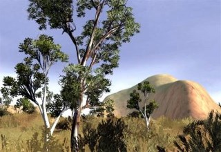
  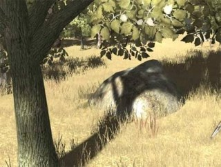
  Quando **distante**, uma árvore pode ser **renderizada como _billboard_
  ou _impostor_**
- Quando **próxima**, separamos em:
  1. Região sólida usando malha poligonal (tronco e galhos mais grossos)
  2. Folhagem usando _sprites_

---
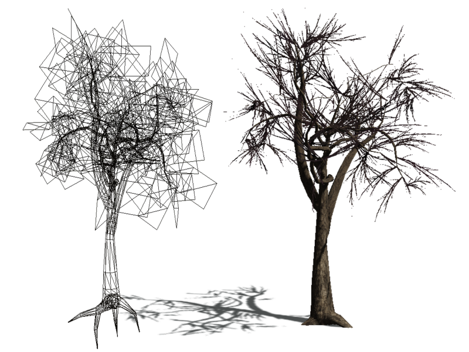

---
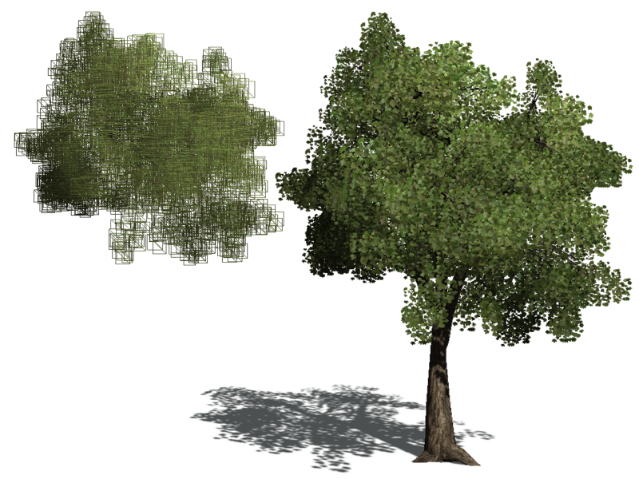

---
<!--
  deferred-lighting
-->

# Renderização Tardia (_Deferred_)

---
## Um problema com a Renderização "tradicional"

- Na renderização tradicional (_"forward"_), a geometria é enviada
  ao _pipeline_, que (a) calcula suas posições e (b) a colore
- Um potencial problema é o **alto custo**
  (O(geometria * luzes)) associado à porção
  relacionada à **iluminação (b)**, combinado à possibilidade
  de se **desenhar geometria** que será **posteriormente sobrescrita**
  por outra mais próxima da câmera

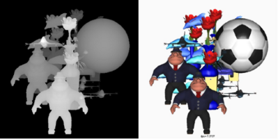

---
## Renderização Tardia (_Deferred Rendering_)

- Renderização (ou Iluminação, ou Sombreamento) Tardia é a ideia de **separar
  a renderização da geometria de sua colorização** (iluminação)
  - É um _hack_ inteligentão do _pipeline_
- Acontece em 2 passos:
  - Renderização (sem cálculo de iluminação) da cena "em texturas"
  - Colorização da textura e combinação para gerar a imagem final
- Exemplo de cena com 1000 vértices:
  - (1) 1000 vértices vão para o _pipeline_ e a geometria é rasterizada,
    cálculo de iluminação, para uma textura (na verdade, umas 4+)
    - Esse _frame buffer_ profundo se chama _g-buffer_
  - (2) as texturas são enviadas ao _pipeline_ e o _fragment shader_
    as combina, gerando a imagem final

---
## Exemplo: _Engine_ [Leadwerks](http://www.leadwerks.com/werkspace/page/home?shownav=0)

<figure style="position: relative; width: 100%; height: 585px;">
  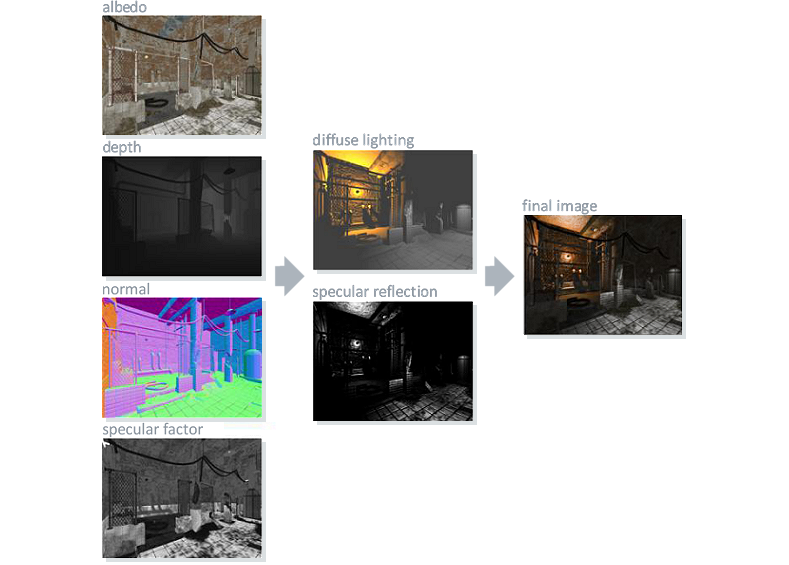
  
  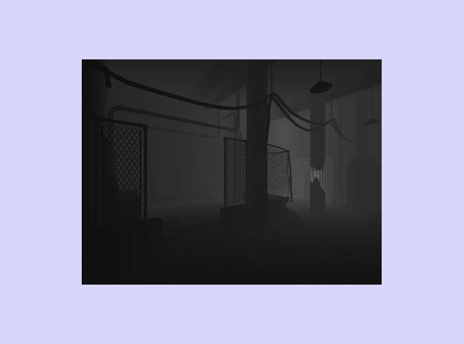
  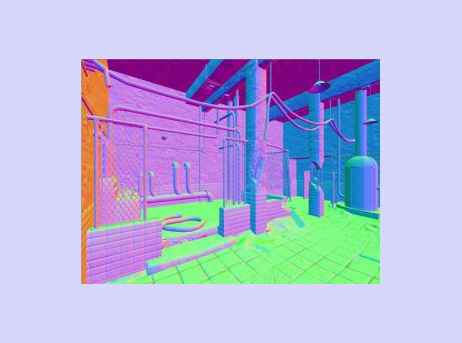
  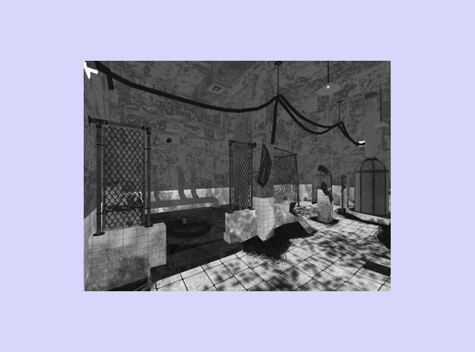
  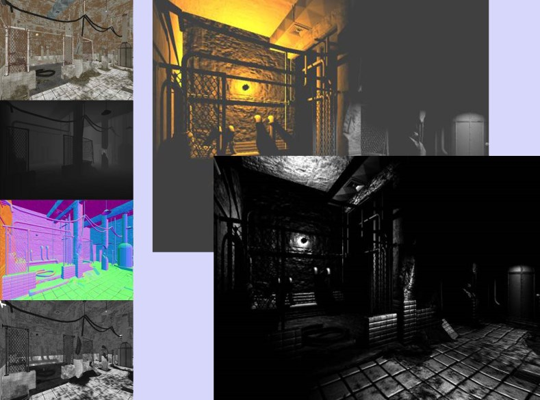
  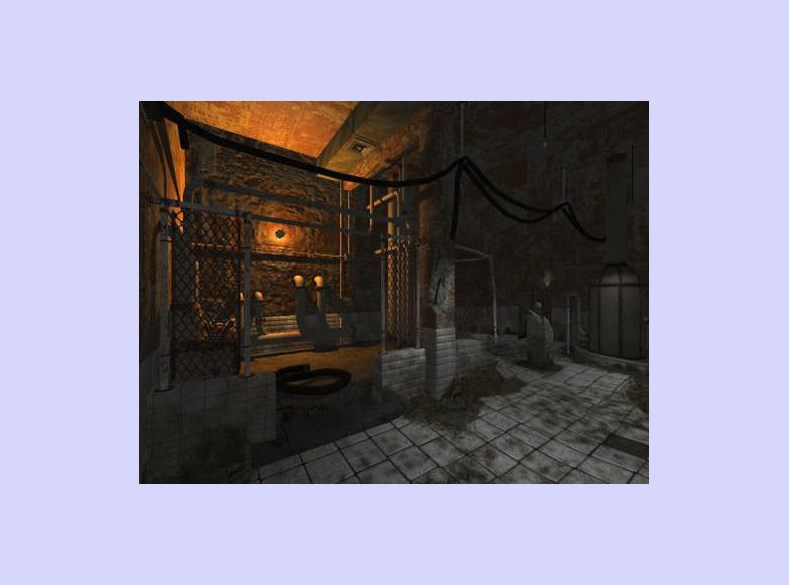
</figure>

---
## Vantagens e Desvantagens

- 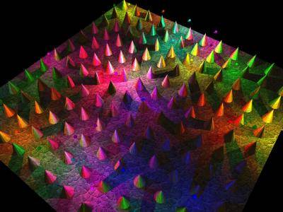
  Uma grande vantagem é a possibilidade de usar um **número muito maior de
  fontes de luz**
  - A complexidade é O(geometria + luzes)
  - Apenas os pixels afetadas por uma fonte de luz precisam ter sua iluminação
    calculada para ela
- Desvantagens:
  - Difícil lidar com objetos transparentes

---
# Referências

- Livro _Game Engine Architecture, Second Edition_
  - Capítulo 10: _The Rendering Engine_
- Livro _Real-Time Rendering, Third Edition_
  - Capítulo 10: _Image-Based Rendering_
- Livro _GPU Gems_:
  - Artigo _Rendering Countless Blades of Waving Grass_
