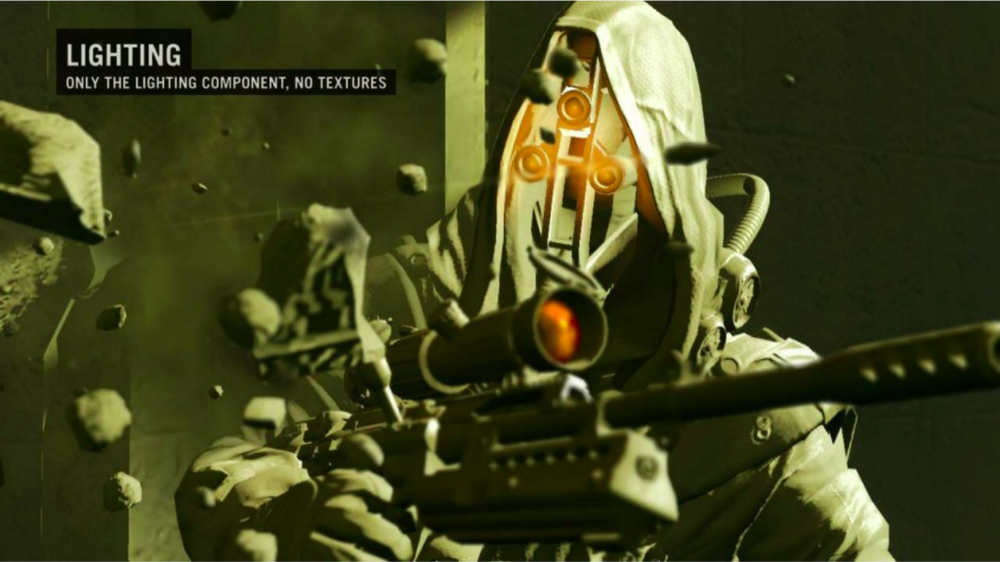

<!-- { "layout": "title" } -->
# Renderização em Tempo Real (parte 2)

---
## Roteiro

1. [Efeitos Visuais](http://fegemo.github.io/cefet-cg/classes/visual-effects/) (aula de CG)
1. [Árvores e Vegetação](#arvores-e-vegetacao)
1. [Sombreamento Tardio](#sombreamento-tardio) (_deferred shading_)

---
<!-- { "layout": "section-header", "slideClass": "arvores-e-vegetacao", "slideHash": "arvores-e-vegetacao" } -->
# Árvores e Vegetação

---
<!-- { "layout": "regular" } -->
# Árvores e Vegetação

-  <!-- {.push-right} -->
  A complexidade visual de grama, arbustos, árvores etc. é frequentemente
  renderizada usando um ou mais _billboards_ ou _sprites_

  
- [Renderização de grama no Crysis 3](https://www.youtube.com/watch?v=Uh2Lv97OhMg)

---
<!-- { "layout": "regular" } -->
# Grama (1/3)

-  <!-- {.push-right style="width: 280px"} -->
   <!-- {.push-right style="clear:both"} -->
  Grama é normalmente renderizada usando _sprites_ intersectantes, renderizados
  usando transparência
- As _sprites_ são cruzadas para que haja qualidade visual independente do
  ponto de vista
  - As normais devem apontar para cima
  - _Backface culling_ deve ser desabilitado

---
<!-- { "layout": "regular" } -->
# Grama (2/3)

-  <!-- {.push-right} -->
  Para dar sensação de alta densidade, as "moitinhas" devem ser colocadas
  próximas umas às outras
- Para renderizar, os testes alfa e de profundidade devem ser ativados

 <!-- {p:.centered} -->

---
<!-- { "layout": "regular" } -->
# Grama (3/4): respondendo ao **vento**

-  <!-- {.push-right style="max-height: 200px" } -->
   <!-- {.push-right} -->
  Uma transformação pode ser feita nas moitas, cuja intensidade
  é determinada pela quantidade de vento e o momento (tempo) corrente
- O _vertex shader_ pode usar funções envolvendo `sin`/`cos`
  para dar efeito de movimento ondular
  <iframe src="https://codepen.io/al-ro/full/jJJygQ" width="100%" height="240px" seamless frameborder="0" allowfullscreen style="margin: 0 auto;"></iframe>

---
<!-- { "layout": "2-column-content" } -->
# Grama (4/4): com geometria

- ::: figure
  <video src="../../videos/grass-geometric.webm" width="100%" loop="0" autoplay muted></video>
  [Tutorial](https://roystan.net/articles/grass-shader.html) de Roystan (2018)
  :::
  <!-- {li:.no-bullet} -->
- Uma malha é enviada ao pipeline e cada vértice é substituído por um fiapo

1. ::: figure
   <video src="../../videos/grass-geometric-blade-vertices.mp4" height="160px" loop="0" autoplay muted class="push-right"></video>
   :::
   O _geometry shader_ transforma 1 vértice dessa malha em 7
1. Fiapo tem tamanho e orientação aleatória
1. Para controlar densidade, _tesselation shader_ subdivide a malha inicial 
   com mais ou menos intensidade:
    <!-- {style="max-height: 200px"} -->

---
<!-- { "layout": "regular" } -->
# Árvores

-  <!-- {.push-right} -->
   <!-- {.push-right style="clear:both"} -->
  Quando **distante**, uma árvore pode ser **renderizada como _billboard_
  ou _impostor_**
  - Por exemplo, árvores em locais distantes e inalcançáveis
- Quando **próxima**, separamos em:
  1. Região sólida usando malha poligonal (tronco e galhos mais grossos)
  2. Folhagem usando _sprites_

---

---
<!-- { "layout": "centered", "state": "show-active-slide-and-previous" } -->

---
<!-- { "layout": "section-header", "slideClass": "sombreamento-tardio", "slideHash": "sombreamento-tardio" } -->
# Sombreamento Tardio

- Ou _Deferred Shading_, _Deferred Rendering_
- É uma forma diferente de usar o _pipeline_ gráfico para gerar imagens

---
<!-- { "layout": "regular" } -->
# Um problema com o _pipeline_ tradicional

- Na renderização tradicional (_forward rendering_), a geometria é enviada
  ao _pipeline_, que (a) calcula suas posições e (b) a colore
- Um potencial problema é o **alto custo**
  O(geometria + fragmentos \times luzes) associado à porção
  relacionada à **iluminação (b)**

::: figure .layout-split-2
 <!-- {p:.centered} -->
- Um pixel pode conter muitos fragmentos (de um objeto atrás do outro)
- A iluminação é feita para todos os fragmentos da cena
  - Mesmo aqueles que não contribuirão para o pixel
:::

---
<!-- { "layout": "regular" } -->
# Sombreamento Tardio (_Deferred Shading_)

- Renderização (ou Iluminação, ou Sombreamento) Tardia é a ideia de 
  **separar a renderização da geometria de sua colorização** (iluminação)
  - É um _hack_ inteligentão do _pipeline_
- Acontece em 2 passos:
  1. Renderização (sem cálculo de iluminação) da cena em 4+ texturas
  1. Combinação dessas texturas com as fontes de luz para gerar a imagem final
- Exemplo de cena com 1000 vértices:
  - (1) 1000 vértices vão para o _pipeline_ e a geometria é rasterizada,
    cálculo de iluminação, para texturas
    - Esse _frame buffer_ "profundo" se chama _g-buffer_
  - (2) as texturas são enviadas ao _pipeline_ em um segundo passo de
    renderização e o _fragment shader_ as combina, gerando a imagem final

---
<!-- { "layout": "centered-horizontal" } -->
# 1º passo: geração do _g-buffer_ <!-- {h1:style="transform: scale(0.8)"} -->

::: figure
 <!-- {style="height: 445px"} -->
<figcaption>Killzone 2 (Guerrilla Games, 2009)</figcaption>
:::

---
<!-- { "layout": "centered-horizontal", "state": "show-active-slide-and-previous" } -->
# 2º passo: combinação _g-buffer_ e iluminação <!-- {h1:style="transform: scale(0.8)"} -->
 
::: figure
 <!-- {style="height: 445px"} -->
:::

---
<!-- { "layout": "regular" } -->
# Vantagens e Desvantagens

-  <!-- {.push-right} -->
  Uma grande vantagem é a possibilidade de usar um **número muito maior de
  fontes de luz**
  - A complexidade é O(geometria + pixels \times luzes)
  - Apenas os pixels afetados por uma fonte de luz precisam ter sua iluminação
    calculada para ela
- Desvantagens:
  - Difícil lidar com objetos transparentes
    - Nesse caso, usa-se abordagem híbrida (_forward + deferred_)
---
<!-- { "layout": "centered", "backdrop": "trine-2-deferred-shading", "fullPageElement": "#trine-2-video", "playMediaOnActivation": {"selector": "#trine-2-video", "delay": "400" } } -->
<!-- # Trine 2 {style="color: white"} -->
  
<video src="../../videos/trine-2.webm" width="100%" loop="0" id="trine-2-video"></video>

---
<!-- { "layout": "centered-horizontal" } -->
# Referências

- Livro _Game Engine Architecture, Second Edition_
  - Capítulo 10: _The Rendering Engine_
- Livro _Real-Time Rendering, Third Edition_
  - Capítulo 10: _Image-Based Rendering_
- Livro _GPU Gems_:
  - Artigo _Rendering Countless Blades of Waving Grass_
