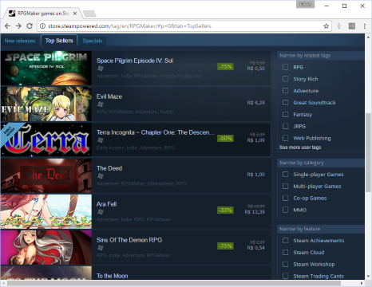

<!--
backdrop: rpgmaker-sand
-->

# RPG Maker

---
# Por quê existe isso?

---
## Por que alguém precisa do RPG Maker?

- Criar jogos pode ser uma tarefa bem complexa
  - Tipicamente, programadores gostam de programar, artistas gostam de desenhar e projetistas gostam de projetar
  - Para criar um bom jogo, **é vital deixar as pessoas fazendo o que elas gostam** (_e.g_, não coloque o projetista para programar)
  - Para isso, construímos **ferramentas de apoio**

---
## Ferramentas de apoio

- Existem **vários tipos** de ferramentas de apoio ao desenvolvimento de jogos e elas podem focar em **diferentes aspectos**:
  - Audio
  - Gráficos
  - _Level design_
- Um tipo de ferramenta é o tipo "_game/genre maker_", ou fazedor de jogos de um certo tipo
  - O RPG Maker é provavelmente o _maker_ de RPGs bidimensionais mais popular
   - Mas existem [vários][rpg-boss] [outros][tool-rpgtoolkit] [também][tool-ggmaker]

[rpg-boss]: http://rpgboss.com/
[tool-rpgtoolkit]: http://rpgtoolkit.net/home
[tool-ggmaker]: http://ggmaker.com/

---
# Mas é profissional isso?

---
## _RPG-Maker-made_, no Steam

[][steam-rpgmaker-tagged-games]

- Destaque para o jogo _To the Moon_ (97% _**overwhelmingly**_ positivo)

[steam-rpgmaker-tagged-games]: http://store.steampowered.com/tag/en/RPGMaker/#p=0&tab=TopSellers
---
## Nosso uso do RPG Maker

- É super válido sim usar o RPG Maker para desenvolver jogos
  - Pros:
    - Criadores podem focar em conteúdo, em vez em de código
    - Muito bom para aprender como um jogo funciona
    - Excelente para criar protótipos para testar narrativas
    - Jogos com gráficos 8-16 bits são sempre bem vindos
  - Cons:
    - Pouca flexibilidade nos tipos de jogos criados

---
# Tudo bem, então me explique como!

---
## Tutoriais oficiais

- A Enterbrain possui [alguns tutoriais oficiais][tut-enterbrain], mas vamos nos ater apenas a estes:
  1. [Parte 1: Interface do RPG Maker VX Ace][tut-1]
  1. [Parte 2: Criando mapas][tut-2]
  1. [Parte 8: Uso de eventos][tut-3]
  1. [Parte 9: Uso de eventos parte 2][tut-4]
- Se você veio à aula, não precisa ler os tutoriais - o professor vai fazer uma demonstração esperta

[tut-enterbrain]: http://www.rpgmakerweb.com/support/products/tutorials
[tut-1]: https://d289qh4hsbjjw7.cloudfront.net/rpgmaker-20130522223546811/files/RPGMakerVXAceTutorial1.pdf
[tut-2]: https://d289qh4hsbjjw7.cloudfront.net/rpgmaker-20130522223546811/files/RPGMakerVXAceTutorial2.pdf
[tut-3]: https://d289qh4hsbjjw7.cloudfront.net/rpgmaker-20130522223546811/files/RPGMakerVXAceTutorial8.pdf
[tut-4]: https://d289qh4hsbjjw7.cloudfront.net/rpgmaker-20130522223546811/files/RPGMakerVXAceTutorial9.pdf

---
# Atividade

---
## Atividade Prática

- E possível que não seja possível instalar o RPG Maker (necessário ter
    permissão de administrador)
  - Se for o caso, vamos usar o [RPG Boss][rpgboss] (gratuito, _open source_)
- Enunciado da atividade de hoje:
  - [RPG Maker][activity-rpgmaker]
  - [RPG Boss][activity-rpgboss]

[activity-rpgmaker]: https://github.com/fegemo/cefet-games/tree/master/assignments/rpgmaker
[activity-rpgboss]: https://github.com/fegemo/cefet-games/tree/master/assignments/rpgboss
[rpgboss]: http://rpgboss.com/
