<!-- {"layout": "title"} -->
# Ferramentas para<br>Desenvolvimento de Jogos
## Por onde começar...

---
<!-- {"state": "emphatic"} -->
 <!-- {style="max-height: 600px;"} -->

---
<!-- {"layout": "regular"} -->
# Como faziam...

- Jogos eram desenvolvidos por empresas: <!-- {ul:.full-width} -->
  **grandes**, **sólidas**, com **bom histórico**
- 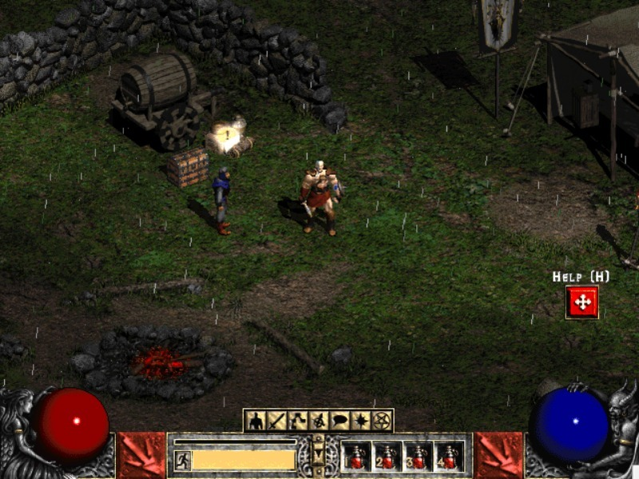 <!-- {.polaroid.push-right style="width: 300px"} -->
  Exemplo:  criando o Diablo II (2000) <!-- {style="height: 1em;"} -->

  Desenvolvimento
    ~ 3 anos (🌐 [fonte][diablo2-postmortem])

  Equipe
    ~ 40 pessoas na produção

- As empresas criavam todas as ferramentas ou adquiriam licenças:

  Unreal Engine, 98
    ~ USD 350,000 + 5% (🌐 [fonte][nytimes-unreal]), por jogo!

  id Tech 3, 99
    ~ USD 500,000 (idem)


[diablo2-postmortem]: https://www.gamasutra.com/view/feature/131533/postmortem_blizzards_diablo_ii.php
[nytimes-unreal]: https://www.nytimes.com/1999/12/02/technology/game-theory-for-game-maker-there-s-gold-in-the-code.html

---
<!-- {"layout": "2-column-highlight-and-list"} -->
# Até que em 2008...

::: figure . align-self: center;
<iframe width="100%" src="https://www.youtube.com/embed/iBjBJRjRBn4?start=169&rel=0&showinfo=0&autoplay=1&cc_load_policy=0&controls=0&disablekb=1&enablejsapi=1&fs=0&iv_load_policy=3&loop=1&modestbranding=1&origin=https%3A%2F%2Funity.com&playlist=ICONNciFCvg&playsinline=1&rel=0&start=5&mute=1&widgetid=1" frameborder="0" allow="accelerometer; autoplay; encrypted-media; gyroscope; picture-in-picture" allowfullscreen></iframe>
:::

-  <!-- {.push-right.portrait.floating} --> <!-- {ul:.no-bullet.no-margin style="width: 64%;"} -->
  ### _"Xbox's **'Braid'** A **Surprise Hit**, For Surprising Reasons"_ <small>(🌐 [fonte][braid-news])</small>

  Equipe <!-- {dl:.dl-6 style="margin-bottom: 0;"} -->
    ~ Jonathan Blow + David Hellman

  _Plot_
    ~ Tim deve resgatar a princesa 🎵

  Mecânica
    ~ Controle do tempo, múltiplas realidades

  Arte
    ~ Estilo impressionista lindão

  Finanças
    ~ Custos: USD 200,000 // Receita: USD 6 mi

1. **Como ele fez isso?** Em 2004, a Microsoft... <!-- {ol:.no-bullet.no-margin style="width: 100%;"} -->
   - Criou o XNA e abriu uma loja virtual de jogos
   - XNA: ferramenta para criar jogos para Xbox 360 e Windows

[braid-news]: http://www.npr.org/templates/story/story.php?storyId=94025221
*[XNA]: XNA's Not Acronymed*

---
<!-- {"layout": "centered-horizontal"} -->
# Em 2010...

### _"Games review - **Super Meat Boy** is a **prime cut**"_ <small>(🌐 [fonte][smb-news])</small>

::: gallery
 <!-- {.push-left.portrait.floating} --> <!-- {p:style="align-items:center;"} -->

 <!-- {.push-left.portrait.floating style="margin-left: 12px;"} -->
:::

- ::: div .note.info.push-right width: 240px; margin-left: 1em; margin-right: 1em; font-size: 80%
  #### Dica para o FDS
  Assistam [_Indie Game - The Movie_][indie-game-movie] <!-- {p:.no-margin.center-aligned} -->
  :::
  Jogos criados por equipes pequenas - **indie** - ganharam a moda
- **As ferramentas** e a **forma de vender** <!-- {.alternate-color} --> se
  tornaram mais acessíveis

[smb-news]: http://metro.co.uk/2010/10/21/games-review-super-meat-boy-555869/
[indie-game-movie]: https://www.youtube.com/watch?v=g8SEDVJOpqY

*[FDS]: fim de semana*

---
# Mais tarde em 2010...

> A **Unity Technologies** lançou a versão 2.6 do seu motor de jogos
> multiplataforma e tornou o seu uso gratuito para desenvolvedores indie.
>
> **Qualquer pessoa pode instalar** e começar a desenvolver jogos
> imediatamente para **PC, Mac e na web**

Notícia histórica em [geek.com](http://www.geek.com/games/unity-2-6-released-and-is-now-free-to-use-955771/)

---


---
<!-- {"layout": "regular"} -->
# Do que precisamos?

Gráficos <!-- {dl:.bulleted} -->
  ~ Imagens, Animação, Modelos 3D, Efeitos visuais

Lógica
  ~ Mecânica de jogo, Linguagem de _scripting_

Intel. artificial
  ~ Movimentação, Tomada de decisão, Estratégia

Física
  ~ Colisão, Cinemática, Dinâmica, Simulações

Redes
  ~ Arquitetura, Protocolos

...são várias coisas diferentes! Imagina se um **pedreiro** precisasse
**construir seu martelo** e outras ferramentas antes de construir uma casa? <!-- {p:.bullet} -->

---
## O que estes jogos têm **em comum**? E de **diferente**?

<ul class="multi-column-inline-list-2 no-bullet">
  <li>
    <figure class="polaroid light item-250w">
      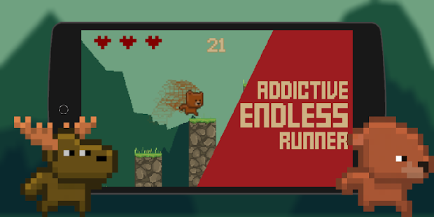
      <figcaption>Animal Run</figcaption>
    </figure>
  </li>
  <li>
    <figure class="polaroid light item-250w">
      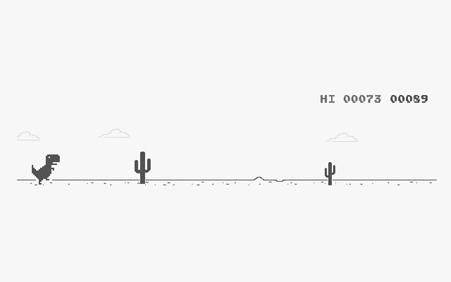
      <figcaption>dino-run</figcaption>
    </figure>
  </li>
</ul>
<ul class="multi-column-inline-list-2 no-bullet">
  <li>
    <figure class="polaroid light item-250w">
      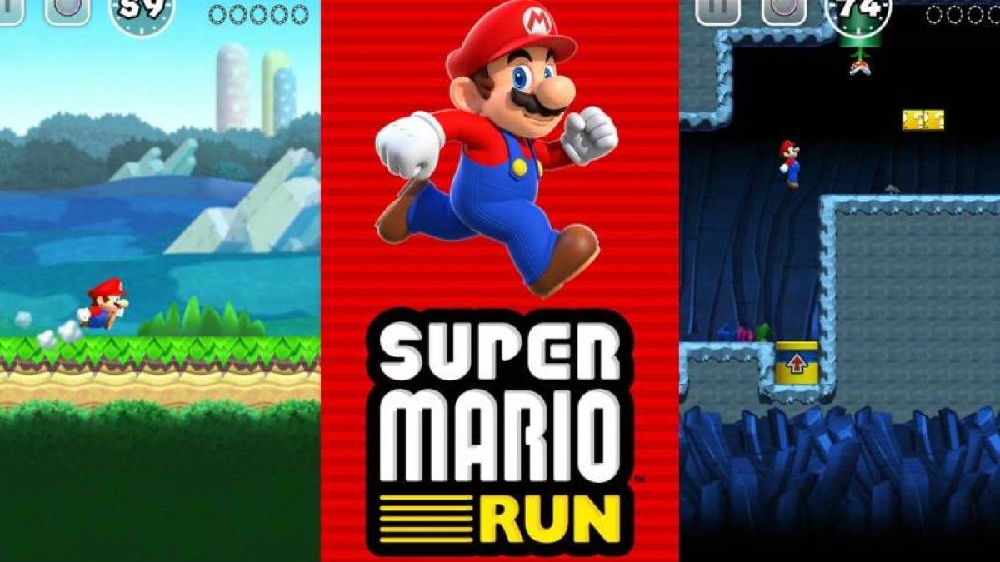
      <figcaption>Super Mario Run</figcaption>
    </figure>
  </li>
  <li>
    <figure class="polaroid light item-250w">
      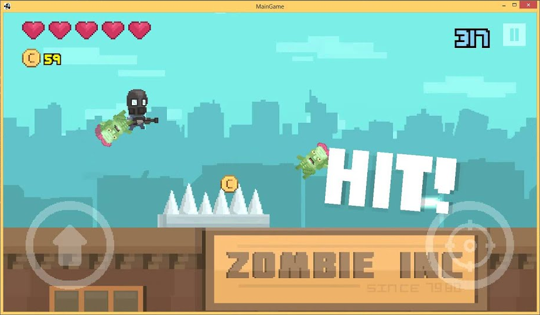
      <figcaption>Zombie Rush</figcaption>
    </figure>
  </li>
</ul>

---
<!-- {"layout": "grid-2x2-1x3-1x1"} -->

## Pontos comuns <!-- {.c1x1 style="align-self: flex-end; justify-self: center;"} -->

- Todos precisaram de **muito trabalho** <!-- {ul:.c2x1 style="align-self: flex-start;"} -->
- Equipes **multidisciplinares**
- Um _workflow_ que vai da concepção de **ideias até a criação da arte**
- Levaram **o mesmo tempo** para serem feitos (5 meses)

## Divergências <!-- {.c1x2 style="align-self: flex-end; justify-self: center;"} -->

- Ferramentas **de níveis diferentes** foram usadas para fazer cada um <!-- {ul:.bullet.c2x2 style="align-self: flex-start;"} -->
- Em alguns jogos, pôde-se focar **mais tempo em criar conteúdo**
  do que em programar
- **Programadores tiveram mais liberdade** para criar **alguns dos jogos**
  do que outros

## Basicamente, cada jogo desses foi desenvolvido<br>**começando-se de pontos de partida diferentes** <!-- {h2:.bullet.center-aligned style="grid-row: 3 / 4; grid-column: 1 / 3;"} -->

---

<iframe width="1000" height="580" frameborder="0" src="https://www.mindmeister.com/maps/public_map_shell/573906250/por-onde-quero-come-ar?width=1066&height=600&z=1.1&presentation=1" scrolling="no" style="overflow: hidden; margin-bottom: 5px;"></iframe>

---
<!-- {"layout": "centered"} -->
# Comparando os tipos de ferramentas


---
<!-- {"layout": "section-header", "slideClass": "makers"} -->
# Ferramentas do tipo **_Maker_**

1. 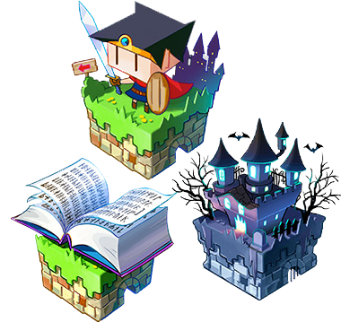 <!-- {.small-width.push-right} -->
   O que são
1. Exemplos famosos
1. Dia a dia
1. Veredito


---
<!-- {"layout": "regular"} -->
## _Makers_: **O que são?**

- O nível mais alto na escala de abstração
- Ferramentas **específicas para um único gênero (eg, RPG)
  ou estilo (eg, 2D) de jogo**
- Alta produtividade na produção do jogo
  - Já que é possível **focar no conteúdo** <!-- {.alternate-color} -->
    em vez de no código
  - Auxiliam na **criação de mapas/fases/cenários, eventos, interação,
    sons e gráficos** <!-- {.alternate-color} -->
- Muitas vezes **não é necessário programar**
- Baixa flexibilidade e pouco controle sobre o que se pode ser feito
  1. ### RPG Maker MV<br>(RPG tipo Snes) <!-- {ol:.card-list.cover} -->
     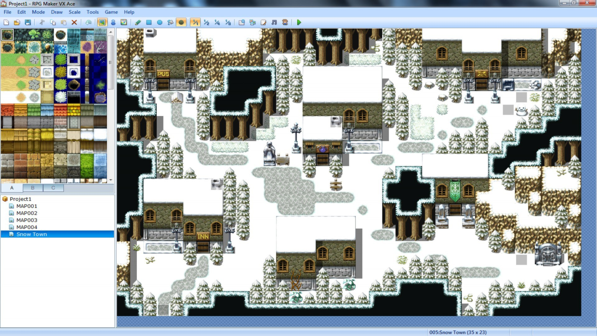 <!-- {style="height: 120px"} -->
  1. ### EF-12 ou Mugen<br>(jogos de luta)
     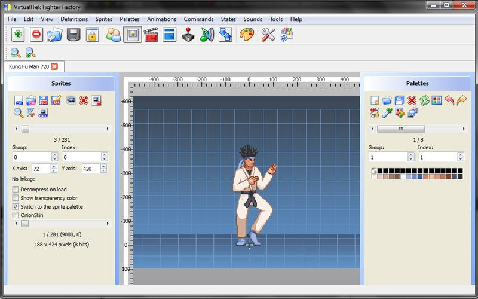 <!-- {style="height: 120px"} -->
  1. ### Game Maker<br>(2D em geral)
     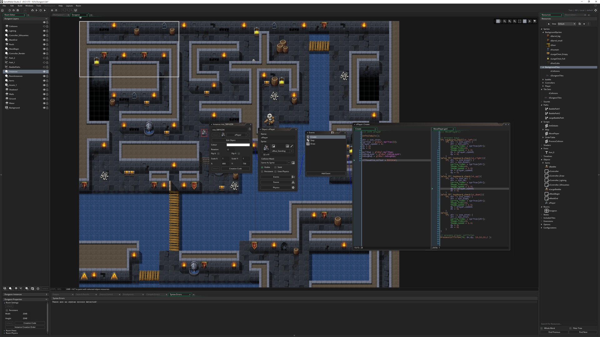 <!-- {style="height: 120px"} -->
  1. ### Editor de Mapas<br>do Dota 2 (RTS)
     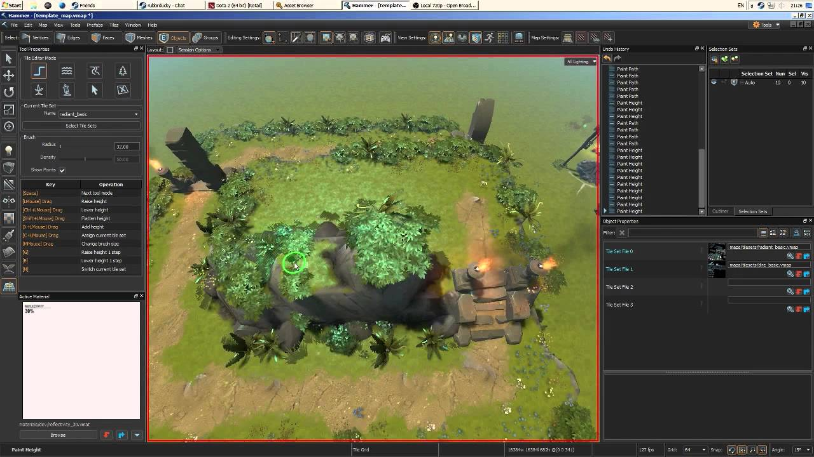 <!-- {style="height: 120px"} -->


*[RTS]: Real-time Strategy*

---
<!-- {"fullPageElement": "#rpg-maker-speed-mapping", "playMediaOnActivation": {"selector": "#rpg-maker-speed-mapping", "delay": 0 }} -->
<video src="https://fegemo.github.io/cefet-front-end-large-assets/videos/rpgmaker-speed.mp4" id="rpg-maker-speed-mapping" muted></video>

---
<!-- {"layout": "regular"} -->
## _Makers_: **Atividades/Desafios típicos(as)**

1. Como criar uma **narrativa interessante** e envolvente? <!-- {ol:.bulleted} -->
1. Como criar um **sistema de batalhas personalizado**?
1. Como manter um estilo **visual consistente** e convincente?
1. Como criar uma HUD com **boa usabilidade**?
1. Como criar um **ambiente imersivo**?

*[HUD]: Head-up Display*

## _Makers_: **Veredito** <!-- {h2:.bullet} -->
### Perfeito para quem quer **focar em conteúdo** ou **começar a desenvolver** <!-- {h3:.bullet} -->

---
<!-- {"layout": "section-header", "slideClass": "apis-graficas"} -->
# Programando<br>**APIs Gráficas**<br>diretamente

1. O que são
1. Exemplos
1. Dia a dia
1. Como usar?

---
<!-- {"layout": "regular"} -->
# APIs Gráficas: **O que são?**

- O nível mais baixo - onde se está mais próximo do _hardware_
- **Menor produtividade**, maior conhecimento sobre todo o funcionamento do jogo
- **Maior flexibilidade e controle** sobre o que pode ser feito
- Precisa-se ter "preocupações de baixo nível", como por exemplo gerenciamento
  de memória
- Possibilita ao programador compreender tudo o que está acontecendo <!-- {li:.bullet} -->
  1. ### Aberto, multiplataforma <!-- {ol:.bullet.card-list.cover style="margin-top: 1em;"} -->
      <!-- {style="height: 80px"} -->
  1. ### Proprietário, Windows
      <!-- {style="height: 80px"} -->
  1. ### Aberto, web
     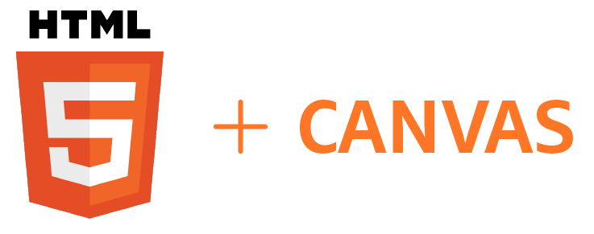 <!-- {style="height: 80px"} -->


---
<!-- {"layout": "regular"} -->
# APIs Gráficas: **Atividades/Desafios típicos(as)**

1. Como fazer um **personagem mexer as pernas** ao andar? <!-- {ol:.bulleted} -->
1. Como gerenciar diversos tipos de imagens para fazer **animações
   de personagens**, **efeitos visuais** (_e.g._, explosões), cenário?
1. Como desenhar o mesmo personagem várias vezes, mas ocupando **espaço de RAM**
   para apenas um?
1. Como fazer com que o jogo **execute na mesma velocidade** em todos computadores?
1. Como saber se um **tiro acertou** um inimigo?
1. Como **gerenciar o uso da memória** (_e.g._, alocação e desalocação) da
   maneira mais eficiente?

---
<!-- {"layout": "regular"} -->
# APIs Gráficas: **Como usar?**

- A API gráfica fornece apenas meios para se **desenhar primitivas geométricas
  na tela**
- Contudo, para termos a **sensação de animação**, precisamos desenhar quadro a
  quadro na taxa de 30-60 <abbr title="Frames per Second">FPS</abbr>
- Para isso, usamos um **_game loop_** parecido com a forma abaixo:
  ```java
    while (true) {
      aguardaPorEventos();
      atualizaLogicaDoJogo();
      desenhaCenaAtual();
    }
    return 0;
  }
  ```

---
<!-- {"state": "emphatic"} -->
## APIs Gráficas: **Veredito**
### Perfeito para **programador** que não quer "usar a cueca de **terceiros**"
... e quer deter conhecimento e controle sobre todo o processo

---
<!-- {"layout": "section-header", "slideClass": "frameworks"} -->
# Usando **_frameworks_** (bibliotecas)

1. O que são
1. Dia a dia
1. Exemplos
1. Veredito

---
<!-- {"layout": "regular"} -->
# _Frameworks_: **O que são?**

- Nível mais alto que APIs gráficas, **proveem facilidades** não encontradas
  nelas, como:
  - Carregar imagens e áudio em vários formatos
  - Multiplataforma (em algum nível)
  - Comandos de interação
  - ::: figure .sprite.push-right width: 60px; height: 60px;
     <!-- {p:.no-margin} -->
    :::
    
    
    Animações de **_sprites_**
- Possui estrutura pronta:
  - Um **_game loop_ pronto**
  - Classes para mapas, fases, entidades

---
<!-- {"layout": "regular"} -->
# _Frameworks_: **Atividades/Desafios típicos(as)**

1. Como **modelar classes** (_e.g._, em Java) de forma que os personagens <!-- {ol:.bulleted} -->
   possam ter diferentes profissões ao longo do jogo?
1. Como estabelecer uma **hierarquia dos objetos** de uma cena de jogo (_e.g._,
   ao mexer a mão, a espada acompanha)
1. Como posso determinar quais as **imagens e sons para pré-carregar** antes de
   cada fase?
1. Como posso usar arquivos .txt para **descrever as fases** do jogo (_e.g._,
   `fase1.txt`, `fase2.txt` etc.)?
1. Como carregar **modelos 3D** em diferentes formatos?
1. Como possibilitar que **não-programadores possam criar** conteúdo também?

---
<!-- {"layout": "regular"} -->
## _Frameworks_: **Exemplos**

- Phaser ([site](http://phaser.io/))
  - JavaScript, navegador, 2D, física simples, gráficos, animações
- LibGDX ([site](https://libgdx.badlogicgames.com/index.html))
  - Java, multiplataforma, 2D/3D, Audio, física simples, gráficos, animações
- Pygame ([site](http://www.pygame.org/hifi.html))
  - Python, multios, 2D/3D, Audio, gráficos, animações
- LWJGL3 ([site](http://www.lwjgl.org/))
  - Java, multios, 2D/3D, Audio, gráficos
- MonoGame ([site](http://www.monogame.org/))
  - C#, multios, 2D/3D, Audio, gráficos

*[LWJGL3]: Lightweight Java Game Library 3*

---
<!-- {"state": "emphatic"} -->
## _Frameworks_: **Veredito**
### Perfeito para **programadores** que querem se **manter no controle**, mas **não querem reinventar a roda**

---
<!-- {"layout": "section-header", "slideClass": "engines"} -->
# Dominando<br>**_game engines_** (motores)

1. O que são
1. Dia a dia
1. Exemplos
1. Veredito

---
<!-- {"layout": "regular"} -->
# _Game Engines_: **O que são?**

- Ferramentas poderosas de criação de jogos, contando com muitas
  funcionalidades
- Objetivo: oferecer a implementação de rotinas sempre presentes, como:
  - **Grafo de cena**
  - **Importação** de imagens, audio, modelos 3D, animações
  - **Movimentação e animação** de personagens
  - Arquitetura de **redes**
  - Motor de **física** completo
  - Uso de **_shaders_** multiplataforma
  - Editor de **mapas**
  - Editor de **efeitos visuais**
  - Linguagem de **_scripting_**

---
<!-- {"layout": "regular"} -->
# _Game Engines_: **Atividades/Desafios típicos(as)**

1. Como programar o **comportamento dos NPCs**
   de forma que eles **usem seus sentidos** (visão, audição)?
1. Como fazer com que um personagem possa **atirar e saltar ao mesmo tempo**?
1. Como **animar** um personagem para fazer **algo que ele não estava "preparado"**?
1. Como tirar proveito dos recursos da placa de vídeo para deixar o
   jogo **super fotorrealista**?
1. Como estabelecer um **protocolo de rede** para jogos multi-jogador?
1. Como fazer um inimigo **planejar um ataque** inteligente ao personagem?

*[NPCs]: Non-playable characters*
---
<!-- {"layout": "regular"} -->
# _Game Engines_: **Exemplos**

- 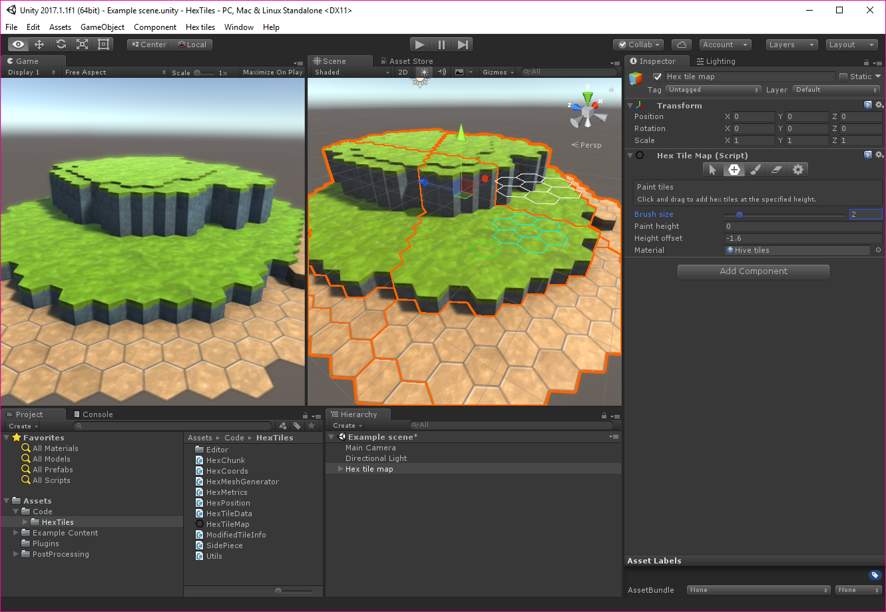 <!-- {.push-right style="width: 300px;"} --> <!-- {ul:.full-width} -->
  Unity3D ([site](http://unity3d.com/)) *➡️* <!-- {.push-right} -->
  - C#, multiplataforma, versão gratuita
- jMonkeyEngine ([site](http://jmonkeyengine.org/))
  - Java, multios, gratuita
- PlayCanvas ([site](https://playcanvas.com/))
  - JavaScript, web, versão gratuita
- 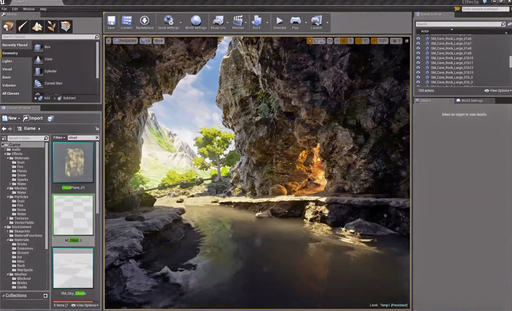 <!-- {.push-right style="width: 300px;"} -->
  Unreal Engine ([site](https://www.unrealengine.com/what-is-unreal-engine-4)) *➡️* <!-- {.push-right} -->
  - C++, multiplataforma, versão gratuita
- Lumberyard ([site](http://gamua.com/starling/))
  - C++ ou Lua, multiplataforma, gratuita

---
<!-- {"state": "emphatic"} -->
# _Game Engines_: **Veredito**
### Perfeito para **equipes experientes** em busca de **resultados profissionais**

---
<!-- {"backdrop": "orc-progress-3ds"} -->
# Ferramentas Acessórias
## Que **não são exclusivas** para desenvolver jogos

---
<!-- {"layout": "regular"} -->
# Ferramentas Acessórias

- São aquelas que **auxiliam** e são muitas vezes necessárias para desenvolver
  jogos
- No entanto, elas servem para **criar os _assets_** (e.g., sons, imagens,
  modelos 3d, animações etc.)
- Nos próximos slides veremos uma pequena amostra de algumas dessas ferramentas

---
## Gráficos 2D: Photoshop


- Um dos editores gráficos mais famosos
  - É uma ferramenta proprietária (fechada e não-gratuita)
  - Alternativa gratuita e aberta: GIMP

---
## Gráficos 3D: Blender


- _Software_ de criação de modelos 3D, texturização, _rigging_ e animação
  - _Opensource_ (feito em Python) e gratuito

---
## Mapas/fases: **Tiled**


- Criador e editor de mapas gratuito
- Salva cada mapa/fase em um arquivo `.tmx` (formato deles)
  - Vários _frameworks_ conseguem usar mapas  no formato `.tmx`

---
## Audio: **sfxr**


- Possibilita **criar efeitos sonoros variados** apenas trocando valores de
  parâmetros

---
## Audio: **Audacity**

- 
  Editor de arquivos de audio em diversos formatos
  - Equalizador
  - Aplicação de efeitos
  - Tratamento de problemas
  - Mesclagem

---
# Concluindo...

- Há 4 formas para se começar sua jornada
  - Não há escolha sempre certa, depende dos seus objetivos
    - Você prefere focar seu tempo para criar conteúdo?
    - Você gosta/precisa ter controle sobre todo o código?
    - Você quer controle, mas não quer reinventar a roda?
    - Você prima por recursos gráficos de ponta?
- Outros tipos de ferramentas de apoio também podem ajudar

---
## Você pode precisar **criar a sua ferramenta**...

<ul class="multi-column-inline-list-2">
  <li>
    <figure class="polaroid light item-360w">
      
      <figcaption>O jogo Delver</figcaption>
    </figure>
  </li>
  <li>
    <figure class="polaroid light item-360w">
      
      <figcaption>Editor de mapas DelvEditor</figcaption>
    </figure>
  </li>
</ul>

- Mais informações [neste tópico do reddit](https://www.reddit.com/r/gamedev/comments/1011fx/post_a_pic_of_your_custom_gamelevel_editors/)

---
## E não se esqueça: **conclua** seus projetos!


---
# Referências

- Artigos
  - [Ganhando a vida como um desenvolvedor _indie_][article-indie]
  - [Vários tipos de ferramentas para desenvolvedores de jogos][article-many-tools]
- Ferramentas de Audio (gratuitas)
  - [sfxr][tool-sfxr]: gerador automático de efeitos sonoros
  - [Audacity][tool-audacity]: editor de arquivos de audio
- Criadores de Jogos
  - [RPG Maker VX Ace Lite][tool-rpgmaker]
  - [Game Maker](http://www.yoyogames.com/studio)
  - [M.U.G.E.N](http://www.elecbyte.com/)


[article-indie]: http://makegames.tumblr.com/post/44181247500/making-it-in-indie-games-starter-guide
[article-many-tools]: http://gamedevelopment.tutsplus.com/articles/the-many-types-of-tools-for-game-developers--gamedev-451
[article-best-2d-engines]: http://www.slant.co/topics/341/~what-are-the-best-2d-game-engines
[tool-sfxr]: http://www.drpetter.se/project_sfxr.html
[tool-audacity]: http://audacityteam.org/
[tool-rpgmaker]: http://www.rpgmakerweb.com/download/free-programs/rpg-maker-vx-ace-lite
