<!--
backdrop: unity-vikings
-->

# Ferramentas para Desenvolvimento de Jogos

---
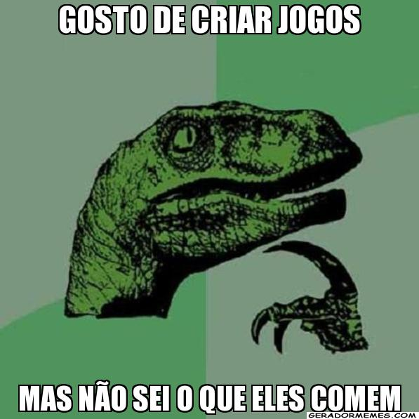

---
## Em 2008...

### _"Xbox's **'Braid'** A **Surprise Hit**, For Surprising Reasons"_

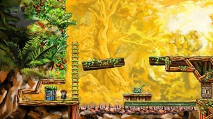

Notícia em [npr.org](http://www.npr.org/templates/story/story.php?storyId=94025221)


---
## Em 2010...

### _"Games review - **Super Meat Boy** is a **prime cut**"_


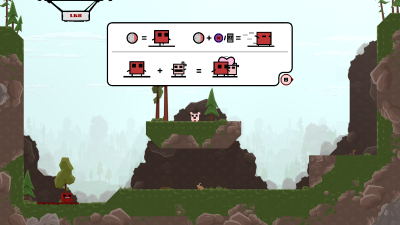

<!--  -->


Notícia em [Metro.co.uk](http://metro.co.uk/2010/10/21/games-review-super-meat-boy-555869/)

---
## Mais tarde em 2010...

_"Unity Technologies has launched version 2.6 of its cross-platform games
engine and with it also **dropped the license fee of $199 previously required**
to use it."_

_"By effectively making Unity free to use **anyone can now download it** and
start developing games for **PC, Mac, and the web**"_

Notícia histórica em [geek.com](http://www.geek.com/games/unity-2-6-released-and-is-now-free-to-use-955771/)

---
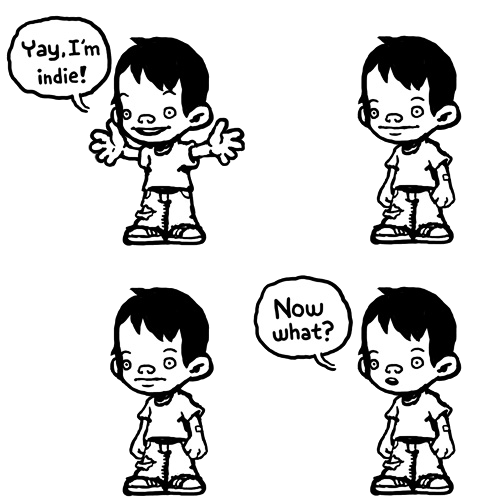

---
# Do que precisamos?

- Gráficos
  - Imagens, Animação, Modelos 3D, Efeitos visuais
- Lógica
  - Mecânica de jogo, Linguagem de _scripting_
- Inteligência artificial
  - Movimentação, Tomada de decisão, Estratégia
- Física
  - Colisão, Cinemática, Dinâmica, Simulações
- Redes
  - Arquitetura, Protocolos

---
## O que estes jogos têm **em comum**? E de **diferente**?

<ul class="multi-column-inline-list-2">
  <li>
    <figure class="polaroid light item-250w">
      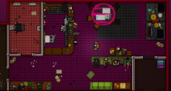
      <figcaption>Hotline Miami</figcaption>
    </figure>
  </li>
  <li>
    <figure class="polaroid light item-250w">
      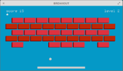
      <figcaption>Breakout</figcaption>
    </figure>
  </li>
</ul>
<ul class="multi-column-inline-list-2">
  <li>
    <figure class="polaroid light item-250w">
      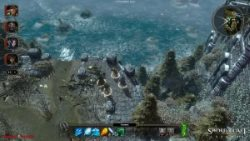
      <figcaption>Sword Coast</figcaption>
    </figure>
  </li>
  <li>
    <figure class="polaroid light item-250w">
      
      <figcaption>Wesnoth</figcaption>
    </figure>
  </li>
</ul>

---

<div class="layout-split-2" style="height: auto;">
  <section style="border-right: 4px dotted silver;">
    <h2>Pontos comuns</h2>
    <ul style="text-align: left">
      <li>Todos precisaram de **muito trabalho**</li>
      <li>Equipes **multidisciplinares** os desenvolveram</li>
      <li>Um _workflow_ que vai da criação das **idéias até a criação da arte**</li>
      <li>Exceto pelo _breakout_, os **gêneros são bem parecidos**</li>
    </ul>
  </section>
  <section>
    <h2>Divergências</h2>
    <ul style="text-align: left">
      <li>Ferramentas **de níveis diferentes** foram usadas para fazer cada um</li>
      <li>Em alguns jogos, pôde-se focar **mais tempo em criar conteúdo** do que em programar</li>
      <li>**Programadores tiveram mais liberdade** para criar **alguns dos jogos** do que outros</li>
    </ul>
  </section>
</div>

---
## Basicamente, cada jogo desses foi desenvolvido **começando-se de pontos diferentes**

---

<iframe width="800" height="600" frameborder="0" src="https://www.mindmeister.com/maps/public_map_shell/573906250/por-onde-quero-come-ar?width=800&height=600&z=1.1" scrolling="no"></iframe>

---
## Comparando os tipos de ferramentas

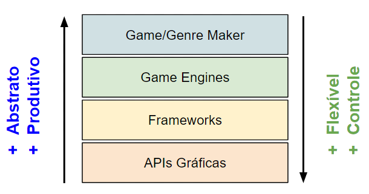

---
# Ferramentas do tipo **"Maker"**
---
## _Makers_: **O que são?**

- O nível mais alto na escala de abstração
- Ferramentas de criação **específicas para jogos ou mesmo para um único gênero
  (_e.g._, RPG) de jogo**
- Alta produtividade na produção do jogo
  - Já que é possível focar no conteúdo em vez de no código do jogo
- Em algumas ferramentas, **não é necessário programar** usando uma linguagem
  de programação
- Costumam auxiliar na **criação de mapas/fases/cenários, eventos, interação,
  sons e gráficos**
- Baixa flexibilidade e pouco controle sobre o que se pode ser feito

---
## _Makers_: **Exemplos**

- **RPG Maker VX Ace** (demonstração)
  - Para criar... RPGs ;)
- Mugen
  - Para jogos de luta
- Game Maker
  - Para jogos 2D em geral
- Editor de Mapas do Warcraft
  - Para jogos que se baseiem na mecânica <abbr title="Real-time Strategy">RTS</abbr>

---
## _Makers_: **Atividades/Desafios típicos(as)**

1. Como criar uma narrativa interessante e envolvente?
1. Como criar um sistema de batalhas personalizado?
1. Como manter um estilo visual consistente e convincente?
1. Como criar uma <abbr title="Head-up display">HUD</abbr> com boa usabilidade?
1. Como criar um ambiente imersivo?

---
## _Makers_: **Veredito**
### Perfeito para quem quer **focar em conteúdo** ou **começar a desenvolver**

---
# Programando **APIs Gráficas** diretamente

---
## APIs Gráficas: **O que são?**

- O nível mais baixo - onde se está mais próximo do _hardware_
- **Menor produtividade**, maior conhecimento sobre todo o funcionamento do jogo
- **Maior flexibilidade e controle** sobre o que pode ser feito
- Precisa-se ter "preocupações de baixo nível", como por exemplo gerenciamento
  de memória
- Possibilita ao programador compreender tudo o que está acontecendo

---
## APIs Gráficas: **Atividades/Desafios típicos(as)**

1. Como fazer um personagem mexer as pernas ao andar?
1. Como gerenciar diversos tipos de imagens para fazer animações de personagens,
  efeitos visuais (_e.g._, explosões), cenário?
1. Como desenhar o mesmo personagem várias vezes, mas ocupando espaço de RAM
  para apenas um?
1. Como fazer com que o jogo execute na mesma velocidade em todos computadores?
1. Como saber se um tiro acertou um inimigo?
1. Como gerenciar o uso da memória (_e.g._, alocação e desalocação)?

---
## APIs Gráficas: **Exemplos**

- **OpenGL** (demonstração)
  - Padrão aberto, multiplataforma
- DirectX
  - Proprietário, Microsoft
- Java2D

---
## APIs Gráficas: **Como usar?**

- A API gráfica fornece apenas meios para se **desenhar primitivas geométricas
  na tela**
- Contudo, para termos a **sensação de animação**, precisamos desenhar quadro a
  quadro na taxa de 30-60 <abbr title="Frames per Second">FPS</abbr>
- Para isso, usamos um **_game loop_** parecido com a forma abaixo:
  ```java
    while (true) {
      aguardaPorEventos();
      atualizaLogicaDoJogo();
      desenhaCenaAtual();
    }
    return 0;
  }
  ```

---
## APIs Gráficas: **Veredito**
### Perfeito para **programador** que não quer "usar a cueca de **terceiros**"
... e quer deter conhecimento e controle sobre todo o processo

---
# Usando **_frameworks_** (bibliotecas)

---
## _Frameworks_: **O que são?**

- Nível mais alto que APIs gráficas, **proveem facilidades** não encontradas
  nelas, como:
  - Carregar imagens e áudio em vários formatos
  - Multiplataforma (em algum nível)
  - Comandos de interação
  - <figure class="sprite" id="megaman">
      
    </figure>
    
    
    Animações de **_sprites_**
- Possui estrutura pronta:
  - Um **_game loop_ pronto**
  - Classes para mapas, fases, entidades

---
## _Frameworks_: **Atividades/Desafios típicos(as)**

1. Como modelar minhas classes (_e.g._, em Java) de forma que os personagens
  possam ter diferentes profissões ao longo do jogo?
1. Como estabelecer uma hierarquia dos objetos de uma cena de jogo (_e.g._,
  ao mexer a mão, a espada acompanha)
1. Como posso determinar quais as imagens e sons para pré-carregar antes de
  cada fase?
1. Como posso usar arquivos .txt para descrever as fases do jogo (_e.g._,
  `fase1.txt`, `fase2.txt` etc.)?
1. Como carregar modelos 3D em diferentes formatos?
1. Como possibilitar que não-programadores possam criar conteúdo também?

---
## _Frameworks_: **Exemplos**

- Phaser ([site](http://phaser.io/))
  - JavaScript, navegador, 2D, física simples, gráficos, animações
- LibGDX ([site](https://libgdx.badlogicgames.com/index.html))
  - Java, multiplataforma, 2D/3D, Audio, física simples, gráficos, animações
- Pygame ([site](http://www.pygame.org/hifi.html))
  - Python, multios, 2D/3D, ~~Audio?, física?~~, gráficos, animações
- <abbr title="Lightweight Java Game Library 3">LWJGL3</abbr> ([site](http://www.lwjgl.org/))
  - Java, multios, 2D/3D, Audio, ~~física~~, gráficos, ~~animações~~

---
## _Frameworks_: **Veredito**
### Perfeito para **programadores** que querem se **manter no controle**, mas **não querem reinventar a roda**

---
# Dominando **_game engines_** (motores)

---
## _Game Engines_: **O que são?**

- Ferramentas poderosas de criação de jogos, contando com muitas
  funcionalidades
- Objetivo: oferecer a implementação de rotinas sempre presentes, como:
  - **Grafo de cena**
  - **Importação** de imagens, audio, modelos 3d, animações
  - **Movimentação e animação** de personagens
  - Arquitetura de **redes**
  - Motor de **física** completo
  - Uso de **_shaders_** multiplataforma
  - Editor de **mapas**
  - Editor de **efeitos visuais**
  - Linguagem de **_scripting_**

---
## _Game Engines_: **Atividades/Desafios típicos(as)**

1. Como programar o comportamento dos <abbr title="Non-player characters">NPCs</abbr>
  de forma que eles usem seus sentidos (visão, audição)?
1. Como fazer com que um personagem possa atirar e saltar ao mesmo tempo?
1. Como animar um personagem para fazer algo que ele não estava "preparado"?
1. Como tirar proveito dos recursos da placa de vídeo para deixar o
  jogo super fotorrealista?
1. Como estabelecer um protocolo de rede para jogos multi-jogador?
1. Como fazer um inimigo perseguir o personagem do jogador?

---
## _Game Engines_: **Exemplos**

- Unity3D ([site](http://unity3d.com/))
  - C# e JavaScript, multiplataforma, versão gratuita
- Unreal Engine ([site](https://www.unrealengine.com/what-is-unreal-engine-4))
  - C++, multiplataforma, versão gratuita
- jMonkeyEngine ([site](http://jmonkeyengine.org/))
  - Java, multios, gratuita
- Starling ([site](http://gamua.com/starling/))
  - ActionScript, multiplataforma, gratuita

---
## _Game Engines_: **Veredito**
### Perfeito para **equipes experientes** em busca de **resultados profissionais**

---
<!--
backdrop: orc-progress-3ds
-->

# Ferramentas Acessórias
## Que **não são exclusivas** para desenvolver jogos

---
## Ferramentas Acessórias

- São aquelas que **auxiliam** e são muitas vezes necessárias para desenvolver
  jogos
- No entanto, elas servem para **criar os _assets_** (e.g., sons, imagens,
  modelos 3d, animações etc.)
- Nos próximos slides veremos uma pequena amostra de algumas dessas ferramentas

---
## Gráficos 2D: Photoshop

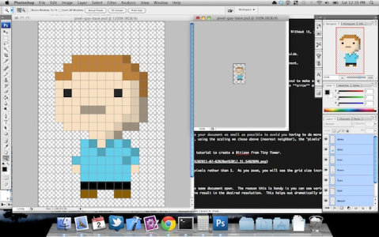

- Um dos editores gráficos mais famosos
  - É uma ferramenta proprietária (fechada e não-gratuita)
  - Alternativa gratuita e aberta: GIMP

---
## Gráficos 3D: Blender

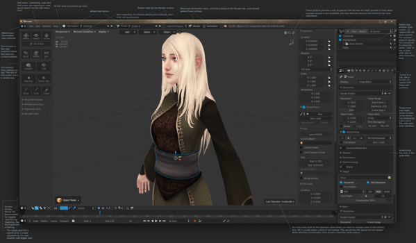

- _Software_ de criação de modelos 3D, texturização, _rigging_ e animação
  - _Opensource_ (feito em Python) e gratuito

---
## Mapas/fases: **Tiled**

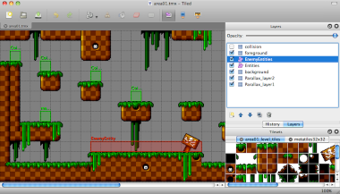

- Criador e editor de mapas gratuito
- Salva cada mapa/fase em um arquivo `.tmx` (formato deles)
  - Vários _frameworks_ conseguem usar mapas  no formato `.tmx`

---
## Audio: **sfxr**

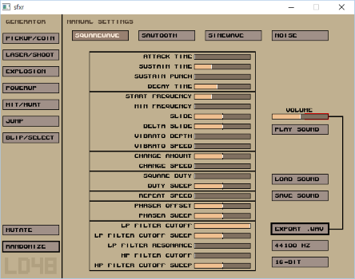

- Possibilita **criar efeitos sonoros variados** apenas trocando valores de
  parâmetros

---
## Audio: **Audacity**

- 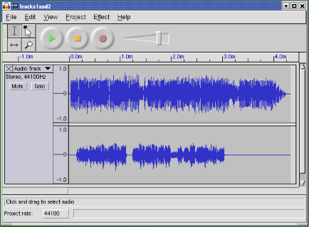
  Editor de arquivos de audio em diversos formatos
  - Equalizador
  - Aplicação de efeitos
  - Tratamento de problemas
  - Mesclagem

---
# Concluindo...

- Há 4 formas para se começar sua jornada
  - Não há escolha sempre certa, depende dos seus objetivos
    - Você prefere focar seu tempo para criar conteúdo?
    - Você gosta/precisa ter controle sobre todo o código?
    - Você quer controle, mas não quer reinventar a roda?
    - Você prima por recursos gráficos de ponta?
- Outros tipos de ferramentas de apoio também podem ajudar

---
## Você pode precisar **criar a sua ferramenta**...

<ul class="multi-column-inline-list-2">
  <li>
    <figure class="polaroid light item-360w">
      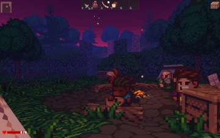
      <figcaption>O jogo Delver</figcaption>
    </figure>
  </li>
  <li>
    <figure class="polaroid light item-360w">
      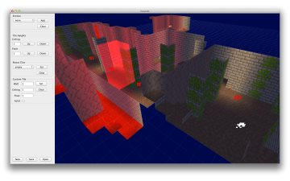
      <figcaption>Editor de mapas DelvEditor</figcaption>
    </figure>
  </li>
</ul>

- Mais informações [neste tópico do reddit](https://www.reddit.com/r/gamedev/comments/1011fx/post_a_pic_of_your_custom_gamelevel_editors/)

---
## E não se esqueça: **conclua** seus projetos!

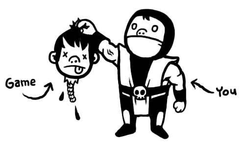

---
# Referências

- Artigos
  - [Ganhando a vida como um desenvolvedor _indie_][article-indie]
  - [Vários tipos de ferramentas para desenvolvedores de jogos][article-many-tools]
- Ferramentas de Audio (gratuitas)
  - [sfxr][tool-sfxr]: gerador automático de efeitos sonoros
  - [Audacity][tool-audacity]: editor de arquivos de audio
- Criadores de Jogos
  - [RPG Maker VX Ace Lite][tool-rpgmaker]
  - [Game Maker](http://www.yoyogames.com/studio)
  - [M.U.G.E.N](http://www.elecbyte.com/)


[article-indie]: http://makegames.tumblr.com/post/44181247500/making-it-in-indie-games-starter-guide
[article-many-tools]: http://gamedevelopment.tutsplus.com/articles/the-many-types-of-tools-for-game-developers--gamedev-451
[article-best-2d-engines]: http://www.slant.co/topics/341/~what-are-the-best-2d-game-engines
[tool-sfxr]: http://www.drpetter.se/project_sfxr.html
[tool-audacity]: http://audacityteam.org/
[tool-rpgmaker]: http://www.rpgmakerweb.com/download/free-programs/rpg-maker-vx-ace-lite
