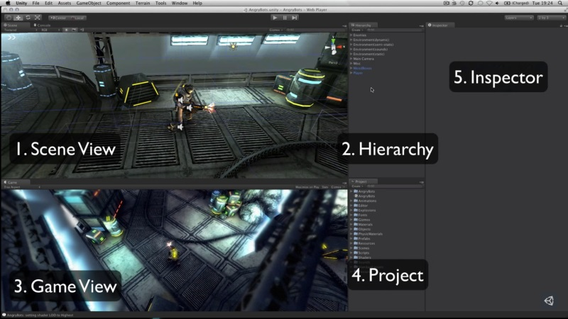
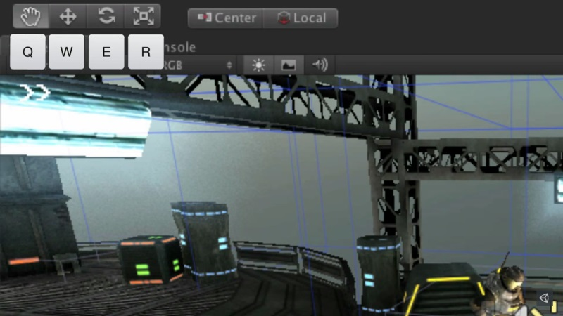
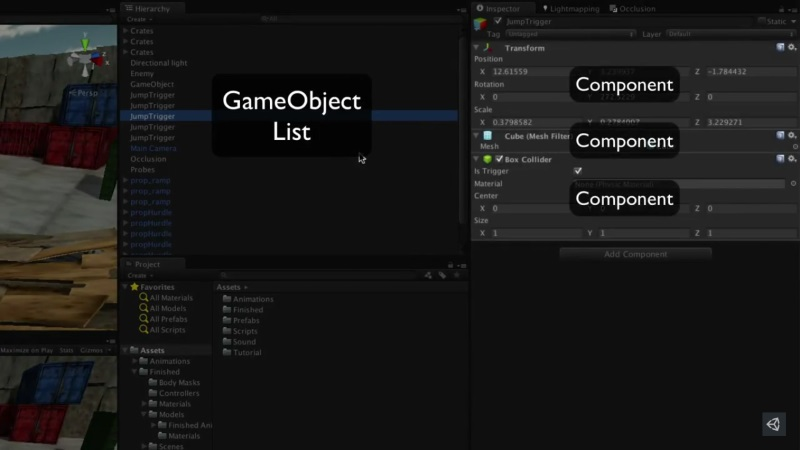
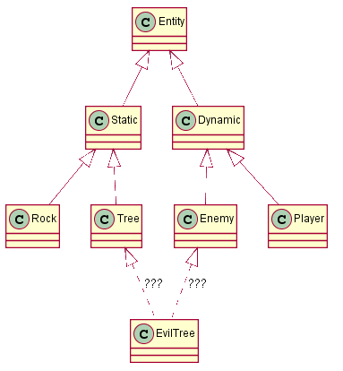
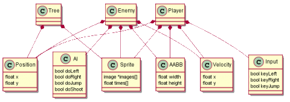
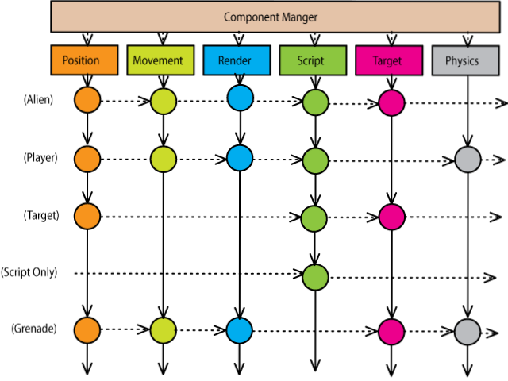
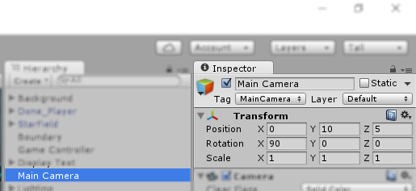

# Interface

---
## Componentes da Interface



---
## _Scene View_: navegação



---
## _Game Objects_



---
# Arquitetura **_Entity-Component-System_**

---
## Arquitetura **Orientada a Objetos**

- 
  Uma forma comum para se arquitetar um jogo é usando um modelo
  orientado a objetos
  - E usando a hierarquia de classes para especializar as entidades do jogo
  - Essa é uma abordagem válida e ainda utilizada
  - Contudo, alguns problemas podem surgir:
    1. Como a hierarquia é rígida (tempo de compilação), não dá pra
      uma entidade se tornar outra
    1. Hierarquia pode complicar para entidades "mistas"

---
## Arquitetura **_Entity-Component-System_** (1/4)

- 
  Abordagem mais recente: _Thief: The Dark Project (1998)_ e
  _Dungeon Siege (2002)_
  - Composição de objetos em vez de herança
  - Benefícios:
    1. É mais fácil adicionar entidades mais complexas
    1. Melhor manutenibilidade do código
    1. Mais eficiente
- Mas como que faz?

---
## Arquitetura _Entity-**Component**-System_ (2/4)

- **Componente**: armazena informações sobre um aspecto de uma Entidade
  - Pode herdar de uma classe `Componente`:
    ```ruby
    class Componente
      String getTipoComponente()
      Entidade getEntidade()
    ```
  - Exemplos:
    - `Posicao`: `float x, y`
    - `Sprite`: `imagens, animacoes`
    - `Vida`: `int valor`
    - `Velocidade`: `float x, y`

---
## Arquitetura _**Entity**-Component-System_ (3/4)

- **Entidade**: algo que existe no mundo de jogo e possui `Componente`s e
  `Entidade`s filhas
  - Pode herdar de uma classe `Entidade`:
    ```ruby
    class Entidade
      List<Entidade> getFilhas()
      List<Componente> getComponentes();
      List<Componente> getComponentesByTipo(String tipo);
    ```
  - Exemplos:
    - Pedra: possui [`Posicao`, `Sprite`]
    - Caixa: possui [`Posicao`, `Sprite`, `Vida`]
    - Inimigo: possui [`Posicao`, `Sprite`, `Vida`, `Velocidade`, `IA`]

---
## Arquitetura _**Entity**-Component-System_ (4/4)

- **Sistema**: atualiza o estado de um conjunto de componentes
  - Em uma implementação purista, apenas o sistema possui código
  - Exemplos:
    - `Movimentacao`: atua em [`Posicao`, `Velocidade`] - integra velocidade
    - `Gravidade`: atua em [`Velocidade`] - decrementa a velocidade
    - `Renderizacao`: atua em [`Sprite`] - desenha _sprites_
    - `ControleJogador`: [`Input`, `Jogador`] - controla via _input_ do jogador
    - `ControleNPC`: [`Input`, `IA`] - controla via IA

---
## Exemplo de ECS



---
## **Arquitetura da Unity** (1/3)

- A Unity implementa um **modelo parecido com ECS**, mas pouco purista
  - Os sistemas (Física, Renderização 3D, 2D etc.) são fechados para alteração
  - 
    **Entidades** são chamadas **_GameObjects_**
    - Todos possuem um **componente <u>obrigatório</u> chamado
      [`Transform`][unity-transform]**:
      - _"Position, rotation and scale of an object."_
      - Possui lista de filhos/ponteiro para pai

[unity-transform]: https://docs.unity3d.com/ScriptReference/Transform.html

---
## **Arquitetura da Unity** (2/3)

- Há vários tipos de componentes implementados:
  <ul class="multi-column-list-3">
    <li>_Camera_</li>
    <li>_Light_</li>
    <li>_Mesh Renderer_</li>
    <li>_Particle System_</li>
    <li>_Audio Source_</li>
    <li>_Capsule Collider_</li>
    <li>_Box Collider 2D_</li>
    <li>_Nav Mesh Agent_</li>
    <li>...</li>
  </ul>
- Os componentes podem ter código associado (componente  _Script_):
  - Basta criar um componente que é uma classe C# que herda de
    [`MonoBehaviour`][unity-scripting]:
    ```csharp
    public class ComportamentoDaTorre : MonoBehaviour {
        public Transform alvo;
        void Update() {             // faz olhar (se
            transform.LookAt(alvo); // orientar) para o alvo
        }
    }
    ```

[unity-scripting]: https://unity3d.com/learn/tutorials/modules/beginner/scripting/scripts-as-behaviour-components?playlist=17117

---
## **Arquitetura da Unity** (3/3)

- Ao criar um _Script_ (_i.e._, criar uma classe C# que herda de
  [`MonoBehaviour`][unity-monobehaviour]), temos vários "ganchos"
  que podemos implementar:
  ```csharp
  public class MeuScript : MonoBehaviour {
      void Awake() {
          // chamado quando o script está sendo carregado
      }
      void Start() {
          // chamado 1x qdo o script é ativado, antes do Update
      }
      void Update() {
          // chamado a cada quadro se está ativado
      }
  }
  ```

[unity-monobehaviour]: https://docs.unity3d.com/ScriptReference/MonoBehaviour.html

---
# Referências

1. Artigo em [gamedev.net][gamedevnet]
  - [Understanding Component-Entity-Systems][understanding-ecs]
  - [Implementing Component-Entity-Systems][implementing-ecs]
1. Artigo em [Game Programming Patterns][gpp]:
  - [Component][gpp-components]

[gamedevnet]: http://www.gamedev.net/
[understanding-ecs]: http://www.gamedev.net/page/resources/_/technical/game-programming/understanding-component-entity-systems-r3013
[implementing-ecs]: http://www.gamedev.net/page/resources/_/technical/game-programming/implementing-component-entity-systems-r3382
[gpp]: http://gameprogrammingpatterns.com/
[gpp-components]: http://gameprogrammingpatterns.com/component.html
