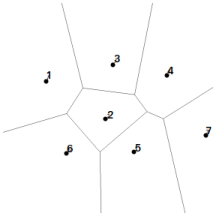
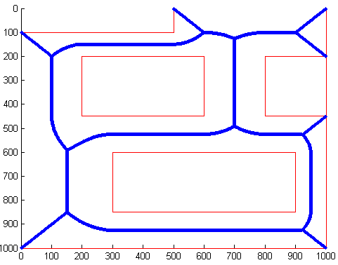
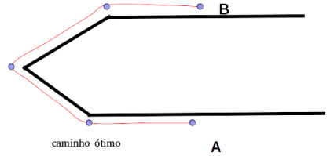
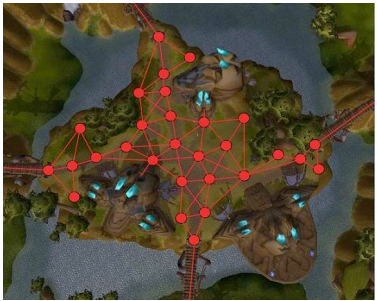
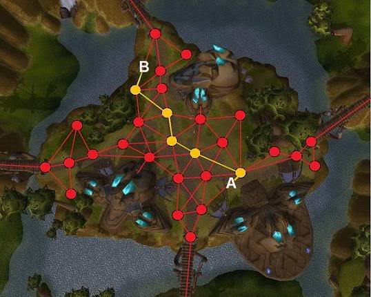

<!--
backdrop: world-representation
-->

# IA: Representações do Mundo para _Pathfinding_

---
# Relembrando _Pathfinding_

- Usamos um algoritmo de determinação de trajetórias em um grafo
  - Dijkstra
  - A* (Dijkstra + heurística)
    - Heurística admissível:
      - estimativa proporcional ao custo do trajeto restante
      - estimativa com valor igual ao real ou menor

---
# Motivação

- Conseguimos resolver o problema de encontrar trajetórias em um grafo, mas
  **como obtemos esse grafo**?
  - Uma forma é criar o grafo "na mão"
  - Um trabalho para _level designers_
- Contudo, vamos analisar **formas para automatizar a geração do grafo**
  de navegação

---
## Roteiro

- Grafos de _Tiles_
- Diagramas de Voronoi (Domínios de Dirichlet)
- Grafos de Visibilidade
- Malhas de Navegação (_Navigation Meshes_)

---
<!--
bespokeState: checkpoint
-->

# Representação do Mundo
## O que precisamos saber?

- Como podemos **obter um grafo de navegação de forma automática** a partir
  da descrição do mundo de jogo?
- Como **determinar se o grafo tem validade**, i.e., se ele permite a
  determinação de caminhos válidos (que **não passem por dentro de
  obstáculos**)?

---
# Representação do Mundo

- É necessário representar o mundo do jogo usando um grafo
  - Cenário é dividido em regiões (nós) interconectadas (por arestas)
- A forma como dividimos o espaço em regiões é um **esquema de divisão**.
  - Vamos falar de 4 esquemas de divisão:
    1. Grafos de _tiles_
    1. Diagrama de Voronoi (Domínios de Dirichlet)
    1. Pontos de Visibilidade
    1. Malhas de Navegação (_navigation meshes_)

---
## Esquema de Divisão

- Um **esquema de divisão** possui 3 importantes características:
  1. **Quantização e localização**: mudança do espaço do cenário para o espaço do grafo, e vice-versa
  1. **Geração**: manual (_level designer_) ou automática (algorítmica)
  1. **Validade**: todos os caminhos gerados devem poder se executados

---
## Esquema de Divisão: **(1) Quantização e Localização**

- <u>**Quantização**</u>: converte uma localização no cenário em um nó do grafo
  - Exemplo: um NPC quer ativar uma alavanca distante:
    - Precisamos converter sua posição atual e a posição da alavanca para nós
      do grafo
- <u>**Localização**</u>: converte um nó do grafo em uma localização no cenário
  - Exemplo: um NPC executando um caminho que foi planejado
    - Precisamos converter cada nó do grafo em coordenadas do cenário do jogo

---
## Esquema de Divisão: **(3) Validade**


- Se agente indo de um nó A para B, independente de onde esteja em A ele deve
  conseguir chegar em qualquer ponto em B
- **Esquema de divisão válido**: todos os pontos de duas regiões conectadas
  podem ser atingidos entre si
  - Exemplo (esquerda): grafo inválido, mas usando _steering_ para evitar muros
    consegue-se resolver
  - Exemplo (direita): grafo inválido, agente fica preso

---
# (1) Grafos de _Tiles_

---
## Grafos de _Tiles_

- Útil para jogos 2D, mas também para 3D que representam seu mundo usando um
  _grid_ de regiões quadradas (ou hexagonais)
- O _grid_ pode ser facilmente transformado em um grafo

  

---
## Grafos de _Tiles_: **Quantização e Localização**

- **Quantização**: determinar em que _tile_ uma coordenada do mundo está:
  ```ruby
  def emQualTile(x, y)  
    tileX = floor(x / ladoDoTile)   # floor: inteiro abaixo
    tileY = floor(y / ladoDoTile)
    return grafo[tileX][tileY]
  ```
- **Localização**: determinar a posição do cenário onde um nó do grafo se encontra:
  ```ruby
  def ondeNoCenario(tile)
    return (tile.x + tile.largura/2, tile.y + tile.altura/2)
  ```

---
## Grafos de _Tiles_: **Geração** e **Validade**

- **Geração**:
  - Gerados algoritmicamente
    - Pré-processados
    - Gerados em tempo de inicialização
    - Pode ser gerado sob demanda, em partes (para cenários muito grandes - <abbr title="Real-Time Strategy">RTS</abbr>)
- **Validade**:
  - Garantidamente válido se não houver _tiles_ parcialmente bloqueados
    <ul class="multi-column-inline-list-2">
      <li>
          <figure class="polaroid">
            
            <figcaption>Parcialmente bloqueado, mas caminho ok</figcaption>
          </figure>
      </li>
      <li>
          <figure class="polaroid">
            
            <figcaption>Parcialmente bloqueado, com problema</figcaption>
          </figure>
      </li>
    </ul>


---
## Grafo de _Tiles_: Exemplo ([GraphGenerator.java][graph-generator])

```ruby
def geraGrafo(mapa)
  Grafo g = new Grafo()

  # gera um nó do grafo para cada tile,
  # passável ou obstáculo
  for i = 0 to mapa.verticais
    for j = 0 to mapa.horizontais
      No novo = new No(i, j)
      novo.ehObstaculo = mapa.ehObstaculo(i,j)
      novo.posicao = ondeNoCenario(mapa,i,j)
      g.novoNo(novo)

  # gera arestas saindo de cada nó (se passável),
  # exceto destinos que são obstáculos
  for i = 0 to mapa.verticais
    for j = 0 to mapa.horizontais
      No atual = mapa.getNo(i,j)
      if atual.ehObstaculo
        continue
      tentaConectarCom(atual, g, mapa,  1,  0) # N
      tentaConectarCom(atual, g, mapa,  0,  1) # L
      tentaConectarCom(atual, g, mapa, -1,  0) # S
      tentaConectarCom(atual, g, mapa,  0, -1) # O

  return g
```

[graph-generator]: https://github.com/fegemo/cefet-games-pathfinding/blob/exercise-heuristic2/core/src/br/cefetmg/games/pathfinding/GraphGenerator.java#L18

---
# (2) Diagrama de Voronoi

---
## Diagrama de Voronoi

<p class="note" style="max-width: 80%;">
Uma **célula de Voronoi** é uma região ao redor
de um ponto cujo interior consiste de tudo o que está mais próximo
desse ponto do que de outro ponto de um conjunto</p>

- 
  Esquema de divisão: cada nó do grafo é um ponto no espaço chamado
  **ponto característico** (_i.e._, um ponto do domínio)
  - A quantização mapeia cada região do domínio de Dirichlet a um nó
    do ponto característico
  - Os pontos característicos são tipicamente definidos pelos _level designers_
  - Arestas são colocadas entre polígonos adjacentes usando
    _Delaunay Triangulation_

---
## Diagrama de Voronoi: **Quantização e Localização**

- [Exemplo online](http://blog.ivank.net/voronoi-diagram-in-javascript.html)
- **Quantização**: achar em que ponto característico uma coordenada está
  - Percorre lista de pontos para determinar o mais
    próximo: <span class="math">O(n)</span>
  - Usando uma estrutura de particionamento espacial
    (_quadtree_, _octree_)
- **Localização**: determinar a posição do cenário onde um nó do grafo
  se encontra:
  - As coordenadas do ponto característico

---
## Diagrama de Voronoi: **Geração** e **Validade**

- **Geração** dos pontos característicos: manual
- **Validade**: não há garantia de que, ao navegar da célula A até a B, não se
  passe por uma terceira célula C, que pode ser impassável
  - Estritamente, o grafo não é válido
  - Contudo, o _level designer_ exclui do diagrama as células
    que contém obstáculos

---
## Variação: **Diagrama de Voronoi <u>Generalizado</u>**

1. 
  Cria-se vários **pontos característicos nas fronteiras dos obstáculos**
1. **Simplifica-se o diagrama** removendo as células dentro dos obstáculos
  (ou pega-se os centros dos círculos de Delaunay)
  - Resultado: curvas equidistantes dos obstáculos da cena
  - [Exemplo online](http://blog.ivank.net/voronoi-diagram-in-javascript.html)
  - [Outro exemplo (círculos)](http://bl.ocks.org/zanarmstrong/b1c051113be144570881)

---
# (3) Pontos de Visibilidade

---
## Pontos de Visibilidade

- 
  Arestas são criadas entre pontos entre os quais haja visibilidade
- Nós podem ser colocados manualmente pelo _level designer_, mas há como
  gerá-los automaticamente
- **Geração**: automaticamente a partir da geometria de colisão
  - Cria-se nós nos vértices dos obstáculos
  - **Raios são lançados** de entre todos os pares de nós de
    obstáculos diferentes
    - Aqueles que não atingem um obstáculo, são arestas válidas

---
## Pontos de Visibilidade

<figure class="picture-steps clean" style="background: white;">
  
  
  
  
  
</figure>

---
## Pontos de Visibilidade: **Quantização, Localização** e **Validade**

- Características iguais às do diagrama de Voronoi
  - **Validade**: pode ser inválido
    - 
      Para agente com largura diferente de 0, aumenta-se os obstáculos
- Navegação do ponto A até ponto B
  - Mover para o nó mais próximo de A
  - Mover pelas arestas do grafo
  - Mover do nó mais próximo de B para B propriamente dito

---
## Diagramas de Voronoi: Exemplo



---
# (4) Malhas de Navegação

---
## Malhas de Navegação (_nav meshes_)

- 
  Comum nos jogos 3D mais recentes
- Usa a própria **geometria <u>gráfica</u>** do cenário como base
  - _Level designer_ marca que polígonos formam o "chão"

---
## Malhas de Navegação: **Esquema de Divisão**

- 
  Cada polígono que forma o "chão" atua como um (ou mais) nó(s) do grafo
- Nós são conectados por arestas se suas regiões são adjacentes
  - Polígonos são triângulos ou quadriláteros
    - Cada polígono tem 3 ou 4 conexões

---
## Malhas de Navegação: **Quantização e Localização**

- **Quantização**: achar em que nó uma coordenada do cenário está
  - Verifica-se qual dos polígonos contém o ponto desejado
    - Isso é relativamente caro
  - Usa-se o <u>princípio da coerência</u>: é possível que o personagem continue
    no mesmo polígono nos quadros seguintes, ou em um adjacente
    - Começa-se a busca por eles
- **Localização**: achar a coordenada do mundo de um nó do grafo
  - Usa-se o centro dos polígonos (posição média de seus vértices)

---
## Malhas de Navegação: **Validade**

- 
  **Validade**: Não há garantia de validade
  - A forma como a triangulação do terreno é feita e a sua granularidade podem
    gerar geometrias problemáticas

---
## Malhas de Navegação: **Exemplo** na Unity


- [Como criar um _navmesh Agent_](https://docs.unity3d.com/Manual/nav-CreateNavMeshAgent.html)

---
## **Variação** das Malhas de Navegação

- Meio das **arestas** da geometria **sendo os nós** do grafo

  
- Qualquer ponto das **arestas** da geometria **sendo os nós** do grafo

  

---
## Comparação: Diagrama de Voronoi vs _NavMesh_

<ul class="multi-column-inline-list-2">
  <li>Diagrama de Voronoi
      <figure class="polaroid">
        
        <figcaption>Caminho em zig-zag</figcaption>
      </figure>
  </li>
  <li>_NavMesh_
      <figure class="polaroid">
        
        <figcaption>Linha reta</figcaption>
      </figure>
  </li>
</ul>

---
# Referências

- Livro _Artificial Intelligence for Games, Second Edition_
  - Capítulo 4: _Pathfinding_ (4.4)
  - Capítulo 11: _Tools and Content Creation_ (11.1)
